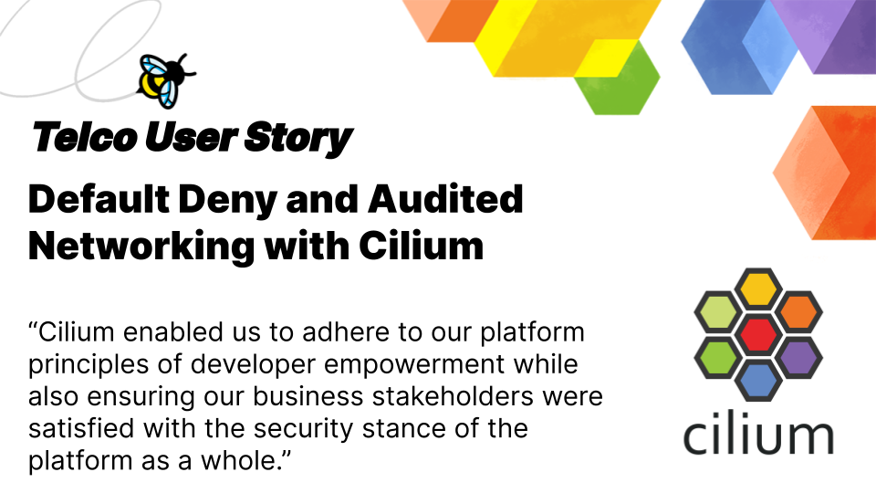

_May 4th, 2023_

_Author: Shedrack Akintayo, Isovalent_

_This User Story comes from a company in the telecommunications industry._

Telecommunications involves connecting people across the world. In order to achieve this efficiently, telecommunications companies need highly scalable and secure systems to handle user traffic. Based on new business requirements, one telecommunications company needed to implement a zero trust networking model with default-deny policies and limited and audited egress.

They have a large multi-tenanted Kubernetes platform with Cilium as the CNI but needed to update their security model fundamentally because of the new business mandates. They required a performant and secure solution to help them implement zero-trust network security and landed on leveraging additional features in Cilium as the answer.

## Leveraging More Features in Cilium to Meet New Business Requirements

The platform team manages a large, highly multi-tenanted Kubernetes platform with >20,000 vCPUs across seven production regions and >100 tenant teams of developers pushing code to the platform. As a platform provider in the telecommunications industry, they always needed to ensure that their 100+ tenant teams could all work on the same platform without blocking each other while providing the teams with good guardrails required for security and compliance.

As their platform grew, a new business-wide security requirement mandated full logging of all outgoing connections and a default-deny egress policy (only permitting egress connections to specifically enumerated destinations). Before this change was requested, they had already deployed Cilium to their platform mainly as a more [highly performant CNI](https://cilium.io/blog/2021/05/11/cni-benchmark/) layer and to provide their platform with network isolation as a feature for specific sensitive workloads.

In other business areas, using cloud provider-level solutions or integrating traditional network policies to manage and secure applications and their dependencies is common. However, that approach didn't work because they needed more granular control over application access to dependencies. A uniform layer-3-driven blocking strategy would also not scale to the diversity of workloads on their platform. The team also wanted to ensure that only certain applications could access specific dependencies rather than applying a blanket policy across the entire platform. Finally, they also needed to balance security against introducing more friction for developers that would slow them down.

To achieve this level of control and ensure developer happiness, they had to take a different approach with Cilium at the forefront.

_“We were certain that Cilium would be the key to successfully implementing the requirements in the context of our platform – and this proved to be the case.”_ - A member of their Infrastructure team.

## Leveraging Cilium to Satisfy Business Zero Trust Networking Requirements

For scalability reasons and developer experience in the modern dynamic internet environment, they felt it necessary to allow network policies to be specified based on (stable) hostnames rather than (potentially highly volatile) IP ranges. They were also running a live Production environment where they needed to ensure non-disruptive rollout and adoption of capabilities. Finally, they were committed to providing each platform tenant with the ability to manage their network policies with a compliance approval workflow in line with their principles of developer empowerment.

The basis of the solution was implementing FQDN-based rulesets. With FQDNs, they added flexible blocklisting and a default deny egress policy with granularity at the team and namespace level.

They also utilize Isovalent’s Hubble enterprise daemon set to export connection events from their cluster nodes in a JSON format that is compatible with their security team’s data ingestion pipelines, providing richer information about the identity of the workload initiating the connection and DNS information about the target host.

With the visibility in place, they next turned to the issue of ensuring that their tenants could each create their individual allowlists in a self-service way that would still be compatible with the overall corporate policies around approval for egress destinations. To manage operational risk, they were clear that egress traffic should be directly controlled by CiliumNetworkPolicies (CNPs), giving them a common language between the platform team, their tenants, and their vendor (Isovalent) in the case of any problems arising.

To ensure each platform tenant could manage their network policies with a compliance approval workflow, they created a two-tier system of CiliumNetworkPolicies (CNPs) and Custom Resource Definitions (CRDs) with a PR-based workflow for tenants to suggest and cybersecurity teams to approve changes to the approval list on a case by case basis. The CNPs could be deployed to the clusters by tenants using the same CD pipelines they used to deploy their applications. They used the Gatekeeper policy engine to enforce congruence between the CNPs created in the cluster and the approval records, rejecting any noncompliant change to a CNP.

Through the design and operation of this system, they were able to satisfy business requirements around the control and traceability of updates to the egress approval list while also allowing tenants to have direct supervision and responsibility over the restrictions that affect their applications.

_“The use of Cilium proved a key element of our ability to successfully deliver these requirements due to the level of control and visibility it provides over traffic flows on our platform and the native integration with the Kubernetes API on which our platform is based.”_

## Empowering Developers and Meeting Security Requirements

Cilium was a crucial component in the platform team’s ability to deliver the required outcomes effectively. The result is a system that empowers developers and enables the use of cutting-edge technology on the platform while ensuring organizational security mandates are fully implemented and supported.

_“Cilium, and specifically its FQDN rule features, also enabled us to adhere to our platform principles of developer empowerment while also ensuring our business stakeholders were satisfied with the security stance of the platform as a whole.
We would like our experience in this area to serve as encouragement and an example to teams seeking to integrate best-in-class OSS tools from the Kubernetes ecosystem with their own organization-specific requirements.”_ - A member of their Infrastructure team.
