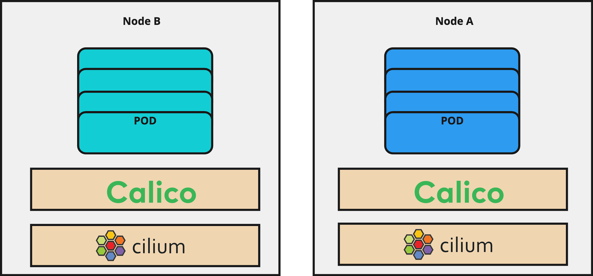

_Author: Amir Kheirkhahan, DB Schenker_


## History behind the Migration to Cilium

In the past, the IT unit for the land transportation business of [DB Schenker](https://www.dbschenker.com/de-de) used Calico as a Container Network Interface ([CNI](https://www.cni.dev/)) for in-Kubernetes-Cluster communication, like pod-to-pod communication. Recently our team had the chance to participate in the 2023 [KubeCon](https://events.linuxfoundation.org/kubecon-cloudnativecon-europe/) in Amsterdam, where we learned a lot about [eBPF](https://ebpf.io/) and especially [Cilium](https://cilium.io/), which was an important driver for us to question our CNI strategy.

Although Calico offers eBPF as well and leverages some important features of it, Cilium was built natively on top of eBPF. In parallel we saw wide adoption in the market and a very feature rich tooling and ecosystem around Cilium, like [Tetragon](https://github.com/cilium/tetragon) for security observability and [Hubble](https://github.com/cilium/hubble) for network visibility. All of these factors together made the decision clear that we needed to migrate to Cilium to prepare our platform for the next steps in our cloud native journey.

## Live migration Considerations

When planning  the migration of all our Kubernetes clusters, we needed to architect it to have minimal down time.

To understand how we could do this, we started a POC and tried to use the capabilities of [Multus](https://github.com/k8snetworkplumbingwg/multus-cni) to have multiple network interfaces attached in parallel to a Pod. Unfortunately, this option didn’t work for us due to the complexity and risk of longer downtime.

However, Cilium recently introduced support for a [hybrid mode](https://docs.cilium.io/en/stable/installation/k8s-install-migration/#migration-via-dual-overlays) for migration where 2 different CNIs with different CIDR-ranges can be established across the cluster, so we found a good new motivation to give it a chance.

As already stated for the Land Business, it was important to keep the downtime of clusters minimal. Cilium has a brilliant feature which helped us to achieve this goal. It offers a [per-node configuration](https://docs.cilium.io/en/latest/configuration/per-node-config/) feature to easily roll out the Cilium configuration on a node by node basis using node-labels. That means, after you install Cilium and apply the configuration, all new nodes identified with a matching label will automatically get the specified configuration. This `CiliumNodeConfig` object has been available since [Cilium 1.13](https://isovalent.com/blog/post/cilium-release-113/#resilience-and-troubleshooting). We will go through this feature later during the migration steps.

The other aspect we needed to consider was how to replace the current Calico IP-in-IP tunneling protocol. Cilium offers UDP-based [encapsulation protocols](https://docs.cilium.io/en/stable/network/concepts/routing/) VXLAN or GENEVE and based on our needs we chose VXLAN where the entire layer 2 Ethernet frame is encapsulated inside a UDP packet and transmitted over the node network.

For IP address distribution among pods, you have different [options](https://docs.cilium.io/en/stable/network/concepts/ipam) to select in Cilium. Cluster-scope IPAM mode is the recommended way which we also chose. In this case, the Cilium operator manages the IP addresses by creating a CiliumNode object for each node and assigning the podCIDRs to them which is then read by Cilium agents running on the nodes. Of course, you are not allowed to select the same podCIDR used by Calico.

Another important consideration was the kube-proxy replacement feature. When a new service is created, the API server notifies all kube-proxy agents running on the worker nodes about this event. Then kube-proxy creates iptable rules to make sure each packet destined for a service is forwarded to the one of the correct backend pods. It is the same for a new pod when the endpoints in iptables are updated.  In the following migration steps, we kept Cilium’s kube-proxy replacement option disabled to reduce the complexity of the migration.

Finally, we also needed to think about our Kafka clusters. We run Kafka inside our Kubernetes environment by using the [strimzi](https://strimzi.io/) chart which includes very sensitive and important data. To ensure the stability of Kafka, we needed  to prevent losing the cluster state or running into a Kafka leader election issue.

To get a better understanding of our infrastructure, I’ll shortly point out some tooling and approaches which we use within DB Schenker. We use self-managed Kubernetes clusters on AWS where the worker and controller nodes are running independently on separate VMs. The worker nodes run on a mix of spot and on-demand instances. The base Images are built by Packer and Ansible and the whole infrastructure setup is managed by Terraform. To meet IT Security requirements, every day we throw away a set of our worker and controller nodes. We also have automated processes to rotate all our nodes. We do this by starting a new node and waiting until it is ready, then we drain the old node and move all workloads away from it before terminating the old node in AWS as well as in Kubernetes. These steps are repeated for each of our worker pools.

For monitoring and measuring connectivity between nodes we leverage [Goldpinger](https://github.com/bloomberg/goldpinger) and for Kafka monitoring we leverage [strimzi canary](https://github.com/strimzi/strimzi-canary), which is a component of the [strimzi kafka operator.](https://github.com/strimzi/strimzi-kafka-operator)

The overview of the migration is as follows and we will go through these steps in the next section:


<div align="center" style="font-style:italic">Figure 1. Existing Nodes with Calico CNI</div>



<div align="center" style="font-style:italic">Figure 2. After Cilium Installation on exisiting Nodes, Cilium has still no CNI ownership</div>


<div align="center" style="font-style:italic">Figure 3. After Starting the rotation, Node C starts with both CNIs and Cilium has CNI ownership. Node C currently has Cilium configurations in place which is discussed later at step 1 of migration</div>


<div align="center" style="font-style:italic">Figure 4. Draining the older worker node (here Node A) and re-schdule the pods on the new Node</div>


<div align="center" style="font-style:italic">Figure 5. Node A is removed from the LoadBalancer so that it no longer receives traffic, and then terminated. Node A is fully replaced by Node C</div>


<div align="center" style="font-style:italic">Figure 6. After the full rotation of both Nodes, both CNIs should be running on new nodes with Cilium leading</div>


<div align="center" style="font-style:italic">Figure. 7. After removing Calico resources and clean up the lables, the new nodes have only Cilium installed on it</div>


<div align="center" style="font-style:italic">Figure 8. At the end, only Cilium is running on all nodes.</div>

## Live migration

### Step 1- Preparation

Before starting the migration, we need to make sure that we have proper back-ups of the workloads. In the Kubernetes context, the most important piece is to keep etcd backedup in a safe place, like an AWS S3 Bucket. In case the migration fails, we have a backup in place to perform a disaster recovery to the state before the migration.

The next thing that should be prepared is building the migration image (AMI in AWS context). Some of the important changes are:

- Add the label `"io.cilium.migration/cilium-default=true"` to all newly created nodes.  As soon as a new node is launched and has this label, the predefined Cilium config will be applied to this node. These predefined configs are declared in the [CiliumNodeConfig](https://docs.cilium.io/en/latest/configuration/per-node-config/#ciliumnodeconfig-objects) object.

- Add the Taint `"node.cilium.io/agent-not-ready=:NoSchedule.` to all newly created nodes. This prevents a race condition between the CNIs that are now running in parallel on the new nodes. Since Calico is sometimes faster in starting, the node gets marked as ready and newly scheduled pods on the node get IP addresses assigned by Calico. With the taint, Cilium is able to start up properly and then take over assignment of IPs.
  For more information refer to [official Cilium documentation.](https://docs.cilium.io/en/latest/installation/taints)

You should make your changes ready for deployment after Cilium installation. In our case, we built a new AMI with these changes and kept them ready to deploy. We used Terraform for deploying the infrastructure in AWS and in this context, we rolled out the new images right after the Cilium installation. With that all new nodes have this label and taint and Cilium is the leading CNI on those nodes.

### Step 2- Scale down the important applications like Strimzi Kafka

During a migration, if you aren’t careful with the stateful components, like Kafka, you could lose data. Therefore, we scale down Kafka and Zookeeper to ensure no messages are produced or consumed.

```bash
    kubectl scale statefulset -n kafka kafka-broker --replicas 0
    kubectl scale statefulset -n kafka kafka-zookeeper --replicas 0
```

This does cause a short downtime for our workloads but it helped us prevent issues with one of our most important components.

```bash
    kubectl drain --ignore-daemonsets --delete-emptydir-data --force --grace-period=900 -l label=gp-kafka
```

As soon as Kafka is completely stopped, we terminate the underlying node pool to be able to quickly bring up the nodes with Cilium installed and configured properly in the cluster.

### Step 3- Cilium installation

Afterwards, we apply the changes to Terraform that contain the labels and taints that are required to tell Cilium to run as leading CNI on those nodes. It is important to mention that this step contains no new node deployment and is rather a preparation for the final installation and configuration of Cilium. Node deployment happens during the rotation.

Now it is the time to install Cilium where the configuration looks like this:

```yaml
# migration, for connectivity between calico and cilium

  bpf:

    hostLegacyRouting: true 

# Set cluster name. It would be interesting for cluster mesh

  cluster:

    id: 0

    name: prod-cluster

  cni:

# migration, disable CNI changes

    customConf: true 

# should be always false so it doesn't remove cilium

    uninstall: false 

# Assign a new CIDR for cilium

 ipam:

    operator:

      clusterPoolIPv4PodCIDRList:

        - 10.x.x.x/16          

# migration, otherwise all calico pods are restarted and we get downtime

  operator:

    unmanagedPodWatcher: 

      restart: false

# migration

  policyEnforcementMode: never 

# We stay with kubeproxy

  kubeProxyReplacement: disabled  

# change the tunnel port, If you have already calico with VXLAN

  tunnel: vxlan

  tunnelPort: 8473

# (Optional) to resolve the sonobuoy test

  sessionAffinity: true     

# (Optional) Enable prometheus

  prometheus:

    enabled: true

    metrics: \~

  operator:

    prometheus:

      enabled: true

# (Optional) Enable Hubble

  hubble:

    relay:

      enabled: true

      prometheus:

        enabled: true

    ui:

      enabled: true

    metrics:

      enabled:

      - dns

      - tcp

      - httpV2

  endpointStatus:

    enabled: true

    status: "policy"
```

You must consider the proper CIDR ranges for Cilium and Calico and the previously allocated CIDR range should not be used. Migration steps are marked with _#migration_ comments and they will be changed at the end.

We can start Cilium’s installation at this step using the Helm deployment or another preferred approach. We installed the Cilium using the official Cilium Helm chart. The Cilium operator and agents are started in parallel with the existing Calico CNI, which will cause a short downtime for your applications (see below to remediate this). The downtime for us was less than 2 minutes and it went very smoothly.  Of course, it could differ in another setup and it should be tested during the POC. During Cilium installation if you look at the Goldpinger UI, it looks a bit terrifying:


<div align="center" style="font-style:italic">Figure 9. Goldpinger UI after Cilium installation</div>

It turns out that this outage can be avoided altogether: when you install Cilium on a node, it creates a new network interface called `cilium\_host`. If Calico decides to use that interface as its default interface, Calico node routing will start failing. For this reason, Calico needs to be configured to ignore the `cilium\_host` interface. This could be done with the [skipInterface setting on the Tigera operator](https://docs.tigera.io/calico/latest/reference/configure-calico-node#skip-interfaceinterface-regex). See the Cilium docs [update](https://github.com/cilium/cilium/pull/27666) for more information.

### Step 4- Deploy CiliumNodeConfig

After all inter-node communications are green and connectivity between the nodes has been recovered, you need to roll out the `CiliumNodeConfig`. This resource causes new nodes with the label `"io.cilium.migration/cilium-default=true"`  to receive Cilium configurations.

```bash
    cat <<EOF | kubectl apply --server-side -f -
    apiVersion: cilium.io/v2alpha1
    kind: CiliumNodeConfig
    metadata:
      namespace: kube-system
      name: cilium-default
    spec:
      nodeSelector:
        matchLabels:
          io.cilium.migration/cilium-default: "true"
      defaults:
        write-cni-conf-when-ready: /host/etc/cni/net.d/05-cilium.conflist
        custom-cni-conf: "false"
        cni-chaining-mode: "none"
        cni-exclusive: "true"
    EOF
```

**HINT**: It could happen that `_coredns_ pods` are restarted permanently after Cilium installation. The Cilium operator needs `_coredns_` for DNS resolution and it will try to restart the pods to be able to resolve the dns queries. Because we still have Calico as leader on the nodes on which `_coredns_` is running, the restarting goes to an infinite loop. To solve the issue, we added 3 new worker nodes for each AZ with new images built by us in step 1. After starting those nodes, Cilium takes over the CNI ownership and `_coredns_` pods are scheduled on those nodes. To avoid the `_cluster-autoscaler_` terminating these new nodes due to low resource usage, we tell the `_cluster-autoscaler_`to not consider these nodes as candidates for termination. For that, we add this annotation to `_coredns_ pods`:

```bash
    kubectl annotate pod -n kube-system -l k8s-app=kube-dns cluster-autoscaler.kubernetes.io/safe-to-evict=false
```

Now if you check the status of Cilium, you will still see that no pods are managed by Cilium, except `_coredns_` pods. This is expected. Calico is still running on the node and has CNI ownership. The nodes should be drained, cordoned, and the new nodes created as described  later.

### Step 5- Scale up Kafka

Now you can scale up Kafka’s underlying worker pools to the previous numbers in AWS. New nodes should have both CNIs running, but Cilium will take over leadership. After that you can start Kafka applications again. First start Zookeeper and wait for it to be ready and then start the Kafka brokers.

```bash
    kubectl scale statefulset -n kafka kafka-zookeeper --replicas 5
    kubectl scale statefulset -n kafka kafka-broker --replicas 5
```

### Step 6- Rotate the nodes

Now it is the time to rotate all nodes with the new image which was built in step 1. The rotation will take some hours depending on the rotation mechanism as well as the number of nodes. At the end, each new node should have Cilium as a CNI in parallel to Calico and all pods must have a new IP address from the Cilium CIDR range.

To check how many nodes are not yet rotated the following command can be executed:

```bash
    kubectl get nodes -l '!io.cilium.migration/cilium-default'
```

### Step 7- Cleanup 

We proceed with this step when the node rotation has been completed and Cilium is the main CNI on all nodes. You can check this with the _“cilium status”_ command or filter the pods based on the IP range.

To check which pods have still Calico IPs (when assuming Calico’s IP range is 192.168.0.0/16) run:

```bash
    kubectl get po -o wide -A | grep -e "192\.168\."
```

These pods got the Calico network after node rotation and are unmanaged by Cilium. They will be restarted once we perform the post migration step. . For us it happened for some daemonsets like goldpinger which were started before the Cilium agents could not be managed. If they are not critical pods, they can be restarted simply using the following command at your own responsibility:

```bash
    kubectl get po -o custom-columns=NAMESPACE:.metadata.namespace,NAME:.metadata.name -A --no-headers=true -o wide | grep -e "192\.168\." | awk '{print "-n "$1" "$2}' | xargs -L 1 -r kubectl delete pod
```

If you check the Cilium status, you will see all nodes are managed by the Cilium CNI. Now we can remove all Calico CRDs and other leftovers.

```bash
    kubectl delete crd bgpconfigurations.crd.projectcalico.org bgppeers.crd.projectcalico.org blockaffinities.crd.projectcalico.org caliconodestatuses.crd.projectcalico.org clusterinformations.crd.projectcalico.org felixconfigurations.crd.projectcalico.org globalnetworkpolicies.crd.projectcalico.org globalnetworksets.crd.projectcalico.org hostendpoints.crd.projectcalico.org ipamblocks.crd.projectcalico.org ipamconfigs.crd.projectcalico.org ipamhandles.crd.projectcalico.org ippools.crd.projectcalico.org ipreservations.crd.projectcalico.org kubecontrollersconfigurations.crd.projectcalico.org networkpolicies.crd.projectcalico.org networksets.crd.projectcalico.org
    kubectl delete -n kube-system deploy calico-kube-controllers
    kubectl delete -n kube-system ds/calico-node
    kubectl delete -n kube-system cm/calico-config
    kubectl delete -n kube-system ciliumnodeconfig cilium-default
```

### Step 8- Post migration steps 

As the [official documentation](https://docs.cilium.io/en/stable/installation/k8s-install-migration/#post-migration) suggested, we do some post migration steps, like restarting the unmanaged pods by cilium operator, enforcing NetworkPolicy, and enabling eBPF host routing which could cause short interruption.

```yaml
   bpf:
     hostLegacyRouting: false
   cni:
     customConf: false
   operator:
     unmanagedPodWatcher:
       restart: true
   policyEnforcementMode: default
```

We now have all new nodes only with Cilium as the CNI. We removed Calico resources and Cilium migration labels from the code. As mentioned earlier, we have a daily automatic rotation approach for each worker pool and hence all nodes are replaced gradually and Cilium will be the only CNI available on those nodes.

## Conclusion

This blog post walked through how we migrated from Cilium to Calico using the new `CiliumNodeConfig` feature. Overall, we found the process to be smooth and are excited for the possibility that switching to Cilium will unlock for our platform.
