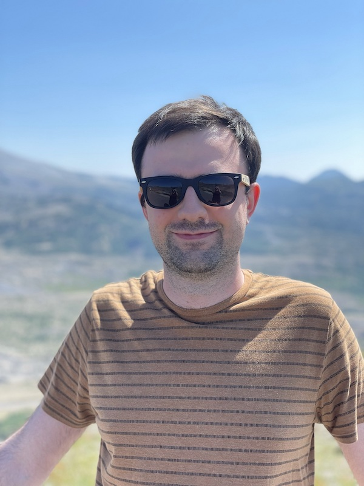

import authors from 'utils/author-data';

_September 13th, 2023_

_Interviewed by: Bill Mulligan, Isovalent_

_Written by: Shedrack Akintayo, Isovalent_

## How did you first get into technology?

From a young age, I was exposed to technology in various forms because both of my parents were involved in the technology scene. However, it's worth noting that they are not specifically in computer science. My father runs a company specializing in CCTV camera automation, while my mother teaches high school electronics. Growing up in such an environment naturally piqued my interest in technology, ultimately leading me to pursue a career in computer science.

## How did you get into open source?

My journey into open source began during my second year of high school when I discovered [Google Code-in](https://codein.withgoogle.com/). This program was designed for high school students to collaborate with open source projects, providing an opportunity to work on them and gain exposure to the open source community.

During this time, I vividly remember working on fixing bugs for [ffmpeg](https://www.ffmpeg.org/) using a Linux computer. I also explored projects like valgrind and collaborated with the ffmpeg upstream maintainers. This experience continued for two years throughout high school, as the program itself spanned over three months. I thoroughly enjoyed contributing to open source during this period.

## How did you first hear about eBPF and Cilium?

When I joined Palantir, I became part of the developer tools group, which had the responsibility of managing the internal CI/CD ecosystem and enhancing developer productivity.

Our primary focus was on optimizing the developer workflow at Palantir. To achieve this, we created a set of bots and decided to host them on a container scheduler, initially choosing [Nomad](https://www.nomadproject.io/).

When I relocated from the London office to the Seattle office, I discovered another group also working with containers and container schedulers. However, in the Seattle office, they used Kubernetes as their preferred container scheduler and Calico for networking.

Using Calico and troubleshooting networking issues was challenging which prompted us to explore alternative CNI options approximately two years after adopting Calico. We were particularly interested in moving away from running an overlay network in our Kubernetes clusters. It was during this search that I came across Cilium.

To gather more information about Cilium and its capabilities, I reached out to the Cilium community on [Slack](https://slack.cilium.io) and inquired about native routing. Through this process, I connected with Thomas Graf and although native routing was not available at the time, I suggested that we work on its development.

This marked the beginning of my involvement with Cilium and my relationship with the project has since evolved and grown stronger.

## How did you become a maintainer of Cilium?

When we initially started working on adding support for native routing in Cilium, we were doing it all internally at Palantir. However, during this process, we encountered some bugs in our implementation. At the same time, Palantir was expanding its infrastructure from being exclusively on AWS to encompassing all major cloud providers.

This made me start to collaborate with Thomas and other team members to create the initial implementation of native routing support for Azure, which we successfully integrated into Cilium. I also focused on enhancing AWS native routing by improving the intelligence of the Cilium operator when assigning IP addresses.

To ensure continued contributions to Cilium, I dedicate several weeks every quarter to focus solely on the project. I take responsibility for specific areas based on my past work and contributions. During this dedicated time, I address various aspects such as reviewing newly reported bugs, identifying necessary additions to the documentation, and finding opportunities for overall project improvement.

My commitment involves actively contributing these updates and enhancements back to the Cilium project.

## What are you working on right now in Cilium?

Currently, my main focus revolves around addressing internal bug fixes that will be subsequently ported back to the Cilium project. Specifically, my team and I at Palantir are working on improving the IPSec encryption part of the code because, given our compliance requirements, we need to ensure that all traffic inside a VPC is encrypted.

I am also conducting research to identify potential enhancements for OpenShift support in Cilium including managing Cilium through OpenShift.

## What advice do you have for people just getting into the Cilium community?

Rather than focusing on Cilium specifically, I’ll give some advice to people who generally want to get involved in open source. One valuable piece of advice I received early on from a close colleague is to ask any questions you have when you join Slack, Discord, or any other communication platform used by the community. This encourages you to interact more and get involved with the community.

It's also highly beneficial to use the GitHub label "first good issue" to discover tasks suitable for new contributors as it serves as an excellent starting point.

## What is one of your hobbies outside coding?

During winter, I enjoy skiing and in summer I find pleasure in hiking. Aside from these activities, I have a fondness for traveling to warm destinations, especially during the winter, to escape the cold. I also recently rekindled an old passion of mine – flying model airplanes, specifically RC airplanes. I used to do this during high school but had to put it on hold when I entered university.

To engage with the Cilium community and contribute to the project, follow Vlad's lead: join our [Slack](https://slack.cilium.io), check out a [good first issue](https://github.com/cilium/cilium/issues?q=is%3Aopen+is%3Aissue+label%3Agood-first-issue) you can work on, and explore our [community page](https://cilium.io/get-involved/) for more information.

<BlogAuthor {...authors.ShedrackAkintayo} />
