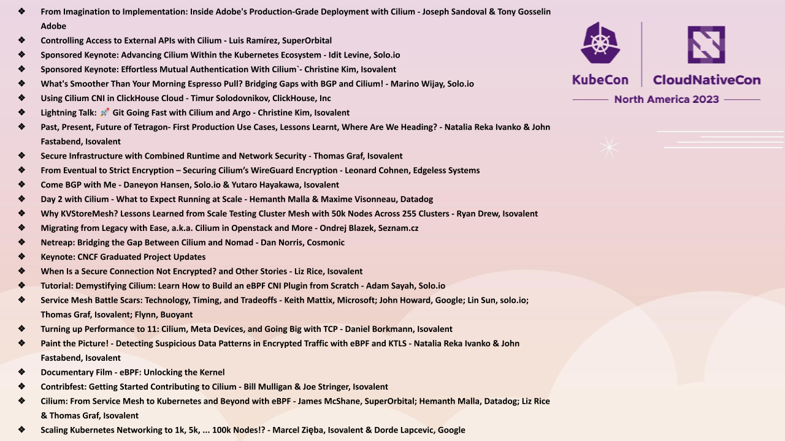

_October 30th, 2023_

_Author: Shedrack Akintayo, Isovalent_

Fresh on the heels of [Cilium’s graduation](https://www.cncf.io/announcements/2023/10/11/cloud-native-computing-foundation-announces-cilium-graduation/), the community is gathering for the second [CiliumCon](https://events.linuxfoundation.org/kubecon-cloudnativecon-north-america/co-located-events/ciliumcon) and sixth [KubeCon + CloudNativeCon North America 2023](https://events.linuxfoundation.org/kubecon-cloudnativecon-north-america/). Cilium is once again taking center stage in the cloud native ecosystem, highlighting how the next generation of networking, observability, and security is being built with eBPF and bringing with it a tale of growth, community, and technological innovation. This isn't just a sequel, but a new narrative unfolding, spotlighting the strides Cilium has made in the cloud native ecosystem.

CiliumCon promises to be a deep dive into the world of eBPF, networking, observability, security, and more, through the lens of Cilium. The [agenda](https://colocatedeventsna2023.sched.com/overview/area/CiliumCon?iframe=no) is packed with insightful talks from seasoned practitioners, core contributors, and community members with topics spanning from the core technical aspects of Cilium to real world implementations and case studies.

At the broader KubeCon + CloudNativeCon North America 2023, as in the past, Cilium is poised to be a significant part of the discourse, reflecting its growing importance in the cloud native ecosystem. With Cilium’s presence at the event, the goal is to equip you with the insights and tools necessary to harness the power of Cilium and eBPF, to improve your networking, making your platforms more secure, efficient, and observable.

Now, Let’s dive into each of the talks on Cilium at both events!

## CiliumCon NA 2023

[From Imagination to Implementation: Inside Adobe's Production-Grade Deployment with Cilium - Joseph Sandoval & Tony Gosselin Adobe](https://colocatedeventsna2023.sched.com/event/1Rj0z/from-imagination-to-implementation-inside-adobes-production-grade-deployment-with-cilium-joseph-sandoval-tony-gosselin-adobe)

**Monday, November 6, 2023 • 9:15 am - 9:40 am**

Adobe has trusted Cilium in its production deployments for over seven years, proving its resilience and extensibility amidst the rapidly evolving developer workload needs. In this session, we'll delve deep into Cilium's role within Adobe's internal developer platform, which runs on AKS, EKS, and our data centers. Adobe has seen how Cilium's extensibility stands out from its early days integrating with Mesosphere, migrating to Kubernetes, and now has supported new challenges head-on, recently proving its scalability with the launch of AI/ML features. This session will provide a candid behind-the-scenes of running Cilium on a multi-tenant IDP. We'll provide insights from our recent experiences launching generative AI applications on Kubernetes and Cilium. Plus, get a sneak peek into our future roadmap and how Adobe plans to harness Cilium for a post-container world.

[Controlling Access to External APIs with Cilium - Luis Ramírez, SuperOrbital](https://colocatedeventsna2023.sched.com/event/1Rj1R/controlling-access-to-external-apis-with-cilium-luis-ramirez-superorbital)

**Monday, November 6, 2023 • 9:50 am - 10:15 am**

We’ve worked on many customer projects that utilize Cilium as the keystone for their networking security solution. In this session, we provide a step-by-step guide, complete with explanations and examples, on how to configure Cilium to limit access to GitHub repos for workloads inside a cluster. This will involve creating certificates for terminating TLS, mounting and trusting certificates inside Pods, and crafting L7 network policies targeting specific groups of Pods in a cluster. Defense in depth is important in multi-tenant environments. Making sure that there are multiple safeguards from unauthorized access is a necessity that may require a belt-and-suspenders approach. To this end, we’ve found that the utility that Cilium provides is immense and often underused. After this session, participants will have a much clearer understanding of how Cilium, with its Network Policies and its visibility functionality, can provide a novel and layered approach to external API access control**.**

[Sponsored Keynote: Advancing Cilium Within the Kubernetes Ecosystem - Idit Levine, Solo.io](https://colocatedeventsna2023.sched.com/event/1RqIt/sponsored-keynote-advancing-cilium-within-the-kubernetes-ecosystem-idit-levine-soloio)

**Monday, November 6, 2023 • 10:20 am - 10:25 am**

As the cloud native landscape evolves, Cilium has emerged as the go-to choice. But the Kubernetes ecosystem is vast, so how do you choose an open source tech stack to connect, manage, secure, and observe communication between your applications? Whether you’re enhancing container orchestration capabilities throughout your networking interface, service mesh, edge proxy, or improving your security posture, there are open source projects emerging as clear winners–such as Cilium–that are poised to help you achieve your goals. By leveraging the capabilities of these top cloud native projects, you can effortlessly implement advanced features such as enforcing network policies, mutual TLS, FIPS compliance, rate limiting or holistic observability spanning both network and application layers. This comprehensive approach extends its benefits to Kubernetes clusters and beyond, empowering you to optimize security, traffic control, and observability across diverse environments.

[Sponsored Keynote: Effortless Mutual Authentication With Cilium`- Christine Kim, Isovalent](https://colocatedeventsna2023.sched.com/event/1RqJH/sponsored-keynote-effortless-mutual-authentication-with-cilium-christine-kim-isovalent)

**Monday, November 6, 2023 • 10:30 am - 10:35 am**

Let’s take a look at the new, frictionless way to cryptographically authenticate workload identities using Cilium. In this talk you’ll see how, by adding just two lines of YAML to a network policy, you can enable a SPIFFE-based mutual authentication handshake between endpoints. Just like Cilium’s existing IPSec and Wireguard implementations, this is completely transparent to the application. If you want to secure Kubernetes traffic, don’t miss this talk!

[What's Smoother Than Your Morning Espresso Pull? Bridging Gaps with BGP and Cilium! - Marino Wijay, Solo.io](https://colocatedeventsna2023.sched.com/event/1Rj2I/whats-smoother-than-your-morning-espresso-pull-bridging-gaps-with-bgp-and-cilium-marino-wijay-soloio)

**Monday, November 6, 2023 • 11:05 am - 11:30 am**

The widely adopted, highly capable Border Gateway Protocol has won the hearts and minds of the Internet. And, it’s made its way into Kubernetes! However, not every workload is a container, and not every VM can make its way into Kubernetes so, how do we ensure every workload can freely talk? If BGP on Cilium is the answer how should we proceed? - Why should we care about BGP? - How do we work with Cilium’s BGP Control Plane? - How can we get our VMs to communicate with our pods using BGP? - Can we see a working BGP setup? - Does “show ip bgp summary” still work? This presentation allows us to delve into BGP internals and history while providing a demonstration of BGP in action, running in Cilium. We’ll become the best neighbors with an upstream router, and we’ll share ALL THE NETWORKS!

[Using Cilium CNI in ClickHouse Cloud - Timur Solodovnikov, ClickHouse, Inc](https://colocatedeventsna2023.sched.com/event/1Rj2m/using-cilium-cni-in-clickhouse-cloud-timur-solodovnikov-clickhouse-inc)

**Monday, November 6, 2023 • 11:40 am - 12:05 pm**

Join us at CiliumCon as we delve into the use of Cilium CNI to optimize and enhance deployments in the ClickHouse Cloud. This session will explore how Cilium, a powerful networking and security solution, integrated into ClickHouse Cloud.

[Past, Present, Future of Tetragon- First Production Use Cases, Lessons Learnt, Where Are We Heading? - Natalia Reka Ivanko & John Fastabend, Isovalent](https://colocatedeventsna2023.sched.com/event/1Rj3S/past-present-future-of-tetragon-first-production-use-cases-lessons-learnt-where-are-we-heading-natalia-reka-ivanko-john-fastabend-isovalent)

**Monday, November 6, 2023 • 12:15pm - 12:40pm**

As many of you know already, Tetragon is reaching v1.0 - being a huge milestone for the community, our users as well as the engineers who have been working on the development for years. This talk's main aim is to walk through the history of Tetragon, and predict its future trajectory. Why was it created in the first place? How? What were the first production use cases? What were the security challenges users were facing? Where are they at now? What were the lessons we learnt through this rocket-propelled roller coaster journey? As an example, the audience will learn how we avoided some pitfalls that BPF-based Security applications fall into and solved critical performance challenges. We’ll finish by presenting where the project is heading, what are the main goals and use cases we are aiming to achieve in the future.

[Secure Infrastructure with Combined Runtime and Network Security - Thomas Graf, Isovalent](https://colocatedeventsna2023.sched.com/event/1Rj4B/secure-infrastructure-with-combined-runtime-and-network-security-thomas-graf-isovalent)

**Monday, November 6, 2023 • 1:30pm - 1:55pm**

Network and runtime security have been known as separate security layers for years. Why are we limiting runtime to the scope of a single node? And why are we stopping at the network layer when we could derive a more accurate identity instead of a "network endpoint"? In this talk, we will look into the future of security as we fulfill the vision of a combined and fully coordinated Cilium and Tetragon stack. Imagine a world where processes and identities are fully authenticated end-to-end. As we explore this new stack, we will compare it to using separate uncoordinated tools such as AppArmor, SELinux, micro-segmentation, and mTLS.

[From Eventual to Strict Encryption – Securing Cilium’s WireGuard Encryption - Leonard Cohnen, Edgeless Systems](https://colocatedeventsna2023.sched.com/event/1Rj4j/from-eventual-to-strict-encryption-securing-ciliums-wireguard-encryption-leonard-cohnen-edgeless-systems)

**Monday, November 6, 2023 • 2:05 pm - 2:30 pm**

Cilium's routing and encryption decisions are based upon endpoint identities. Those identities are distributes via Kubernetes CRDs. If an application sends traffic to another pod inside the cluster, it is only encrypted if the destination's identity has propagated to the node on which the application runs. Depending on the configuration this could result in Pod-to-Pod traffic being sent unencrypted over the wire for multiple seconds. To mitigate this issue we developed and upstreamed a new WireGuard strict mode which we'll present in this talk.

[Come BGP with Me - Daneyon Hansen, Solo.io & Yutaro Hayakawa, Isovalent](https://colocatedeventsna2023.sched.com/event/1Rj5D/come-bgp-with-me-daneyon-hansen-soloio-yutaro-hayakawa-isovalent)

**Monday, November 6, 2023 • 2:40 pm - 3:05 pm**

When Border Gateway Protocol (BGP) was first introduced in Cilium v1.10, MetalLB was used as the control plane with minimal support for the protocol. This gave users a simple and effective way to route ingress traffic to services and pods. As time passed, the requirements for BGP grew and Cilium answered the call with a wide range of new features. The BGP feature set has undergone considerable change in recent releases by deprecating MetalLB in favor of a native BGP control plane. In this session, attendees will learn about Cilium’s BGP features and how they work harmoniously to provide a powerful ingress solution.

[Day 2 with Cilium - What to Expect Running at Scale - Hemanth Malla & Maxime Visonneau, Datadog](https://colocatedeventsna2023.sched.com/event/1Rj5p/day-2-with-cilium-what-to-expect-running-at-scale-hemanth-malla-maxime-visonneau-datadog)

**Monday, November 6, 2023 • 3:15 pm - 3:40 pm**

Cilium works great out of the box, but tweaking a few options will ensure you get the best performance as your clusters grow in size. While Cilium abstracts away a lot of complexity, users are provided with several knobs to control the underlying systems wherever necessary. This talk will quickly brush up on how Cilium interacts with Linux, Kubernetes and cloud provider network stacks and then dive into some of the challenges you might encounter running Cilium in large clusters. For example, over time, you might need to reevaluate rate limiting across the board to avoid cascading failures. You will need to carefully plan for IP address management, tune the operating system or take advantage of new features from cloud providers. Since Cilium is a critical piece of your infrastructure, we’ll talk about what health metrics to keep a close eye on. We’ll also discuss some best practices for deploying and validating your rollouts with out of the box connectivity tests.

[Why KVStoreMesh? Lessons Learned from Scale Testing Cluster Mesh with 50k Nodes Across 255 Clusters - Ryan Drew, Isovalent](https://colocatedeventsna2023.sched.com/event/1Rj6E/why-kvstoremesh-lessons-learned-from-scale-testing-cluster-mesh-with-50k-nodes-across-255-clusters-ryan-drew-isovalent)

**Monday, November 6, 2023 • 3:50 pm - 4:15 pm**

Cilium Cluster Mesh is a feature that connects workloads across clusters, but it has its limitations in the realm of scalability. This talk aims to boil a six-month project which explored and tested the scaling limitations of Cilium Cluster Mesh down into a half-hour, where you’ll review how Cluster Mesh syncs information between clusters, how this syncing broke in a scale test with 50k nodes across 255 clusters, how the scale test was architectured using kubemark to avoid breaking the bank, and how the 1.14 beta feature KVStoreMesh addresses Cluster Mesh’s scaling limitations to provide the opportunity for greater stability.

[Migrating from Legacy with Ease, a.k.a. Cilium in Openstack and More - Ondrej Blazek, Seznam.cz](https://colocatedeventsna2023.sched.com/event/1Rj6e/migrating-from-legacy-with-ease-aka-cilium-in-openstack-and-more-ondrej-blazek-seznamcz)

**Monday, November 6, 2023 • 4:25 pm - 4:50 pm**

Everybody knows Kubernetes, that's what this is all about, right? But most companies do not run everything in k8s, they might have legacy applications or databases that are difficult to run in k8s. What if some of them are in something like OpenStack or directly on baremetal? What if part of then are running in k8s with Calico and part of them run in OpenStack? It would be great to use Cilium with CiliumNetworkPolicies to enforce the boundaries. This is all possible in k8s, but what happens if we use the same network layer also outside of k8s? What if each OpenStack cluster is connected with k8s clusters with Cilium and k8s clusters with Calico and form a clustermesh? Sounds crazy? It might not be as crazy as it sounds, thanks to Cilium.. this is possible. See for yourself.

[Netreap: Bridging the Gap Between Cilium and Nomad - Dan Norris, Cosmonic](https://colocatedeventsna2023.sched.com/event/1Rj79/netreap-bridging-the-gap-between-cilium-and-nomad-dan-norris-cosmonic)

**Monday, November 6, 2023 • 5:00 pm - 5:25 pm**

Cilium is one of the best ways to manage network policies and secure workloads running in a Kubernetes cluster. As a CNI, it provides everything you would want and more! The only problem is what do you do if you want to run Cilium but are not running Kubernetes? In this talk we will outline the steps we took to deploy and run Cilium in our Nomad clusters alongside the rest of our infrastructure. We'll dive into what it took to replace Cilium's operator component with Netreap, an open source tool that bridges Cilium and Nomad. Along the way we'll discuss Cilium's endpoint and labeling model along with some of the lower level APIs that power Cilium. To conclude, we'll go though some of the limitations of our approach and outline some ways that we can make Cilium better for everyone.

## ArgoCon

[Lightning Talk: 🚀 Git Going Fast with Cilium and Argo - Christine Kim, Isovalent](https://colocatedeventsna2023.sched.com/event/1Rj31/cl-lightning-talk-git-going-fast-with-cilium-and-argo-christine-kim-isovalent)

**Monday, November 6, 2023 • 12:10pm - 12:15pm**

Ever wanted to use Cilium and ArgoCD together? As declarative tools continue to increase, the work to get started can seem overwhelming. This lightning talk will get you going with setting up your GitOps leveraging Cilium and will highlight the strengths of being declarative with your environment.

## KubeCon + CloudNativeCon

[Keynote: CNCF Graduated Project Updates](https://kccncna2023.sched.com/event/1R4Zf)

**Tuesday, November 7, 2023 • 10:00 am - 10:15 am**

Cilium will be included in the Graduated projects update keynote.

[When Is a Secure Connection Not Encrypted? and Other Stories - Liz Rice, Isovalent](https://kccncna2023.sched.com/event/1R2tD)

**Tuesday, November 7, 2023 • 3:25 pm - 4:00 pm**

Many organizations use a Service Mesh to secure traffic between apps. This may use Mutual TLS, with a proxy terminating connections on behalf of apps. mTLS starts with a handshake to authenticate endpoint identities, and exchange certificates for subsequent traffic encryption. When encryption is needed but app authentication is not, approaches like WireGuard or IPSec may be more suitable. What about scenarios where authentication is important but encryption adds too much latency? With demos to make concepts concrete, let’s dive into Cilium's approach to authentication and encryption, and the differences between mTLS and in-kernel alternatives.

- Explore the mTLS handshake step-by-step
- Contrast with transparent encryption using node identities
- Understand where encryption takes place in different models
- Discuss options for encrypting L7 protocols other than HTTP

With a clear picture of how authentication and encryption work, you’ll be better able to assess which approach best meets your needs.

[Tutorial: Demystifying Cilium: Learn How to Build an eBPF CNI Plugin from Scratch - Adam Sayah, Solo.io](https://kccncna2023.sched.com/event/1R2on/tutorial-demystifying-cilium-learn-how-to-build-an-ebpf-cni-plugin-from-scratch-adam-sayah-soloio?iframe=no&w=100%&sidebar=yes&bg=no)

**Tuesday, November 7, 2023 • 4:30 pm - 6:00 pm**

eBPF technology is driving a transformative shift in the network stack, enabling secure code execution within a protected kernel sandbox. This facilitates instant metrics retrieval and the implementation of network routing and security policies. Additionally, eBPF empowers us to reshape traffic at a low level with XDP, which delivers high-performance programmable packet processing seamlessly integrated with the kernel. This revolutionary impact extends to the Kubernetes networking landscape, as eBPF serves as the core technology behind projects like Cilium and its CNI plugin that provides high-performance network capabilities, but such powerful technologies remain enigmatic for many. The objective of this workshop is to dive into the inner workings of these technologies, participants will learn the basics of eBPF and CNI, and they will gain hands-on experience in creating a CNI plugin for Kubernetes utilizing eBPF, demystifying the underlying mechanics of eBPF-based projects.

[Service Mesh Battle Scars: Technology, Timing, and Tradeoffs - Keith Mattix, Microsoft; John Howard, Google; Lin Sun, solo.io; Thomas Graf, Isovalent; Flynn, Buoyant](https://kccncna2023.sched.com/event/1R2ts)

**Tuesday, November 7, 2023 • 5:25 pm - 6:00 pm**

It has been ~6 years since the first service meshes hit the market, and hundreds if not thousands of users are employing the technology in production today. As the space has matured and meshes are used at scale, many users are wondering about why certain constraints exist in their mesh of choice. Come hear maintainers of 3 CNCF service mesh projects discuss the very real tradeoffs they’re making everyday with topics ranging from eBPF, sidecarless, Rust proxies, multicluster, and user experience.

[Turning up Performance to 11: Cilium, Meta Devices, and Going Big with TCP - Daniel Borkmann, Isovalent](https://kccncna2023.sched.com/event/1R2s5/turning-up-performance-to-11-cilium-meta-devices-and-going-big-with-tcp-daniel-borkmann-isovalent?iframe=no&w=100%&sidebar=yes&bg=no)

**Wednesday, November 8, 2023 • 4:30 pm - 5:05 pm**

The need to move more bits faster through the cloud is constantly turning up, from “day 2” challenges like migrating more workloads into Kubernetes environments, connecting multiple clusters, or simply escalating data demands from AI applications. In this talk, we discuss Cilium’s journey to achieve host-level network performance and latency for Pods. We will deep dive into changes we upstreamed to the Linux kernel and then brought to Cilium such as the new veth-replacement driver. We also take a look at new features like BIG TCP which so far have not been brought into the wider Kubernetes community. This talk is for operators who want to get the most out of their setup. While many start with the default settings for getting started on “day 1”, “day 2” challenges will often lead to seeking ways to turn the performance knob up. The audience will walk away knowing how resources can be freed up and given to the application just by tweaking software to finally reach 11 for performance.

[Paint the Picture! - Detecting Suspicious Data Patterns in Encrypted Traffic with eBPF and KTLS - Natalia Reka Ivanko & John Fastabend, Isovalent](https://kccncna2023.sched.com/event/1R2v2)

**Wednesday, November 8 • 5:25 pm - 6:00 pm**

Using eBPF to detect malicious events on Cloud Native environments continues to rise because it provides a wide range of options to monitor for suspicious runtime execution, network connections, and file access. However, detecting sensitive data patterns, like social security or credit card numbers in encrypted L7 network traffic has traditionally been done in user space. By leveraging in-kernel HTTP visibility and kTLS, we now have the ability to paint a complete security picture and monitor sensitive data flows between Kubernetes workloads, even if they are encrypted. Using Tetragon, this talk will demonstrate how eBPF can be applied to solve the technical challenge of decrypting TLS traffic by using kTLS and showcase how Security Teams can detect sensitive data patterns, like social security numbers or exploit signatures in encrypted L7 traffic. By using eBPF, this solution avoids operational complexity, overhead, and is fully transparent to the application as well as the CNI.

[Documentary Film - eBPF: Unlocking the Kernel](https://kccncna2023.sched.com/event/1RHS7)

**Wednesday, November 8 • 6:15 pm - 7:00 pm**

In 2014, a group of engineers at Plumgrid needed to find an innovative and cost-effective solution to handle network traffic in SDN environments. What they created was a landmark in the industry known as the extended Berkeley Packet Filter (or eBPF). This vital technology allows user-level code execution inside the Linux Kernel, transforming network traffic handling for SDN environments. Whether these engineers knew it or not, they had just revolutionized the Linux Kernel. We go in-depth to explore the origins of eBPF and showcase the stories, challenges, and rewards of this game-changing technology. In the documentary film, we interviewed key stakeholders from Meta, Intel, Isovalent, Google, Red Hat, and Netflix who helped shape and build the tools that drove the success and adoption of eBPF. Join us for this premiere screening of why eBPF is seen as one of the most promising, emerging applications and cutting-edge technologies in the Linux ecosystem.

[🚨 Contribfest: Getting Started Contributing to Cilium - Bill Mulligan & Joe Stringer, Isovalent](https://kccncna2023.sched.com/event/1R2tk/contribfest-getting-started-contributing-to-cilium-bill-mulligan-joe-stringer-isovalent?iframe=no&w=100%&sidebar=yes&bg=no)

**Thursday, November 9, 2023 • 11:00 am - 12:30 pm**

"It's always DNS" has hit production and you have found a bug in Cilium. You think you have a fix, but aren't sure how to contribute it back to upstream Cilium. This is the Contribfest for you! We will start with an overview of Cilium for developers to help contributors understand how the different parts of the project interact and where they should look to contribute their code. From there, we will divide into groups based on functional areas to discuss new and outstanding PRs. New contributors to Cilium will learn how to contribute to the project and existing contributors will gain a better understanding of how their code connects to the rest of the project.

[Cilium: From Service Mesh to Kubernetes and Beyond with eBPF - James McShane, SuperOrbital; Hemanth Malla, Datadog; Liz Rice & Thomas Graf, Isovalent](https://kccncna2023.sched.com/event/1R2ux/cilium-from-service-mesh-to-kubernetes-and-beyond-with-ebpf-james-mcshane-superorbital-hemanth-malla-datadog-liz-rice-thomas-graf-isovalent?iframe=no&w=100%&sidebar=yes&bg=no)

**Thursday, November 9, 2023 • 2:00 pm - 2:35 pm CST**

In this session you'll get an update on how Cilium is expanding the frontiers of cloud native networking, observability, and security. You'll hear about the latest developments and future roadmap of the project and why it has become the CNI of choice in the wild. We will cover things like how Cilium is leveraging eBPF to speed up container networking, doing mutual authentication of services with Cilium Service Mesh, and expanding cloud native principles beyond Kubernetes with Cilium Mesh. In this session, you'll hear from Cilium contributors and users Datadog, Isovalent, and SuperOrbital.

Make sure you stop by the Cilium booth to get your Cilium swag and as you navigate through the sessions, engage with the community, and immerse yourself in the discourse, we hope you'll carry with you not just the technical know-how, but a sense of belonging to a community that’s propelling towards a future of improved cloud native networking. See you there!

[Scaling Kubernetes Networking to 1k, 5k, ... 100k Nodes!? - Marcel Zięba, Isovalent & Dorde Lapcevic, Google](https://kccncna2023.sched.com/event/1R2vB)

**Thursday, November 9 • 2:55 pm - 3:30pm**

Setting up clusters with thousands of nodes can be challenging especially when running sophisticated networking like Cilium, which is required when serving internet-scale applications. In this session, you will learn best practices around scaling Cilium and Kubernetes from tech leads from Google Cloud (which allows 15,000 node clusters) and Isovalent (which scales Cilium Cluster Mesh-based clusters up to 256 clusters/100k nodes). It will compare two perspectives - a large single-cluster as well as an alternative - managing multiple smaller clusters and how these decisions impact performance/scalability/reliability. You’ll be able to hear from practitioners in the space how to configure your clusters, what metrics to monitor, and how to improve the reliability of your production environment. If you want to understand how networking features impact the Kubernetes control plane, how to minimize the blast radius of outages, and learn about large-scale incidents, this session is for you!
