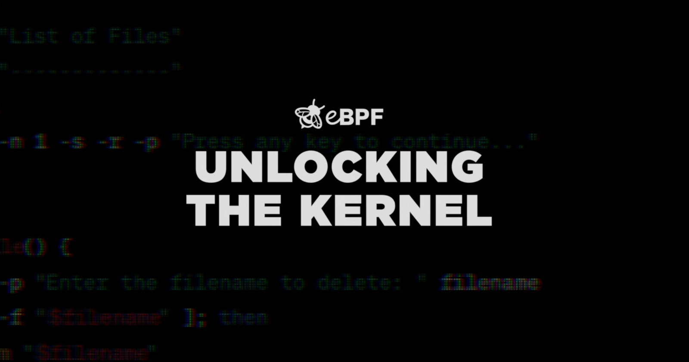

**November 8th, 2023**

**Author: Shedrack Akintayo, Isovalent**

eBPF is a revolutionary technology that allows safe and efficient modification of the Linux kernel’s behavior without altering its source code or loading extra modules. This is the technology that gives Cilium its secure network connectivity capabilities, deep application observability via Hubble, and runtime enforcement capabilities with Tetragon.

The eBPF documentary is a story of a journey that began with an idea—transforming the Linux kernel into a programmable entity, which has since redefined the boundaries of what's possible in the industry. It features pioneers of the technology like [Alexei Starovoitov](https://www.linkedin.com/in/alexey1), [Thomas Graf](https://ch.linkedin.com/in/thomas-graf-73104547), [Daniel Borkmann](http://borkmann.ch/), [Brendan Gregg](https://www.brendangregg.com/), David Miller and [Liz Rice](https://uk.linkedin.com/in/lizrice), who have been instrumental in eBPF's growth.

The documentary dives deep into the motivations of the individuals who stand at the forefront of this technology and showcase the role that Cilium played in its development. Thomas Graf, alongside Daniel Borkmann and other brilliant minds, embarked on a mission: to harness the raw power of eBPF and make it accessible to end users through Cilium. Their vision was clear—to introduce a new layer of networking that was secure by default.

Learn about Cilium's inception and how it is crafting a secure networking layer for the future. Discover the story of Cilium and how DockerCon 2017 sparked a wave of community engagement with Cilum and eBPF, leading to milestones like Google's integration of[Cilium and eBPF into their GKE Dataplane](https://cloud.google.com/blog/products/containers-kubernetes/bringing-ebpf-and-cilium-to-google-kubernetes-engine) in 2020.

Join us in exploring the untold story of eBPF from its inception to its adoption in the cloud native ecosystem and how it is driving the ecosystem forward through projects like Cilium.

You can watch the eBPF documentary [here](https://www.youtube.com/watch?v=Wb_vD3XZYOA)

<YoutubeIframe embedId="Wb_vD3XZYOA?controls=0"/>
