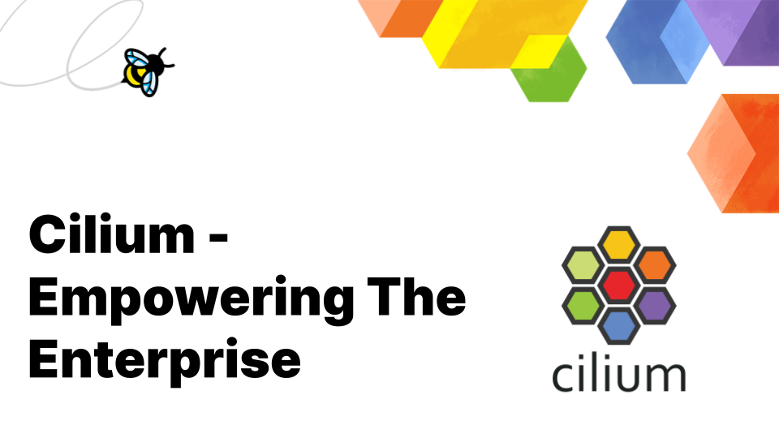

import authors from 'utils/author-data';

_Author: Shedrack Akintayo, Isovalent_

## Introduction

As the cloud native ecosystem has matured, simplifying complexities without compromising useability or performance is key. Cilium is a cloud native networking, observability and security platform built to address these challenges, even as the scale and challenges of the platform grow.

This article aims to trace Cilium’s journey from its early days to becoming a go-to solution for enterprises in search of a rock-solid networking, observability and security solution. Understanding this journey is significant as it mirrors the broader industry's transition towards cloud native technologies, which is essential in harnessing the full potential of application teams and modern infrastructure.

## The Evolution of Cilium

In 2014, the Linux networking ecosystem experienced a wave of innovation that reshaped it.

During this period, the ecosystem was focused on building various networking protocols and models including [software-defined networking](https://en.wikipedia.org/wiki/Software-defined_networking). At the same time, [Kubernetes made its first commit](https://github.com/kubernetes/kubernetes/commit/2c4b3a562ce34cddc3f8218a2c4d11c7310e6d56) and containerization was taking off. With these new improvements in the ecosystem, the pre-existing Linux networking, observability, and security tools became unable to keep up with the dynamic needs of containerised and orchestrated applications.

eBPF had also just been merged into the Linux kernel, bringing programmability and flexibility to this decades old technology. Some of the key architects behind the revolutionary technology wanted to bring the power of eBPF to end users, leading to the creation of the [Cilium project](https://cilium.io/). The main goal for Cilium was to introduce a new networking layer that was programmable, scalable, and secure by default to keep up with the needs of IT infrastructure.

The initial implementation of Cilium was as an eBPF-based Container Networking Interface (CNI) to provide connectivity for container workloads. As the cloud native ecosystem grew, Cilium’s use cases evolved, expanding to include a myriad of capabilities like [service mesh](https://cilium.io/use-cases/service-mesh/), [BGP](https://cilium.io/use-cases/bgp/), [network encryption](https://cilium.io/use-cases/transparent-encryption/), etc. Each new capability added was a testament to Cilium's evolving nature, constantly adapting to meet the complex demands and challenges that cloud native networking, observability and security presented.

Cilium’s evolution is a great example of innovation spurred by necessity and an evolving journey towards creating a platform that meets the requirements of the cloud native world.

## eBPF - The Heart of Cilium

eBPF is the core technology powering Cilium, providing high-performance networking, security, and deep observability in cloud native environments like Kubernetes clusters and even beyond​.

eBPF has high performance because it is [JIT (Just-In-Time) compiled](https://en.wikipedia.org/wiki/Just-in-time_compilation) and runs directly within the Linux kernel. This kernel-level operation offers enhanced performance, security, and flexibility. eBPF programs are verified to ensure they won't crash the kernel and can only be modified by privileged users. This opens up a world where developers can easily diagnose problems, innovate quickly, and extend operating system functionality, unlocking new ways of building cloud native infrastructure that weren’t possible before​.

Major organizations and projects such as [Meta](https://www.youtube.com/watch?v=ZYBXZFKPS28), [Netflix](https://netflixtechblog.com/how-netflix-uses-ebpf-flow-logs-at-scale-for-network-insight-e3ea997dca96), and [Google](https://cloud.google.com/blog/products/containers-kubernetes/bringing-ebpf-and-cilium-to-google-kubernetes-engine) use eBPF across their organization for its ability to enhance system performance, provide granular observability, and provide better security. Additionally, its [wide adoption](https://ebpf.io/case-studies/) and contributions from various organizations underline its importance and the pivotal role it plays in modern technology solutions.

Harnessing the power of eBPF enables dynamic insertion of powerful security, visibility, and networking control logic right into the Linux kernel. This is the cornerstone of Cilium's capabilities in providing [high-performance](https://cilium.io/use-cases/cni/) and [multi-cluster](https://cilium.io/use-cases/cluster-mesh/) networking, [advanced load balancing](https://cilium.io/use-cases/load-balancer/), [observability](https://cilium.io/use-cases/protocol-visibility/), [transparent encryption](https://cilium.io/use-cases/transparent-encryption/), and [extensive network security](https://cilium.io/use-cases/runtime-enforcement/) capabilities, to name a few.

## Cloud Native Challenges Meet Their Match with Cilium

In enterprise organizations, transitioning from legacy systems into the cloud native world can feel like a bucket of cold water raining down on you. With constant changes in the environment, navigating these new waters often feels like finding a needle in a haystack. The stakes are high with challenges ranging from securing customer data, maintaining high performance, keeping up with customer demands with scalable software, and avoiding outages that degrade customer experience. Here's where Cilium steps in as a solution for these enterprise-grade challenges.

With Cilium at the helm, enterprises can seamlessly implement [network policies](https://cilium.io/use-cases/network-policy/), crafting a secure and compliant networking environment. This is particularly crucial for enterprises operating in highly regulated industries, where data encryption and adherence to standards and regulations are paramount.

In a microservices-based system, observability is the key to discovering the intricacies of network operations and debugging when things go wrong. Cilium provides in-depth [observability](https://cilium.io/use-cases/protocol-visibility/) with [Hubble](https://docs.cilium.io/en/stable/overview/intro/), paving the way for a clear understanding of network traffic. This, in turn, simplifies troubleshooting and performance optimization, acting as a catalyst in diagnosing and resolving network-related issues.

High-performance networking is not just a need but a critical requisite for real-time applications and services. Enterprises seeking to optimize their Kubernetes deployments for high-performance networking can reap significant benefits from adopting Cilium. Cilium's unique architecture enables it to operate directly within the Linux kernel, resulting in substantial [performance improvements](https://cilium.io/blog/2021/05/11/cni-benchmark/). This translates into faster application response times, reduced delays for data-intensive workloads, enhanced throughput for high-bandwidth applications, and support for larger-scale deployments.

As enterprises grow, the scalability of networking solutions also becomes a focal point. Cilium offers a high-performance [layer 4 load balancer](https://cilium.io/use-cases/load-balancer/) designed to efficiently handle the networking demands of large-scale, distributed architectures. Cilium’s [Kube-proxy replacement](https://cilium.io/use-cases/kube-proxy/) can also provide enhanced networking speed and efficiency for enterprises building on Kubernetes. These features of Cilium ensure that as the enterprise grows, the networking solutions evolve equally, meeting the dynamic demands head-on.

The narrative of Cilium being referred to as a game-changer in the enterprise domain comes from its ability to simplify the complex world of cloud native networking, security, and observability, making it a critical component of modern cloud native platforms.

## Cilium in Action: Case Studies

To fully understand Cilium’s impact on the enterprise software ecosystem, we need to look into real-world scenarios. In this section, we'll explore three distinct case studies from Bloomberg, Meltwater, and Trendyol to showcase Cilium's capabilities in tackling networking, observability and security challenges in enterprise organizations.

### Bloomberg

Bloomberg ventured into creating a next-generation quantitative investment solution known as BQuant Enterprise. While architecting the data sandboxes for the BQuant Enterprise cloud, data security emerged as a significant challenge. The primary goal was to bolster the protection of both the firm’s and its clients' data by restricting automated data egress and customer resource access.

The Bloomberg Engineering team turned to Cilium, drawn by its host-based network policies. Through Cilium, they restricted cluster network access to specific ports and host names to curb data egress. As they built their data sandbox storage solution, Cilium simplified the creation of an access control system for data from user workloads via its policy exception feature and allowed them to offer additional features to their customers by leveraging Layer 7 policies. Moreover, Cilium’s Hubble enhanced observability, making network debugging simpler for the engineering teams.

Cilium significantly heightened the security and access control for BQuant Enterprise workloads which allowed Bloomberg to successfully prevent unauthorized egress of protected data and access to unauthorized resources. This proactive approach also allowed the enforcement of licensing restrictions across datasets, minimizing the risk of unlicensed access to sensitive information. Additionally, Hubble’s observability features empowered Bloomberg's Engineers to troubleshoot network problems efficiently, saving valuable development time. You can read more about this case study [here](https://www.cncf.io/case-studies/bloomberg-2/).

### Meltwater

Meltwater, a global media intelligence company, initially used the AWS VPC CNI for their Kubernetes platform. However, they stumbled upon challenges such as the lack of crucial features like network policies and encryption, AWS API rate limiting, performance glitches with kube-proxy/iptables, and limited observability within their clusters. The quest for a robust solution to these challenges led them to Cilium.

Cilium facilitated a seamless transition from the existing AWS VPC CNI without any service interruption to their clientele. With Cilium as the default CNI across all of Meltwater’s Kubernetes clusters, the payoff has been substantial. The company now enjoys improved performance, better architecture and notably, improved network observability courtesy of Hubble.

Meltwater's live migration to Cilium established a solid groundwork for better network management and observability in their Kubernetes platform. Hubble, in particular, helped them in debugging network issues, visualizing network traffic, and making troubleshooting more efficient, faster, and easier. You can read more about this case study [here](https://www.cncf.io/case-studies/meltwater/).

### Trendyol

Trendyol, a leading e-commerce platform in Turkey, initially employed Flannel and Calico for networking in their Kubernetes platform. However, as their infrastructure grew, scalability and performance challenges surfaced. The anticipation of a further increase in the number of Kubernetes clusters and the size of the clusters made them look for an alternative CNI solution. Their goal was to bolster the network performance of their Kubernetes cluster’s connectivity, manage 3-5 thousand nodes within a single cluster, and remove kube-proxy to augment the overall performance of their Kubernetes clusters.

After rigorous performance testing of various solutions, Trendyol opted for Cilium as their foundation for networking, observability, and security in their platform. The transition to Cilium marked a significant leap in performance, effective observability with Hubble, and enhanced scalability and security for their Kubernetes clusters.

Cilium is now the default CNI for Trendyol’s Kubernetes clusters. The migration to Cilium’s advanced networking from Flannel increased their network performance **by over 40%**, according to their internal benchmarks, significantly transcending their expectations. You can read more about this case study [here](https://www.cncf.io/case-studies/trendyol/).

The practical implementation of Cilium in Bloomberg, Meltwater, and Trendyol’s systems showcases its robust, adaptable nature in addressing distinct challenges in varied enterprise environments. From enhancing data security and observability to significantly improving networking performance and scalability, Cilium emerges as a comprehensive platform.

## Cilium: Built For The Enterprise

Navigating the cloud native networking, observability, and security ecosystem often unveils complex challenges, bringing tools like Cilium to the forefront. We traced Cilium's evolution from its roots amidst the early Kubernetes ecosystem to its current stature as a trusted enterprise-grade solution, all powered by eBPF.

Through the lens of real-world implementations at Bloomberg, Meltwater, and Trendyol, we saw how Cilium substantially improved network performance, tightened security, and offered detailed observability, addressing unique challenges across many different companies. Cilium represents a shift in how companies can approach networking, observability, and security for their cloud native platform.

If you want to learn more about Cilium read through [Cilium’s documentation](https://docs.cilium.io/en/stable/), engage with hands-on [Cilium labs](https://cilium.io/labs/), or follow the [getting-started guides](https://cilium.io/get-started/) to learn more about its capabilities. For those keen on engaging in discussions or staying updated with the latest information, joining [Cilium’s Slack community](https://slack.cilium.io) is a way to add to the conversation.

If you're geared towards contributing to Cilium, the project is [open to your contributions](https://github.com/cilium/cilium/issues?q=is%3Aopen+is%3Aissue+label%3Agood-first-issue). Every code commitment, documentation enhancement, or community interaction nudges Cilium closer to addressing the dynamic challenges in the cloud native networking observability, and security platforms.

<BlogAuthor {...authors.ShedrackAkintayo} />
