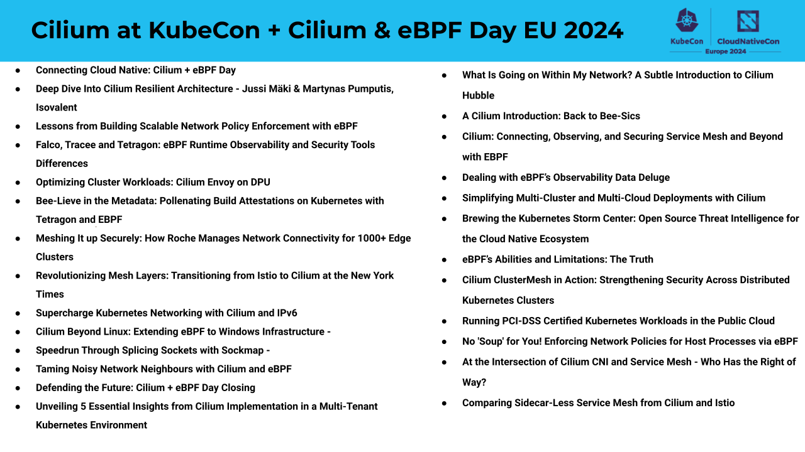

KubeCon + CloudNativeCon EU 2024 is nearly here, and it's packed with activities centered around Cilium. As the standard for high-performance networking, observability, and security in the Cloud Native ecosystem, Cilium is set to be a major point of discussion throughout the event, especially following the recent release of [Cilium 1.15](https://github.com/cilium/cilium/releases/tag/v1.15.0).

Starting with [Cilium + eBPF Day](https://events.linuxfoundation.org/kubecon-cloudnativecon-europe/co-located-events/cilium-ebpf-day/), the agenda features talks from end users like the New York Times, Roche, and Datadog, who will showcase the benefits they've achieved with the scalability, performance, and security capabilities of Cilium and eBPF. Cilium maintainers will also be diving into the architecture of the project and discussing where it is going next.

After Cilium + eBPF Day, there will be 11 other exciting talks about Cilium to catch when the main conference kicks off on Wednesday! The talks this year will cover high-scale networking, deep dives into security and observability with Tetragon, Hubble, and eBPF, and end-user stories from those implementing Cilium in highly regulated environments and on the edge. Similar to last year, there will be a Cilium booth in the Project Pavilion where you can meet the developers behind the project and have all your questions answered too.

Now, let's explore each of these talks in more detail.

## Cilium + eBPF Day

[Connecting Cloud Native: Cilium + eBPF Day - Laurent Bernaille, Datadog & Bill Mulligan, Isovalent](https://events.linuxfoundation.org/kubecon-cloudnativecon-europe/co-located-events/cncf-hosted-co-located-schedule/)

Tuesday, March 19, 2024, 09:00 - 09:10 CET

The Opening Session for Cilium + eBPF Day EU 2024

[Deep Dive Into Cilium Resilient Architecture - Jussi Mäki & Martynas Pumputis, Isovalent](https://colocatedeventseu2024.sched.com/event/1ZJA8?iframe=no)

Tuesday, March 19, 2024, 09:15 - 09:40 CET

With 680 unique contributors, 470k lines of Go, and 35k of eBPF code, Cilium is on track to becoming one of the most significant OSS infrastructure projects. This comes with a big challenge - designing Cilium so that its learning curve for contributors is manageable while not sacrificing important infrastructure software properties such as stability.

In this talk, two core Cilium contributors will present Cilium's architecture, emphasizing resilience, integrity, modularity, and testability. This talk aims to help developers understand Cilium's design principles and architecture, which can facilitate their contributions.

[Lessons from Building Scalable Network Policy Enforcement with eBPF - Hemanth Malla, Datadog & Joe Stringer, Isovalent](https://colocatedeventseu2024.sched.com/event/1YFe0/lessons-from-building-scalable-network-policy-enforcement-with-ebpf-hemanth-malla-datadog-joe-stringer-isovalent?iframe=no)

Tuesday, March 19, 2024, 09:50 - 10:15 CET

eBPF has unlocked new levels of performance and scalability for container networking. Cilium has leveraged eBPF to implement a plethora of network policy features. Kubernetes scalability has been improving with every new release, and clusters with 5k+ nodes are increasingly common. Cilium’s policy framework needs to scale for hundreds of thousands of pods while dealing with complex scenarios like high pod churn environments. In this talk, Cilium maintainers will share lessons learnt from years of programming Kubernetes abstractions directly into the kernel space using eBPF. You’ll learn about how cilium efficiently intercepts traffic for enforcement both at L4 and L7, tricks used by cilium to minimize CPU overhead on each node, and some design decisions that have been instrumental in squeezing high-performance out of the kernel regardless of the number of pods. Finally, we’ll discuss strategies you can follow to improve the debuggability of eBPF-based networking datapaths.

[⚡ Lightning Talk: Falco, Tracee and Tetragon: eBPF Runtime Observability and Security Tools Differences - Kyle Quest, Slim.AI](https://colocatedeventseu2024.sched.com/event/1YFee/cl-lightning-talk-falco-tracee-and-tetragon-ebpf-runtime-observability-and-security-tools-differences-kyle-quest-slimai?iframe=no)

Tuesday, March 19, 2024, 10:40 - 10:45 CET

Falco, Tracee and Tetragon are popular eBPF-based runtime observability and security tools. Which tool is better? How are they different in terms of use and in terms of their design? Which one should you choose? What are the best use cases for each tool? This talk will focus on the eBPF-related differences in those tools including the eBPF application design, eBPF libraries each tool uses, eBPF features leveraged by each tool, and types of eBPF hooks used. default tracepoint and kprobes, data exposed in the events generated by each tool. The talk will also give an overview of the trade-offs, gaps and benefits those tools have based on their differences. If you are a user trying to understand what eBPF runtime tool is best for you or if you are a developer trying to build your own eBPF runtime tool this talk will help you answer the top questions you might have.

[⚡ Lightning Talk: Optimizing Cluster Workloads: Cilium Envoy on DPU - Shatakshi Mishra & Abed Mohammad Kamaluddin, Marvell Technology](https://colocatedeventseu2024.sched.com/event/1YFey/cl-lightning-talk-optimizing-cluster-workloads-cilium-envoy-on-dpu-shatakshi-mishra-abed-mohammad-kamaluddin-marvell-technology?iframe=no&w=100%&sidebar=yes&bg=no)

Tuesday, March 19, 2024, 10:50 - 10:55 CET

The Envoy Proxy plays a pivotal role in providing Layer 7 functionalities like Ingress, Gateway API, Network Policies, and Protocol Visibility as part of the Cilium agent. In Cilium version 1.14, deploying the Envoy proxy as a DaemonSet is supported, introducing intriguing deployment scenarios. One compelling option is transitioning these features to the DPUs. Modern SmartNICs and DPUs offer additional power-efficient compute capacity on servers with hardware accelerations tailored for specialized workloads. This study delves into an architecture for provisioning the Cilium Envoy Proxy to an OCTEON10 DPU, addressing challenges encountered in this process. The goal is to unlock the substantial compute potential of DPUs, optimizing resource utilization and enabling the host machine to handle an increased load of application workloads.

[Bee-Lieve in the Metadata: Pollenating Build Attestations on Kubernetes with Tetragon and EBPF - Tom Meadows, TestifySec](https://colocatedeventseu2024.sched.com/event/1YFfN/bee-lieve-in-the-metadata-pollenating-build-attestations-on-kubernetes-with-tetragon-and-ebpf-tom-meadows-testifysec?iframe=no)

Tuesday, March 19, 2024 11:05 - 11:30 CET

Like bees making honey, we developers forage the internet for code that we borrow and thread together to create software. It’s built, uploaded and shared, resulting in hundreds of thousands (if not millions) of software artefacts being built each day. For an unlucky few, attackers seek to infiltrate the build process like a hornet attacking a beehive. If they successfully attack a project with a large user base, the impact could be unprecedented, leading to the big bad ‘Game Over’ message rolling across the screen. In 2022, A Kubernetes-aware, Security Observability tool called Tetragon was released. This talk shows how the project serves as the key to the creation of a tool for securing build systems on Kubernetes. By leveraging Tetragon and eBPF, Attestagon aims to produce concise and cryptographically verifiable metadata. Come to this talk if you wish to see how any busy bee can inspect it to see whether a package was indeed sealed and delivered in the way the author intended.

[Meshing It up Securely: How Roche Manages Network Connectivity for 1000+ Edge Clusters - Hector Monsalve & Edgar Pardo, Roche](https://colocatedeventseu2024.sched.com/event/1YFg2/meshing-it-up-securely-how-roche-manages-network-connectivity-for-1000-edge-clusters-hector-monsalve-edgar-pardo-roche?iframe=no)

Tuesday, March 19, 2024, 11:40 - 12:05 CET

Roche, one of the largest global healthcare companies, has embarked on the challenging journey of building a modern, cloud native edge compute platform that helps to run applications on customer premises, like laboratories or hospitals. In this talk, we will discuss the challenges of highly protected environments and show how leveraging Cilium Service Mesh can bring “the firewall” closer to the workload. This not only allows for more fine-grained traffic control but also simplifies the operations and configuration of network policies using a GitOps approach, alongside the deployment of workloads. Going beyond this, we’ll also look at some of the more advanced features of Cilium - like sending cluster traffic that targets the cloud via a specific forward proxy before it leaves the customer premises.

[Revolutionizing Mesh Layers: Transitioning from Istio to Cilium at the New York Times - Ahmed Bebars & Pete Saia, The New York Times](https://colocatedeventseu2024.sched.com/event/1YFgU/revolutionizing-mesh-layers-transitioning-from-istio-to-cilium-at-the-new-york-times-ahmed-bebars-pete-saia-the-new-york-times?iframe=no&w=100%&sidebar=yes&bg=no)

Tuesday, March 19, 2024, 12:15 - 12:40 CET

Networking isn’t an easy task to achieve, and with scale, that can grow out of control quickly. We are always looking to improve the performance and ensure the traffic passes through the most efficient route but with more capabilities. Adding a service mesh to ensure better availability and many other features can be a bit tricky. We will discuss the intricacies of the shared platform mesh layer design. We will dive into our decision to explore the evolution of Cilium, which was initially used only as a Container Network Interface (CNI) that has now become a feature-rich, multi-region mesh layer. Ahmed and Pete will discuss the strategic decisions and implementation processes that allowed Cilium to replace many of Istio seamlessly. This has resulted in a scalable architecture and a significant performance and resource optimization boost. The audience will learn how the team strategically leveraged Cilium to unlock new possibilities in managing their platform mesh layer.

[Supercharge Kubernetes Networking with Cilium and IPv6 - Daneyon Hansen, Solo.io](https://colocatedeventseu2024.sched.com/event/1YFh4/supercharge-kubernetes-networking-with-cilium-and-ipv6-daneyon-hansen-soloio?iframe=yes&w=100%&sidebar=yes&bg=no)

Tuesday, March 19, 2024, 13:30 - 13:55 CET

Get ready for an in-depth journey into IPv6 networking with Cilium! In this session, we dive deep into the powerful IPv6 capabilities of Cilium to supercharge your Kubernetes applications. Join us to uncover the extensive range of IPv6 features that Cilium brings to Kubernetes environments. From ultra-high throughput powered by BIG TCP to transition mechanisms such as NAT46/64, you'll see firsthand how Cilium elevates the IPv6 networking game in Kubernetes. Whether you're a seasoned Kubernetes pro or just getting started, this session promises valuable insights into harnessing the full potential of Cilium for IPv6 workloads.

[Cilium Beyond Linux: Extending eBPF to Windows Infrastructure - Chandan Aggarwal & Alan Jowett, Microsoft](https://colocatedeventseu2024.sched.com/event/1YFiT/cilium-beyond-linux-extending-ebpf-to-windows-infrastructure-chandan-aggarwal-alan-jowett-microsoft?iframe=no&w=100%&sidebar=yes&bg=no)

Tuesday, March 19, 2024, 15:15 - 15:40 CET

Cilium eBPF offers significant performance improvements and advanced features exclusively for Linux users today. Would you believe it if I say “Cilium eBPF programs can run on Windows and reap the same benefits as Linux”. If you're intrigued by these advancements, this session promises valuable insights. The session will cover the current capabilities of Cilium Windows, encompassing L4 load balancers, network policy and observability and outline the roadmap for future milestones in this domain. There are a number of diverse challenges encountered while enabling these features and adapting cilium eBPF programs for the Windows environment. Exploring the array of challenges faced during this development, such as supporting the eBPF verifier, cilium dynamic generation of eBPF programs, integrating TC programs and eBPF maps, this session explores our detailed strategy for overcoming these challenges and further continuing development of eBPF on top of windows.

[Speedrun Through Splicing Sockets with Sockmap - Jakub Sitnicki, Cloudflare](https://colocatedeventseu2024.sched.com/event/1YFjR/speedrun-through-splicing-sockets-with-sockmap-jakub-sitnicki-cloudflare?iframe=no)

Tuesday, March 19, 2024, 16:25 - 16:50 CET

Network proxies have one thing in common - they push data from one side to the other. If the proxy doesn't access the data, then we can delegate the task of moving it between sockets to the operating system. In Linux, applications that can move data in batches between sockets using the splice() syscall. However, this isn't the only method available! Linux network stack also offers an alternative API to transfer packets between sockets, called sockmap, which leverages the eBPF technology. In fact, your systems might be already using sockmap. This is what powers the transparent L7 filtering and socket-level policy enforcement in Cilium. In this talk, we will go over the fundamentals of sockmap API, its evolution and features, as well as its internal design. We'll also explore the existing caveats and limitations. By the end, you should have a clear understanding of what it takes to use the sockmap API or, if you are a Cilium user, what role sockmap plays in your existing K8S cluster.

[⚡ Lightning Talk: Taming Noisy Network Neighbours with Cilium and eBPF - Anton Ippolitov, Datadog](https://colocatedeventseu2024.sched.com/event/1YFjs/cl-lightning-talk-taming-noisy-network-neigbours-with-cilium-and-ebpf-anton-ippolitov-datadog?iframe=no&w=100%&sidebar=yes&bg=no)

Tuesday, March 19, 2024, 17:00 - 17:05 CET

Who likes noisy neighbours? Imagine enjoying a peaceful and quiet Kubernetes evening, when those miscreants show up and wreck the network latency and throughput on your shared nodes! In order to safeguard fair network resource distribution, Cilium has introduced the Bandwidth Manager feature: an egress bandwidth rate-limiting mechanism to keep those noisy neighbours in check. This short talk will give an overview of how the Bandwidth Manager does its job by leveraging the Fair Queue (FQ) packet scheduler and eBPF-based Earliest Departure Time (EDT) algorithm. Additionally, the attendees will learn about the performance implications of enabling this feature and potential pitfalls in Cloud environments.

[⚡ Lightning Talk: Unveiling 5 Essential Insights from Cilium Implementation in a Multi-Tenant Kubernetes Environment - Victor Varza, Adobe Inc](https://colocatedeventseu2024.sched.com/event/1YFk9/cl-lightning-talk-unveiling-5-essential-insights-from-cilium-implementation-in-a-multi-tenant-kubernetes-environment-victor-varza-adobe-inc?iframe=no)

Tuesday, March 19, 2024, 17:10 - 17:15 CET

Meeting foundational requirements for a developer platform is crucial for key aspects such as security, scalability, reliability, and cost-effectiveness. At Adobe, Victor is actively engaged in constructing and operating a cross-cloud, multi-tenant Kubernetes-based platform. This initiative empowers product teams to develop and deploy services with heightened speed and efficiency. Beyond container orchestration, the network layer stands out as a paramount aspect of platform engineering. In this presentation, Victor will highlight five key insights on the the indispensable role of Cilium in establishing and implementing a minimum viable Kubernetes namespace in a multi-tenant cluster aligned with best practices.

[Defending the Future: Cilium + eBPF Day Closing - Bill Mulligan, Isovalent & Laurent Bernaille, Datadog](https://colocatedeventseu2024.sched.com/event/1YGSv/defending-the-future-cilium-ebpf-day-closing-bill-mulligan-isovalent-laurent-bernaille-datadog?iframe=no&w=100%&sidebar=yes&bg=no)

Tuesday, March 19, 2024, 17:20 - 17:30 CET

The Closing Session for Cilium + eBPF Day EU 2024

## Observability Day

[What Is Going on Within My Network? A Subtle Introduction to Cilium Hubble - Shedrack Akintayo, Isovalent](https://colocatedeventseu2024.sched.com/event/1YFjg/what-is-going-on-within-my-network-a-subtle-introduction-to-cilium-hubble-shedrack-akintayo-isovalent?iframe=no&w=100%&sidebar=yes&bg=no)

Tuesday, March 19, 2024, 16:25 - 16:50 CET

Discover the power of Cilium Hubble in this session dedicated to cloud native observability. I'll introduce you to Hubbe, an open source tool that is transforming the way we observe and understand network traffic in cloud-native systems with the power of eBPF. In this session, we’ll deep dive into Hubble and how Hubble leverages eBPF technology for deep visibility at the kernel level. Key features like real-time monitoring, comprehensive network flow visibility, and security enforcement, crucial for today's cloud-native applications, will be highlighted. The talk includes a straightforward demo, showcasing Hubble's efficiency in understanding and reading your network traffic, and its intuitive interface. Finally, I'll walk you through the initial steps to get started with Cilium Hubble. Whether you're a developer, system administrator, or simply interested in cloud-native technologies, this talk will equip you with the knowledge to use Hubble for enhanced network observability.

## KubeCon + CloudNativeCon

[A Cilium Introduction: Back to Bee-Sics - Nico Vibert & Dan Finneran, Isovalent](https://kccnceu2024.sched.com/event/1YeMX/a-cilium-introduction-back-to-bee-sics-nico-vibert-dan-finneran-isovalent?iframe=no&w=100%&sidebar=yes&bg=no)

Wednesday, March 20, 2024, 14:30 - 15:05 CET

Cilium is now the first CNCF Graduated project in the Cloud Native Network category and has now its first certification with the Cilium Certified Associate (CCA) program! But while networking is a fundamental aspect of Kubernetes, it remains an intimidating topic for many engineers. In this session, you will learn that Kubernetes networking and Cilium don't need to be daunting subjects after all! This session will provide an introduction to the core Kubernetes networking requirements and how Cilium addresses these use cases. Expect a demo-packed and inclusive session where newcomers and experienced network engineers alike will improve their cloud native networking knowledge and understand the benefits of using Cilium and eBPF for networking, observability and security. Finally, the session will also provide tips on some of the core topics and domains covered in the Cilium Certified Associate and enable participants to effectively prepare for the exam.

[Cilium: Connecting, Observing, and Securing Service Mesh and Beyond with EBPF - Liz Rice & Maartje Eyskens, Isovalent; Nico Meisenzahl, white duck; Vlad Ungureanu, Palantir Technologies](https://kccnceu2024.sched.com/event/1Yhfl/cilium-connecting-observing-and-securing-service-mesh-and-beyond-with-ebpf-liz-rice-maartje-eyskens-isovalent-nico-meisenzahl-white-duck-vlad-ungureanu-palantir-technologies?iframe=no&w=100%&sidebar=yes&bg=no)

Wednesday, March 20, 2024, 15:25 - 16:00 CET

Welcome to Cilium's maintainer track session where you'll get an update on how Cilium is expanding the frontiers of cloud native networking, observability, and security. After graduating and becoming the de-facto standard CNI for Kubernetes, what comes next? We'll start with a brief overview of each part of the project before giving an update on Cilium Service Mesh's mutual authentication. Next, we'll dive into how Cilium is expanding beyond Kubernetes with load balancing and multi-cloud networking and into runtime enforcement with Tetragon. In this session, you'll hear from Cilium contributors and users Isovalent, Palantir, and white duck.

[Dealing with eBPF’s Observability Data Deluge - Anna Kapuścińska, Isovalent](https://kccnceu2024.sched.com/event/1YeN5?iframe=no)

Wednesday, March 20, 2024, 15:25 - 16:00 CET

eBPF has created quite a buzz in observability because of its promise of no-instrumentation, low overhead, and complete observability. However, being able to observe and collect everything that is happening in a system can also create a deluge of data. Instead of sifting and winnowing to create a clear picture, eBPF can instead produce an even larger haystack to search through to find the critical observability needle. Drawing on practical production experience running observability systems for enterprises, this talk dives into strategies to deal with this torrent of data. It will go through examples from both the application monitoring and security observability arenas and demonstrate the commonalities between them and showcase real world benchmarking results. The audience will walk away with a better understanding of the pitfalls and perils of using eBPF for observability and how to overcome them.

[Simplifying Multi-Cluster and Multi-Cloud Deployments with Cilium - Liz Rice, Isovalent](https://kccnceu2024.sched.com/event/1YeQn/simplifying-multi-cluster-and-multi-cloud-deployments-with-cilium-liz-rice-isovalent?iframe=no&w=100%&sidebar=yes&bg=no)

Wednesday, March 20, 2024, 16:30 - 17:05 CET

Multi-cloud, multi-cluster Kubernetes deployments are used for high-availability, global distribution, to take advantage of different cloud vendor features, or to use both on-prem and public clouds. But sharing workloads in these distributed environments doesn’t have to be complicated! This talk uses live demos to introduce Cilium’s ClusterMesh capabilities, which make it easy to connect and secure workloads distributed across clouds and clusters. - Securely connecting multiple Kubernetes clusters - Distributing services across them - Load balancing and service affinity - Applying network policies across multiple clusters - Exposing distributed services to external traffic You’ll also learn about the requirements for the underlying internet connectivity between clusters, with an overview of IP address management considerations. You’ll need a basic familiarity with Kubernetes concepts like pods, services, nodes and clusters to get the most out of attending this talk.

[Brewing the Kubernetes Storm Center: Open Source Threat Intelligence for the Cloud Native Ecosystem - Constanze Roedig, Technische Universität Wien & James Callaghan, ControlPlane](https://kccnceu2024.sched.com/event/1YeOX?iframe=no)

Thursday, March 21, 2024, 11:55 - 12:30 CET

The process of threat modelling can seem an abstract art, especially regarding scoring and prioritisation. We show how a non-expert can practically validate threat modelling predictions and quantify the relative risk of different attack vectors. After a general introduction, we propose an extensible method that, based on a given threat model: a) generates a Kubernetes-based environment with embedded trip-wires, enabling the detection of real attacker paths without interference, b) exposes these simulated environments to the wild to observe quantitative threat intelligence in action, and c) informs cost-effective decisions for a defensive team. We discuss caveats, emphasise the critical role of automation in scalability across diverse threat models, and live showcase one quantified attack tree utilising Tetragon. To benefit the Kubernetes ecosystem, this accessible framework can be crowd-sourced into an open source threat intelligence capturing network for risk exposure quantification.

[Running PCI-DSS Certified Kubernetes Workloads in the Public Cloud - Stephen Hoekstra, Schuberg Philis](https://kccnceu2024.sched.com/event/1YeQJ?iframe=no)

Thursday, March 21 • 17:25 - 18:00

Compliance in the public cloud with Kubernetes can sound difficult and scary, but it doesn’t have to be. In this session, I will talk about our experiences running a PCI-DSS certified Kubernetes cluster in AWS, and share some lessons learned to help you achieve the same. This talk will start by covering high-level PCI-DSS requirements and discuss how we addressed them using several CNCF and open source projects: _ GitOps with ArgoCD _ Network policies and visibility with Cilium _ In-cluster image scanning and visualisation with Trivy and Grafana _ Open Policy Agent Gatekeeper or Kyverno for Policy as Code \* Cilium Tetragon for runtime security visibility By the end of the session, you should walk away with the knowledge of what is needed to run your own PCI-DSS workloads on Kubernetes in the public cloud, with tangible examples and best practice recommendations.

[No 'Soup' for You! Enforcing Network Policies for Host Processes via eBPF - Vinay Kulkarni, eBay](https://kccnceu2024.sched.com/event/1YeNT?iframe=no)

Friday, March 22, 2024, 11:00 - 11:35 CET

Current Kubernetes networking solutions provide basic security for pod network traffic using layers 3 and 4 CIDR-based or identity-based network policies. However, there is no mechanism to assign network identities to native processes running on hosts (e.g., kubelet) or processes in pods that use the host network. Securing host processes has traditionally been done using layer 7 auth, which comes with its overhead costs and scale challenges. In this talk, Vinay presents an innovative, industry-first approach that leverages eBPF to efficiently identify, in the kernel at the network layer, traffic from native host processes and pods using the host network. This takes network micro-segmentation to a new level. He will explain how host process identities are transmitted on a per-packet basis, and illustrate efficient network policy enforcement for such traffic. He will discuss how this approach offers significant scalability advantages, and conclude with a demo showcasing the proposed solution.

[At the Intersection of Cilium CNI and Service Mesh - Who Has the Right of Way?🚦 - Christine Kim, Isovalent](https://kccnceu2024.sched.com/event/1YeR5/at-the-intersection-of-cilium-cni-and-service-mesh-who-has-the-right-of-way-christine-kim-isovalent?iframe=no&w=100%&sidebar=yes&bg=no)

Friday, March 22, 2024, 11:00 - 11:35 CET

Getting started with service mesh can be overwhelming. You might get nervous about how many tools you’ll have to keep up to date. With Cilium, you may have heard of it being a strong CNI (container network interface), but did you know you can have both a strong foundation and traffic management features? Let’s dispel some confusion and go through examples together on enabling Cilium to manage your cluster’s traffic.

[eBPF’s Abilities and Limitations: The Truth - Liz Rice & John Fastabend, Isovalent](https://kccnceu2024.sched.com/event/1YeQt?iframe=no)

Friday, March 22, 2024, 11:55 - 12:30 CET

eBPF is proving to be a great platform for cloud native infrastructure tooling, with several CNCF projects leveraging it to implement networking, security and observability capabilities from within the kernel. But as with any new technology, there are various myths and uncertainties circulating about it in the community, particularly around its limitations: you might hear that it’s not Turing complete, that it can’t be used for anything that involves state, or that it can’t be used to parse Layer 7 protocols. In this talk, we’ll disprove all these rumours with demonstrations including: - Looping in eBPF - Leveraging maps for the state - An eBPF implementation of a Turing machine equivalent This doesn’t mean eBPF is the right hammer for every nail; using the Cilium project as an example we’ll discuss why not every feature is implemented in the kernel. (Yet?)

[Cilium ClusterMesh in Action: Strengthening Security Across Distributed Kubernetes Clusters - Matheus Morais, Sicredi](https://kccnceu2024.sched.com/event/1YeRT/cilium-clustermesh-in-action-strengthening-security-across-distributed-kubernetes-clusters-matheus-morais-sicredi?iframe=no&w=100%&sidebar=yes&bg=no)

Friday, March 22, 2024, 14:00 - 14:35 CET

Sicredi has over 2K applications running on 47 different K8s clusters deployed across a private cloud, built on Canonical OpenStack and public clouds. Such a complex environment needs a uniform framework to create a consistent security policy. Sicredi chose Service Mesh as such a mechanism, evaluated multiple competitors and selected Cilium ClusterMesh. This presentation will describe the evaluation process. Compare features of various service meshes and show how Sicredi used Cilium ClusterMesh to implement a full security policy across its infrastructure. Cilium is used as the CNI in Sicredi K8s clusters. Selecting it reduced operational and maintenance complexity. Cilium uses eBPF and avoids sidecars so has the best performance vs competing service meshes. Its fine-grain Cilium Network Policy made it possible to create rules access and operations rules per target application. Sicredi is Brazil’s largest credit union financial institution with over 7 million members.

[Comparing Sidecar-Less Service Mesh from Cilium and Istio - Christian Posta, Solo.io](https://kccnceu2024.sched.com/event/1YeRx/comparing-sidecar-less-service-mesh-from-cilium-and-istio-christian-posta-soloio?iframe=no&w=100%&sidebar=yes&bg=no)

Friday, March 22, 2024, 14:55 - 15:30 CET

Service mesh is a powerful pattern for implementing strong zero-trust networking practices, introducing better network observability, and allowing for more fine-grained traffic control. Up until now, the sidecar pattern was used to implement service-mesh capability but as the technology matures, a new pattern has emerged: sidecarless service mesh. Two prominent open-source networking projects, Cilium and Istio, have implemented a sidecar-free approach to service mesh but they both make interesting design decisions and tradeoffs. In this talk we review the architecture of both, focusing on the pros and cons of implementations such as mutual authentication, ingress, and observability.
