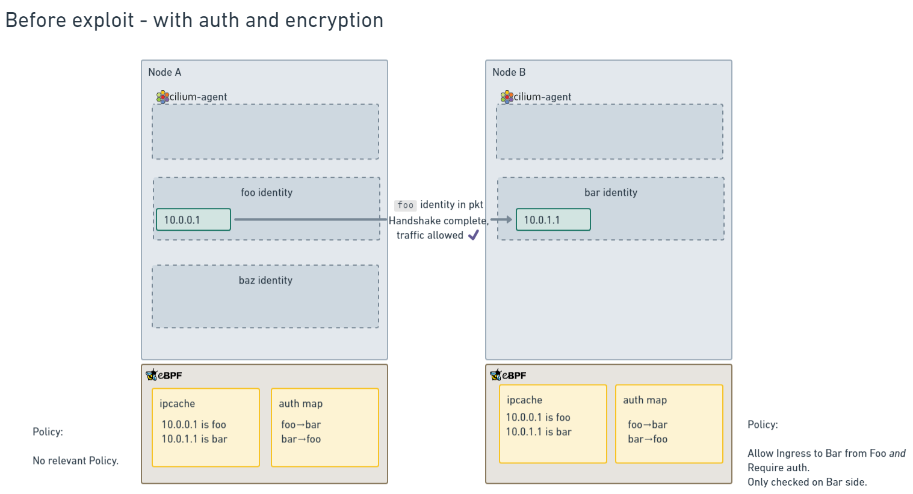

# Improving the security of Cilium's Mutual Authentication

Traditionally, service meshes have achieved mutual authentication and encryption by setting up an mTLS connection between workload proxies running in sidecar containers within the pods at either end of the connection. As you might recall if you've been following this space, last year Cilium introduced an innovative approach to providing [mutual authentication between workloads](https://docs.cilium.io/en/stable/network/servicemesh/mutual-authentication/mutual-authentication/). It splits mutual authentication and encryption (the two fundamentals of mutual TLS) into two separate channels. This removes the overhead of per-pod proxy sidecars, and opens up the possibility of authenticating traffic that uses protocols other than TCP.

From the original CFP:

>Firstly, a control plane connection between cilium-agent instances on each node provides authentication of connections between pods on the nodes.
Secondly, the existing Cilium encryption support using WireGuard or IPsec provides an encrypted dataplane for the connections.

We've seen a very positive reaction to, and adoption of, this approach, but in certain modes and under certain circumstances, the implementation was vulnerable to manipulation of the cache of IP identities. The Cilium community is indebted to the passion for security shown by the folks from Solo.io, whose [analysis](https://www.solo.io/blog/could-network-cache-based-identity-be-mistaken/) and [persistent](https://thenewstack.io/how-ciliums-mutual-authentication-can-compromise-security/) [feedback](https://www.youtube.com/watch?v=bKpp30Q4_nY) have helped the community fully understand the issue and all its implications. Thankfully, we're now at a point where this IP cache manipulation is no longer possible in the vast majority of deployments using ingress network policies, and can be mitigated in many of the remaining corner cases.

In this post we'll discuss how the vulnerability was possible, and how it's now addressed by encapsulation for nearly all use cases. We'll also discuss some ideas for tackling the remaining corner cases - and we'd welcome your feedback on [the CFP](https://github.com/cilium/design-cfps/pull/27) that covers this.

This is an in-depth post, so to summarize of the actions the Cilium community is taking to address this issue:

* We're updating the documentation to strongly recommend using encryption (currently Wireguard preferred) or encapsulation when using mutual authentication.
* As you'll see from later in this post, using ingress mutual authentication policies in combination with encapsulation or encryption makes IP cache manipulation impossible, so we'll recommend against only using egress mutual auth policies.
* For users who can't enable encryption or encapsulation, we're also proposing a connection-based mode for mutual authentication, and we'd love your feedback on that proposal.

## General architecture
The following is a diagram of the general architecture of Ciliums' mutual authentication solution, that uses an auth table to cache the results of mutual authentication handshakes.

The most important thing to call out for this post is in the eBPF section, where the state of authentication is stored in the Auth Table for use by the eBPF code.

This table is used by eBPF code but maintained by both the eBPF code paths and the userspace code paths.

The flow for a packet is that, when the packet passes through Cilium's policy engine, if it matches a NetworkPolicy that requests authentication, and no authentication is stored in the table, then a TLS connection between agents using delegated SPIFFE identities is triggered (this is the `TLS Session Manager` box in the diagram).

Once this handshake succeeds, the userspace cilium-agent adds the details into the Auth Table, and any future packets will be allowed to proceed.

## Cilium Identities

To understand the details of how the Auth table stores authentication information, it's important to understand how Cilium's Policy engine assigns identity to network traffic.

Each Pod has a CiliumEndpoint, but also each set of labels on a Pod is associated with a CiliumIdentity, which marries the pods together into a workload. This identity maps a set of labels to a integer identifier.

When Cilium makes Policy decisions, it does this by assigning an identity to the source and destination IP addresses, then using the identity to make policy decisions.

This identity can be determined in a couple of ways for each packet:
- either included in every packet when there is encapsulation (like VXLAN) or encryption (like Wireguard), which is preferred, or
- imputed using a cache of IP (the "ipcache") to identity mappings that's held on each agent, and kept up to date by watching the Kubernetes apiserver.

Many Cilium installs use either VXLAN (it's the default networking mode), or Wireguard, which ensure that the Cilium identity is present in every packet.

However, for many different reasons, other Cilium installs need not to use any encapsulation. This is called Direct Routing or Native Routing in Cilium's documentation, and when it's involved with no Wireguard encryption, the ipcache is used as the main method of imputing identity to network traffic. This will be important later.

## Auth table and its implications

The Auth table stores the following details:
- The source identity
- The destination identity
- The destination node (so that Cilium can ensure that mutual auth to separate identities on the same node are handled correctly)
- An expiry time (when the auth table entry will be considered expired and a new authentication triggered. This is set to the closest expiry time for any of the certificates involved in a particular authentication handshake).

Doing things in this way allows some big advantages:
- because the enforcement is done per-identity, which is associated with IP addresses rather than higher-layer protocols, _all IP traffic_ can be protected with mutual auth, including UDP traffic, which is much harder to do with traditional mutual auth methods.
- Similarly, because the mutual auth is performed per identity, only one TLS handshake is required for each identity-identity-node tuple. So a pod can open as many TCP connections as it likes without having to pay a TLS handshake overhead for each one. This can result in a significant amount of time saved, and speed up connections by a large amount for workloads that don't make good use of shared connection mechanisms like HTTP/2.
- Because the auth mechanism is handled out-of-band of the actual traffic, then key rotations can be performed by the userspace agent before the old keypair expires, and update the auth table with the new expiry time. This means that _key rotation is completely invisible_, connections are _not_ interrupted by the key rotation process.
- Lastly, if users wish to, they can use mutual auth in the absence of encryption, and avoid paying the latency cost of encrypting every packet. For users who do not wish to pay the compute and latency cost of encryption, this tradeoff may be worthwhile.

## Issue with the current approach

All of the above advantages are why the mutual authentication feature was built this way to begin with, but it's become apparent that there are a set of circumstances where the current design will fail when attacked.

Those circumstances are:
- The cluster must be using native routing or some other method that does not encapsulate the packets (where the encapsulation carries the CiliumIdentity, as in VXLAN and Wireguard)
- _Some_ nodes in the cluster must lose connection to the apiserver somehow. In one demonstration, this was performed using iptables rules on a host, which would require elevated privileges, but it's also possible, if unlikely, that this situation would arise in some other network failure scenarios.
- An attacker must be able to launch new pods on one of the nodes while the above two conditions hold.

Then, the following steps must occur:

* Attacker must delete a pod on a connected node (the source node)
* Attacker must schedule a pod on that connected node that ends up with the same IP address as an already existing Pod, that had an already authenticated mutual auth session established with a disconnected node (the destination node)
* The network policy used to enforce traffic must be an _ingress_ policy, which is enforced on the _destination_ node. For _egress_ policies, the attack must be reversed, with the _destination_ node remaining connected and the _source_ node being disconnected. In this case, scheduling another Pod to reuse the same IP address is more complex, since Kubernetes can't be used to achieve it.

If these steps can occur, then mutual authentication can be effectively bypassed, which is bad.

In more detail the steps are:
* Attacker has to identify a source / destination pod pair where the destination pod is protected by an ingress policy that enables mutual auth.
* There must already have been a connection between the source and destination pod pair to establish a mutual auth session in the mutual auth BPF table.
* Attacker has to cut apiserver access of the destination node or otherwise delay any updates from the apiserver to that node for a prolonged time while the source node remains connected to the apiserver. In most cases, the entire apiserver not being available is not enough as no pods could be deleted or scheduled (next step).
* Attacker has to be able to delete the source pod so it releases its IP. Otherwise attacker has to wait for the pods to scale down by the autoscaler or some other reason and has to identify IPs which have been released. All of this has to happen while the destination node remains detached from the apiserver, or else the destination node will see pod deletion updates and update its cache.
* Attacker must be able to schedule a pod that will end up with the same IP address as the source pod.
* Attacker has to be able to schedule a pod and be lucky enough for it to get assigned the same IP address as the original source pod. The chances of this depends on factors like the size of the IP address pool, and how many other pods are being scheduled at this time.
* No egress policy requiring mutual authentication for the scheduled source pod may exist (as this would trigger a new handshake).

However, if _all_ of those steps happen, then the cache manipulation involved will render it possible to spoof the mutual authentication process and allow unauthenticated pods to send traffic that the system will treat as though it's authenticated.

This condition will last only until one of the following occurs:

* The destination node regains connection to the apiserver and processes pod deletion events. This will update the cache to be in the correct state, and the mutual auth table will be updated to remove entries associated with identities with no running endpoints on a node.
* One of the certificates involved in the handshake expires. When this occurs, another mutual auth handshake will occur, which also checks the pods running on the node. The default lifetime for a certificate is 30 minutes (although this is configurable), so that setting is the maximum window of exposure to this attack.

Let's walk through some diagrams of this attack.

Here we have two nodes of a Cilium cluster, meeting the above requirements.

The ipcaches are synced between the two nodes, so all the identities are correct.

Both nodes `A` and `B` agree on the IP addresses associated with the identites `foo` and `bar`.

Once the exploit has been performed, the nodes look more like this:

On Node `B`, the connection to the apiserver has been interrupted in some way, so the Cilium agent is no longer receiving updates to Cilium Endpoints, meaning that the ipcache will become out of sync.

On node `A`, enough pods have been scheduled in a new identity (the `baz` identity), to have the IP address that was previously associated with `foo` be now associated with `baz`.

However, on Node `B`, because the ipcache is out of sync, the ingress policy will allow traffic from the pod that's actually a `baz` pod, because it has incorrect information about the IP to identity mapping. This is the reason why the exploit only works in direct routing mode - because in encapsulated modes, the identity is passed in any packet and used directly, rather than relying on the ipcache.

The CFP lays out a proposal to mitigate this risk in two ways:
* Require the use of either encryption (recommended because it prevents man-in-the-middle attacks) or encapsulation (which prevents cache manipulation but not MITM). In both of these cases, the Cilium identity is included in every packet, and so the ipcache is not used to impute identity to packets.
* Add an additional mutual authentication mode that will use the connection tracking ("conntrack") table in the conntrack BPF map to store information about which _connections_ need authentication, instead of which _identity-identity-node pairings_ need authentication.

The first idea makes cache manipulation irrelevant, because the inbound packets include the security identity in a header.

## Requiring encryption or encapsulation resolves cache manipulation

This assertion depends on two things that may not be clear:

- Wireguard encryption now (as of Cilium 1.15) also encapsulates packets into VXLAN as they transit the tunnel, adding a Cilium identity into the header (as in unencrypted VXLAN)
- When the datapath can determine the remote security identity from packets directly, the ipcache is _not_ used.

As part of actions taken to mitigate this attack, we added VXLAN encapsulation to Wireguard during development of Cilium 1.15.

But Cilium's eBPF code has _always_ preferenced identity information it decodes from encapsulation, and in the case that it's present, the ipcache is not used for policy decisions.

This is why the original attack required the use of direct routing - when encapsulation is in use, the attack never worked.

The more recent change to ensure that Wireguard encryption also includes encapsulation just means that when you're ensuring your traffic's wire security, you're also making the identity not spoofable by cache manipulation when using ingress mutual authentication policies. 

When egress policies are used to require mutual authentication, the IP cache at the source node is used, so this would potentially still be subject to IP cache manipulation. For this reason, we will recommend going forward that ingress policies should be preferred, or used in parallel with egress policies.

### Diagrams of the new workflow

After adding this change, let's look at diagrams of before and after the exploit is attempted:

Before, things work as anticipated.

However, it's after that there is a difference:

Even though the ipcache entries don't match on both nodes, the identity being included in the packets means that the datapath relies on that instead of the ipcache, so any cache manipulation is irrelevant.

## Connection-based mutual authentication method

In the existing identity-based mode, mutual authentication handshakes are only initiated when there is a change in either endpoint state (that is, a new node to node connection from a new pod), or when a certificate is rotated. So, in the event that an attacker _did_ manage to compromise mutual authentication mechanisms somehow, the window is, at maximum, the certificate rotation period, which defaults to 30 minutes.

Adding a connection-based mutual authentication mode significantly reduces the timescale that an attack is exploitable for - since the mutual auth handshake is performed on each new connection, and connections _generally_ last much less that 30 minutes.

It also makes performing the exploit harder, since the full 5-tuple (source IP, source port, destination IP, destination port, protocol) must match, rather than just source and destination IP, _and_, for TCP connections, must also migrate the actual connection from one application to another. For both TCP and UDP, the attack is still possible, but orders of magnitude harder.

Additionally, the eBPF conntrack table already handles new three-way handshakes on existing entries by clearing and resetting connection properties, so as long as this code also handles clearing mutual auth related config, then it will make it even more difficult to reuse an existing connecton entry.

The connection-based mutual authentication method will:
* Be selectable as an entirely new authentication method (called `connection-spiffe` or similar)
* Use the conntrack table to keep track of connections
* Add two bits of marking into conntrack table entries, "Auth required", and "Auth completed"
* Use the existing TLS handshake code, but call it on a different event (new connection instead of new identity-identity-node tuple).

The existing conntrack table performs standard connection tracking functions, tracking connections based on the 5-tuple of source IP, source port, destination IP, destination port, and protocol. TCP is handled using its connection mechanisms, and UDP is handled using the same time-based pseudo connection that is standard across most networking gear.

What this change does is add two additional bits to the conntrack table:
- Auth required: This connection requires mutual authentication before proceeding. The datapath will drop all packets until the mutual auth has been completed.
- Auth completed: This connection has had a mutual authentication handshake completed. The userspace agent will perform the handshake and update the connection table entry once it is finished.

The updated mutual auth architecture diagram from above then looks like this:

The steps are:

1. Packet arrives and the policy engine determines a policy requires it to have mutual auth
2. Kernel checks if there is a conntrack entry already, and creates one if not, with the Datapath code setting the Auth Required bit to true if the new entry was created
3. If the conntrack entry has "Auth Required" but no "Auth completed", drop packet and send a signal to the userspace asking it to complete the auth handshake
4. Cilium Agent performs a mutual auth handshake between the source and destination nodes, sending the checksum as part of the handshake. When this succeeds, it updates the conntrack entry to have "Auth completed".
5. The next packet sent after the conntrack table update will be passed.

#### Advantages

* Every new connection requires a mutual auth handshake, so this has more familiar security properties to traditional mutual TLS
* Connection based nature makes it much harder to spoof traffic so that it matches an already-authenticated connection, whether by manipulating the cache or some other spoofing method.
* Can handle both TCP and UDP traffic (the latter using the standard pseudoconnection model)

#### Disadvantages

* Compared to the accelerated mode, connection-based mode introduces a per-connection handshake overhead
* The initial implementation will need to drop packets until the mutual handshake is complete, rather than holding packets

We would love feedback from users who have a need for mutual authentication without enabling encryption with Wireguard, on whether this per-connection overhead might outweigh the latency cost of avoiding encryption.

## Conclusion 

We believe that these changes significantly improve the security of Cilium's Mutual Auth solution and are a significant step on the path to bringing the solution from beta to stable.

Please watch the [CFP PR](https://github.com/cilium/design-cfps/pull/27) and the [tracking issue on Github](https://github.com/cilium/cilium/issues/28986) for more updates.

