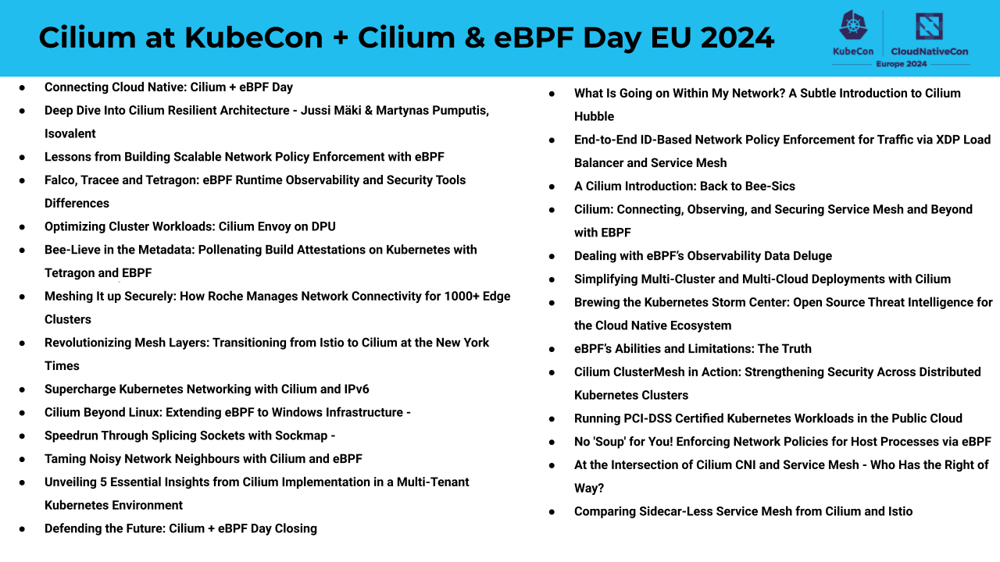

There will be lots of Cilium-related activity at KubeCon + CloudNativeCon Europe
in Paris! We'll keep this page updated with more details as they are published.

- Sign up for the new [Cilium Certified Associate
  exam](https://training.linuxfoundation.org/certification/cilium-certified-associate-cca/)!

- Come to the [Cilium + eBPF Day](https://events.linuxfoundation.org/kubecon-cloudnativecon-europe/co-located-events/cilium-ebpf-day/) co-located event

- Attend the Maintainers' Track session

  [Cilium: Connecting, Observing, and Securing Service Mesh and Beyond with EBPF - Liz Rice & Maartje Eyskens, Isovalent; Nico Meisenzahl, white duck; Vlad Ungureanu, Palantir Technologies](https://kccnceu2024.sched.com/event/1Yhfl/cilium-connecting-observing-and-securing-service-mesh-and-beyond-with-ebpf-liz-rice-maartje-eyskens-isovalent-nico-meisenzahl-white-duck-vlad-ungureanu-palantir-technologies?iframe=no&w=100%&sidebar=yes&bg=no)

  Wednesday March 20, 2024 15:25 - 16:00 CET

  Welcome to Cilium's maintainer track session where you'll get an update on how Cilium is expanding the frontiers of cloud native networking, observability, and security. After graduating and becoming the de-facto standard CNI for Kubernetes, what comes next? We'll start with a brief overview of each part of the project before giving a update on Cilium Service Mesh's mutual authentication. Next, we'll dive into how Cilium is expanding beyond Kubernetes with load balancing and multi-cloud networking and into runtime enforcement with Tetragon. In this session, you'll hear from Cilium contributors and users Isovalent, Palantir, and white duck.

- Come and have a chat at the Cilium kiosk in the Project Pavilion throughout
  the event

## Cilium Talks at KubeCon EU 2024 Full Schedule

Below is a list of some Cilium talks at KubeCon EU including Cilium + eBPF Day and Observability Day.

You can find more details about each talk in this [blog post](https://cilium.io/blog/2024/02/02/cilium-at-kube-con-eu-2024).

À bientôt à Paris!
