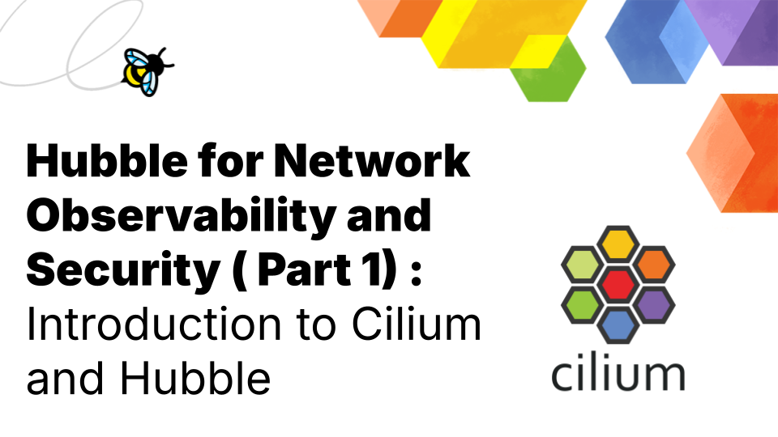

import authors from 'utils/author-data';

_Author: Shedrack Akintayo, Isovalent_

In the cloud native ecosystem, Kubernetes has emerged as the de facto standard for container orchestration, offering powerful capabilities for managing containerized applications. However, this power brings complex challenges, particularly for network observability and security. As Kubernetes environments grow in scale and complexity, traditional networking approaches often fall short. This is where Cilium and Hubble come in, revolutionizing Kubernetes networking, observability, and security with new ideas and implementations. Cilium leverages [eBPF](https://ebpf.io/) to provide high-performance, identity-based networking, and security, while Hubble offers deep visibility into network flows and security policies. Together, they enable fine-grained control and observability at the network layer, addressing the unique demands of modern, dynamic Kubernetes environments.

This three-part series dives deep into Hubble, exploring how it can transform your Kubernetes network observability and security strategies. In part 1 of the series, we’ll start by understanding Cilium and Hubble and why they're essential in modern Kubernetes environments.

### What is Cilium?

[Cilium](cilium.io) is the leading cloud native solution for providing, securing, and observing network connectivity between workloads. At its core, Cilium leverages eBPF to provide high-performance networking, security, and observability.

**Some key features of Cilium include:**

- [Layer 3/4 and Layer 7 network policies](https://cilium.io/use-cases/network-policy/)
- [Load balancing](https://cilium.io/use-cases/load-balancer/)
- [High performance cloud native networking](https://cilium.io/use-cases/cni/)
- [Service mesh integration](https://cilium.io/use-cases/service-mesh/)
- [Kube-proxy replacement](https://cilium.io/use-cases/kube-proxy/)

One of Cilium's standout benefits is its ability to enforce network policies at the kernel level, providing both enhanced security and improved performance compared to traditional [iptables-based solutions](https://isovalent.com/blog/post/why-replace-iptables-with-ebpf/).

### What is Hubble?

Hubble is Cilium's observability layer, offering deep insights into your Kubernetes cluster's network. It's like a powerful microscope for your cluster's network traffic, allowing you to see and understand what's happening at a granular level.

**Some key features of Hubble include:**

- [Real-time network flow monitoring](https://cilium.io/use-cases/network-flow-logs/)
- [Service dependency mapping](https://cilium.io/use-cases/service-map/)
- [Advanced network visibility](https://cilium.io/use-cases/protocol-visibility/)
- [API aware observability (L7)](https://docs.cilium.io/en/stable/observability/visibility/)

Hubble's integration with Cilium provides contextual information about network flows, making it easier to understand and troubleshoot complex networking scenarios in Kubernetes environments.

### Why Use Cilium and Hubble for Network Security?

Traditional network security tools often need help to keep up with the dynamic nature of Kubernetes environments. Cilium and Hubble offer several advantages:

- **Native Kubernetes integration**: Cilium and Hubble are designed from the ground up for Kubernetes, understanding its unique networking model and security requirements.
- **eBPF-powered performance**: By leveraging eBPF, Cilium can enforce security policies with minimal overhead, often outperforming traditional solutions.
- **Deep visibility**: Hubble provides unprecedented visibility into network flows, making detecting and responding to security threats easier.
- **API-aware visibility and security**: Cilium can understand and secure application-layer (L7) protocols, allowing for more granular and effective security policies, Hubble can provide application-level visibility such as HTTP request headers and DNS Queries

### Setting Up Cilium and Hubble

The best way to get started with Cilium and Hubble in your environment is to read through the [official introduction](https://docs.cilium.io/en/stable/overview/intro/#intro) in the Cilium documentation. The [official documentation](https://docs.cilium.io/en/stable/gettingstarted/hubble_setup/#hubble-setup) guides you through installing Cilium and Hubble, configuring Hubble to suit your environment, and using the Hubble UI.

Explore the Isovalent repository of [hands-on Labs](http://cilium.io/labs) for a live approach to learning how to use Cilium and Hubble in your Kubernetes cluster. These labs educate you on the various features that both Cilium and Hubble provide and how to use them effectively.

However, if you're not ready to fully switch to Cilium as your CNI, don't worry. You can still leverage Hubble's powerful observability features through CNI chaining. This approach allows you to benefit from Hubble's insights while maintaining your current networking setup. To learn more about this method, check out this detailed guide on [using Cilium Hubble for observability in CNI chaining mode](https://isovalent.com/blog/post/cilium-hubble-observability-cni-chaining-mode/). This flexibility ensures that you can benefit from Hubble's capabilities regardless of your current setup.

### Hubble In The Wild

Let's look at some Cilium users who are benefitting from using Hubble in their network infrastructure.

#### Utmost

Utmost, a workday-native workforce management system company, leveraged Hubble to significantly enhance visibility into their operations. Introducing Hubble into their Kubernetes platform has improved their monitoring, auditing, and compliance processes, making it an indispensable tool in their setup.

**_"Hubble having a UI and being able to pump those metrics into our monitoring tools is amazing because if there is an issue, attack, or any kind of troubleshooting, you need to be able to see what's going on."_** - Andrew Holt, Senior Systems Engineer

[Read the full case study](https://www.cncf.io/case-studies/utmost/)

#### Rabobank

Rabobank is a multinational bank offering banking and financial services in the Netherlands. Hubble became an unexpected gem in their API platform infrastructure. It offered Rabobank's platform team a comprehensive view of their network traffic, transforming complex flows into easily digestible visual insights. For Rabobank, Hubble serves as both a discovery tool and a crucial component in their network observability strategy.

**_"I didn't know about Hubble, so that was something we discovered along the way and it was a nice feature to have. What I like about Hubble is that it gives a great overview of what is going on. You can see the traffic and also graphically, you can see how it flows. In the beginning, when we were allowing some traffic, we weren't exactly sure what we needed but with Hubble, we could see all the traffic and even found some things we had missed."_** - Frank Potter, Rabobank

[Read the full case study](https://www.cncf.io/case-studies/rabobank/)

#### DigitalOcean

DigitalOcean is a cloud service provider with a target market of small to medium-sized businesses, developers, and startups. Hubble provided DigitalOcean and its customers with deep insights into network traffic, transforming complex flows into easily digestible visual representations. For DigitalOcean, Hubble provides an internal debugging tool to help troubleshoot networking issues in their platform, and customers also benefit from Hubble’s features, as DigitalOcean expanded Hubble to be also consumed by their customers.

**_“Regarding observability, with Hubble, it’s night and day. With Hubble, it’s easy to see where traffic is going and where it’s denied. In a distributed world, observability is a key feature. Hubble was one of the features our customers most frequently requested to be enabled, and we recently enabled it."_**

**_One feature they love is the Hubble UI, especially the services map feature, where you can see all of your pods and their communication. Our customers greatly value this because it gives them a better understanding of their applications and network connections._**

**_Internally, we also use Hubble because we want easy debuggability for network policies. We didn’t want to log into every Cilium agent and run the Cilium monitor command to identify issues; we wanted one central place that could simplify this process, and that’s what we got with Hubble.”_** - Ingo Gottwald, Senior Engineer, DigitalOcean

[Read the full case study](https://www.cncf.io/case-studies/digitalocean/)

#### Trendyol

Trendyol is a leading e-commerce platform that provides an extensive selection of products spanning categories such as fashion, technology, and home furnishings. In Trendyol's large-scale e-commerce infrastructure, where observability is crucial, Hubble has proven to be a key asset for maintaining smooth operations and providing network observability.

**_"With Hubble, if we need to debug something or investigate the source and destination of certain traffic that comes into our clusters we can quickly see that. It has enabled members of our team to monitor the network connectivity within our clusters easily."_** - Emin AKTAŞ, Platform Engineer, Trendyol

[Read the full case study](https://www.cncf.io/case-studies/trendyol/)

#### G Data CyberDefense

G DATA CyberDefense is a German software company that specializes in endpoint protection and cybersecurity services, including penetration testing. Hubble offers G DATA's development teams deep insights into network traffic without requiring full cluster access. For G DATA, Hubble serves dual roles:

1. A network visibility tool
2. A crucial component in their security-focused infrastructure

In G DATA's infrastructure, where visibility and control are paramount, Hubble has proven to be a vital tool for maintaining robust security while improving developer productivity.

**_"With Hubble, you can give developers access to the network visibility in a much better way. We don't have to give them full cluster access to see the networking issues."_** - Jan Jansen, Platform Engineer, G DATA

[Read the full case study](https://www.cncf.io/case-studies/g-data-cyberdefense/)

### Final Words

Cilium and Hubble represent a significant leap forward in Kubernetes network security and observability. By providing deep, context-aware visibility and high-performance security enforcement, they address many of the challenges faced in securing modern, dynamic Kubernetes environments.

In the next part of this series, we'll explore how to utilize Hubble for comprehensive network observability. We will dive into its features and show you how to extract valuable insights from your Kubernetes network traffic.

<BlogAuthor {...authors.ShedrackAkintayo} />
