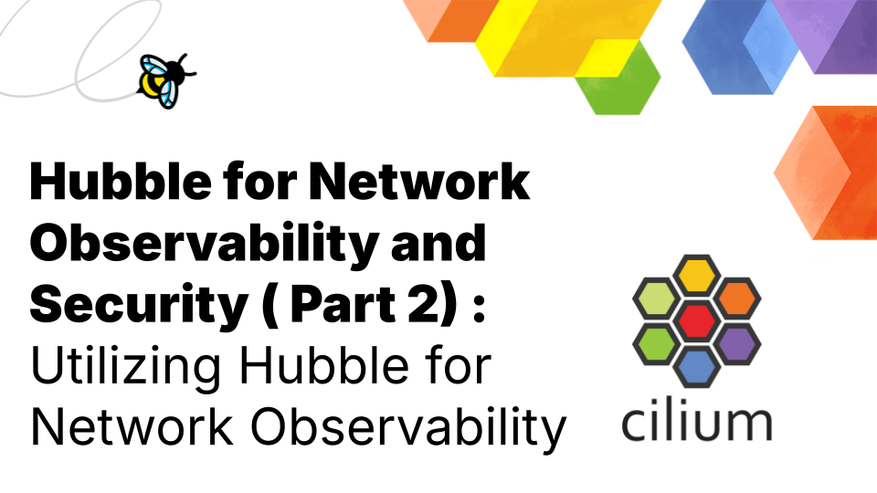

**_Author: Shedrack Akintayo, Isovalent_**

In this second installment of this series, we'll delve deeper into Hubble's powerful observability features and explore how they can enhance your Kubernetes network observability strategy. We'll also examine practical use cases, such as monitoring network traffic for dropped packets and identifying abnormal patterns in your network.

In the [first part of the series](https://cilium.io/blog/2024/08/14/hubble-for-network-security-and-observability-part-1/), we introduced Cilium and Hubble, highlighting their significance in modern Kubernetes environments. We guided you through their setup process and showcased real-world case studies of organizations successfully leveraging Cilium and Hubble in production environments.

Now, let's take on a comprehensive exploration of Hubble's capabilities for modern network observability!

## Why Is Network Observability So Crucial In Kubernetes Environments?

Network observability is a crucial component of maintaining large-scale and secure Kubernetes environments. It is one of the most critical aspects of infrastructure operations that platform engineering and DevOps teams worry about. This concern stems from the fact that Kubernetes, for all its power and flexibility, provides minimal built-in network observability tools. This lack of visibility can leave operations teams blind when understanding network behavior, troubleshooting issues, or detecting potential security threats.

As Clément Nussbaumer, Systems Engineer at PostFinance puts it: **“_In terms of observability in Kubernetes, it was quite tricky to know exactly where the packets were flowing and what could be blocking them. Basic Linux networking tools, like tcpdump, lack the context of cluster topology and quickly become complicated with dynamic pod IPs._”** ([Read the case study](https://www.cncf.io/case-studies/postfinance/))

This sentiment is echoed across the industry. A [recent survey by the Cloud Native Computing Foundation](https://www.cncf.io/reports/cncf-annual-survey-2023/) cited monitoring and observability as a significant challenge in managing environments with a large number of containers.

## What Do End Users Need?

Given these difficulties, it's evident that Kubernetes users require comprehensive solutions to address this observability gap. The complexities of modern containerized environments demand tools that go beyond basic network monitoring. To effectively manage and secure their Kubernetes clusters, end users need a suite of advanced observability features that provide deep insights, context-aware analysis, and actionable intelligence.

Let's explore the key capabilities that Hubble offers as part of the platform, which has become essential for tackling the observability challenges in Kubernetes environments:

1. **Real-time visibility into network flows:** Users require instant insights into how traffic moves through their Kubernetes clusters. This includes understanding the source and destination of packets, the protocols being used, and the volume of traffic between different services.
2. **Detailed packet-level analysis:** For troubleshooting complex issues, teams need the ability to drill down to individual packet details. This granular view can help identify specific problems like malformed packets or unexpected protocol behaviors.
3. **Service dependency mapping:** As applications grow more complex, understanding the relationships between different services becomes crucial. Customers need tools that can automatically map out service dependencies and visualize traffic patterns.
4. **Performance metrics and alerting:** Teams require comprehensive performance metrics, including latency, throughput, and error rates. Moreover, they need the ability to set up alerts based on these metrics to address issues before they impact users proactively.
5. **Historical data retention and analysis:** Post-mortem analysis is a critical part of improving system reliability. Users need the ability to store and analyze historical network data to understand trends, investigate past incidents, and prevent future issues.
6. **Security-focused observability:** With the increasing focus on cybersecurity, teams need observability tools that can help detect potential threats. This includes identifying unusual traffic patterns, detecting potential DDoS attacks, and spotting attempts at data exfiltration.
7. **Cross-stack correlation:** Network issues often don't exist in isolation. Users need the ability to correlate network events with application logs and infrastructure metrics for a holistic view of their system's health.
8. **Policy verification:** As network policies become more complex, teams need ways to verify that these policies are being enforced correctly. This includes observing which traffic is being allowed or denied based on current policies.
9. **Easy-to-use interfaces:** Whether through a GUI or CLI, customers need intuitive interfaces that allow both seasoned engineers and newer team members to gain insights from the observability data quickly.
10. **Integration with existing tools:** Most organizations already have a suite of monitoring and observability tools. They need new solutions to integrate seamlessly with their existing ecosystem, whether that's pushing data to a centralized logging system or alerting through established channels.
11. **Scalability:** As Kubernetes clusters grow, observability solutions need to scale accordingly without significant performance overhead or cost increases.

These capabilities are crucial for teams running Kubernetes workloads. Modern observability solutions must address these requirements to significantly enhance an organization's ability to monitor, troubleshoot, and secure its Kubernetes environments effectively. The question now is: **Does Hubble have the features in place to meet these requirements for a modern Kubernetes observability solution?** In the next section, we'll explore the capabilities that Hubble provides to platform engineering and DevOps teams, demonstrating how it can enhance their overall network observability.

## What Observability Features Are Available in Hubble?

Hubble leverages [eBPF](http://ebpf.io) to provide deep, granular visibility into your Kubernetes network. This advanced approach enables Hubble to meet most of the requirements we previously discussed. Let's explore the key features that Hubble offers to enhance network observability:

### Comprehensive Network Flog Logs

Hubble captures detailed logs of all network interactions, providing a wealth of information. This comprehensive set of information allows for deep analysis of network behavior, troubleshooting of issues, and detection of potential security threats. It provides a deeper view of network interactions within your Kubernetes cluster, enabling you to understand not just what is communicating but how and why. The following is some of the information that Hubble provides in its network flow logs:

- Source and destination IP addresses and ports
- Protocol information (TCP, UDP, ICMP, HTTP, Kafka, gRPC, etc.)
- Kubernetes-specific metadata (pod names, namespaces, labels)
- DNS queries and responses
- HTTP headers and methods
- Network Policy verdicts and names

### Metrics

Hubble generates a wide range of metrics from your cluster/application state that gives you an in-depth view of what is going on in your network. Hubble metrics can also be exported when explicitly requested by clients. This is useful for teams that already have observability tools that they want to pair with Hubble.

You can find a comprehensive list of available metrics and their options in the [Hubble exported metrics](https://docs.cilium.io/en/stable/observability/metrics/#hubble-exported-metrics) section of the Cilium documentation.

### Service Maps


The Hubble UI provides a real-time graphical [service map](https://docs.cilium.io/en/stable/gettingstarted/hubble/#service-map-hubble-ui) that visualizes the flow of the network and relationships between components (services, pods, namespaces) in a Kubernetes cluster. It also visualizes the majority of data from the network flow logs.

### Protocol Visibility


With the support of Cilium and Envoy, Hubble provides the ability to [monitor Layer 7 traffic](https://docs.cilium.io/en/stable/observability/visibility/#proxy-visibility). This gives you insights into L7 protocols like HTTP, gRPC, and Kafka.

## The Hubble UI And CLI

Let’s see these capabilities in action with a walkthrough of the [Hubble UI](https://docs.cilium.io/en/stable/gettingstarted/hubble/) and [CLI](https://docs.cilium.io/en/stable/gettingstarted/hubble_cli/) deployed to a Kubernetes platform.

### Hubble UI

The Hubble UI provides an intuitive, visual representation of network traffic between pods and services in specific namespaces within your Kubernetes clusters. You can access the Hubble UI by enabling Hubble from the Cilium CLI or during the installation of Cilium and Hubble with Helm.

For example, to enable the Hubble UI using the Cilium CLI, run the following command:

```bash
cilium hubble enable -ui
```

Verify that the Hubble UI is enabled with:

```bash
cilium status -–wait

    /¯¯\
 /¯¯\__/¯¯\    Cilium:             OK
 \__/¯¯\__/    Operator:           OK
 /¯¯\__/¯¯\    Envoy DaemonSet:    OK
 \__/¯¯\__/    Hubble Relay:       OK
    \__/       ClusterMesh:        disabled

DaemonSet              cilium-envoy       Desired: 4, Ready: 4/4, Available: 4/4
DaemonSet              cilium             Desired: 4, Ready: 4/4, Available: 4/4
Deployment             hubble-relay       Desired: 1, Ready: 1/1, Available: 1/1
Deployment             cilium-operator    Desired: 1, Ready: 1/1, Available: 1/1
Deployment             hubble-ui          Desired: 1, Ready: 1/1, Available: 1/1
Containers:            hubble-relay       Running: 1
                       hubble-ui          Running: 1
                       cilium-operator    Running: 1
                       cilium             Running: 4
                       cilium-envoy       Running: 4
Cluster Pods:          14/14 managed by Cilium
Helm chart version:
Image versions         hubble-ui          quay.io/cilium/hubble-ui:v0.13.1@sha256:e2e9313eb7caf64b0061d9da0efbdad59c6c461f6ca1752768942bfeda0796c6: 1
                       hubble-ui          quay.io/cilium/hubble-ui-backend:v0.13.1@sha256:0e0eed917653441fded4e7cdb096b7be6a3bddded5a2dd10812a27b1fc6ed95b: 1
                       hubble-relay       quay.io/cilium/hubble-relay:v1.16.0@sha256:33fca7776fc3d7b2abe08873319353806dc1c5e07e12011d7da4da05f836ce8d: 1
```

Next, launch the Hubble UI in a new tab:

```bash
Cilium hubble ui

ℹ️  Opening "http://localhost:12000" in your browser...
```

Here is an example of what the Hubble UI service map and flow logs look like:


On further inspecting the `deathstar` pod by clicking on it, we can see more details.


From the above example, we can see all the labels attached to the `deathstar` pod. We can also observe network flow logs containing communication between the pods in the default namespace.

You can also update the network flow column to show other information available about pods and services in your cluster like this:


The Hubble UI offers much more functionality, such as tracking `DROPPED` packets, viewing HTTP methods and headers, and other advanced features.

You can learn more about the Hubble UI in this [video](https://youtu.be/M0hZRvF8CpQ).

### Hubble CLI

The Hubble CLI offers a powerful command-line interface for those who prefer terminal-based interactions or need to automate observability tasks. It’s like an advanced `tcpdump`.

It provides access to Hubble's rich observability data, allowing users to quickly query flow logs, analyze network traffic, and troubleshoot connectivity issues. With its wide range of filtering options and output formats, the Hubble CLI is an essential tool for DevOps teams seeking to quickly gain deep insights into their Kubernetes network behavior.

To use the Hubble CLI, you must install it locally by following the [instructions](https://docs.cilium.io/en/stable/gettingstarted/hubble_setup/#install-the-hubble-client) in the official documentation.

Once installed, you can interact with the Hubble CLI using various commands. Here are some examples:

```bash
# Observe real-time flows
hubble observe

# Filter flows by namespace
hubble observe --namespace kube-system

# View HTTP-specific information
hubble observe --protocol http

# View specific information by HTTP method
hubble observe --http-method get

# Check hubble relay status
hubble status
```

Below is an example of using the Hubble CLI to query the network flow logs from the `deathstar` pod:


Please check out the [Hubble Cheatsheet](https://isovalent.com/blog/post/cilium-hubble-cheat-sheet-observability/) for a comprehensive list of Hubble CLI commands.

## What are Some Practical Use Cases For Hubble?

As we've explored Hubble's powerful features, it's important to understand how these capabilities translate into real-world benefits for Kubernetes operators and developers. In this section, we'll delve into practical use cases that demonstrate Hubble's value in day-to-day operations.

### Monitoring network traffic

Use Hubble to gain insights into your application's communication patterns. For example, you can easily identify which services are communicating most frequently or detect unexpected connections.

As Jan Jansen, Platform Engineer, G DATA puts it:

**_“With Hubble, you can give developers access to the network visibility in a much better way. We don’t have to give them full cluster access to see the networking issues.”_** ([Read the case study](https://www.cncf.io/case-studies/g-data-cyberdefense/))

### Identifying abnormal patterns or potential threats

Hubble's real-time flow logs and metrics can help you spot anomalies quickly. Unusual spikes in traffic, connections to unexpected IP addresses, or abnormal protocol usage can all be indicators of potential security issues.

As Frank Potter from Rabobank notes:

**_“What I like about Hubble is that it gives a great overview of what is going on. You can see the traffic and also graphically, you can see how it flows. In the beginning, when we were allowing some traffic, we weren’t exactly sure what we needed but with Hubble, we could see all the traffic and even found some things we had missed.”_** ([Read the case study](https://www.cncf.io/case-studies/rabobank/))

### Troubleshooting connectivity issues

When applications misbehave, Hubble can help you pinpoint the root cause. Whether it's a misconfigured network policy or a DNS resolution problem, Hubble provides the visibility you need to resolve issues quickly.

As Federico, Principal Engineer at Meltwater notes:

**_“Besides just the UI, Hubble is an easier way to debug network issues and see network traffic. I don’t need to use tcpdump anymore. We understand better what is going on between all the different components and workloads in our system.”_** ([Read the case study](https://www.cncf.io/case-studies/meltwater/))

## Final Words

Hubble brings much-needed clarity to the complex world of Kubernetes networking. Providing deep, real-time visibility into network flows empowers operations teams to maintain robust, secure, and efficient Kubernetes environments.

In the next post, we'll explore how Hubble's observability features can be leveraged for advanced security enforcement, taking your Kubernetes network security to the next level.
