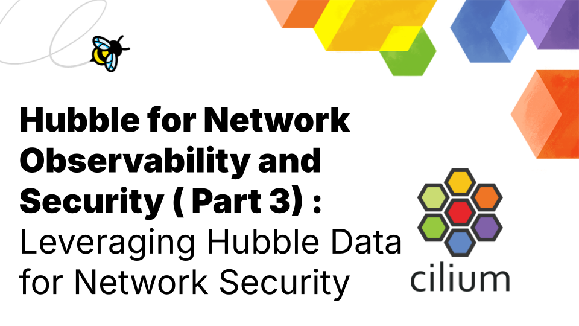

**_Author: Shedrack Akintayo, Isovalent_**

In this final part of the series, we'll focus on a critical aspect of network observability: security. In today's rapidly evolving threat landscape, the ability to leverage observability data for security observability is not just beneficial—it's essential. Let's take a look at how Hubble's rich observability data can be used to enhance your Kubernetes network security posture.

## How Do I Interpret Hubble Data?

Hubble provides a wealth of security-relevant data that can be invaluable for identifying potential threats. Let's dive deeper into the types of data Hubble offers and how to interpret them:

### Flow Logs

These detailed logs capture all network interactions, including:

- Source and destination IP addresses and ports
- Protocols used (TCP, UDP, ICMP, etc.)
- Kubernetes-specific metadata (pod names, namespaces, labels)
- Timestamp and duration of connections

With flow logs, you can look for unusual patterns such as unexpected connections between pods, connections to external IP addresses, or sudden increases in traffic volume.

Just like PostFinance does:

**_“We export the Hubble metrics, flows, and particularly the connection drops. With the source label and namespace label, we can quickly help when one of our customers or teams is having issues or a bad configuration in the namespace.”_** - Clément Nussbaumer, Systems Engineer, PostFinance ([Read the case study](https://www.cncf.io/case-studies/postfinance/))

### Policy Verdicts

Hubble logs whether traffic was allowed or denied based on your network policies. In a situation where you constantly see a high number of denied connections, this could indicate either an attempted attack or a misconfigured policy. Use the Hubble service map to visualize and investigate the source and destination of denied traffic to determine the cause.

### DNS Queries

Hubble captures DNS-related traffic, including query types and responses. You can monitor for unusual DNS patterns, such as a high volume of queries to uncommon domains or attempts to resolve known malicious domains.

### HTTP Header

For HTTP traffic, Hubble can provide information about methods, paths, and headers. With this data, you can investigate suspicious user agents, unexpected request patterns, or attempts to access sensitive endpoints.

### TLS Information

Hubble provides details about TLS versions and cipher suites used in encrypted connections. This data can help you identify potentially insecure TLS versions or cipher suites that could cause vulnerable connections.

### Performance Metrics

Hubble provides data on latency, throughput, and error rates. Sudden changes in these metrics could indicate a DDoS attack, misconfiguration, or a compromised application.

The API company, WS02 spoke about how Hubble helps them fix performance issues that their customers encounter:

**_“If a customer has some performance issues, we directly use the Hubble CLI to look at the Layer 3 packets to see where things are failing and what optimization we can do.”_** - Lakmal Warusawithana, Senior Director – Cloud Architecture, WSO2 ([Read the case study](https://www.cncf.io/case-studies/wso2/))

## How Can I Make Security Decisions with Hubble Data?

With Hubble's observability data, you can make informed security decisions. Let's explore some common scenarios and how Hubble can help:

### Detecting Potential Intrusions

**Scenario**: You notice unexpected connections to a sensitive database service.

**Action**: Use Hubble to trace the source of these connections. If they come from an unauthorized pod or external IP, investigate immediately and consider tightening your network policies.

### Identifying Misconfigured Policies

**Scenario**: Hubble shows a high number of denied connections between services that should be able to communicate.

**Action**: Review your network policies and adjust them to allow legitimate traffic while maintaining the principle of least privilege.

### Spotting Data Exfiltration Attempts

**Scenario**: Hubble logs show unusual outbound traffic patterns, particularly large data transfers to external IP addresses.

**Action**: Investigate the source pod and the nature of the data being transferred. If unauthorized, isolate the pod and conduct a thorough security audit.

### Responding to DDoS Attacks

**Scenario**: Hubble metrics show a sudden spike in traffic to a particular service.

**Action**: Analyze the traffic patterns to determine if it's a legitimate increase or a potential DDoS attack. If it's an attack, use Hubble data to identify the sources and block them at the network level with network policies.

### Investigating Lateral Movement

**Scenario**: After detecting a compromised pod, you need to determine if the attacker [moved laterally](<https://en.wikipedia.org/wiki/Lateral_movement_(cybersecurity)>) within the cluster.

**Action**: Use Hubble's flow logs to trace all connections made by the compromised pod, identifying any potential spread of the attack.

### Optimizing Network Policies

**Scenario**: You want to implement a zero-trust network model in your cluster.

**Action**: Analyze Hubble's flow logs to understand the actual communication patterns between services. Use this information to create precise, least-privilege network policies.

## What Are Some Best Practices for Incident Response?

Incorporating Hubble into your incident response strategy can significantly improve your ability to detect, investigate, and mitigate security incidents. Here are some best practices:

- **Set Up Alerts**: Configure alerts based on Hubble metrics to notify your team of potential security events in real time.

- **Establish Baselines**: Store and use Hubble's historical data to establish normal traffic patterns, making it easier to spot anomalies. For example, you can enable [Hubble Metrics](https://docs.cilium.io/en/stable/observability/metrics/) and have Prometheus scrape these into a data store.

- **Integrate with SIEM**: Feed Hubble's rich data into your Security Information and Event Management (SIEM) system for correlation with other security events.

- **Practice Forensics**: In the event of an incident, use Hubble's detailed logs to perform thorough forensic analysis.

- **Regular Policy Reviews**: Leverage Hubble's policy verdict data to review and refine your network policies regularly.

## Taking Your Platform And Network Security to The Next Level With Tetragon

While Hubble provides excellent network-level observability, [Tetragon](https://tetragon.io/) takes security observability to the next level by providing kernel and process-level insights. Tetragon, another eBPF-powered tool under Cilium, can:

- Monitor process executions and file access
- Detect and prevent unauthorized binaries from running
- Provide real-time alerts on suspicious activities at the host level
- Observes network traffic activity (TCP, UDP, TLS, DNS, HTTP, and more)

Tetragon correlates information from the runtime layer to the network layer, bringing together deep context around the network traffic that Hubble is observing. For example, Tetragon observes TLS traffic on a specific workload and captures rich information around the process ID, parent process, TLS versions, and Kubernetes identity of the workload. By combining Hubble's network insights with Tetragon's system-level observability, you can create a comprehensive security monitoring solution for your Kubernetes environment. To get started with Tetragon, you can try out the guides in its [official documentation](https://tetragon.io/docs/getting-started/) or this [hands-on lab](https://isovalent.com/labs/security-observability-with-ebpf-and-cilium-tetragon/) from Isovalent.

## Final Words

Throughout this series, we've explored the critical role that network observability plays in managing and securing Kubernetes environments. We began by examining the challenges DevOps and platform engineering teams face in achieving comprehensive visibility into their containerized networks. We then delved into Hubble's powerful features and how they address these challenges head-on.

In [Part 1](https://cilium.io/blog/hubble-for-network-security-and-observability-part-1/), we introduced the concept of network observability and its importance in the Kubernetes ecosystem. We highlighted the limitations of traditional monitoring tools and the unique requirements of modern, dynamic container environments.

[Part 2](https://cilium.io/blog/hubble-for-network-security-and-observability-part-2/) focused on Hubble's core capabilities, demonstrating how its deep, granular visibility into network flows, real-time metrics, and intuitive visualizations empower teams to monitor, troubleshoot, and optimize their Kubernetes networks effectively.

Finally, in this part, we explored leveraging Hubble's rich data to enhance network security. We discussed practical use cases, from detecting potential threats to improving incident response strategies, and even touched on how including Tetragon can take your platform security to the next level.
