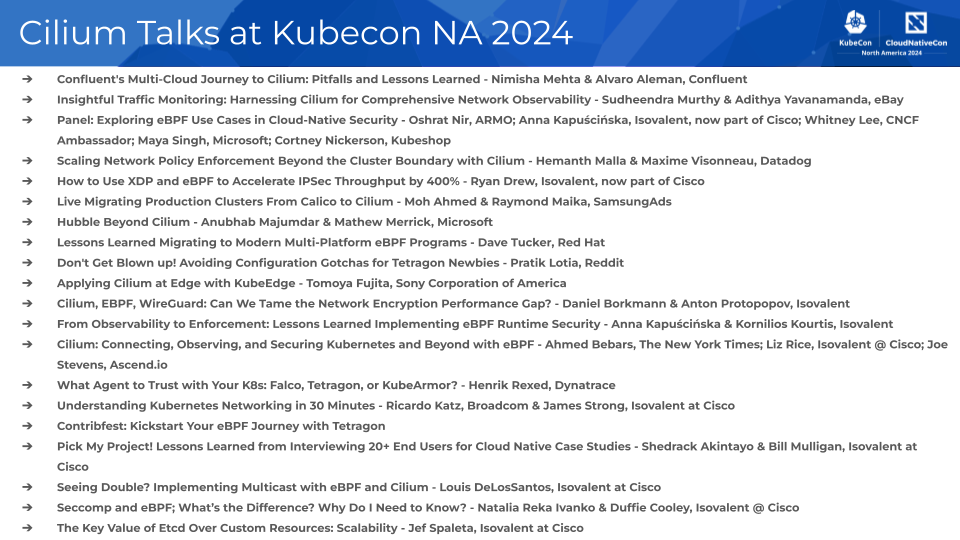

#### _October 4th, 2024_

#### _Author: Shedrack Akintayo, Isovalent at Cisco_

Following a remarkable period of growth and innovation, the Cilium community is gathering for the fourth Cilium + eBPF Day and the ninth KubeCon + CloudNativeCon North America 2024. With the recent [release of Cilium 1.16](https://github.com/cilium/cilium/releases/tag/v1.16.0), featuring the highly anticipated and powerful Cilium **netkit**, the project is again at the forefront of the cloud native ecosystem. This release is generating significant buzz, showcasing how Cilium and eBPF continue to revolutionize networking, observability, and security.

[Cilium + eBPF Day](https://events.linuxfoundation.org/kubecon-cloudnativecon-north-america/co-located-events/cilium-ebpf-day/) promises to be an immersive exploration into the world of Cilium, Tetragon, Hubble, and eBPF. The agenda is packed with insightful talks from end users, core contributors, and community members, covering topics like migrating to Cilium, network policy scalability and enforcement, Cilium at the edge, and many more. Speakers from leading companies, including Microsoft, Isovalent at Cisco, Red Hat, eBay, Sony, and The New York Times, will share their experiences and insights, making this a valuable learning opportunity. We’d also like to thank our sponsors for their generous support in making this event possible.

At the broader [KubeCon + CloudNativeCon North America 2024](https://events.linuxfoundation.org/kubecon-cloudnativecon-north-america/), Cilium is poised to be a significant part of the discourse, reflecting its leading influence in the cloud native community. Let’s run through all the ways you can learn about Cilium at the events to equip yourself with the knowledge to harness the power of Cilium and eBPF, enhance your networking capabilities, and make your platforms more secure, performant, and observable.

Now, let’s dive into each of the talks on Cilium at the events!

## Cilium + eBPF Day 2024

[Cilium + eBPF Day | Welcome + Opening Remarks - Bill Mulligan, Isovalent & Vlad Ungureanu, Palantir Technologies](https://colocatedeventsna2024.sched.com/event/1j2dF/cilium-ebpf-day-welcome-opening-remarks)

Tuesday, November 12, 2024, 09:00 am - 09:10 am MST

The Opening Session for Cilium + eBPF Day NA 2024

[Confluent's Multi-Cloud Journey to Cilium: Pitfalls and Lessons Learned - Nimisha Mehta & Alvaro Aleman, Confluent](https://colocatedeventsna2024.sched.com/event/1izpN/confluents-multi-cloud-journey-to-cilium-pitfalls-and-lessons-learned-nimisha-mehta-alvaro-aleman-confluent)

Tuesday, November 12, 2024, 9:10 am - 9:35 am MST

Confluent Cloud is a data streaming platform built on thousands of Kubernetes clusters across AWS, Azure & GCP. Confluent migrated clusters to use Cilium for its advanced security features like transparent encryption and DNS name-based network policies, along with performance, scalability & observability improvements. The main challenge was executing a live migration without disrupting stateful workloads, complicated by the risks of replacing a low-level component like the CNI. The process required meticulous planning to ensure intra-cluster connectivity during migration while accommodating each cloud provider's unique network config. This talk shares the journey of migrating to Cilium, highlighting obstacles and lessons learned. We will explore uninstalling pre-existing CNIs, setting up Cilium & addressing cloud-specific issues to maintain connectivity. Benefits like transparent encryption, policies, and Hubble observability, along with the challenges faced, will also be discussed.

[Insightful Traffic Monitoring: Harnessing Cilium for Comprehensive Network Observability - Sudheendra Murthy & Adithya Yavanamanda, eBay](https://colocatedeventsna2024.sched.com/event/1izpm/insightful-traffic-monitoring-harnessing-cilium-for-comprehensive-network-observability-sudheendra-murthy-adithya-yavanamanda-ebay)

Tuesday, November 12, 2024, 9:45 am - 10:10 am MST

eBay's cloud consists of thousands of microservices running on millions of containers across hundreds of Kubernetes clusters. In this dynamic & complex cloud environment, mapping dependencies between microservices is crucial. This session delves into how eBay innovatively and scalably uses Cilium, powered by eBPF, to monitor traffic flows, generate real-time traffic events, and construct a comprehensive dependency graph of microservice interactions across hundreds of K8s clusters.

The presentation will cover:

- The innovative use of eBPF and Cilium to monitor traffic events in near real-time
- How traffic events are mapped to different microservices
- The architecture and design of the scalable solution to handle the large volume of data
- The integration of OpenTelemetry for efficient traffic event stream processing
- Key challenges and solutions in building and maintaining the dependency graph
- Insights and lessons learned from integrating eBPF and Cilium into eBay’s infrastructure

[Panel: Exploring eBPF Use Cases in Cloud-Native Security - Oshrat Nir, ARMO; Anna Kapuścińska, Isovalent, now part of Cisco; Whitney Lee, CNCF Ambassador; Maya Singh, Microsoft; Cortney Nickerson, Kubeshop](https://colocatedeventsna2024.sched.com/event/1izr8/panel-exploring-ebpf-use-cases-in-cloud-native-security-oshrat-nir-armo-anna-kapuscinska-isovalent-now-part-of-cisco-whitney-lee-cncf-ambassador-maya-singh-microsoft-cortney-nickerson-kubeshop)

Tuesday, November 12, 2024, 11:50 am - 12:25 pm MST

Cloud-native security requires a shift in mindset. Workloads are ephemeral, the attack surface has grown, and with it, the complexities. eBPF has emerged as a powerful technology, enabling deep visibility and dynamic security capabilities within the Linux kernel. This panel will explore use cases in which eBPF enhances cloud-native security. We will explore how eBPF can be leveraged to perform real-time monitoring, threat detection, and mitigation across containerized applications and microservices. Our expert panelists will share insights on using eBPF for network security, application profiling, anomaly detection, and enforcing security policies at the kernel level. Additionally, we will discuss the integration of eBPF with popular cloud-native tools and platforms, showcasing practical implementations.

[Scaling Network Policy Enforcement Beyond the Cluster Boundary with Cilium - Hemanth Malla & Maxime Visonneau, Datadog](https://colocatedeventsna2024.sched.com/event/1izs0/scaling-network-policy-enforcement-beyond-the-cluster-boundary-with-cilium-hemanth-malla-maxime-visonneau-datadog)

Tuesday, November 12, 2024, 1:30 pm - 1:55 pm MST

To keep up with infrastructure growth, companies around the world are managing an increasing number of Kubernetes clusters. Enforcing Kubernetes native network policy at scale is already hard enough within a single cluster. Extending this to multiple clusters is even more challenging. Depending on the shape of your infrastructure, your cross-cluster policy requirements may be unique, and there’s no one-size-fits-all configuration. In this talk, we’ll dive deep into how different solutions work in cilium to understand sources of potential bottlenecks. We’ll discuss Clustermesh, KVstoremesh, DNS-based FQDN policy, and a custom variant of KVstoremesh Datadog leverages while meshing at scale. Specifically, we’ll discuss how factors like the number of pods, identities, and pod churn will impact scalability and time to policy enforcement. Join us if you’re curious about understanding the latest in cross-cluster policy and leave with actionable insights you can apply to your infrastructure.

[How to Use XDP and eBPF to Accelerate IPSec Throughput by 400% - Ryan Drew, Isovalent, now part of Cisco](https://colocatedeventsna2024.sched.com/event/1izsR/how-to-use-xdp-and-ebpf-to-accelerate-ipsec-throughput-by-400-ryan-drew-isovalent-now-part-of-cisco)

Tuesday, November 12, 2024, 2:05 pm - 2:30 pm MST

The techniques used to increase IPSec network performance are often kept as secrets because they act as a competitive advantage and a lucrative product offering. This talk transparently presents a technique for massively boosting IPSec performance that is simple to implement (less than 200 lines of C), and based entirely on open-source work. An early Proof of Concept (POC) implementation showed an increase in p99 throughput by 412%! This talk will take a deep dive into how it all works, covering: the implementation, the pros and cons of the design, and an analysis of benchmark results. As transparent encryption becomes more crucial for securing data in transit, we hope this talk will enable users required to use IPSec for compliance or infrastructure reasons to learn how to speed up their network without having to compromise their security.

[Live Migrating Production Clusters From Calico to Cilium - Moh Ahmed & Raymond Maika, SamsungAds](https://colocatedeventsna2024.sched.com/event/1mFPd/live-migrating-production-clusters-from-calico-to-cilium-moh-ahmed-raymond-maika-samsungads)

Tuesday, November 12, 2024, 2:40 pm - 3:05 pm MST

Engineers may be tasked with rolling out a new Container Networking Interface (CNI) to their environment. Sounds easy enough! Delete the old one, and deploy the new one. Or maybe just deploy a brand new cluster! What if... there was another way? The talk will show how a live, in-place migration of the CNI plugin was performed in production clusters. It will highlight a few approaches that were considered, and what approach was eventually selected before proceeding with the migration process. Lastly, the procedure and steps taken to execute this migration will be shared, along with any lessons learned.

[Hubble Beyond Cilium - Anubhab Majumdar & Mathew Merrick, Microsoft](https://colocatedeventsna2024.sched.com/event/1iztI/hubble-beyond-cilium-anubhab-majumdar-mathew-merrick-microsoft)

Tuesday, November 12, 2024, 3:20 pm - 3:45 pm MST

Hubble is a great solution for finding and fixing network problems in a Kubernetes cluster. However, we noticed that one of the main barriers for people to use Hubble is its dependency on Cilium as the dataplane. In this talk, we'll demonstrate how to decouple Hubble from Cilium, and use Hubble as a powerful Observability/metrics platform on top of any custom data plane. We will show you how to make Hubble work with any data source you want, without changing any code in Hubble. We'll show you an example of one such open source project called Retina and compare how key features work with both Cilium and custom CNI. In a live demo, we will show that you can get the same experience with Hubble regardless of what CNI you use.

[Lessons Learned Migrating to Modern Multi-Platform eBPF Programs - Dave Tucker, Red Hat](https://colocatedeventsna2024.sched.com/event/1izth/lessons-learned-migrating-to-modern-multi-platform-ebpf-programs-dave-tucker-red-hat)

Tuesday, November 12, 2024, 3:55 pm - 4:20 pm MST

Kepler needed to migrate its old eBPF probes developed with BCC to probes that were compiled ahead of time. Maybe you do too? While performing this migration we were able to use some modern features of eBPF, the cilium/ebpf Go library, and bpf2go to make our probes multi-platform. Kepler (Kubernetes-based Efficient Power Level Exporter) is a CNCF project focused on measuring the environmental impact of software. At its core, Kepler uses eBPF to gather metrics from the Linux Kernel, which feeds into an ML model that estimates power consumption for processes, VMs, and Pods. By the end of this session, you’ll gain a deeper understanding of eBPF, practical insights into its application in power consumption monitoring, and strategies for modernizing existing eBPF programs. Join us to learn from our experience and take away actionable best practices for your projects!

[⚡ Lightning Talk: Don't Get Blown up! Avoiding Configuration Gotchas for Tetragon Newbies - Pratik Lotia, Reddit](https://colocatedeventsna2024.sched.com/event/1izuW/cl-lightning-talk-dont-get-blown-up-avoiding-configuration-gotchas-for-tetragon-newbies-pratik-lotia-reddit)

Tuesday, November 12, 2024, 5:00 pm - 5:10 pm MST

This talk will dive into five common configuration pitfalls that beginners encounter when using Tetragon for runtime observability on their workloads. We'll explore the implications of each gotcha and provide clear steps to avoid them. The talk will also cover best practices for configuring Tetragon in a Kubernetes environment.

[⚡ Lightning Talk: Applying Cilium at Edge with KubeEdge - Tomoya Fujita, Sony Corporation of America](https://colocatedeventsna2024.sched.com/event/1izuu/cl-lightning-talk-applying-cilium-at-edge-with-kubeedge-tomoya-fujita-sony-corporation-of-america)

Tuesday, November 12, 2024, 5:15 pm - 5:25 pm MST

Applications in edge environments can be platform-dependent, complicated, and distributed in regions, and the number of devices significantly increases. Our final goal is to create the infrastructure that can be applied to the entire environment crossing over the cloud and edge in common. Working with KubeEdge and Cilium, we are now successfully able to use Cilium with KubeEdge-hosted nodes at edge environment. This means, that enabling wireguard VPN with Cilium can provide transparent network connectivity with the nodes running in the cloud infrastructure so that edge nodes running at edge environment just appear to be a member of the cluster system but with edge autonomy feature provided by KubeEdge. We would like to share our technical insights and experience with using Cilium at Edge with KubeEdge, and what are the future development and contribution to the Cilium community.

[Cilium + eBPF Day | Closing Remarks - Bill Mulligan, Isovalent & Vlad Ungureanu, Palantir Technologies](https://colocatedeventsna2024.sched.com/event/1jJ2P/cilium-ebpf-day-closing-remarks)

Tuesday, November 12, 2024, 5:25 pm - 5:30 pm MST

The Closing Session for Cilium + eBPF Day NA 2024

## KubeCon + CloudNativeCon

[Cilium, EBPF, WireGuard: Can We Tame the Network Encryption Performance Gap? - Daniel Borkmann & Anton Protopopov, Isovalent](https://kccncna2024.sched.com/event/1i7lP/cilium-ebpf-wireguard-can-we-tame-the-network-encryption-performance-gap-daniel-borkmann-anton-protopopov-isovalent)

Wednesday, November 13, 2024, 2:30 pm - 3:05 pm MST

To increase data security for cloud and hybrid cloud deployments, many companies, governments, standards, and tenders require data in transit to be protected. However, network encryption comes at a cost - what is the performance impact and how can we reduce it? In this session, we explore how network encryption can be efficiently enforced with Cilium, eBPF, and WireGuard. We dive deep into Cilium’s integration of WireGuard and elaborate on both the management plane and Cilium’s eBPF datapath. We analyze and benchmark what performance cost one can expect and explore opportunities in the Linux kernel to reduce that price. This talk is for operators and security teams that need to encrypt network traffic, but also want to minimize its overhead. The audience will walk away understanding whether network encryption needs to come at a high toll and whether there are opportunities for optimizations.

[From Observability to Enforcement: Lessons Learned Implementing eBPF Runtime Security - Anna Kapuścińska & Kornilios Kourtis, Isovalent](https://kccncna2024.sched.com/event/1i7ma/from-observability-to-enforcement-lessons-learned-implementing-ebpf-runtime-security-anna-kapuscinska-kornilios-kourtis-isovalent)

Wednesday, November 13, 2024, 5:25 pm - 6:00 pm MST

eBPF is getting widely adopted in cloud native runtime security tools like Falco, KubeArmor, and Tetragon. Using eBPF we can collect relevant security events right in the kernel and pass them to Security Engineers for retroactive attack detection and response. Having reliable and complete visibility is great, but wouldn't it be even better to proactively prevent attacks in progress? This talk covers the Tetragon team’s experience moving from security observability to enforcement and lessons learned along the way: from defining security models to hardening interactions between the local kernel and distributed Kubernetes systems. It will deep dive into how eBPF-based enforcement works, why it differs from observability, and the challenges of implementing it. The audience will walk away understanding the inner workings and common pitfalls of eBPF-based runtime security.

[Cilium: Connecting, Observing, and Securing Kubernetes and Beyond with eBPF - Ahmed Bebars, The New York Times; Liz Rice, Isovalent @ Cisco; Joe Stevens, Ascend.io](https://kccncna2024.sched.com/event/1howZ/cilium-connecting-observing-and-securing-kubernetes-and-beyond-with-ebpf-ahmed-bebars-the-new-york-times-liz-rice-isovalent-cisco-joe-stevens-ascendio)

Thursday, November 14, 2024, 11:55 am - 12:30 pm MST

Welcome to Cilium's maintainer track session where you'll get an update on how Cilium is expanding the frontiers of cloud native networking, observability, and security. Cilium is CNCF's most widely adopted CNI, being the default choice for all major cloud providers. This talk dives into the bytecode behind all of the buzz around the project. We'll start with a brief overview of each part of the project before diving into how Cilium is expanding beyond Kubernetes with load balancing and multi-cloud networking and into runtime enforcement with Tetragon. In this session, you'll hear from Cilium contributors and users Isovalent and The New York Times.

[What Agent to Trust with Your K8s: Falco, Tetragon, or KubeArmor? - Henrik Rexed, Dynatrace](https://kccncna2024.sched.com/event/1i7rE/what-agent-to-trust-with-your-k8s-falco-tetragon-or-kubearmor-henrik-rexed-dynatrace)

Thursday, November 14, 2024, 11:55 am - 12:30 pm MST

In the CNCF landscape we have plenty of ebpf-based security solutions that help us protect our k8s cluster from runtime vulnerabilities. On paper though Falco, Tetragon, and KubeArmor look very similar. Eventually, you have to make a choice on which one best fits your needs. To give you additional insights to make your decision join this session. We have run extensive benchmarks against those three solutions and will answer the following questions that came out of our testing: - What are the different feature sets? - What about the performance impact of each agent? - Which privileges does each solution need? - What are the pros and cons of the three options?

[Understanding Kubernetes Networking in 30 Minutes - Ricardo Katz, Broadcom & James Strong, Isovalent at Cisco](https://kccncna2024.sched.com/#)

Thursday, November 14, 2024 4:30 pm - 5:05 pm MST

You are learning Kubernetes and started to face concepts like Pod CIDRs, Services, CNI, kube-proxy? Welcome! you have reached the amazing area of Kubernetes networking! We all have already been there and know how complex it may seem on the beginning, but in this talk, Ricardo and James will demystify the Kubernetes network concepts and model on a fun way, exploring how it is designed, why the is a "pause" container on every Pods, how the communication between Pods work, what are kube-proxy and CNI and their importance. In the end of this talk we expect you to get your learning path on Kubernetes Networking clear to better understand not only what are the concepts about, but also see on a live demo how every component correlates and makes the communications possible on a Kubernetes cluster .

[🚨 Contribfest: Kickstart Your eBPF Journey with Tetragon](https://kccncna2024.sched.com/event/1hoyj/contribfest-kickstart-your-ebpf-journey-with-tetragon)

Thursday, November 14, 2024, 4:30 pm - 6:00 pm MST

Tetragon and eBPF have a lot of buzz and this is your chance to get involved diving into the bytecode or docs! Tetragon’s docs are still young and your new contributor's perspective will be a superpower for spotting issues or unclear wording in the various quickstarts, guides, and concepts pages. The project’s CLI, tetra, is another great opportunity for those interested in code contributions around ease of use, testing, and consistency in flags and output. Tetragon’s documentation tech stack uses Markdown, built with Hugo, and a customized Docsy theme. The CLI is written in Go with the Cobra library and uses gRPC to communicate with the agent. While this session should help you get more familiar with Tetragon and can lead to more contributions in the future, those technologies are also used in Kubernetes and many other CNCF projects.

[Pick My Project! Lessons Learned from Interviewing 20+ End Users for Cloud Native Case Studies - Shedrack Akintayo & Bill Mulligan, Isovalent at Cisco](https://kccncna2024.sched.com/event/1i7pZ/pick-my-project-lessons-learned-from-interviewing-20-end-users-for-cloud-native-case-studies-shedrack-akintayo-bill-mulligan-isovalent-at-cisco)

Thursday, November 14, 2024, 5:25 pm - 6:00 pm MST

Cloud native projects can promise the moon in their READMEs, but have you ever wondered what causes end users to adopt a project? Shedrack and Bill have interviewed over 20 companies in industries ranging from media to financial services about why they picked a project for their cloud native platform. In this talk, they will reveal what end users truly want when adopting cloud native technologies and what the forcing function is for each of them. You’ll hear firsthand accounts of the triumphs and tribulations faced by companies like Bloomberg, DigitalOcean, The New York Times, and more as well as the specific benefits these organizations are reaping, from enhanced security and observability to improved performance and cost savings. Additionally, they’ll teach other projects their process for creating impactful case studies. By the end, the audience will understand the real-world applications and advantages of cloud native technologies and why end users pick a project.

[Seeing Double? Implementing Multicast with eBPF and Cilium - Louis DeLosSantos, Isovalent at Cisco](https://kccncna2024.sched.com/event/1i7qG/seeing-double-implementing-multicast-with-ebpf-and-cilium-louis-delossantos-isovalent-at-cisco)

Friday, November 15, 2024, 11:55 am - 12:30 pm MST

Multicast is a popular networking technology used in finance, telecommunications, and media CDNs, among others to efficiently replicate and deliver data streams to multiple clients. However, this advantage can be overshadowed by the complexity involved in configuring the necessary infrastructure leaving the overworked platform team rather than the end users seeing double. To combat this complexity, Cilium explored using eBPF to implement pod-to-pod multicast delivery within a Kubernetes cluster. This talk will provide both a high and low-level understanding of how eBPF can be used to implement multicast delivery. It will discuss how Cilium’s multicast works and the hurdles faced by the project along the way. By the end of this talk, the audience will have a better understanding of how multicast functions, how eBPF can be used in place of traditional multicast infrastructure, and how Cilium can be used as a multicast-enabled CNI, letting your audience - and not you- see double.

[Micro-Segmentation and Multi-Tenancy: The Brown M&Ms of Platform Engineering](https://kccncna2024.sched.com/event/1i7qS/micro-segmentation-and-multi-tenancy-the-brown-mms-of-platform-engineering-jim-bugwadia-nirmata-rachael-wonnacott-fidelity-international?iframe=no)

Friday November 15, 2024 2:00pm - 2:35pm MST

A key requirement for internal developer platforms is that they serve multiple workloads. The reality of platform engineering is that while it seeks to lower the barrier to entry for teams to deliver applications, it must also balance cost and ensure appropriate levels of security. It’s therefore essential to consider how application components running on shared infrastructure are allowed to communicate with each other and weigh up the cost of each architecture. In industry, we have seen differing approaches to deploying Kubernetes to achieve these goals, from multiple single-tenant clusters through to shared clusters that deliver namespaces-as-a-service. Rachael and Jim will define the concepts of multi-tenancy and micro-segmentation for cloud native systems, explain why they are critical to success with platform engineering. They will also show real-world examples of how they can be implemented, and demonstrate full automation using best practices like GitOps and Policy as Code.

[Seccomp and eBPF; What’s the Difference? Why Do I Need to Know? - Natalia Reka Ivanko & Duffie Cooley, Isovalent @ Cisco](https://kccncna2024.sched.com/event/1i7qb)

Friday, November 15, 2024, 2:00 pm - 2:35 pm MST

Containers in Kubernetes share a common Linux kernel so how can we limit access where it isn’t required so we can follow the principle of least privilege? Join Natalia and Duffie as they each explore different approaches to harden your container security with Secure Computing (seccomp) and eBPF! The talk will begin with an overview and comparison between seccomp and eBPF and how they both can solve the same problem - limiting access to the Linux Kernel that all containers share. This will be a fun talk, showing each solution with a live demo. You will leave this talk with a better understanding of how to limit what system calls a process can make and restrict your containers’ behavior to only access the files, binaries and external DNS names they need and nothing more. Which is the right solution for your environment? Come and learn about two of the commonly used technologies in use today!

[The Key Value of Etcd Over Custom Resources: Scalability - Jef Spaleta, Isovalent at Cisco](https://kccncna2024.sched.com/#)

Friday, November 15, 2024 2:55 pm - 3:30 pm MST

Cilium defaults to using Kubernetes Custom Resources to hold Cilium specific internal state, however when the cluster is large enough, the Kubernetes API becomes a bottleneck on performance. To scale a cluster to hundreds of nodes, Cilium can be configured to use a dedicated external etcd instance. This talk will discuss the details of what the external etcd looks like from an operator perspective, and explore why Cilium uses an external etcd for enhanced scalability. It will cover how to manage a cluster by bypassing the Kubernetes API and interacting only with the cluster's etcd key-value store - and also why it might be a bad idea. Get a taste of what's possible by bypassing the Kubernetes API and interacting with the etcd API directly, and learn why Cilium has an option to use a dedicated etcd deployment, not shared by the Kubernetes API, for holding Cilium state and the scalability benefits it can bring to your cluster.
