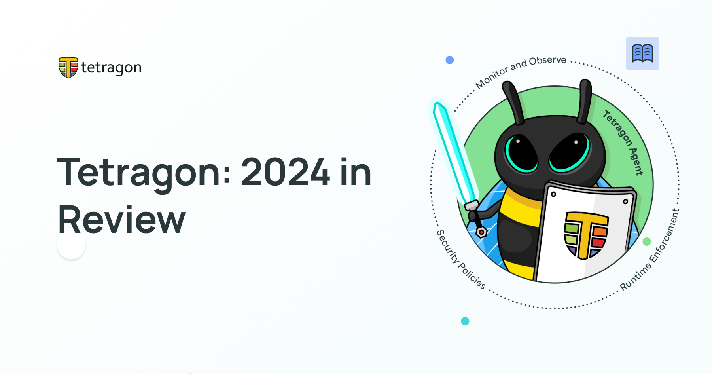

import authors from 'utils/author-data';

**_Author: Paul Arah, Isovalent_**

2024 has been a remarkable year for Tetragon. This year witnessed increased adoption, the release of many exciting features, a record number of conference talks, and exponential growth within the community. As we approach the year's end, we reflect on the progress made as a community and look ahead to the future.

Since the initial release of Tetragon 1.0 last year, the sub-project has continued to set the standard for eBPF-based security observability and runtime enforcement. Platform and security teams worldwide, from small companies to prominent enterprises, use Tetragon to secure their environments efficiently and effectively.

While the 2024 [Cilium annual report](https://github.com/cilium/cilium.io/blob/main/Annual-Reports/Cilium_Annual_Report_2024.pdf) covered some major statistics for the Tetragon project, this blog zooms in on what we, as a community, have accomplished this year.

## Release Highlights

### Tetragon 1.1

#### Kubernetes Identity-Aware Policies

Tetragon 1.1 introduced features that enabled deeper integration with Kubernetes, including Kubernetes Identity-Aware Policies. Previously, tracing policies (which define the situations Tetragon should react to and how) were applied at a cluster-wide scope. With this update, Tetragon’s security observability and runtime enforcement can be used with precision to specific Kubernetes workloads based on their identity. This improvement reduces noise and overhead while providing security tailored to specific workloads.

#### Redaction Filters

Tetragon events, exposed via gRPC and JSON logs, can include sensitive information such as passwords or environment variables. Tetragon 1.1 introduced redaction filters, enabling users to redact specific fields from exported data, ensuring sensitive information is not inadvertently exfiltrated.

#### CRI-O Runtime Hooks Support

Tetragon requires Kubernetes metadata to enable Kubernetes Identity-Aware Policies. Retrieving this metadata from the Kubernetes API can cause delays between container startup and policy application, which is undesirable, especially in enforcement scenarios. Runtime hooks solve this issue by directly "hooking" into the container runtime system, ensuring the Tetragon agent sets up the necessary state before the container starts. With Tetragon 1.1, CRI-O runtime hooks are automatically configured via a Tetragon init container.

### Tetragon 1.2

### Persistent Enforcement

Before Tetragon 1.2, enforcement policies depended on the Tetragon agent’s uptime. If the agent went down—due to restarts or failures—the eBPF programs responsible for enforcement were removed, potentially causing a security lapse. Tetragon 1.2 ensures that the eBPF programs responsible for enforcement continue running even during agent downtime, enhancing security and minimizing risk.

#### Improved Child Process Visibility

Child process visibility is crucial for detecting malicious activities such as process injection and lateral movement. Tetragon already allowed tracking all child processes spawned by specific binaries, but earlier versions required users to rely on PID values, which can be non-deterministic. Version 1.2 introduced a more intuitive way to track process ancestry across complex execution chains.

#### Containerd Support

Containerd, one of the most popular container runtimes, is now supported in Tetragon 1.2. Previously, the runtime hook system enabling Kubernetes Identity-Aware Policies supported only CRI-O. With this update, the runtime hook system was redesigned from an init container to a DaemonSet, providing flexibility to support both CRI-O and Containerd. This expansion brings Tetragon’s full capabilities to a broader range of Kubernetes deployments.

## Conferences

Tetragon had a strong presence at major cloud native events in 2024. These events included KubeCon, Cilium + eBPF Day, and CloudNativeSecurityCon. Here are some of the highlights:

- [Dealing with eBPF’s Observability Data Deluge - Anna Kapuścińska, Isovalent](https://www.youtube.com/watch?v=yWB8n_e4N14)
- [Bee-Lieve in the Metadata: Pollenating Build Attestations on Kubernetes with Tetragon and EBPF - Tom Meadows, TestifySec](https://www.youtube.com/watch?v=ejkJiq7AMHs)
- [Brewing the Kubernetes Storm Center: Open Source Threat Intelligence for the Cloud Native Ecosystem - Constanze Roedig, Technische Universität Wien & James Callaghan, ControlPlane](https://www.youtube.com/watch?v=YDIW2CY8WPI)
- [Don't Get Blown up! Avoiding Configuration Gotchas for Tetragon Newbies - Pratik Lotia, Reddit](https://www.youtube.com/watch?v=YNDp7Id7Bbs)
- [What Agent to Trust with Your K8s: Falco, Tetrago, or KubeArmor? - Henrik Rexed, Dynatrace](https://www.youtube.com/watch?v=QKE8WMv-6qw)
- [From Observability to Enforcement: Lessons Learned Implementing eBPF Runtime Security - Anna Kapuścińska & Kornilios Kourtis, Isovalent](https://www.youtube.com/watch?v=Hw469I5GKmY)
- [Panel: Exploring eBPF Use Cases in Cloud-Native Security](https://www.youtube.com/watch?v=towNkbPMDjE)
- [Tutorial: Sailing the Security Seas with Tetragon - Duffie Cooley, Isovalent](https://www.youtube.com/watch?v=4ACOEB4PnQo)

## Community Meetings

This year, we kicked off a monthly [Tetragon community meeting](https://isogo.to/tetragon-meeting-notes) on the second Monday of the month. We held the first community meeting in March and have held 9 community meetings so far this year baring the months where the community meetings coincided with KubeCon. The community meetings have been great to onboard new members to the community, discuss ongoing PRs, and learn about all the exciting work and development in Tetragon.
We look forward to continued participation and growth in the community meetings as we go into 2025.

## Community Voices

The Tetragon community has shared many exciting testimonials about their experiences. One quote that encapsulates Tetragon's impact on cloud native security comes from Marcos Hernandez, Platform Engineering Lead at Google Cloud:

**_“eBPF tracing is very powerful. I recently deployed a hashtag#Tetragon TracingPolicy CR to my Google Distributed Cloud Virtual (GDCV) clusters at the edge as an experiment. The level of visibility and control it offers through the various supported hook points is really cool. Love the programmatic, low level access to kernel events. hashtag#Cilium hashtag#GoogleDistributedCloud.”_** - Marcos Hernandez, Platform Engineering Lead at Google Cloud ([Read the LinkedIn post](https://www.linkedin.com/posts/activity-7270097966017703936-mvrp/?utm_source=share&utm_medium=member_desktop))

## Looking Ahead

As we close the chapter on 2024, it’s clear that Tetragon has made significant strides in enhancing cloud native security observability and runtime enforcement. From major feature releases to a growing community and vibrant presence at key conferences, the project’s trajectory is nothing short of inspiring.

The Tetragon community’s dedication, innovation, and collaboration have been pivotal to this success. As we look to 2025, we are excited to continue pushing the boundaries of what’s possible with eBPF powered security observability and runtime enforcement with Tetragon, empowering teams worldwide to secure their cloud native environments with confidence.

Here’s to another year of growth, innovation, and community-driven success. See you in 2025!

For the Tetragon Community:

Paul Arah
Community Builder – Security
