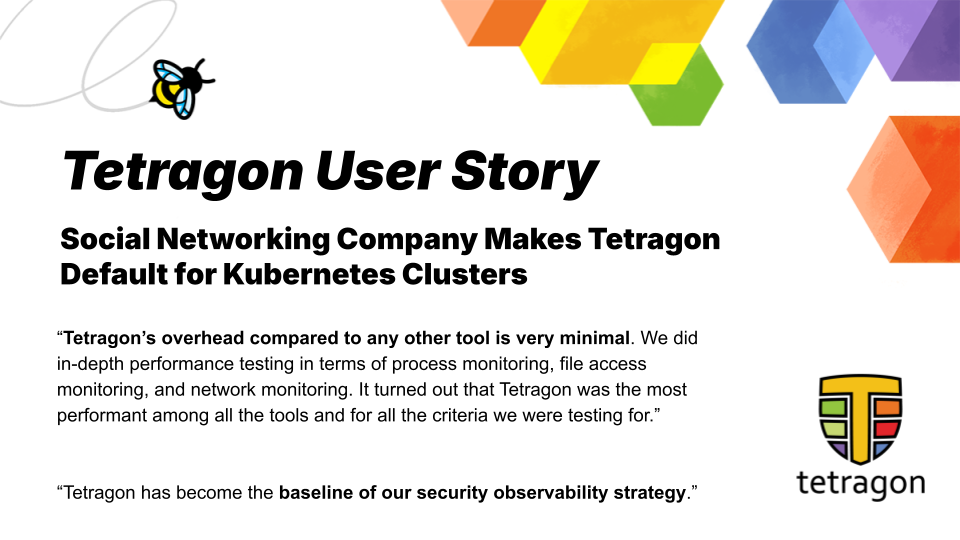

import authors from 'utils/author-data';

_April 15th, 2025_

_Author: Paul Arah, Isovalent@Cisco_

_This user story comes from a company that provides communication and social networking services._

**Problem**

As this social networking company’s Kubernetes footprint expanded from 12 to 35 clusters in just two years, its security and observability tools struggled to keep up. Like most companies, the ratio of security engineers to developers made it nearly impossible to manually ensure that every service adhered to the company's security best practices. The open source Osquery, initially deployed for visibility, frequently caused production outages due to high resource consumption and contention and noisy neighbor issues. They needed a cloud native, low-overhead solution capable of delivering detailed security observability while seamlessly integrating with its Kubernetes-based infrastructure.

**Solution**

After evaluating various tools and doing in-depth performance overhead testing based on metrics such as process overhead, network monitoring overhead, and file access overhead, this social networking company adopted Tetragon, an eBPF-powered runtime security observability tool, for its Kubernetes environments. Tetragon’s daemonset-based deployment model ensured consistent coverage across all clusters, while its granular configuration allowed them to focus on high-value process events without overwhelming their logging pipeline. Critical features like ARM architecture support, enforcement capabilities, and integration with their data lake via a gRPC logging pipeline made Tetragon the ideal fit for their evolving needs.

With 100 percent coverage of Kubernetes clusters at this company, Tetragon is now part of the bare minimum requirements for every new Kubernetes cluster created there, regardless of whether it is a development, staging, or production cluster.

**Outcome**

Tetragon transformed the company’s approach to security observability by providing full visibility into process events with minimal impact on resources. Prior to migrating to Tetragon, production outages due to performance impacts from security tools were a common challenge. Tetragon’s low overhead has translated into adjacent teams not even realizing that a security tool is running in the background. Production workloads are shielded from disruptions, enabling their security team to focus on proactive threat detection. This has resulted in deeper trust across the organization, knowing their infrastructure is continuously monitored and safeguarded against evolving threats. With comprehensive coverage across all clusters, the team now identifies anomalies faster and enforces better security practices without compromising performance or developer productivity.

## The Journey to Reliable Security Observability with Tetragon

The company is a network of thousands of vibrant communities that connect millions of users daily to discuss topics they’re passionate about. Behind the scenes, its infrastructure has grown significantly to meet its users' demands. Over the past few years, the company’s Kubernetes adoption surged from 12 clusters to 35, with over 80% of workloads now running on Kubernetes. Supporting this growth is a small but dedicated infrastructure security team of five engineers tasked with securing the environment for over 1,200 developers. The rapid scale of Kubernetes adoption revealed critical limitations in the company’s existing security observability stack. Osquery, an open source tool previously used to monitor processes and network activity, became a source of frustration. As a security engineer at this company explained, _“Osquery caused numerous outages in production. It was consuming a lot of resources, creating contention issues for our workloads. The tool ended up being a noisy neighbor that disrupted the very systems it was supposed to protect.”_ Even switching from a self hosted to a managed solution didn’t help mitigate the problem.

Performance wasn’t the only issue. Osquery’s high data volume overwhelmed their logging pipeline. Generating excessive logs from test clusters alone, Osquery’s default configuration also provided little actionable insight. _“With Osquery, we often found ourselves sifting through stacks of irrelevant data to find something meaningful,”_ The security engineer added. The lack of Kubernetes-native integration and real-time enforcement capabilities further compounded the challenges.

## Testing and Performance Benchmarking Security Tools

Seeking a modern, Kubernetes-aware solution, the company’s security team evaluated multiple options. Performance testing and benchmarking of tools primarily focused on the overhead introduced for process monitoring, file access, and network monitoring. Tetragon came to the top of the list with the least overhead.

_“Tetragon’s overhead compared to any other tool has been very minimal. We did in-depth performance testing in terms of process monitoring, file access monitoring, and network monitoring. We tested the baseline behavior without any security tool. Then we compared it with all the security tools we were testing against, and it turned out that Tetragon had the best performance among all the tools we tested out and for all the criteria we were testing for.”_ - Security engineer on the team.

Tetragon’s gRPC logging pipeline also reduced resource consumption compared to JSON-based logging. By directing logs into their Kafka-backed observability pipeline and storing them in BigQuery, the team ensured scalability and fast querying of security events. _“Tetragon offers granular configuration for monitoring processes, file access, and network traffic, and there’s also no requirement to maintain a logging backend. We can customize how we want the logs sent to our data lake and how they get delivered to various destinations,”_ The security engineer explained.

## Kubernetes and ARM Support Additional Benefits

Another important factor the team considered when choosing their next security observability tool was first-class support for Kubernetes. Osquery was primarily designed with bare metal and VM workloads in mind. This meant the team had to customize Osquery to work for their Kubernetes workloads, which introduced an extra layer of complexity and maintenance burden on the team. A security engineer on the team highlighted Tetragon’s key differentiator “Tetragon’s Kubernetes compatibility stood out immediately. It supports Kubernetes as a first-class citizen and offers granular monitoring for processes, file access, and network activity.”

The company also has some of its workloads running ARM-based architectures, and when choosing a tool, they looked for in-built support ARM so they wouldn’t have to maintain any custom ARM images. _“A major factor in choosing Tetragon was its support for the arm64 architecture. With increasing workloads running on ARM-based processors, we are shifting further in this direction to leverage the efficiency and cost benefits. Tetragon's native support for arm64 eliminates the need for us to maintain custom images for our ARM-based deployments.”_

Finally, the team needed a tool that provided flexibility on the kind of security observability data collected. They were keen about this tool not requiring any custom vendor solution to funnel this data into their security observability pipeline. With the gRPC pipeline, the team could streamline exporting and analyzing security events without relying on proprietary or custom vendor solutions. _“We were looking for a security observability tool that allowed us to customize what kind of data we wanted to gather. As a company, we rely a lot on open source tools; this means we didn't want a situation where we had to wait for a custom vendor solution or request for a specific kind of data.”_

Deployment was straightforward. _“Tetragon’s daemonset-based model made implementation seamless,”_ the security engineer said. The company’s automated infrastructure ensured Tetragon was installed with baseline configurations across all new clusters. This provided them with instant visibility into process-level events without requiring extensive manual intervention.

## Granular Control of High Value Events

Tetragon’s granular policy controls allowed them to focus on high-value process events, such as privilege escalations, execution of binaries from temp directories, and unauthorized container access.

_“Tetragon offers granular configuration for monitoring processes, file access, and network traffic, and there's also no requirement to maintain a logging backend. We can customize how we want the logs sent to our data lake and how they get delivered to various destinations.”_ - A Security Engineer on The Team

Tetragon’s ability to track vulnerabilities at runtime also proved invaluable. “If a new vulnerability affects specific binaries or libraries, we could write a Tetragon tracing policy to identify the workload affected. Tracking what service uses what library can be challenging. A service can have thousands of dependencies. Tetragon makes detecting any new vulnerability type that could impact us easier,” The security engineer said.

## Confidence in Baseline Security Posture

With Tetragon deployed across all Kubernetes clusters, the security team gained comprehensive visibility into its environment. _“We can now detect anomalies faster, establish baseline behaviors, and confidently identify deviations,”_ The security engineer said. This enhanced confidence extended beyond the security team to the company’s leadership, who appreciated the improved reliability and reduced risk of production outages.

They have also been able to make security disappear into the background. _“The best situation is when other services and teams don't even realize that a security tool is running. That’s when you know you’ve done your job well, and that’s what Tetragon gives us.”_
The company’s infrastructure automation now includes Tetragon as a baseline component for every new Kubernetes cluster, whether it is for development, staging, or production. Tetragon is deployed with predefined configurations and baseline tracing policies. Events generated by Tetragon are logged locally and sent to their security observability pipeline. Currently, the company focuses on process visibility and file access monitoring with Tetragon.

## Enforcement For the Future

The team plans to expand their usage of Tetragon to include various use cases such as monitoring all sudo invocations, monitoring the execution of binaries /tmp directory, monitoring privilege escalations, monitoring kubectl exec, monitoring execution of deleted binaries, and monitoring of eBPF subsystem interactions to provide visibility into the activity of other programs utilizing eBPF within their environment. They also want to implement network monitoring and improve metric-based anomaly detection. _“Metrics are incredibly powerful. They help us identify patterns and potential issues before they escalate,”_ the security engineer explained. Training team members to craft policies and integrating advanced enforcement mechanisms are on the roadmap.

Enforcement capabilities, though not yet fully implemented, are also a promising feature for the company. _“Tetragon allows us to block activities at runtime, which becomes crucial when managing a large number of violations. The SOC team cannot manually intervene with each developer, saying, ‘Hey, this is something you should not be doing.’ Tetragon allows us to automate the shift left to the first deployment, which is very helpful because once things are deployed in production, reversing them is challenging,”_ the security engineer noted

Tetragon has revolutionized the company’s approach to security observability, transforming a once-frustrating process into an efficient, proactive system. By providing detailed visibility without compromising performance, Tetragon empowers the company to secure its rapidly growing Kubernetes infrastructure. The security engineer summarized, _“Tetragon has become the baseline of our security observability strategy.”_

<BlogAuthor {...authors.PaulArah} />
