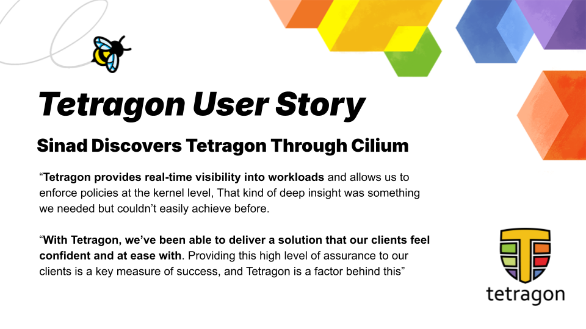

_April 25th, 2025_

_Author: Paul Arah, Isovalent@Cisco_

**Challenge**

SINAD, a company specializing in Cloud, DevOps, and Kubernetes, with a focus on making Kubernetes management seamless, provides consulting and in-house solutions to help clients optimize their cloud-native infrastructure. Their flagship product, EzyKube, simplifies Kubernetes operations. However, they also knew that customers were looking for granular control over security and observability while maintaining ease of use.

SINAD identified a key pain point among its target clients: The need for granular control over their data and operations, with customizable options for observability and security. SINAD sought a solution to this challenge while providing robust observability and security capabilities. They needed a tool that could integrate seamlessly with their Kubernetes-focused product, EzyKube, and offer real-time insights and policy enforcement.

**Solution**

The SINAD team discovered Tetragon through Cilium, which they already used for Kubernetes networking. They chose Tetragon for security observability and runtime enforcement capabilities. KubeKnight, one key component of the EzyKube platform responsible for security and observability, integrates Tetragon to deploy customizable security policies, enabling real-time monitoring and enforcement. With Tetragon, SINAD team can deploy policies covering a wide range of security and observability use cases for its organization and target clients.

**Impact**

Using Tetragon’s monitoring and enforcement capabilities, SINAD is able to effectively observe and secure its client’s environments and workloads. Tetragon has enabled SINAD to offer its clients a wide array of benefits, such as deep visibility into workloads, network traffic, and file integrity while maintaining fine-tuned control over security policies, leading to increased trust in SINAD’s solutions. Tetragon’s unique efficiency and ease of use empowers SINAD to equip organizations to maximize their return on investment in Kubernetes and cloud native technologies. Integrating Tetragon into the EzyKube platform also helps teams streamline compliance, making it easier to meet regulatory requirements. In summary, Tetragon enables SINAD’s customers to focus on security outcomes rather than infrastructure challenges.

## Simplifying Security and Observability for Kubernetes

SINAD was founded with a mission to make Kubernetes easier to manage, providing consulting services and developing in-house solutions like EzyKube, their flagship Kubernetes management platform. From the outset, SINAD wanted to provide deeper control over observability and security capabilities.

eBPF offered the visibility and enforcement capabilities SINAD needed, but using it directly was too complex and resource-intensive. _“We knew eBPF was the ideal solution for our security and observability needs,”_ explained Arezki OUHENIA, co-founder of SINAD. _“But managing maps, using helpers, and writing safe kernel code is extremely complex. It’s the kernel after all.”_

The challenge of using eBPF directly extended beyond the scope and specialty of the SINAD team. A tool that required manual eBPF programming or kernel modifications would be impractical. “

## Discovering Tetragon Through Cilium

Initially, SINAD wasn’t aware of Tetragon. When they discovered Tetragon's runtime security observability capabilities, the team had already been using Cilium for Kubernetes networking. Arezki OUHENIA recalled, _“At first, we didn’t know about Tetragon. We found it through using Cilium, and it turned out to be exactly what we needed.”_

The powerful and flexible abstraction Tetragon provides on top of eBPF eliminates the need for the SINAD team to write eBPF programs directly for the EzyKube platform while still providing all the immense benefits and flexibility eBPF brings to cloud native security. Tetragon made it easy for SINAD to leverage eBPF for observability and security without requiring deep eBPF or kernel expertise from the team. Arezki, highlighted that Tetragon’s ability to simplify eBPF was a game changer. _“Rather than dealing with the complexities of writing eBPF programs, we wanted to focus on delivering value for our clients, and we needed a tool that made eBPF easy to use. To SINAD, Tetragon is eBPF made simple. It provides precise observability and efficient security, exactly what we needed.”_

The simplicity of collecting various security significant events with Tetragon meant that the SINAD team could be as broad or granular as possible with the data they collected depending on the use case. In Arezki’s words: _“Tetragon gave us the flexibility to decide what data we want to collect without enforcing any restrictions on us.” This flexibility empowered SINAD Team to customize their solution to the varying needs and requirements of their target clients._

## Real-Time Observability Without Overhead

Tetragon’s efficiency and lightweight design were also major selling points. Unlike many, it didn’t introduce unnecessary performance overhead. _“Tetragon provides real-time visibility into workloads and allows us to enforce policies at the kernel level,”_ Arezki OUHENIA explained. _“That kind of deep insight was something we needed but couldn’t easily achieve before.”_

Another key advantage was network observability. _“Being able to track and enforce network policies in real time without introducing latency is crucial,”_ Arezki OUHENIA noted. Tetragon’s fine-grained controls offer several capabilities, for example, they enable SINAD to monitor live production sessions, promptly detect unauthorized network connections, and log critical file modifications in real time.

## Building a Tetragon Enabled Platform

Tetragon is the underlying driver of KubeKnight, the component of the EzyKube platform responsible for observability and security. KubeKnight integrates with Tetragon to provide fine-grained monitoring, runtime enforcement, and security observability. This allowed SINAD to address use cases such as file integrity monitoring, network observability, and privilege escalation detection.

_“Tetragon enables us to provide deep insights, visibility, and control,”_ Arezki OUHENIA explained. _“With Tetragon, we’ve been able to deliver a solution that our clients feel confident and at ease with. Providing this high level of assurance to our clients is a key measure of success, and Tetragon is behind this.”_

One of KubeKnight’s key features is enforcement. Tetragon enables SINAD to block security violations in real time. “Tetragon allows us to block activities at runtime, preventing misconfigurations or malicious actions before they cause damage.”

By integrating Tetragon into EzyKube, SINAD streamlined compliance efforts, which is core to their offering.

## Future Plans

SINAD plans to expand its use of Tetragon within EzyKube by introducing more user-friendly, easily accessible Kubernetes and cloud computing capabilities.

_“Tetragon stands as a powerhouse within EzyKube, delivering real-time enforcement, deep observability, and streamlined security; Maximizing return on investment (ROI) while reducing operational complexity,”_ said the co-founder of SINAD, Arezki OUHENIA
