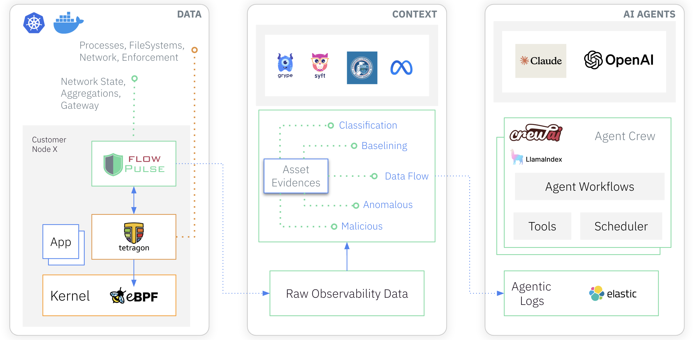

_May 15th, 2025_

_Authors: Himal Kumar, Bhaskar Dutta, Arman Pashamokhtari @CanopusAI.com_

## Overview

Canopus, a cloud-native cybersecurity company, faced the challenge of managing container vulnerabilities across a complex hybrid cloud environment. By leveraging eBPF-powered observability from Tetragon and autonomous workflows using AI agents, Canopus significantly reduced security noise and enabled highly accurate runtime vulnerability prioritization. This transformation enhanced operational efficiency for small DevSecOps teams while strengthening security posture across hundreds of containers and multiple Kubernetes clusters.

## Challenge

Operating in a hybrid cloud infrastructure with development and production workloads, Canopus confronted several key challenges:

- **Alert Fatigue**: Traditional CI/CD vulnerability scanners flooded teams with alerts – often dozens per container – making it difficult for smaller security teams to identify and act on the most critical issues.
- **Lack of Runtime Context**: Static analysis tools failed to provide insight into whether vulnerabilities were actually exploitable in real-world scenarios.
- **Manual Processes**: Security insights required manual dashboard interaction, resulting in inefficient workflows and slower response times.

## Solution

Canopus developed a system called FlowPulse AI, which integrates eBPF telemetry from Tetragon with autonomous AI agent workflows. This system provides high-fidelity runtime data, contextual intelligence, and automated analysis to accurately prioritize actionable vulnerabilities.

**Key Components:**

- **Tetragon (eBPF-powered)**: Captures four “golden signals” of security observability – Network, Process, FileSystem, and Identity – at the kernel level.
- **Contextualization Engine**: Uses LLMs to classify container roles, and behavioural baselining algorithms to assess privileges, trace data flows, and correlate vulnerabilities to real-time usage.
- **Grype + Syft Integration**: Scans for static vulnerabilities and builds SBOMs to monitor actual use of vulnerable packages.
- **AI Agentic Workflow (CrewAI + Claude)**:
  - Funnels vulnerabilities from general to runtime-exploitable.
  - Assesses exposure using asset classification and network flow data.
  - Tracks remediation and change history.
  - Generates concise risk reports automatically.

## Results

- **100x Reduction in Immediate Action Items**: By filtering out non-exploitable vulnerabilities, Canopus cut down the number of alerts requiring immediate action by a factor of 100.
- **Faster Decision-Making**: AI-generated reports are delivered in one-to-two minutes, consuming about $0.13 to $0.23 per report.
- **Operational Efficiency**: Enabled a small security team to proactively manage a large, dynamic container environment.
- **Comprehensive Visibility**: Continuous monitoring delivers an always-current view of runtime behavior across infrastructure.

## Implementation

**High-fidelity data collection with Tetragon:**
FlowPulse uses high-fidelity eBPF telemetry from Tetragon to collect runtime events from the cloud-native infrastructure. Tetragon is an open-source CNCF project that enables extraction of four golden signals of security observability on Network, Processes, FileSystems and Identity, by configuring dynamic Tracing Policies.

**Data Contextualisation in real-time:**
FlowPulse takes a stream of events from Tetragon through its gRPC client, and processes them to generate various baseline and runtime profiles, such as process and network baselines, data flow patterns, run-time malicious evidences, vulnerability scans, and asset classifications. Key contextual factors that are used specifically for vulnerability prioritisation are:

- **Asset Classification**: FlowPulse leverages a local LLM (Llama) to classify each container based on its activity into its role, such as database, monitoring, or message queue.
- **Data Flows**: To assess risk, FlowPulse constructs network flows by processing network events and enriching them with contextual details such as src/dst containers and domain name. This is done using kprobes tcp_recvmsg & tcp_sendmsg. We additionally implement stateful tracking & aggregations to reduce the sheer volume of network events.
- **Privileges**: Some containers have elevated privileges that allow them to access and modify host resources. For example, the Linux NET_ADMIN capability enables containers to configure network interfaces and traffic control settings, while sharing host namespaces like PID grants direct access to host processes. FlowPulse detects privileged containers by analysing Tetragon’s runtime events and incorporates this information into its contextual data to further assess risk.
- **Static Vulnerabilities**: FlowPulse utilises Grype to scan container images running in monitored environments. Grype identifies vulnerabilities in installed software packages and provides metadata such as CVE ID, description, severity, package name, package type, installed version, and fixed version (if available). Since Grype’s vulnerability descriptions lack a standard format, we use the local Llama model to generate concise yet accurate summaries, ensuring that vulnerability data remains both informative and AI-friendly.
- **Runtime Vulnerabilities**: Static vulnerabilities do not indicate whether those vulnerabilities pose an active risk. A package becomes a real threat only if it is actively used by running processes. To determine this, FlowPulse uses Syft to generate a Software Bill of Materials (SBOM) for containers with vulnerable packages. The SBOM provides details on the location of installed software and the files associated with them. FlowPulse then dynamically updates Tetragon Tracing Policies to monitor processes that access vulnerable files. When a process (e.g., a Java application) loads a vulnerable package (e.g., Log4J), Tetragon generates an event containing both process details and the accessed file. FlowPulse then correlates this information with known vulnerabilities, adding critical runtime context that is essential for prioritising vulnerabilities.

**AI Agents Workflows**

Traditional cybersecurity tools rely heavily on dashboards and visual interfaces, requiring users to manually search through data, drill down, and write queries (e.g., SQL, KQL, SPL) to extract meaningful insights. With recent developments in AI Agents frameworks and LLM Models, we leverage an autonomous Agentic workflow to produce the final actionable report, while providing interactivity to the user.
FlowPulse utilizes the ReAct (Reason & Act) agentic framework from CrewAI to build out the workflow, and uses the Anthropic Claude LLM model for reasoning. The Agentic workflow consists of four main steps and is triggered whenever there is a change/update to the application environment:

- AI Agents first generate the severity funnel by filtering down vulnerabilities from Critical to Fixable to Privileged to RuntimeActive, significantly reducing the scope of investigation.
- Second, Agentic Crew assess risk by utilising asset classifications and network data flows to determine the exposure.
- Third, the crew correlates findings from previous runs to determine what has caused a new vulnerability to appear, or whether a previous alert has been actioned and fixed. This is done by correlating vector and summary indexes on the LLM generated reports.
- Finally, the Agents generate a concise context report outlining the scope of risk and a set of actions that require immediate attention.

The system also consists of a no-dashboard interactive UI using which the security teams can perform further investigative queries to understand the context better, or prompt the agents to generate reports for the next set of vulnerabilities having fixed all that were flagged.
The exact number of LLM calls per report is unpredictable, however, we observed that the crew invokes the underlying LLM approximately 10 times per report, with each report taking between one to two minutes to generate. LLM tokens consumption varies significantly, ranging from 30,000 to 60,000 tokens, which results in a cost of $0.13 to $0.23 USD per report.

## Why eBPF?

eBPF was chosen for its unparalleled ability to observe and act on runtime events directly in the kernel, capturing critical signals such as process, network, and filesystem activity with minimal overhead. This high-fidelity data is foundational to Canopus’s proactive security architecture and the effectiveness of its AI-driven workflows.

## Next Steps

Canopus is expanding its use of eBPF with Tetragon to develop a runtime threat detection system. This new system will: (a) Leverage behavioral evidence to detect anomalies and malicious activities; (b) Use AI agents to classify threats against the Kubernetes Threat Matrix; and (c) Enforce real-time policies (e.g., kill processes, block commands) directly in the kernel using Tetragon's enforcement features.
