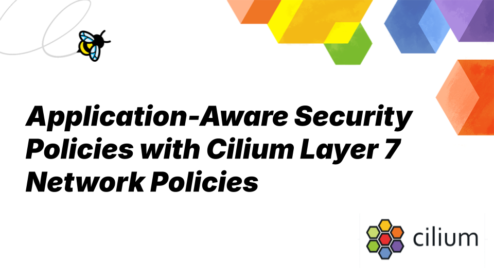
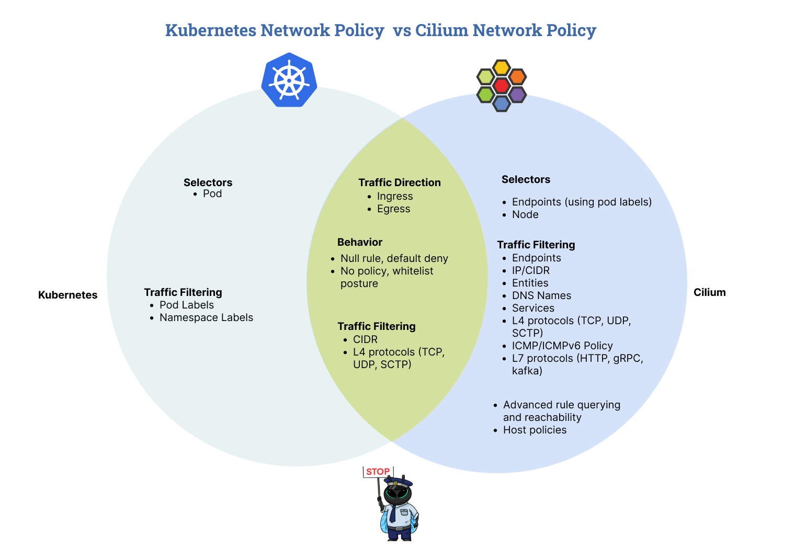

_May 20th, 2025_

_Author: Paul Arah, Isovalent@Cisco_

In Kubernetes, network policies define how pods can communicate with each other and other network endpoints. Network policies are a key building block for securing Kubernetes workloads. The standard Kubernetes network policy is limited to Layer 3 and Layer 4 of the OSI model. That means traffic can be filtered based on IP address, ports, and protocols, but not based on the actual application-layer content, such as HTTP methods or URLs. Cilium extends this model to support Layer 7 policies that understand and control traffic based on application-level protocol semantics. These include HTTP, Kafka, and DNS protocols. With L7 policies, we can enforce rules like “only allow GET /public HTTP requests” or “only permit Kafka produce access to a specific topic.” This level of specificity enables you to lock down workloads with precision without disrupting valid business logic.

In this blog post, we’ll explore how Cilium Layer 7 network policies work across HTTP, gRPC, Kafka, and DNS protocols. If you’re new to Cilium network policies, check out [Introduction to Cilium Network Policies](https://isovalent.com/blog/post/intro-to-cilium-network-policies/) and [Tutorial: Cilium Network Policy in Practice](https://isovalent.com/blog/post/tutorial-cilium-network-policy/) for a primer on Cilium network policies.

**Why Layer 7 Policies Matter**

In modern microservice architectures, services rarely communicate over a low-level protocol like TCP or UDP alone. Instead, they expose APIs over a high-level protocol such as HTTP or gRPC. These high-level protocols carry rich protocol-specific semantics such as HTTP methods, Kafka topics, or gRPC service names representing the true intent behind the application communication.

Standard Layer 3/4 network policies, which only understand IP addresses and ports, are oblivious to this communication intent. L7 network policies in Cilium address this gap by enabling policy verdicts based on the content and context of the traffic, not just its source or destination. This allows us to go beyond saying, “Service A can only talk to Service B on port 8080,” to expressing rules like, “Service A can only perform a POST to /login path” or “Service B can only consume from the order-events Kafka topic”. By aligning the policy enforcement with the API behaviour, Cilium Layer 7 policies ensure that services can only perform the specific operations they are designed for, eliminating implicit access to sensitive resources. This approach is consistent with zero-trust principles, where services are granted the least privileged access to resources. By providing fine-grained control over the exact HTTP methods, gRPC calls, and Kafka topics a service can make, L7 policies reduce the attack surface. Even if a pod is compromised, the attacker’s ability to abuse service-to-service communication is constrained at the protocol level.


## HTTP Policies\*\*

For HTTP, Cilium Layer 7 policies allow you to define specific methods, paths, host headers, and even required HTTP headers. These rules are enforced by a node-local Envoy proxy that inspects and authorizes traffic before it reaches the application.
A common use case is restricting access to specific REST endpoints. For example, you can allow only _GET /public_ requests to your app while blocking all other paths or methods. Here's an example:

```yaml
apiVersion: 'cilium.io/v2'
kind: CiliumNetworkPolicy
metadata:
  name: 'public-api-only'
spec:
  endpointSelector:
    matchLabels:
      app: service
  ingress:
    - fromEndpoints:
        - matchLabels:
            env: prod
      toPorts:
        - ports:
            - port: '80'
              protocol: TCP
          rules:
            http:
              - method: 'GET'
                path: '/public'
```

This policy ensures only HTTP GET requests to _/public_ are allowed on port 80, effectively restricting access to private API paths or other HTTP methods like _POST_ or _PUT_. Unlike Layer 3/4 policies, L7 violations return protocol-specific errors (e.g., HTTP 403), providing a better user experience.

## gRPC Policies

Now lets see how Cilium extends this model to gRPC where HTTP/2 semantics allow similar fine grained control. Because gRPC is built on top of HTTP/2, Cilium supports gRPC Layer 7 policy enforcement via its HTTP parser. This means you can apply HTTP-based rules to gRPC traffic, allowing you to control access to specific services and methods.
For example, you can restrict access to specific gRPC service methods _(like helloworld.Greeter/SayHello)_ using the HTTP path filter, since gRPC requests are encoded as HTTP/2 POST requests with paths like _/package.service/method_. Here's a sample policy:

```yaml
apiVersion: 'cilium.io/v2'
kind: CiliumNetworkPolicy
metadata:
  name: 'grpc-restrict-methods'
spec:
  endpointSelector:
    matchLabels:
      app: grpc-server
  ingress:
    - fromEndpoints:
        - matchLabels:
            app: grpc-client
      toPorts:
        - ports:
            - port: '50051'
              protocol: TCP
          rules:
            http:
              - method: 'POST'
                path: '/helloworld.Greeter/SayHello'
```

This ensures only authorized gRPC clients can call the _SayHello_ method on the _helloworld.Greeter_ service. All other gRPC methods, including potentially sensitive or admin-only endpoints, will be denied with a [gRPC status code](https://grpc.github.io/grpc/core/md_doc_statuscodes.html) 7 (PERMISSION_DENIED).

## Kafka Policies

Cilium also supports Kafka-specific Layer 7 rules, allowing us to define what Kafka operations are permitted at the Kafka protocol level. You can restrict access based on Kafka topics and roles, like _produce_ or _consume_, or match specific apiKeys for a request as per the Kafka protocol reference.
Here's how you can allow only the _produce_ role for specific Kafka topics:

```yaml
apiVersion: 'cilium.io/v2'
kind: CiliumNetworkPolicy
metadata:
  name: 'kafka-produce'
spec:
  endpointSelector:
    matchLabels:
      app: kafka
  ingress:
    - fromEndpoints:
        - matchLabels:
            app: empire-hq
      toPorts:
        - ports:
            - port: '9092'
              protocol: TCP
          rules:
            kafka:
              - role: 'produce'
                topic: 'empire-announce'
```

Kafka support is currently in beta, but is already powerful enough to enforce complex Kafka-aware security policies.

## DNS Policies

Cilium’s DNS-aware L7 policies allow you to filter DNS queries directly _(e.g., only allow queries to \*.cilium.io)_ and dynamically enforce L3 policies based on the resolved IPs.
Here’s an example policy that allows only DNS queries for specific domains and restricts egress traffic based on the returned IPs:

```yaml
apiVersion: cilium.io/v2
kind: CiliumNetworkPolicy
metadata:
  name: 'dns-filter'
spec:
  endpointSelector:
    matchLabels:
      any:org: alliance
  egress:
    - toEndpoints:
        - matchLabels:
            'k8s:io.kubernetes.pod.namespace': kube-system
            'k8s:k8s-app': kube-dns
      toPorts:
        - ports:
            - port: '53'
              protocol: ANY
          rules:
            dns:
              - matchPattern: '*.cilium.io'
    - toFQDNs:
        - matchPattern: '*.cilium.io'
      toPorts:
        - ports:
            - port: '443'
              protocol: TCP
```

This combination of DNS query control and dynamic IP resolution ensures your applications only communicate with known and verified domains, reducing the risk of data exfiltration to malicious endpoints.

## Conclusion

Cilium’s Layer 7 network policies give Kubernetes operators powerful, application-aware security controls that go far beyond the capabilities of IP and port-based network policies. L7 policies enable precise, protocol security control that is aligned with how applications actually communicate. In this post, we explored Cilium Layer 7 network policies across HTTP, gRPC, Kafka, and DNS; with some base examples of policy enforcement. As Kubernetes environments mature, adopting L7-aware security polices becomes less of a “nice to have” and more of a foundational requirement for zero-trust architectures.

If you have questions or feedback, reach out via the network policy channel in the [Cilium Slack](https://slack.cilium.io).

## Additional Resources

- [Securing a Kafka Cluster - Cilium docs](https://docs.cilium.io/en/stable/security/kafka/)
- [Securing gRPC - Cilium docs](https://docs.cilium.io/en/stable/security/grpc/)
- [eCHO Episode 180: Enforcing Kafka-aware Security Policies with Cilium](https://www.youtube.com/watch?v=IIeUIcwwhmE)
- [Cloud Native Live: Using Cilium to enforce gRPC-aware security policies](https://www.youtube.com/watch?v=00b1KN3141k&t=1s)
