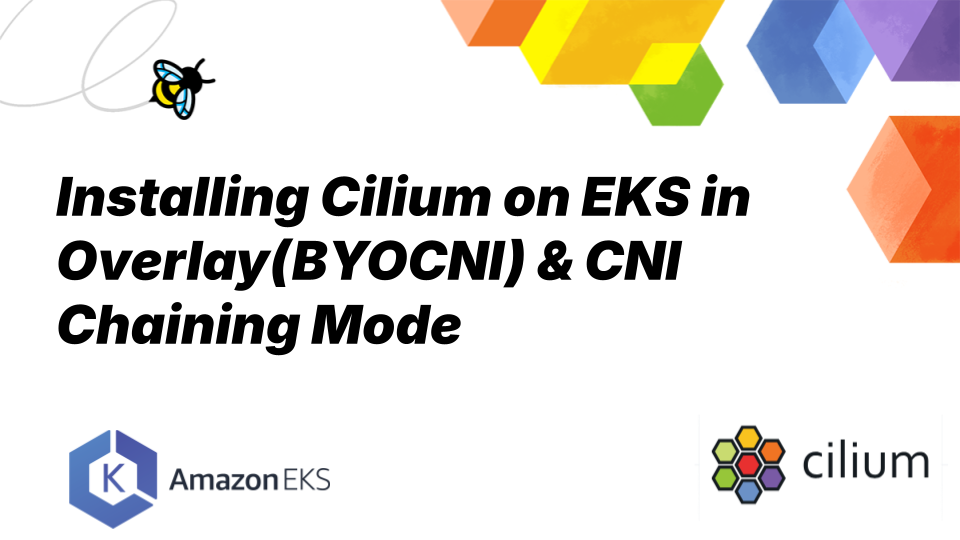
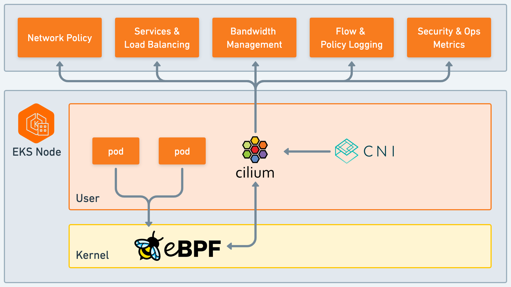

_June 19th, 2025_

_Author: Paul Arah, Isovalent@Cisco_

## Installing Cilium on EKS in Overlay(BYOCNI) and CNI Chaining Mode

In the first part of this EKS series, we covered setting up an EKS cluster and installing Cilium in ENI mode.
In this second and last of the EKS series, we’ll cover installing Cilium in overlay mode and CNI chaining mode.

## Installing Cilium on EKS in CNI chaining mode

Installing Cilium in different modes follows a similar process. The main distinction lies in whether the AWS VPC CNI is disabled and Helm flags used during installation. For brevity sake, I'll skip certain repetitive steps in the installation process with the assumption that you've read the [previous blog post](https://cilium.io/blog/2025/06/19/eks-eni-install/) in this series, or can refer back to it as needed.

## Prerequisites

The following prerequisites need to be taken into account:

- An active AWS Account
- Install [kubectl](https://kubernetes.io/releases/download/#kubectl), [Helm](https://helm.sh/docs/intro/install/), [eksctl](https://docs.aws.amazon.com/eks/latest/userguide/setting-up.html), [awscli](https://docs.aws.amazon.com/cli/latest/userguide/getting-started-install.html), and [Cilium CLI](https://docs.cilium.io/en/stable/gettingstarted/k8s-install-default/#install-the-cilium-cli)

## Creating our EKS cluster

```yaml
apiVersion: eksctl.io/v1alpha5
kind: ClusterConfig
metadata:
  name: cluster1
  region: us-east-1
  version: '1.30'
iam:
  withOIDC: true
addonsConfig:
  disableDefaultAddons: true
addons:
  - name: coredns
  - name: vpc-cni
```

Notice that in the cluster config file, the AWS VPC CNI has been added to the list of add-ons with which we create the cluster. This is because in CNI chaining mode, we want both the AWS VPC CNI and Cilium present in the cluster as opposed to ENI mode, where we entirely remove the AWS VPC CNI.

- Using eksctl, create the cluster.

```
eksctl create cluster -f cilium-eks-config.yaml
```

- Since we have no node group yet, there will be no nodes in our cluster, and the pods will be stuck in a pending state.

````shell
kubectl get pod -n kube-system

NAME                      READY   STATUS    RESTARTS   AGE
coredns-c7bbdfbb8-j2wdg   0/1     Pending   0          2m24s
coredns-c7bbdfbb8-mcgt5   0/1     Pending   0          2m24s

- Next, we need to install Cilium in our cluster. We’ll do this using Helm. But first, we need to grab the value of our Kubernetes service host by running the command below:

```shell
kubectl cluster-info

Kubernetes control plane is running at https://xxxxxxxxxxxxxxxxxxxx.yyy.eu-west-2.eks.amazonaws.com
CoreDNS is running at https://xxxxxxxxxxxxxxx.gr7.eu-west-2.eks.amazonaws.com/api/v1/namespaces/kube-system/services/kube-dns:dns/proxy
````

- Up next, we install Cilium using Helm with the command below

```shell
helm repo add cilium https://helm.cilium.io/
helm repo update
helm install cilium cilium/cilium --version 1.17.5 \
  --namespace kube-system \
  --set cni.chainingMode=aws-cni \
  --set cni.exclusive=false \
  --set enableIPv4Masquerade=false \
  --set routingMode=native\
  --set k8sServiceHost=xxxxxxxxxxxxxx.gr7.eu-west-2.eks.amazonaws.com\
  --set k8sServicePort=443

```

Notice we're installing Cilium with a different set of flags? So what these flags do:

| Helm Flag                           | Description                                                                                                                                     |
| ----------------------------------- | ----------------------------------------------------------------------------------------------------------------------------------------------- |
| `--namespace kube-system`           | Specifies the Kubernetes namespace where Cilium will be installed.                                                                              |
| `--set cni.chainingMode=aws-cni`    | Sets the CNI chaining mode to `aws-cni`. This allows Cilium to integrate with the AWS CNI plugin.                                               |
| `--set cni.exclusive=false`         | Sets the CNI exclusive mode to false, meaning Cilium will not be the only CNI plugin and can coexist with other CNI plugins.                    |
| `--set enableIPv4Masquerade=false`  | Disables IPv4 masquerading. This means packets exiting the cluster will not have their source IP addresses translated to the node's IP address. |
| `--set routingMode=native`          | Enables native routing mode. This mode does not rely on encapsulation (e.g., VXLAN or Geneve) for routing packets between nodes.                |
| `--set endpointRoutes.enabled=true` | Enables endpoint routes. This allows Cilium to manage routing at the endpoint level, creating more specific routes for the network traffic.     |

- Next, we create a corresponding node group for our cluster.

```yaml
apiVersion: eksctl.io/v1alpha5
kind: ClusterConfig

metadata:
  name: cluster1
  region: eu-west-2

managedNodeGroups:
  - name: ng-1
    desiredCapacity: 2
    privateNetworking: true
```

To create the node group, run the command below

```
eksctl create nodegroup -f nodegroup.yaml
```

- Afterwards, we can check the status of the nodes to ensure that they are in a ready state.

```shell
kubectl get nodes


NAME                                            STATUS   ROLES    AGE     VERSION
ip-192-168-125-58.eu-west-2.compute.internal    Ready    <none>   3h25m   v1.30.11-eks-473151a
ip-192-168-128-147.eu-west-2.compute.internal   Ready    <none>   3h25m   v1.30.11-eks-473151a

- Validate health check: cilium-health is a tool available in Cilium that provides visibility into the overall health of the cluster’s networking and connectivity. You can check node-to-node health with cilium-health status:

```

kubectl -n kube-system exec ds/cilium -- cilium status

````

- Additionally, you can run the connectivity tests to ensure your installation works properly.

## Installing Cilium on EKS in BYOCNI or Overlay Mode

BYOCNI mode ("Bring your own CNI"), or overlay, creates an overlay network for pods using UDP-based encapsulation protocols such as VXLAN or Geneve. This installation mode has the advantage of being independent of pod network sizing/IP addressing limitations of AWS ENI.

The steps for Cilium in overlay mode is quite similar. We create a cluster with the AWS VPC CNI disabled and then install Cilium with right set of helm flags.

- To get started, we’ll create a ClusterConfig file. In the file below, we’ve disabled kube-proxy and AWS VPC CNI.

```yaml
apiVersion: eksctl.io/v1alpha5
kind: ClusterConfig

metadata:
  name: cluster1
  region: eu-west-2
  version: '1.30'
addonsConfig:
  disableDefaultAddons: true
addons:
  - name: coredns
````

Notice this time our cluster config file doesn’t include the AWS VPC CNI or kube-proxy add-on.

- Using eksctl, create the cluster.

```shell
eksctl create cluster -f cilium-eks-config.yaml
```

We need to grab the value of our Kubernetes service host by running the command below:

```shell
kubectl cluster-info

Kubernetes control plane is running at https://xxxxxxxxxxxxxxxxxxxx.yyy.eu-west-2.eks.amazonaws.com
CoreDNS is running at https://xxxxxxxxxxxxxxx.gr7.eu-west-2.eks.amazonaws.com/api/v1/namespaces/kube-system/services/kube-dns:dns/proxy
```

Up next, we install Cilium using Helm with the command below

```shell
helm repo add cilium https://helm.cilium.io/
helm repo update
helm install cilium cilium/cilium --version 1.17.5 \
  --namespace kube-system \
  --set egressMasqueradeInterfaces=eth0\
  --set k8sServiceHost=xxxxxxxxxxxxxxxxxxxxxx.gr7.eu-west-2.eks.amazonaws.com\
  --set k8sServicePort=443
```

Next, we create a corresponding node group for our cluster.

```yaml
apiVersion: eksctl.io/v1alpha5
kind: ClusterConfig
metadata:
  name: cluster1
  region: eu-west-2
managedNodeGroups:
  - name: ng-1
    desiredCapacity: 2
    privateNetworking: true
```

To create the node group, run the command below

```yaml
eksctl create nodegroup -f nodegroup.yaml
```

- Afterwards, we can check the status of the nodes to ensure that they are in a ready state, use the Cilium health tool and connectivity tests to validate our installation.

## A Primer on Encapsulation vs Native/Direct Routing in Cilium

Throughout this series, we’ve explored different ways to install Cilium in an EKS cluster. To better understand the trade-offs between these methods and help determine which one is right for you, it's important to examine a core concept in Cilium: routing.

Cilium supports two primary networking modes for routing traffic between Kubernetes nodes: encapsulation and native routing each with its own strengths and drawbacks.

Encapsulation uses overlay networks like VXLAN or Geneve to tunnel traffic between nodes, forming a mesh of virtual paths. This simplifies setup, avoids IP conflicts, and works well in complex or multi-cloud environments. However, it comes with performance overhead and potential [maximum transfer unit(MTU)](https://docs.cilium.io/en/stable/network/concepts/routing/) issues due to the added packet headers.

Native routing, on the other hand, skips tunneling entirely and relies on the underlying network to route PodCIDRs directly. This results in better performance and eliminates MTU concerns, but it requires a network that is aware of all pod IPs typically achievable in on-prem setups or cloud environments.

## Is AWS ENI is considered a form of native routing in Cilium?



Yes! AWS ENI is implemented via a specialized Cilium datapath optimized for AWS VPC’s native capabilities. Cilium delegates packet forwarding to the underlying network (or routing layer) rather than using encapsulation like VXLAN or Geneve. AWS ENI fits this model because Pod IPs are directly routable within the AWS VPC, they are allocated from the ENI IP ranges that are natively integrated into the AWS network. The AWS VPC acts as the native network that routes packets between ENIs across nodes. This model simplifies communication of pod traffic within VPCs and avoids the need for SNAT.

## Conclusion

In this two-part series, we explored how to deploy Cilium on EKS using different networking modes—starting with ENI mode, and now wrapping up with overlay (BYOCNI) and CNI chaining modes. Each mode offers distinct advantages depending on your infrastructure needs. As you evaluate which deployment mode best fits your environment, understanding the trade-offs between encapsulation and native routing helps you make informed decisions that align with your goals on EKS.

## Additional Resources

- [eCHO Episode 106: Live Migration to Cilium in AWS](https://www.youtube.com/watch?v=kurMo3r4Ol4)
- [Life of a packet with Cilium in EKS in CNI chain mode](https://www.youtube.com/watch?v=A91iQS0F9Ug)
- [AWS VPC CNI plugin - Cilium Docs](https://docs.cilium.io/en/latest/installation/cni-chaining-aws-cni/)
- [AWS ENI - Cilium Docs](https://docs.cilium.io/en/latest/network/concepts/routing/#aws-eni-datapath)
- [Routing - Cilium Docs](https://docs.cilium.io/en/latest/network/concepts/routing/#aws-eni-datapath)
- [Helm Reference](https://docs.cilium.io/en/stable/helm-reference/)
  
