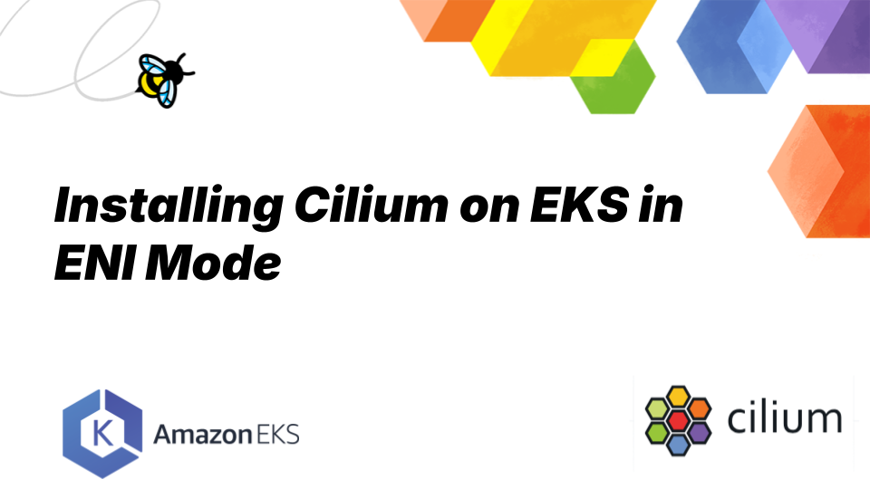
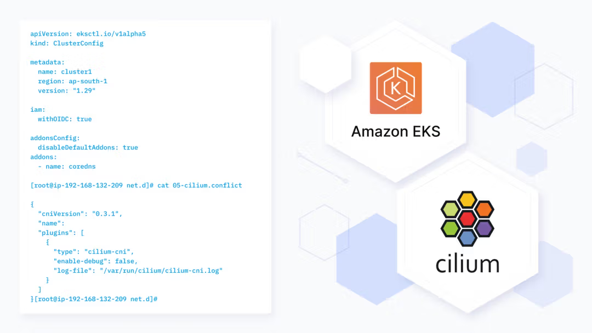

**_June 19th, 2025_**

**_Author: Paul Arah, Isovalent@Cisco_**

## Installing Cilium on EKS in ENI Mode

Amazon EKS is one of the most widely used managed Kubernetes services, chosen by many teams to offload the complexity of cluster management. Deploying Cilium on EKS unlocks powerful networking, security, and observability capabilities that go far beyond the default setup.
In this blog post series, we’ll explore the different ways to install Cilium on Amazon EKS. This first post focuses on deploying and configuring Cilium in ENI mode.

## Why Cilium on EKS?

EKS provides a managed Kubernetes control plane backed by AWS scalable infrastructure. Since Kubernetes doesn't include a native network interface, networking plugins like Cilium and the default AWS VPC CNI provide this functionality. Cilium elevates EKS networking by offering a consistent, high-performance cloud native experience. Cilium seamlessly integrates with AWS's software-defined networking (SDN) while adding eBPF-based policy enforcement, advanced observability, multi-cluster capabilities, service mesh functionalities, all with superior performance. It is also noteworthy to mention that Cilium is the default built-in networking addon for EKS-Anywhere.


## What is ENI Mode?

EKS clusters by default come with a set of networking add-ons, including Amazon VPC CNI, CoreDNS, and Kube-Proxy. These add-ons provide critical functionality that enables pod and service operations. Installing Cilium in ENI mode is the recommended installation method for Amazon EKS clusters. When running in ENI mode, Cilium manages ENIs and IP address allocation in place of the Amazon VPC CNI plugin. This method is highly performant, as it eliminates the need for overlay encapsulation or NAT.

## Prerequisites

The following prerequisites need to be taken into account:

- An active AWS Account
- Install [kubectl](https://kubernetes.io/releases/download/#kubectl), [Helm](https://helm.sh/docs/intro/install/), [eksctl](https://docs.aws.amazon.com/eks/latest/userguide/setting-up.html), [awscli](https://docs.aws.amazon.com/cli/latest/userguide/getting-started-install.html), and [Cilium CLI](https://docs.cilium.io/en/stable/gettingstarted/k8s-install-default/#install-the-cilium-cli)

## Creating our EKS cluster

When using Cilium in EKS, to avoid conflicting behavior with the default networking add-ons, the default networking add-ons have to be disabled. There are generally two ways to achieve this: The first way is to create the cluster with the default networking add-ons and then delete or prevent these add-ons from running. In July 2024, [AWS announced](https://aws.amazon.com/about-aws/whats-new/2024/06/amazon-eks-cluster-creation-flexibility-networking-add-ons/) the ability to create EKS clusters without the default networking add-ons, and this is the approach we’ll be using in the tutorial.

- To get started, we’ll create a ClusterConfig file. In the file below, we’ve disabled kube-proxy and AWS VPC CNI.

```yaml
apiVersion: eksctl.io/v1alpha5
kind: ClusterConfig

metadata:
  name: cluster1
  region: eu-west-2
  version: '1.30'

addonsConfig:
  disableDefaultAddons: true
addons:
  - name: coredns
```

- Using eksctl, create the cluster.

```shell
eksctl create cluster -f cilium-eks-config.yaml
```

- Check the status of the pods; the core-dns pods should be running in a pending state. This is because we currently do not have a CNI in the cluster.

## Installing and Configuring Cilium

Next, we need to install Cilium in our cluster. We’ll do this using Helm.

- But first, we need to grab the value of our Kubernetes service host by running the command below:

```shell
kubectl cluster-info

Kubernetes control plane is running at https://xxxxxxxxxxxxxxxxxxxx.yyy.eu-west-2.eks.amazonaws.com
CoreDNS is running at https://xxxxxxxxxxxxxxx.gr7.eu-west-2.eks.amazonaws.com/api/v1/namespaces/kube-system/services/kube-dns:dns/proxy
```

- Up next, we install Cilium using Helm with the command below

```shell
helm install cilium cilium/cilium --version 1.17.4 \
  --namespace kube-system \
  --set eni.enabled=true \
  --set ipam.mode=eni \
  --set egressMasqueradeInterfaces=eth+ \
  --set routingMode=native\
  --set kubeProxyReplacement=true\
  --set k8sServiceHost=xxxxxxxxxxxxxxxxx.yyy.eu-west-2.eks.amazonaws.com\
  --set k8sServicePort=443
```

**N/B**: _You should remove the “https://” from the Kubernetes services host value before including it in the value of the k8sServiceHost flag. Failure to do so would result in the Cilium agent crashing._

What these flags do:

| Option                                    | Description                                                                                                   |
| ----------------------------------------- | ------------------------------------------------------------------------------------------------------------- |
| `--set eni.enabled=true`                  | Enables the Elastic Network Interface (ENI) mode, which is specific to AWS environments.                      |
| `--set ipam.mode=eni`                     | Sets the IP Address Management (IPAM) mode to ENI, which allows Cilium to manage IP addresses.                |
| `--set egressMasqueradeInterfaces=eth0`   | Specifies the interface (`eth0`) on which egress masquerading (NAT) should be performed.                      |
| `--set routingMode=native`                | Configures Cilium to use native routing instead of encapsulation (e.g., VXLAN or Geneve).                     |
| `--set kubeProxyReplacement=true`         | Enables kube-proxy replacement, allowing Cilium to take over service load balancing and networking functions. |
| `--set k8sServiceHost=${API_SERVER_IP}`   | Sets the IP address of the Kubernetes API server.                                                             |
| `--set k8sServicePort=${API_SERVER_PORT}` | Sets the port of the Kubernetes API server.                                                                   |

- Next, we create a corresponding node group for our cluster.

```yaml
apiVersion: eksctl.io/v1alpha5
kind: ClusterConfig

metadata:
  name: cluster1
  region: eu-west-2

managedNodeGroups:
  - name: ng-1
    iam:
      attachPolicyARNs:
        - arn:aws:iam::aws:policy/AmazonEKSWorkerNodePolicy
        - arn:aws:iam::aws:policy/AmazonEKS_CNI_Policy
        - arn:aws:iam::aws:policy/AmazonEC2ContainerRegistryReadOnly
        - arn:aws:iam::aws:policy/AmazonSSMManagedInstanceCore
    desiredCapacity: 2
    privateNetworking: true
```

**N/B**: _You might be curious why we did not create the EKS cluster with a managed node group in one go. Creating EKS clusters and corresponding node groups with add-ons disabled is currently not supported. This is why we created the cluster and subsequently added the node group._

To create the node group, run the command below

```yaml
eksctl create nodegroup -f nodegroup.yaml
```

- Afterwards, we can check the status of the nodes to ensure that they are in a ready state.

```
kubectl get nodes


NAME                                            STATUS   ROLES    AGE     VERSION
ip-192-168-125-58.eu-west-2.compute.internal    Ready    <none>   3h25m   v1.30.11-eks-473151a
ip-192-168-128-147.eu-west-2.compute.internal   Ready    <none>   3h25m   v1.30.11-eks-473151a

```

- Check if any AWS daemonsets are present in the cluster. You should see only the cilium and cilium-envoy daemonset

```
kubectl get ds -A

NAMESPACE     NAME           DESIRED   CURRENT   READY   UP-TO-DATE   AVAILABLE   NODE SELECTOR            AGE
kube-system   cilium         2         2         2       2            2           kubernetes.io/os=linux   5m11s
kube-system   cilium-envoy   2         2         2       2            2           kubernetes.io/os=linux   5m11s

```

- Validate health check
  cilium-health is a tool available in Cilium that provides visibility into the overall health of the cluster’s networking and connectivity. You can check node-to-node health with cilium-health status:

```
kubectl -n kube-system exec ds/cilium -- cilium status

Defaulted container "cilium-agent" out of: cilium-agent, config (init), mount-cgroup (init), apply-sysctl-overwrites (init), mount-bpf-fs (init), clean-cilium-state (init), install-cni-binaries (init)
E0618 14:07:29.226958   97532 websocket.go:296] Unknown stream id 1, discarding message
KVStore:                 Disabled
Kubernetes:              Ok         1.30+ (v1.30.13-eks-5d4a308) [linux/amd64]
Kubernetes APIs:         ["EndpointSliceOrEndpoint", "cilium/v2::CiliumClusterwideNetworkPolicy", "cilium/v2::CiliumEndpoint", "cilium/v2::CiliumNetworkPolicy", "cilium/v2::CiliumNode", "cilium/v2alpha1::CiliumCIDRGroup", "core/v1::Namespace", "core/v1::Pods", "core/v1::Service", "networking.k8s.io/v1::NetworkPolicy"]
KubeProxyReplacement:    True   [ens5   192.168.190.239 fe80::de:f7ff:fe5a:d4ad (Direct Routing), ens6   192.168.186.8 fe80::62:48ff:fe8a:1133]
Host firewall:           Disabled
SRv6:                    Disabled
CNI Chaining:            none
CNI Config file:         successfully wrote CNI configuration file to /host/etc/cni/net.d/05-cilium.conflist
Cilium:                  Ok   1.17.4 (v1.17.4-55aecc0f)
NodeMonitor:             Listening for events on 2 CPUs with 64x4096 of shared memory
Cilium health daemon:    Ok
IPAM:                    IPv4: 4/12 allocated,
IPv4 BIG TCP:            Disabled
IPv6 BIG TCP:            Disabled
BandwidthManager:        Disabled
Routing:                 Network: Native   Host: Legacy
Attach Mode:             Legacy TC
Device Mode:             veth
Masquerading:            IPTables [IPv4: Enabled, IPv6: Disabled]
Controller Status:       32/32 healthy
Proxy Status:            OK, ip 192.168.167.197, 0 redirects active on ports 10000-20000, Envoy: external
Global Identity Range:   min 256, max 65535
Hubble:                  Ok              Current/Max Flows: 1184/4095 (28.91%), Flows/s: 8.84   Metrics: Disabled
Encryption:              Disabled
Cluster health:          2/2 reachable   (2025-06-18T13:06:28Z)
Name                     IP              Node   Endpoints
Modules Health:          Stopped(0) Degraded(0) OK(59)

```

- Cilium Connectivity Test (Optional)

The Cilium connectivity test deploys a series of services and deployments, and CiliumNetworkPolicy will use various connectivity paths to connect. Connectivity paths include with and without service load-balancing and various network policy combinations.

```
cilium connectivity test

ℹ️  Monitor aggregation detected, will skip some flow validation steps
ℹ️  Skipping tests that require a node Without Cilium
⌛ [cluster1.eu-west-2.eksctl.io] Waiting for deployment cilium-test-1/client to become ready...
⌛ [cluster1.eu-west-2.eksctl.io] Waiting for deployment cilium-test-1/client2 to become ready...
⌛ [cluster1.eu-west-2.eksctl.io] Waiting for deployment cilium-test-1/echo-same-node to become ready...
⌛ [cluster1.eu-west-2.eksctl.io] Waiting for deployment cilium-test-1/client3 to become ready...
⌛ [cluster1.eu-west-2.eksctl.io] Waiting for deployment cilium-test-1/echo-other-node to become ready...
⌛ [cluster1.eu-west-2.eksctl.io] Waiting for pod cilium-test-1/client2-57cf4468f-ncgvj to reach DNS server on cilium-test-1/echo-same-node-ff6f76ccc-4km59 pod...
⌛ [cluster1.eu-west-2.eksctl.io] Waiting for pod cilium-test-1/client3-67f959dd9b-45k7d to reach DNS server on cilium-test-1/echo-same-node-ff6f76ccc-4km59 pod...
⌛ [cluster1.eu-west-2.eksctl.io] Waiting for pod cilium-test-1/client-7b7776c86b-l4wsc to reach DNS server on cilium-test-1/echo-same-node-ff6f76ccc-4km59 pod...
⌛ [cluster1.eu-west-2.eksctl.io] Waiting for pod cilium-test-1/client-7b7776c86b-l4wsc to reach DNS server on cilium-test-1/echo-other-node-6c497457bc-9vlq7 pod...
⌛ [cluster1.eu-west-2.eksctl.io] Waiting for pod cilium-test-1/client2-57cf4468f-ncgvj to reach DNS server on cilium-test-1/echo-other-node-6c497457bc-9vlq7 pod...
⌛ [cluster1.eu-west-2.eksctl.io] Waiting for pod cilium-test-1/client3-67f959dd9b-45k7d to reach DNS server on cilium-test-1/echo-other-node-6c497457bc-9vlq7 pod...
⌛ [cluster1.eu-west-2.eksctl.io] Waiting for pod cilium-test-1/client-7b7776c86b-l4wsc to reach default/kubernetes service...
⌛ [cluster1.eu-west-2.eksctl.io] Waiting for pod cilium-test-1/client2-57cf4468f-ncgvj to reach default/kubernetes service...
⌛ [cluster1.eu-west-2.eksctl.io] Waiting for pod cilium-test-1/client3-67f959dd9b-45k7d to reach default/kubernetes service...
⌛ [cluster1.eu-west-2.eksctl.io] Waiting for Service cilium-test-1/echo-other-node to become ready...
⌛ [cluster1.eu-west-2.eksctl.io] Waiting for Service cilium-test-1/echo-other-node to be synchronized by Cilium pod kube-system/cilium-fxr77
⌛ [cluster1.eu-west-2.eksctl.io] Waiting for Service cilium-test-1/echo-other-node to be synchronized by Cilium pod kube-system/cilium-mxfz7
⌛ [cluster1.eu-west-2.eksctl.io] Waiting for Service cilium-test-1/echo-same-node to become ready...
⌛ [cluster1.eu-west-2.eksctl.io] Waiting for Service cilium-test-1/echo-same-node to be synchronized by Cilium pod kube-system/cilium-fxr77
⌛ [cluster1.eu-west-2.eksctl.io] Waiting for Service cilium-test-1/echo-same-node to be synchronized by Cilium pod kube-system/cilium-mxfz7
⌛ [cluster1.eu-west-2.eksctl.io] Waiting for NodePort 192.168.130.253:30556 (cilium-test-1/echo-other-node) to become ready...
⌛ [cluster1.eu-west-2.eksctl.io] Waiting for NodePort 192.168.130.253:32358 (cilium-test-1/echo-same-node) to become ready...
⌛ [cluster1.eu-west-2.eksctl.io] Waiting for NodePort 192.168.190.239:30556 (cilium-test-1/echo-other-node) to become ready...
⌛ [cluster1.eu-west-2.eksctl.io] Waiting for NodePort 192.168.190.239:32358 (cilium-test-1/echo-same-node) to become ready...
⌛ [cluster1.eu-west-2.eksctl.io] Waiting for DaemonSet cilium-test-1/host-netns-non-cilium to become ready...
⌛ [cluster1.eu-west-2.eksctl.io] Waiting for DaemonSet cilium-test-1/host-netns to become ready...
ℹ️  Skipping IPCache check
🔭 Enabling Hubble telescope...
⚠️  Unable to contact Hubble Relay, disabling Hubble telescope and flow validation: rpc error: code = Unavailable desc = connection error: desc = "transport: Error while dialing: dial tcp [::1]:4245: connect: connection refused"
ℹ️  Expose Relay locally with:
   cilium hubble enable
   cilium hubble port-forward&
ℹ️  Cilium version: 1.17.4
🏃[cilium-test-1] Running 115 tests ...
[=] [cilium-test-1] Test [no-unexpected-packet-drops] [1/115]
..
[=] [cilium-test-1] Test [no-policies] [2/115]
.................................................
[=] [cilium-test-1] Skipping test [no-policies-from-outside] [3/115] (skipped by condition)
[=] [cilium-test-1] Test [no-policies-extra] [4/115]
............
[=] [cilium-test-1] Test [allow-all-except-world] [5/115]
........................
[=] [cilium-test-1] Test [client-ingress] [6/115]
......
[=] [cilium-test-1] Test [client-ingress-knp] [7/115]
......
[=] [cilium-test-1] Test [allow-all-with-metrics-check] [8/115]
......
[=] [cilium-test-1] Test [all-ingress-deny] [9/115]
............
[=] [cilium-test-1] Skipping test [all-ingress-deny-from-outside] [10/115] (skipped by condition)
[=] [cilium-test-1] Test [all-ingress-deny-knp] [11/115]
............
[=] [cilium-test-1] Test [all-egress-deny] [12/115]
........................
[=] [cilium-test-1] Test [all-egress-deny-knp] [13/115]
........................
[=] [cilium-test-1] Test [all-entities-deny] [14/115]
............
[=] [cilium-test-1] Test [cluster-entity] [15/115]
...
[=] [cilium-test-1] Skipping test [cluster-entity-multi-cluster] [16/115] (skipped by condition)
[=] [cilium-test-1] Test [host-entity-egress] [17/115]
......
[=] [cilium-test-1] Test [host-entity-ingress] [18/115]
....
[=] [cilium-test-1] Test [echo-ingress] [19/115]
......
[=] [cilium-test-1] Skipping test [echo-ingress-from-outside] [20/115] (skipped by condition)
[=] [cilium-test-1] Test [echo-ingress-knp] [21/115]
......
[=] [cilium-test-1] Test [client-ingress-icmp] [22/115]
......
[=] [cilium-test-1] Test [client-egress] [23/115]
......
[=] [cilium-test-1] Test [client-egress-knp] [24/115]
......
[=] [cilium-test-1] Test [client-egress-expression] [25/115]
......
[=] [cilium-test-1] Test [client-egress-expression-port-range] [26/115]
......
[=] [cilium-test-1] Test [client-egress-expression-knp] [27/115]
...E0618 14:50:03.068727   10146 websocket.go:296] Unknown stream id 1, discarding message
...
[=] [cilium-test-1] Test [client-egress-expression-knp-port-range] [28/115]
......
[=] [cilium-test-1] Test [client-with-service-account-egress-to-echo] [29/115]
......
[=] [cilium-test-1] Test [client-with-service-account-egress-to-echo-port-range] [30/115]
......
[=] [cilium-test-1] Test [client-egress-to-echo-service-account] [31/115]
......
[=] [cilium-test-1] Test [client-egress-to-echo-service-account-port-range] [32/115]
......
[=] [cilium-test-1] Test [to-entities-world] [33/115]
.........
[=] [cilium-test-1] Test [to-entities-world-port-range] [34/115]
.........
[=] [cilium-test-1] Test [to-cidr-external] [35/115]
......
[=] [cilium-test-1] Test [to-cidr-external-knp] [36/115]
......
[=] [cilium-test-1] Skipping test [seq-from-cidr-host-netns] [37/115] (skipped by condition)
[=] [cilium-test-1] Test [echo-ingress-from-other-client-deny] [38/115]
..........
[=] [cilium-test-1] Test [client-ingress-from-other-client-icmp-deny] [39/115]
............
[=] [cilium-test-1] Test [client-egress-to-echo-deny] [40/115]
............
[=] [cilium-test-1] Test [client-egress-to-echo-deny-port-range] [41/115]
............
[=] [cilium-test-1] Test [client-ingress-to-echo-named-port-deny] [42/115]
E0618 14:53:36.939961   10146 websocket.go:296] Unknown stream id 1, discarding message
....
[=] [cilium-test-1] Test [client-egress-to-echo-expression-deny] [43/115]
....
[=] [cilium-test-1] Test [client-egress-to-echo-expression-deny-port-range] [44/115]
....
[=] [cilium-test-1] Test [client-with-service-account-egress-to-echo-deny] [45/115]
....
[=] [cilium-test-1] Test [client-with-service-account-egress-to-echo-deny-port-range] [46/115]
....
[=] [cilium-test-1] Test [client-egress-to-echo-service-account-deny] [47/115]
..
[=] [cilium-test-1] Test [client-egress-to-echo-service-account-deny-port-range] [48/115]
..
[=] [cilium-test-1] Test [client-egress-to-cidr-deny] [49/115]
......
[=] [cilium-test-1] Test [client-egress-to-cidrgroup-deny] [50/115]
......
[=] [cilium-test-1] Test [client-egress-to-cidrgroup-deny-by-label] [51/115]
......
[=] [cilium-test-1] Test [client-egress-to-cidr-deny-default] [52/115]
......
[=] [cilium-test-1] Skipping test [clustermesh-endpointslice-sync] [53/115] (skipped by condition)
[=] [cilium-test-1] Test [health] [54/115]
..
[=] [cilium-test-1] Skipping test [north-south-loadbalancing] [55/115] (Feature node-without-cilium is disabled)
[=] [cilium-test-1] Test [pod-to-pod-encryption] [56/115]
.
[=] [cilium-test-1] Skipping test [pod-to-pod-with-l7-policy-encryption] [57/115] (Feature encryption-pod is disabled)
[=] [cilium-test-1] Skipping test [pod-to-pod-encryption-v2] [58/115] (skipped by condition)
[=] [cilium-test-1] Skipping test [pod-to-pod-with-l7-policy-encryption-v2] [59/115] (skipped by condition)
[=] [cilium-test-1] Test [node-to-node-encryption] [60/115]
...
[=] [cilium-test-1] Skipping test [seq-egress-gateway] [61/115] (skipped by condition)
[=] [cilium-test-1] Skipping test [egress-gateway-excluded-cidrs] [62/115] (Feature enable-ipv4-egress-gateway is disabled)
[=] [cilium-test-1] Skipping test [seq-egress-gateway-with-l7-policy] [63/115] (skipped by condition)
[=] [cilium-test-1] Skipping test [pod-to-node-cidrpolicy] [64/115] (Feature cidr-match-nodes is disabled)
[=] [cilium-test-1] Skipping test [north-south-loadbalancing-with-l7-policy] [65/115] (Feature node-without-cilium is disabled)
[=] [cilium-test-1] Skipping test [north-south-loadbalancing-with-l7-policy-port-range] [66/115] (Feature node-without-cilium is disabled)
[=] [cilium-test-1] Test [echo-ingress-l7] [67/115]
..................
[=] [cilium-test-1] Test [echo-ingress-l7-via-hostport] [68/115]
......
[=] [cilium-test-1] Test [echo-ingress-l7-named-port] [69/115]
..................
[=] [cilium-test-1] Test [client-egress-l7-method] [70/115]
..................
[=] [cilium-test-1] Test [client-egress-l7-method-port-range] [71/115]
.............E0618 14:59:09.879325   10146 websocket.go:296] Unknown stream id 1, discarding message
.....
[=] [cilium-test-1] Test [client-egress-l7] [72/115]
...............
[=] [cilium-test-1] Test [client-egress-l7-port-range] [73/115]
...............
[=] [cilium-test-1] Test [client-egress-l7-named-port] [74/115]
...............
[=] [cilium-test-1] Test [client-egress-tls-sni] [75/115]
.........
[=] [cilium-test-1] Test [client-egress-tls-sni-denied] [76/115]
.........
[=] [cilium-test-1] Test [client-egress-l7-tls-headers-sni] [77/115]
...
[=] [cilium-test-1] Test [client-egress-l7-tls-headers-other-sni] [78/115]
...
[=] [cilium-test-1] Test [client-egress-l7-set-header] [79/115]
......
[=] [cilium-test-1] Test [client-egress-l7-set-header-port-range] [80/115]
......
[=] [cilium-test-1] Skipping test [echo-ingress-auth-always-fail] [81/115] (Feature mutual-auth-spiffe is disabled)
[=] [cilium-test-1] Skipping test [echo-ingress-auth-always-fail-port-range] [82/115] (Feature mutual-auth-spiffe is disabled)
[=] [cilium-test-1] Skipping test [echo-ingress-mutual-auth-spiffe] [83/115] (Feature mutual-auth-spiffe is disabled)
[=] [cilium-test-1] Skipping test [echo-ingress-mutual-auth-spiffe-port-range] [84/115] (Feature mutual-auth-spiffe is disabled)
[=] [cilium-test-1] Skipping test [pod-to-ingress-service] [85/115] (Feature ingress-controller is disabled)
[=] [cilium-test-1] Skipping test [pod-to-ingress-service-allow-ingress-identity] [86/115] (Feature ingress-controller is disabled)
[=] [cilium-test-1] Skipping test [pod-to-ingress-service-deny-all] [87/115] (Feature ingress-controller is disabled)
[=] [cilium-test-1] Skipping test [pod-to-ingress-service-deny-backend-service] [88/115] (Feature ingress-controller is disabled)
[=] [cilium-test-1] Skipping test [pod-to-ingress-service-deny-ingress-identity] [89/115] (Feature ingress-controller is disabled)
[=] [cilium-test-1] Skipping test [pod-to-ingress-service-deny-source-egress-other-node] [90/115] (Feature ingress-controller is disabled)
[=] [cilium-test-1] Skipping test [outside-to-ingress-service] [91/115] (Feature ingress-controller is disabled)
[=] [cilium-test-1] Skipping test [outside-to-ingress-service-deny-all-ingress] [92/115] (Feature ingress-controller is disabled)
[=] [cilium-test-1] Skipping test [outside-to-ingress-service-deny-cidr] [93/115] (Feature ingress-controller is disabled)
[=] [cilium-test-1] Skipping test [outside-to-ingress-service-deny-world-identity] [94/115] (Feature ingress-controller is disabled)
[=] [cilium-test-1] Test [dns-only] [95/115]
...............
[=] [cilium-test-1] Test [to-fqdns] [96/115]
............
[=] [cilium-test-1] Skipping test [pod-to-controlplane-host] [97/115] (skipped by condition)
[=] [cilium-test-1] Skipping test [pod-to-k8s-on-controlplane] [98/115] (skipped by condition)
[=] [cilium-test-1] Skipping test [pod-to-controlplane-host-cidr] [99/115] (skipped by condition)
[=] [cilium-test-1] Skipping test [pod-to-k8s-on-controlplane-cidr] [100/115] (skipped by condition)
[=] [cilium-test-1] Skipping test [local-redirect-policy] [101/115] (Feature enable-local-redirect-policy is disabled)
[=] [cilium-test-1] Skipping test [local-redirect-policy-with-node-dns] [102/115] (skipped by condition)
[=] [cilium-test-1] Test [pod-to-pod-no-frag] [103/115]
.
[=] [cilium-test-1] Skipping test [seq-bgp-control-plane-v1] [104/115] (skipped by condition)
[=] [cilium-test-1] Skipping test [seq-bgp-control-plane-v2] [105/115] (skipped by condition)
[=] [cilium-test-1] Skipping test [multicast] [106/115] (skipped by condition)
[=] [cilium-test-1] Skipping test [strict-mode-encryption] [107/115] (skipped by condition)
[=] [cilium-test-1] Skipping test [strict-mode-encryption-v2] [108/115] (skipped by condition)
[=] [cilium-test-1] Skipping test [host-firewall-ingress] [109/115] (skipped by condition)
[=] [cilium-test-1] Skipping test [host-firewall-egress] [110/115] (skipped by condition)
[=] [cilium-test-1] Test [seq-client-egress-l7-tls-deny-without-headers] [111/115]
...
[=] [cilium-test-1] Test [seq-client-egress-l7-tls-headers] [112/115]
...
[=] [cilium-test-1] Test [seq-client-egress-l7-extra-tls-headers] [113/115]
......
[=] [cilium-test-1] Test [seq-client-egress-l7-tls-headers-port-range] [114/115]
...
[=] [cilium-test-1] Test [check-log-errors] [115/115]
..................

✅ [cilium-test-1] All 72 tests (630 actions) successful, 43 tests skipped, 0 scenarios skipped.

```

## Conclusion

In the first part of our series, we walked through the deployment of Cilium on Amazon EKS in ENI mode. This configuration offers native AWS networking performance while leveraging Cilium's powerful eBPF-based capabilities. From creating an EKS cluster with the default networking add-ons disabled to validating Cilium's health, you've now seen what it takes to get a clean, kube-proxy-free EKS cluster up and running with Cilium managing ENIs and IP allocation.

In the next part of this series, we'll cover how to install Cilium in overlay mode and explore CNI chaining, giving you more flexibility to integrate Cilium with existing CNIs or tailor your cluster's networking model to suit hybrid environments. Stay tuned!
