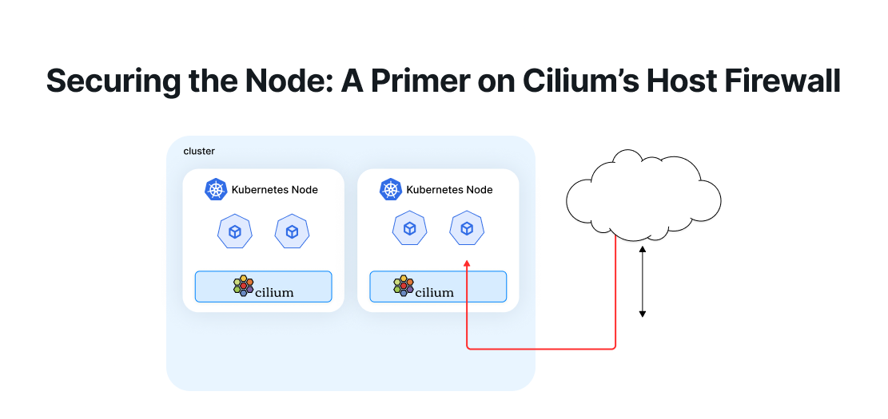
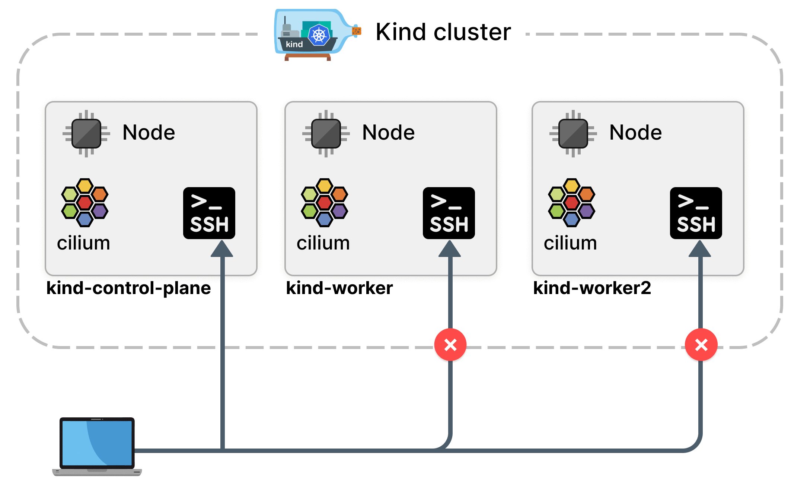

import authors from 'utils/author-data';

##### July 6th, 2025

##### Author: Paul Arah, Isovalent@Cisco

## 

When discussing Kubernetes network security, much of the attention focuses on pod-to-pod traffic, ingress controllers, and service meshes. But what about the underlying nodes themselves, the very foundation on which our workloads run? The attack surface area that Kubernetes nodes expose is vast, and if left unprotected, can become a golden ticket for malicious actors.

Cilium host firewall is built to lock down the host network namespace with precision, visibility, and control, extending the same familiar declarative Kubernetes network policy model to the underlying host. In this blog post, we’ll explore what Cilium Host Firewall is, how it works, and why it should be a core part of your Kubernetes security.

<a id="the-node-as-a-blind-spot"></a>

## The Node as a Blind Spot

Kubernetes native network policies don’t apply to host-level traffic. This means any communication that enters or leaves the host directly (for example, SSH, kubelet, or external monitoring agents) is largely invisible to traditional Kubernetes policy enforcement. While some firewalling is possible via firewalld or external systems, managing those rules is brittle and lacks integration with Kubernetes. At the core of it, this is the problem Cilium host firewall solves. Leveraging eBPF, Cilium introduces host firewalling directly into the fabric of the cluster.

<a id="how-cilium-host-firewall-works"></a>

## How Cilium’s Host Firewall Works

Cilium treats the node as a special type of endpoint with the label reserved:host. This lets us apply policies just like we would for pods, except these apply to traffic to and from the node(s) themselves. Cilium host firewall operates at the interface level. You can explicitly set which devices it attaches to (eth0, eth1, etc.), or let Cilium auto-detect them.



<a id="enabling-host-firewall"></a>

## Enabling Host Firewall

The most convenient way to try out Cilium’s host firewall while keeping the user experience close to that of a production cluster is to set up your Kubernetes environment using a tool that spins up virtual machines locally. This makes it easier to test SSH access, simulate real network interfaces, and apply node-level policies. My personal favourites are [Minikube](https://minikube.sigs.k8s.io/docs/) with the [virtualbox driver](https://minikube.sigs.k8s.io/docs/drivers/virtualbox/), or [k3s](https://k3s.io/) combined with [Multipass](https://canonical.com/multipass) for lightweight VM-based nodes that you can SSH into. We won’t dive into setting up a cluster for the sake of brevity. That said, you’re free to set up your cluster however you like, as long as it allows you to test Cilium in a way that includes host-level visibility and networking.

If you are installing Cilium via the Cilium CLI, you can enable host firewall with the flag below.

```shell
cilium install \
  --version 1.17.4 \
  --set hostFirewall.enabled=true \
  --set kubeProxyReplacement=true
```

Via Helm, you can also enable the host firewall like below.

```shell
helm install cilium ./cilium \
  --namespace kube-system \
  --set hostFirewall.enabled=true \
  --set devices='{eth0}'
```

Once Cilium has been deployed, it starts managing the selected interfaces and the host endpoint. You can verify the status with:

```shell
kubectl exec -n kube-system ds/cilium -- cilium-dbg status | grep 'Host firewall'
```

We can also verify that the Host Firewall feature is activated using the Cilium CLI:

```shell
cilium config view | grep host-firewall
```

To apply policies, first label the target node:

```shell
kubectl label node k8s1 node-access=ssh
```

This allows you to scope policies to specific nodes based on purpose or function (e.g., node-access=ssh, type=ingress-worker).

<a id="audit-mode"></a>

## Audit Mode

Before enforcing a new host policy, you can enable Policy Audit Mode. This mode logs what would have been dropped without actually enforcing the rules. It's an essential step to avoid self-inflicted outages such as accidentally cutting off access to the kube-apiserver or SSH.

```shell
    kexec cilium-dbg endpoint config $HOST_EP_ID PolicyAuditMode=Enabled
```

Monitor traffic verdicts with:

```shell
    kexec cilium-dbg monitor -t policy-verdict --related-to $HOST_EP_ID
```

This provides real-time insights into which flows would have been denied, letting you fine-tune policies before flipping the enforcement switch.

<a id="observe-network-traffic-with-hubble"></a>

## Observe Network Traffic with Hubble

Cilium assigns a special identity of “1” to the nodes in a cluster. We can use this identity to filter and observe the node’s network traffic.

```shell
    hubble observe --to-identity 1 --port 22 -f
```

<a id="writing-host-network-policies"></a>

## Writing Host Network Policies

Host network policies are defined using the CiliumClusterwideNetworkPolicy (CCNP) custom resource. Anatomically, the major difference between host policies and network policies is that traffic is matched based on the nodeSelector field rather than podSelector or endpointSelector like in Cilium network policies. This essentially means policies are scoped to the node itself, rather than to specific pods or workloads.

This table summarizes the major differences between Cilium host policies and Cilium network policies.

| Feature         | Cilium Network Policy               | Cilium Host Policy                   |
| --------------- | ----------------------------------- | ------------------------------------ |
| Selector Type   | endpointSelector (pod-level)        | nodeSelector (node-level)            |
| Namespace Scope | Namespaced or cluster-wide          | Always cluster-wide                  |
| Applies To      | Pods (in or out of host networking) | Host namespace + host-networked pods |
| L3/L4 Rules     | ✅                                  | ✅                                   |
| L7 Rules        | ✅                                  | ❌                                   |

Here’s an example host network policy that allows only SSH (TCP/22) and ICMP (ping) traffic from outside the cluster, while permitting all internal cluster communications to the host:

```yaml
apiVersion: 'cilium.io/v2'
kind: CiliumClusterwideNetworkPolicy
metadata:
  name: 'demo-host-policy'
spec:
  nodeSelector:
    matchLabels:
      node-access: ssh
  ingress:
    - fromEntities:
        - cluster
    - toPorts:
        - ports:
            - port: '22'
              protocol: TCP
    - icmps:
        - fields:
            - type: EchoRequest
              family: IPv4
```

<a id="enforcing-the-policy"></a>

## Enforcing the Policy

Once you're confident your policy won't break anything, you can disable audit mode:

```shell
    kexec cilium-dbg endpoint config $HOST_EP_ID PolicyAuditMode=Disabled
```

Immediately, Cilium will begin enforcing the host policy. Any disallowed communication, like a rogue external SSH attempt, will be blocked and logged with a clear verdict:

```shell
    Policy verdict log: action deny, match none, 10.0.2.2:49038 -> 10.0.2.15:21 tcp SYN
```

Here’s an example of a real-world production policy that permits just the minimum required ingress traffic to a worker node:

```yaml
piVersion: 'cilium.io/v2'
kind: CiliumClusterwideNetworkPolicy
metadata:
  name: 'lock-down-ingress-worker-node'
spec:
  nodeSelector:
    matchLabels:
      type: ingress-worker
  ingress:
    - fromEntities:
        - remote-node
        - health
    - toPorts:
        - ports:
            - port: '22'
              protocol: TCP
            - port: '6443'
              protocol: TCP # kube-apiserver
            - port: '2379'
              protocol: TCP # etcd
            - port: '4240'
              protocol: TCP # health checks
            - port: '8472'
              protocol: UDP # VXLAN
```

<a id="best-practices-and-troubleshooting-tips"></a>

## Best Practices and Troubleshooting Tips

- **Label Nodes Clearly** : Make sure `nodeSelector` labels in your policy match what’s actually set on the nodes.
- **Use Audit Mode First** : Always test in audit mode to avoid breaking the control plane or SSH access.
- **Watch Monitor Logs** : Use `cilium-dbg monitor` to get clear visibility into dropped or allowed packets.
- **Match Devices** : If host firewall seems inactive, verify that Cilium is managing the correct interfaces with `cilium-dbg status`.
- **Hubble is Your Friend** : Flow logs from Hubble come in very handy when writing and debugging policies.

## Conclusion

Cilium Host Firewall brings Kubernetes-native, eBPF-powered network security to the host layer, giving operators fine-grained control over traffic to and from the Kubernetes nodes themselves. Using the same familiar Kubernetes network policy declarative model, it's never been easier to treat your nodes as first-class citizens.

## Additional Resources:

- [Cilium Host Firewall Lab](https://isovalent.com/labs/cilium-host-firewall/)
- [eCHO Episode 40: Cilium Host Firewall](https://www.youtube.com/watch?v=GLLLcz398K0&t=288s)
- [eCHO Episode 184: Securing Kubernetes Nodes with Cilium Host Firewall](https://www.youtube.com/watch?v=fLYHG07VdNc)
- [Kubernetes Node Firewalling from the Inside Out - Jef Spaleta & Justin Garrison](https://www.youtube.com/watch?v=-3Fbb3BNjjE)

<BlogAuthor {...authors.PaulArah} />
