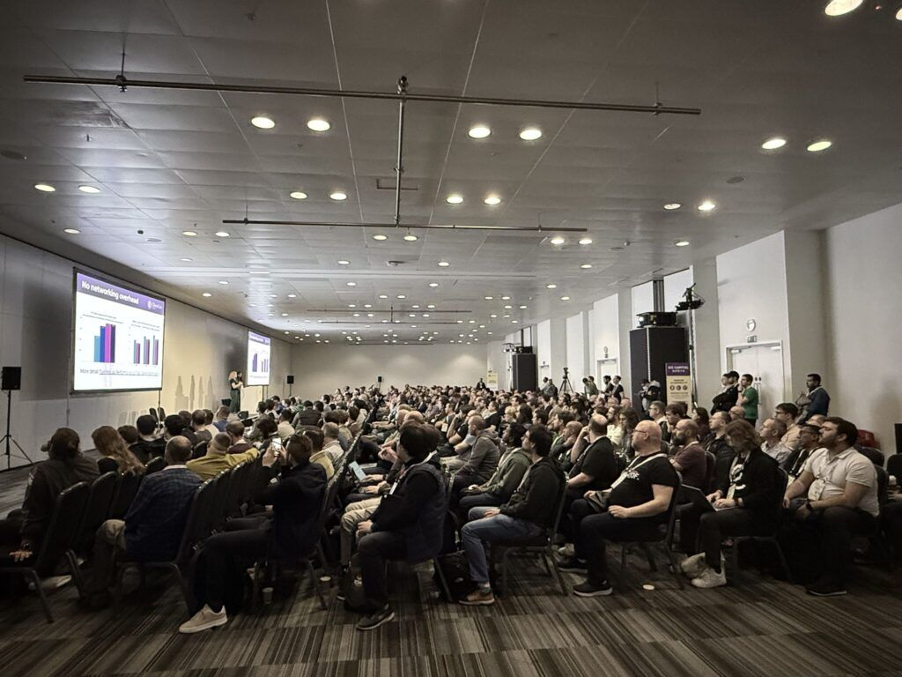

**_Author: Katie Meinders, Isovalent_**

The Cilium community is buzzing to reunite again this November in Atlanta for KubeCon + CloudNativeCon and CiliumCon North America 2025. Learn where to find Cilium during the show, which talks to attend, and how to engage with end users, core contributors, and industry leaders. 

## A look back at KubeCon + CloudNativeCon and CiliumCon Europe in London

Earlier this year, the community gathered in London during KubeCon + CloudNativeCon and CiliumCon Europe. It was a packed house for CiliumCon where attendees heard talks from Isovalent’s Liz Rice and Microsoft’s Neha Aggarwal about configuring Cilium for performance and scale, G-Research’s Luigi Zhou on how the organization uses Cilium as the core network for on-premise, bare-metal clusters and ML workloads, simplifying multi-cluster networking with the multi cluster services API, and much more.

KubeCon keynote attendees also heard the latest Cilium updates from Liz Rice from reporting live at London landmarks. 

<iframe width="560" height="315" src="https://www.youtube.com/embed/thCrfsVJz4g?si=4a6jFCWO0Vs3HmKn" title="YouTube video player" frameborder="0" allow="accelerometer; autoplay; clipboard-write; encrypted-media; gyroscope; picture-in-picture" allowfullscreen></iframe>

Contributors also gathered during the [Cilium Developer Summit](https://github.com/cilium/dev-summits/tree/main/2025-EU) to discuss the future of the Cilium project. Representatives from Google, Isovalent, Microsoft, Seznam, and more discussed the status of existing and new features like Cluster Mesh and StateDB-based load balancing and the project roadmap.

During the Maintainers track, the community came together to celebrate nearly a decade of Cilium, to hear the latest updates to CIlium, Hubble, and Tetragon, and hear how DBSchenker is using Cilium for networking and observability and why Cilium provides the core networking features in the GKE dataplane. 

From co-los to demos and lightning and maintainer talks, we will continue the celebration of 10 years of Cilium in Atlanta!

## CiliumCon

Join us on Monday, November 10, for a morning of talks, community updates, and end user stories during CiliumCon. The schedule is full of insightful talks around Cilium, Hubble, Tetragon and eBPF. Here’s a look at what you can expect:

[CiliumCon | Welcome + Opening Remarks - Hemanth Malla, Program & Bill Mulligan, Co-Chairs](https://colocatedeventsna2025.sched.com/event/28F61/ciliumcon-welcome-+-opening-remarks-bill-mulligan-hemanth-malla-program-committee-co-chairs?iframe=no)

09:00 - 09:05 AM

Event co-chairs, Bill & Hemanth, will share the latest updates from the project and community.

[Rewiring Cilium: Operator-Driven Scale and Security With CiliumEndpointSlice - Shreya Jayaraman & Tamilmani Manoharan, Microsoft](https://colocatedeventsna2025.sched.com/event/28Czl/rewiring-cilium-operator-driven-scale-and-security-with-ciliumendpointslice-shreya-jayaraman-tamilmani-manoharan-microsoft?iframe=no)

9:10 - 9:35 AM

As clusters scale, the control plane often bears the brunt of the growing pains. But what if scale didn’t have to mean stress? In this session, we’ll explore the CiliumEndpointSlice feature that has enabled more scalable container networking and laid the foundation for future optimizations in the Cilium ecosystem.

We start by exploring the default Cilium configuration and the strain it places on the kube-apiserver at scale. Then, we explore how enabling CiliumEndpointSlice helped us unlock higher scale at AKS, with details on its design, how it works & the performance gains we observed. We also share our experiences with fine-tuning clusters at scale & the tradeoffs involved. Finally, we take a glimpse at what’s next in the quest to centralize the Operator and make policy enforcement in Cilium more scalable.

Whether you're running Cilium at scale or just getting started, this talk will equip you with practical insights and architectural strategies to run high-scale Cilium clusters.

[Operating Cilium Mesh With Confidence: From Zero To Production in 90 Days - Andrew Timmes, SeatGeek](https://colocatedeventsna2025.sched.com/event/28D0I/operating-cilium-mesh-with-confidence-from-zero-to-production-in-90-days-andrew-timmes-seatgeek?iframe=no)

9:45 - 10:10 AM

In late 2024, the Cloud Platform team at SeatGeek was tasked with migrating hundreds of microservices from their existing service mesh to Cilium Mesh in just three months.

In this session, we'll talk about how our engineers got up to speed on the inner workings of Cilium in short order, how all the pieces of Cilium's CNI and mesh systems fit together, and walk through production incidents and how we reasoned about a brand-new eBPF networking stack, with the goal of providing you with the context and methodologies to do the same either tomorrow or 5 years from now.

[CiliumCon Sponsored Keynote: Liz Rice, Isovalent at Cisco](https://colocatedeventsna2025.sched.com/event/28F6G/ciliumcon-sponsored-keynote-liz-rice-isovalent-at-cisco?iframe=no)

10:15 - 10:20 AM

[IPv6 First, Not Just Ready: Kubernetes Without IPv4 Using Cilium at ESnet - Kapil Agrawal, ESnet](https://colocatedeventsna2025.sched.com/event/28D0g/ipv6-first-not-just-ready-kubernetes-without-ipv4-using-cilium-at-esnet-kapil-agrawal-esnet?iframe=no)

10:40 - 11:05 AM

ESnet, the U.S. Department of Energy’s high-performance research network, runs Kubernetes on-prem in IPv6 only network using Cilium as our CNI. While Kubernetes introduced IPv6 support in version 1.22, deploying production grade clusters without IPv4 presents unique challenges that require careful architectural design such as:

- Support for DNS64, NAT64 in the underlying network
- Obtaining a stable egress IPv6 address
- Traffic patterns (ingress vs. egress)
- To masquerade or not to
- Allocating PodCIDR, ServiceCIDR sizes correctly
- Choosing between tunneling vs. native routing mode and it's implications

Attendees will learn how we solved these problems using Cilium features such as:

- eBPF datapath using kube proxy replacement
- BGP, load balancer IPAM, GatewayAPI
- NAT46x64Gateway in absence of NAT64 gateway on the network

We will also discuss steps to deploy an IPv6 only KIND cluster using Cilium and how that can be useful for testing applications during development.

[Containing Wildfires in a Sprawling Multi-Cluster Network: The Network's Immune System - Anmol Krishan Sachdeva & Paras Mamgain, Google](https://colocatedeventsna2025.sched.com/event/28D1Y/containing-wildfires-in-a-sprawling-multi-cluster-network-the-networks-immune-system-anmol-krishan-sachdeva-paras-mamgain-google?iframe=no)

11:15 - 11:40 AM

In a sprawling multi-cluster network, a security breach in one pod is never just a local problem. It’s the potential start of a wildfire. The real danger isn’t the initial compromise, it's the attacker's lateral movement across clusters, turning a small incident into a catastrophic failure.

Traditional incident response is too slow; by the time a human can analyze logs and apply new firewall rules, the damage is done. How can we build a system that detects a threat and automatically "shrink-wraps" the blast radius in real-time?

This session presents a cutting-edge, automated threat containment system built on the combined power of Cilium, Tetragon, and Hubble. We demonstrate a closed-loop workflow that transforms your network from a passive conduit into an active immune system.

Join us for a live-fire demo where we’ll compromise a service and watch the mesh quarantine the breach, proving you can contain wildfires before they rage out of control.

[Can We Really Parse DNS in eBPF ? Improving Cilium ToFQDN With In-kernel Policy Updates - Hemanth Malla, Microsoft](https://colocatedeventsna2025.sched.com/event/28D2Q/can-we-really-parse-dns-in-ebpf-improving-cilium-tofqdn-with-in-kernel-policy-updates-hemanth-malla-microsoft?iframe=no)

11:50 AM - 12:15 PM

Parsing DNS in eBPF has been “tricky” for a long time. One needs to handle DNS compression, follow an unknown number of pointers and parse an unknown number of answers. Things get complicated with DNS over TCP. What if the DNS response is split across multiple packets requiring us to parse TCP streams in eBPF ? Luckily eBPF is now sufficiently advanced to handle such complex logic.

So, what does this mean for toFQDN policies in CIlium ? Cilium’s toFQDN policies currently rely on a userspace DNS proxy to intercept responses and populate the endpoint's policy map. A userspace high availability mode for the proxy can avoid hard dependency on the agent at runtime. However this results in increased complexity and need for co-ordination between agent and out of process proxy.

So can we do better natively with eBPF ? Yes. This talk will explore how we can implement such a system and what it takes to integrate it into Cilium’s toFQDN policy sub-system.

[⚡Lightning Talk: Taming the BPF LRU: Eliminating TCP Resets in Cilium - Gyu Tae Bae, Kakao Corp.](https://colocatedeventsna2025.sched.com/event/28D2o/cllightning-talk-taming-the-bpf-lru-eliminating-tcp-resets-in-cilium-gyu-tae-bae-kakao-corp?iframe=no)

12:20 - 12:30 PM

At scale, Cilium users often face mysterious TCP connection failures from unexpected RST packets. This session explores a critical bug where Cilium's BPF-based SNAT and its LRU eviction policy prematurely terminate active sessions. We will dissect the root cause in the eBPF datapath and reveal the elegant fix, now merged upstream in Pull Request #37747: proactively restoring the original NAT entry on the reverse traffic path. This solution, born from a real-world production issue, reduced connection failures from up to 10% to nearly zero.

This talk is a must for operators debugging network instability and developers tackling real-world eBPF challenges. You will leave with a clear diagnosis for this "silent killer" and key insights into building robust, high-performance cloud networking.

## Cilium at other Co-located Events

There are a couple of great talks on Cilium during other KubeCon co-lo events, including Cloud Native University and Observability Day, also happening November 10.

[From Squire To Network Knight: Defending the Kubernetes Castle the Cloud Native Way - Donia Chaiehloudj, Isovalent at Cisco](https://colocatedeventsna2025.sched.com/event/28D0X/from-squire-to-network-knight-defending-the-kubernetes-castle-the-cloud-native-way-donia-chaiehloudj-isovalent-at-cisco?iframe=no&w=100%25&sidebar=yes&bg=no)

Cloud Native University - Monday, November 10, 10:40 - 11:05 AM

In medieval times, a squire was the first step toward becoming a knight. In Kubernetes, many of us start the same way eager to protect our clusters, but armed with the wrong tools and assumptions. In this talk, we’ll start with a wide-open Kubernetes cluster — no policies, no protections — and walk through what’s missing, why it matters, and how to build security the cloud native way.

We’ll contrast static, perimeter-based firewalls with Kubernetes native policy and show how to evolve from static IPs to identity-based enforcement. Step by step, we’ll build protections using Network Policies and Cilium’s identity-aware, DNS-enforcing, and observability-rich capabilities.

Along the way, you’ll learn to debug common issues, avoid the traps of “firewall thinking,” and think in terms of intent, not infrastructure. By the end, you’ll have the tools and mindset to go from squire to network knight.

[How UW Madison Monitors 25+ Clusters With Cilium and Prometheus Agent on a Student-Sized Budget - Cory Sherman, University of Wisconsin & Ryan Etten, Red Hat](https://colocatedeventsna2025.sched.com/event/28D14/how-uw-madison-monitors-25+-clusters-with-cilium-and-prometheus-agent-on-a-student-sized-budget-cory-sherman-university-of-wisconsin-ryan-etten-red-hat)

Observability Day - Monday, November 10, 10:40 - 11:05 AM

Budgets keep shrinking while observability demands explode—so how do you capture L7 insight across 25+ Kubernetes clusters without paying a sidecar tax? At UW Madison, we paired Cilium’s eBPF networking with the Prometheus Agent’s remote write, streaming rich flow telemetry to a central Grafana stack at a fraction of the usual footprint. Live on stage, we’ll fire test traffic with curl from a single app pod and watch Cilium Flow Metrics spike and Alertmanager light up within seconds—no sidecars, no context switching. You’ll leave with a field-tested playbook: scrape-target pruning, discovery patterns that survive air-gapped research zones, and the real story of what broke first—and how we fixed it. This case study demonstrates light weight mesh and light weight observability for a university budget.

## KubeCon + CloudNativeCon North America 2025 Talks

Don't miss Cilium during the main event. There are several exciting talks featuring Cilium from community members and end users.

[10 Years of Cilium: Connecting, Securing, and Simplifying the Cloud Native Stack - Bill Mulligan & Paul Arah, Isovalent @ Cisco; Neha Aggarwal, Microsoft; Satish Krishnan, UBS](https://kccncna2025.sched.com/event/27Nnr/10-years-of-cilium-connecting-securing-and-simplifying-the-cloud-native-stack-bill-mulligan-paul-arah-isovalent-cisco-neha-aggarwal-microsoft-satish-krishnan-ubs?iframe=yes&w=100%&sidebar=yes&bg=no)

Tuesday, November 11, 11:15 - 11:45 AM

Join us as we celebrate a decade of Cilium, now the de-facto standard CNI for Kubernetes and a cornerstone of cloud native networking and security. This session provides updates on the latest Cilium release and showcases how its unified eBPF-powered stack is transforming Kubernetes environments and beyond by replacing fragmented toolchains with seamless, secure, scalable, and simplified solutions.

We’ll showcase advancements in multi-cluster connectivity and support for massively scalable clusters. You’ll also hear updates from sub-project Tetragon for runtime enforcement and security observability.

Contributors and adopters from Isovalent, Microsoft, and UBS will share how they’re using Cilium to streamline operations and reshape the cloud native stack cementing Cilium’s role as the networking and security data plane for modern infrastructure for the next decade to come.

[QEMU in the Fast Lane: Accelerating KubeVirt Networking With eBPF - Daniel Borkmann & Anton Protopopov, Isovalent at Cisco](https://kccncna2025.sched.com/event/27FXg/qemu-in-the-fast-lane-accelerating-kubevirt-networking-with-ebpf-daniel-borkmann-anton-protopopov-isovalent-at-cisco?iframe=yes&w=100%&sidebar=yes&bg=no)

Tuesday, November 11, 5:00 - 5:30 PM

As organizations converge infrastructure by running VMs alongside containers in Kubernetes for cost savings and simplified operations, networking performance remains a key challenge especially for latency and throughput sensitive workloads. In this talk, we'll show how eBPF with AF_XDP can improve KubeVirt networking by putting QEMU in the fast lane (all without losing the ability to observe and enforce policy on traffic in the host unlike SR-IOV).

We'll unpack an architecture built on Cilium, netkit, and upstream Linux kernel enhancements that enable KubeVirt Pods to launch QEMU/KVM instances backed by high-performance AF_XDP interfaces. You'll learn how our contributions to QEMU and the kernel enable this accelerated path, and how it stacks up against KubeVirt defaults using real world benchmarks.

Expect kernel spelunking, performance graphs, and a vision for adding a fast lane to VM networking.

[Community Capital: Making OSS and Businesses Successful Together - Liz Rice, Isovalent at Cisco](https://kccncna2025.sched.com/event/27FaR/community-capital-making-oss-and-businesses-successful-together-liz-rice-isovalent-at-cisco?iframe=yes&w=100%&sidebar=yes&bg=no)

Wednesday, November 12, 3:00 - 3:30 PM 

Just as open source success is about more than great code, building a successful business on OSS relies on more than pricing. This talk explores how ecosystems thrive when maintainers, vendors, and users build on shared values and trust. We'll unpack why timing matters when open sourcing a project or contributing it to a foundation, how vendors can grow real businesses by adding value around open source rather than trying to control it, and why vendor success matters to the projects themselves.

Drawing on Liz’s experience with the Cilium project and as former Chair of the TOC, she’ll look at examples from the CNCF and beyond, to show how shared values can lead to collective success, and draw out the relationships between project health and vendor viability. Expect thoughtful metaphors, practical takeaways, and a reminder that open source isn’t a zero-sum game, and commercial success can amplify community impact.

[Portable MTLS for Kubernetes: A QUIC-Based Plugin Compatible With Any CNI - Apurup Chevuru & Michael Zappa, Microsoft](https://kccncna2025.sched.com/event/27FaL/portable-mtls-for-kubernetes-a-quic-based-plugin-compatible-with-any-cni-apurup-chevuru-michael-zappa-microsoft?iframe=yes&w=100%&sidebar=yes&bg=no)

Wednesday, November 12, 3:00 - 3:30 PM

Most mTLS solutions in Kubernetes are tightly coupled to service meshes or L7 proxies, introducing operational complexity, performance overhead, and limited flexibility across CNIs. In this session, we present a portable mTLS plugin built on QUIC, a modern transport protocol designed for performance and security. Our plugin offers native, transparent L4 encryption with automatic certificate management via SPIRE, and is designed to work seamlessly with any third-party CNI including Cilium, Calico, and others without sidecars or mesh dependencies. We'll deep-dive into the architecture, QUIC+eBPF redirection, SPIRE integration, and benchmarks that highlight performance gains over Envoy-based solutions.

[TikTok's IPv6 Journey To Cilium: Pitfalls and Lessons Learned - Giri Kuncoro & Joseph Pallamidessi, ByteDance](https://kccncna2025.sched.com/event/27FbS/tiktoks-ipv6-journey-to-cilium-pitfalls-and-lessons-learned-giri-kuncoro-joseph-pallamidessi-bytedance?iframe=yes&w=100%&sidebar=yes&bg=no)

Wednesday, November 12, 4:45 - 5:15 PM

Cilium has been the standard for Kubernetes networking and security. TikTok migrated clusters to use Cilium for its advanced security features like mutual authentication, along with high performance networking and enhanced observability. The main challenge was executing this on TikTok IPv6 only datacenters, as Cilium has been battle tested with IPv4 and dual-stack, but not with IPv6 only environments.

This talk shares the journey of making Cilium work for IPv6 only Kubernetes, highlighting the limitations and techniques to overcome them. First, Cilium doesn't support tunneling over IPv6, native routing mode must be configured. Second, we encountered several bugs related to IPv6 only: NDP traffic getting dropped by Cilium Network Policy due to incorrect identification; DNS policy not allowing traffic for IPv6 DNS servers; broken cilium debug tools when IPv4 related BPF maps not found. Finally, the NodePort timeout issue was blocking us from enabling Cilium to fully replace kube-proxy.

**Cilium Project Booth:** Be sure to visit Cilium’s booth in the Project Pavilion to see live demos, explore new features, and connect with the community.

Whether you are attending hands-on workshops, lightning talks, or networking with industry peers, you will find countless opportunities to interact with the Cilium community. Be sure to stop by with any questions or just say hello!
