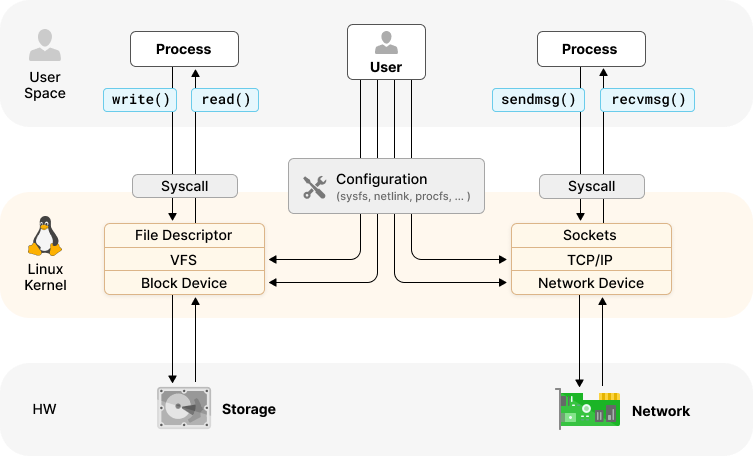

import authors from 'utils/author-data';

**_Author: Paul Arah, Isovalent@Cisco_**


When you write Tetragon tracing policies, you’re not writing arbitrary sets of rules; you're programming against the kernel execution path itself. Every policy you create hooks directly into kernel functions, intercepts system calls, and examines kernel data structures. This power comes with responsibility. Without an understanding of how the Linux kernel works, you'll find yourself writing policies that are ineffective, overly broad, or worse, missing the exact events you are trying to find.

This blog post is meant to be a pointer guide; it won’t make you a kernel hacker overnight, but it aims to cover some core Linux knowledge essential for crafting effective Tetragon tracing policies. We’ll connect kernel fundamentals such as user vs. kernel space, system calls, process structures, namespaces, and more to practical tracing policy examples. A basic familiarity with Linux and a base-level understanding of what Tetragon is will be enough to follow along.

## Kernel Space vs User Space

One of the most fundamental concepts in Linux system programming is the distinction between kernel space and user space.

**User space** is where apps like Bash, Nginx, VS Code run. Userspace programs run with restricted privileges and cannot do things like access arbitrary memory locations, execute privileged instructions, directly control hardware, or access kernel data structures.

**Kernel space** is where kernel code runs with unrestricted access to all system resources. Here, code can access any memory location, execute privileged CPU instructions, directly control hardware devices, modify system-wide data structures, and more.

## The System Call Interface

User programs can’t talk to the kernel directly. They use system calls(syscalls) like `openat`, `write`, or `execve`. System calls are the controlled entry points that allow user space programs to request kernel services. When a user space program wants to open a file, allocate memory, or create a network connection, it must go through the system call interface. For example, when a program calls `open("name.text")`, it isn’t the library function itself that touches the file. Behind the scenes, this becomes a `sys_openat` system call. The kernel then processes the request, checks permissions, and returns a reference that the program can use.

Most programming languages offer some sort of standard library that provides a high-level abstraction over the system call interface; this way, application developers typically never have to access the system call interface directly. When you write tracing policies, we’re working with the kernel’s perspective, where syscalls are the actual events being invoked.



## Hook Points

When you write a tracing policy, you have to tell Tetragon where to look in the system. These attachment points are called hook points. There are two complementary perspectives we can view this from: how the Linux kernel itself defines them, and how Tetragon exposes them for us. Understanding both perspectives helps us choose the right hook point for the security observability scenario.

### The Linux Kernel’s Point of View

In the kernel, a hook point is just a place in the execution flow where code can be instrumented. Different subsystems provide different mechanisms for instrumentation:

- **Kprobes** provide dynamic probes on almost any kernel function. They let you intercept functions like `fd_install()` whenever they’re called. Kprobes are powerful, but are tightly coupled with your kernel version since kernel functions can change across versions.
- **Tracepoints** are essentially built-in static markers inside the kernel. For example, `sched_process_exec` fires every time a process runs a new program. Tracepoints are more stable than kprobes and work across kernel versions.
- **Uprobes** are like kprobes, but for user-space programs. For example, you can hook into the readline() function in Bash to see when someone types a command.
- **BPF LSM** essentially allows instrumenting Linux Security Module (LSM) hooks at runtime. A good way to think of LSM hooks is as some kind of built-in checkpoint that asks, “Is this action allowed?” before letting a process do something sensitive. Security systems like SELinux or AppArmor use LSM hooks. Tetragon can also use LSM hooks for access control and observability. LSM hooks are reliable, less prone to race conditions like TOCTOU, and always represent real enforcement points.

This blog post titled: [Linux tracing systems & how they fit together](https://jvns.ca/blog/2017/07/05/linux-tracing-systems/) by Julia Evans, is a good resource for learning about the tracing systems in the Linux kernel.

### Tetragon Points of View

Tetragon abstracts these raw attachment points into policy targets. **A hook point in Tetragon is simply a declaration of where you want to monitor and what arguments you want extracted.**
With a kprobe spec for example, you declare, and Tetragon takes care of attaching to the kernel function and extracting the arguments.

```yaml
spec:
  kprobes:
    - call: 'fd_install'
      syscall: false
```

With a tracepoint spec, Tetragon subscribes to the stable kernel tracepoints, decoding the arguments.

```yaml
spec:
  tracepoints:
    - subsystem: 'sched'
      event: 'sched_process_exec'
```

This same principle applies to every hook point in Tetragon. With LSM hooks, for example, you point at security checks(`file_open`, `bprm_check_security`) and Tetragon handles the attachment.

From the Tetragon point of view, **a hook point is a declarative contract that specifies what to watch(functions, tracepoints, LSM hooks), which arguments to pull out(pid, file, etc), and how to filter or act on the event.**

### Writing Kprobe-based Tracing Policies for Monitoring System Calls

Before rounding off this section, it is important to highlight one interesting abstraction Tetragon provides for kprobe-based policies that monitor system calls. Different CPU architectures implement system calls differently, and this can create portability challenges. On x86_64, system call handlers have names like `__x64_sys_write`, while on ARM64, they're named `__arm64_sys_write`.
Tetragon provides elegant abstraction here. Instead of writing architecture-specific policies like this:

```yaml
# Architecture-specific (don't do this)
spec:
  kprobes:
    - call: '__x64_sys_write' # Only works on x86_64
      syscall: true
```

You can write portable policies that work across different architectures.

```yaml
# Portable across architectures
spec:
  kprobes:
    - call: 'sys_write' # Works on any architecture
      syscall: true
```

Tetragon automatically translates `sys_write` to the correct architecture-specific function name. This abstraction is crucial for policies that need to work across diverse environments.

### Choosing the Right Hook Point

The best hook point for your policy depends on your specific security observability objective and how much stability you need across environments. If your goal prioritizes portability, tracepoints are often the safest choice. They are built into the kernel source and tend to remain stable across kernel versions.
If you’re writing security-sensitive policies, LSM hooks are a better option. Because they operate on kernel-owned memory after user input has already been validated, they naturally avoid time-of-check to time-of-use (TOCTOU) pitfalls.
When you need fine-grained insight into kernel internals, kprobes give you the flexibility to attach almost anywhere. The tradeoff is that they are more tightly coupled to your kernel version, since function names and prototypes can change between releases. To use them effectively, you need to be comfortable browsing kernel symbols and understanding the calling conventions of the functions you hook.
Finally, if your focus is on application-level behavior, uprobes let you trace functions inside user-space binaries and libraries. The prerequisite here is being able to explore how a particular program is laid out at the binary level.
Whichever option you choose, the common theme is that you’re navigating the Linux kernel (or user-space program) at the level of functions, structures, and symbols. An understanding of these internals is what allows you to pick the right hook.

## Process Management

In the kernel's view, every running program is represented by a `task_struct` data structure. This massive structure (over 1,000 lines in recent kernels) contains everything the kernel needs to know about a process, including the process and thread group IDs (PID/TGID), memory management information, file descriptor table, security credentials, scheduling information, and signal handling state.
When your Tetragon examines process-related information, it is often looking at fields within the current process's task_struct. Process lifecycle monitoring is a core use case for Tetragon, and by default, without deploying any additional tracing policy, Tetragon observes the process lifecycle. The process section of the [Linux kernel teaching lab](https://linux-kernel-labs.github.io/refs/heads/master/lectures/processes.html) covers in detail how processes work in Linux.

### Process Monitoring with Tetragon

Consider a policy that tracks process creation using the sched_process_exec tracepoint:

```yaml
spec:
  tracepoints:
    - subsystem: 'sched'
      event: 'sched_process_exec'
      args:
        - index: 0
          type: 'int'
          resolve: 'pid'
        - index: 2
          type: 'linux_binprm'
```

This policy hooks into the scheduler subsystem when a new program is executed. The `resolve: "pid"` directive tells Tetragon to extract the PID from the first argument (a `task_struct` pointer), while the `linux_binprm` type captures information about the binary being executed.

Understanding that process creation involves multiple kernel subsystems (the scheduler, memory manager, and file system) helps you choose the right hook points for your monitoring and enforcement objectives.

### Process Hierarchies and Namespaces

Container environments add complexity to process management through namespaces. Containers use chroot, namespaces, and cgroups to isolate processes. A good developer-centric resource that covers the Linux internals of how containers work is [Containers From Scratch](https://www.youtube.com/watch?v=8fi7uSYlOdc) and [Crafting Containers By Hand – What Are Containers?](https://btholt.github.io/complete-intro-to-containers/what-are-containers)

A process might have different PIDs in different PID namespaces; PID 1 inside a container might be PID 12345 from the host perspective. Tetragon policies need to account for this. When you're filtering by PID, consider whether you want the namespace PID or the host PID:

```yaml
selectors:
  - matchPIDs:
      - operator: In
        followForks: true
        isNamespacePID: true # Use container-internal PID
        values:
          - 1
```

## File System and File Descriptors

Whenever a program works with files, for example, opening `/etc/passwd`, writing logs, or reading configs; it goes through the Linux file system layer. The kernel doesn’t let programs touch files directly. Instead, it hands them a file descriptor: a small number like 3, 4, or 5 that represents an open file. File descriptors 0, 1, and 2 are always reserved for standard input, output, and error(`stdin`, `stdout`, `stderr`).

Tetragon can hook into the kernel functions that create or use these file descriptors. For example, the `fd_install()` function runs whenever the kernel adds a new open file to a process. By attaching a kprobe here, you can see which files are being opened and by which process:

```yaml
spec:
  kprobes:
    - call: 'fd_install'
      syscall: false
      args:
        - index: 0
          type: int # the file descriptor number
        - index: 1
          type: file # the file being opened
      selectors:
        - matchArgs:
            - index: 1
              operator: 'Prefix'
              values:
                - '/etc'
```

The big idea here is that every file action in Linux is funneled through file descriptors, and by watching them, you can write focused policies that only report on the paths you care about.

## Networking and Sockets

In Linux, all network traffic flows through sockets. A socket works like a file descriptor, but instead of pointing to a file, it represents a network connection (IP + port). When an app calls connect() or send(), the kernel manages the socket. This means every HTTP request, DNS lookup, or database call is visible at the socket layer.


With Tetragon, you can hook into functions like `__sys_connect` to catch new connections and filter them by port, address, or namespace.

```yaml
spec:
  kprobes:
    - call: '__sys_connect'
      syscall: true
      args:
        - index: 0
          type: 'sockaddr'
      selectors:
        - matchArgs:
            - index: 0
              operator: 'DPortPriv'
```

Sockets are the kernel’s gateway for networking, and Tetragon gives you the hooks to watch or restrict how they’re used.

## Conclusion: Building Your Kernel Knowledge

Understanding Linux kernel fundamentals for effectively writing Tetragon tracing policies is an ongoing journey. The kernel is a complex, evolving system, and effective policy development requires understanding how its various subsystems interact.

Start by focusing on the areas most relevant to your monitoring objectives:

- For file system security: study VFS, file descriptors, and path resolution
- For process monitoring: understand task structures, process lifecycle, and namespaces
- For network security: learn socket structures, network stack flow, and connection tracking
- For container security: understand namespaces, cgroups, and container runtime interactions

The investment in kernel knowledge pays dividends in the form of more effective, efficient, and reliable tracing policies. Remember that kernel internals can change between versions, so staying current with kernel development and testing your policies across different kernel versions is essential for production deployments

## Resources and References:

- [Linux Kernel Teaching](https://linux-kernel-labs.github.io/refs/heads/master/index.html)
- [Linux tracing systems & how they fit together](https://jvns.ca/blog/2017/07/05/linux-tracing-systems/)
- [Learning eBPF by Liz Rice](https://isovalent.com/books/learning-ebpf/)
- [Containers From Scratch](https://www.youtube.com/watch?v=8fi7uSYlOdc)
- [Crafting Containers By Hand – What Are Containers?](https://btholt.github.io/complete-intro-to-containers/what-are-containers)
- [File Monitoring with eBPF and Tetragon](https://isovalent.com/blog/post/file-monitoring-with-ebpf-and-tetragon-part-1/)
- [Tetragon Documentation](https://tetragon.io/docs/)
- [The Linux Programming Interface](https://www.amazon.com/Linux-Programming-Interface-System-Handbook/dp/1593272200)
