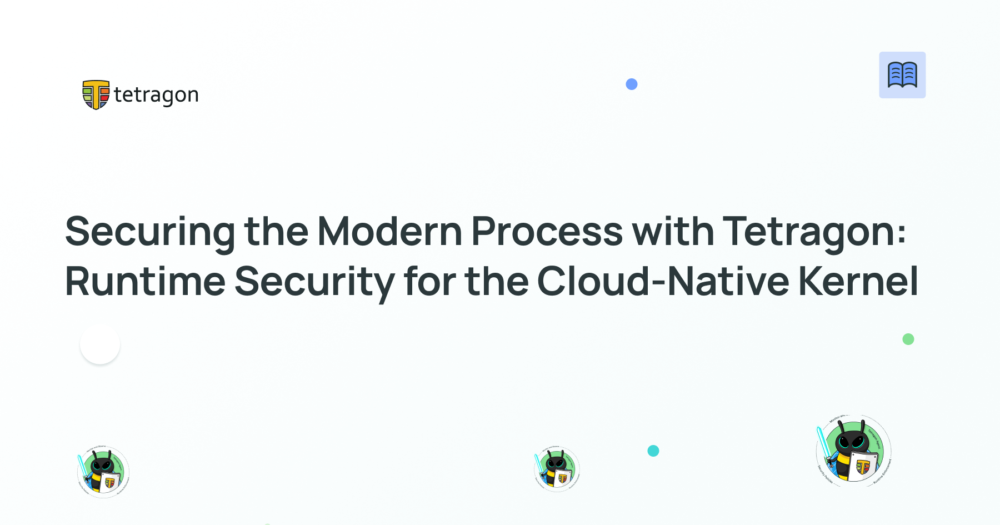
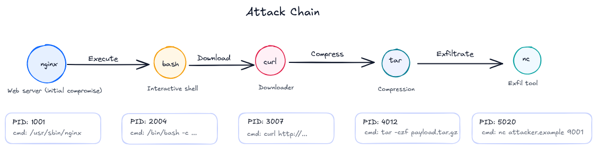

**_Author: Paul Arah, Isovalent@Cisco_**



The evolution into cloud native architectures fundamentally changed how we think about processes from a security perspective. Before cloud native environments, processes were relatively stable and long-lived. You could audit them, understand their behavior patterns, and apply security controls with reasonable confidence. Containers changed this model. Processes now spawn and die in milliseconds, run in isolated namespaces, share the same kernel with dozens of other workloads, and operate at a scale that makes manual security review next to impossible.

The need for runtime security has never been more important. Tetragon's eBPF-based security observability and runtime enforcement provides the visibility and control needed to secure processes in these dynamic environments. But to use it effectively, you need to understand both the Linux process model and how attackers exploit it in containerized systems.

## The Linux Process Model in the Container Context

When you execute a container, you're creating processes that run on the same kernel as every other process on that node, just with different namespace and cgroup configurations. Every container process is still just a Linux process with a process ID, parent-child relationships, memory space, and file descriptors. The container runtime manages the creation of these processes with specific isolation primitives. When Kubernetes schedules a pod, it is instructing the container runtime to fork processes with carefully configured namespaces for PID, network, mount, UTS, and IPC isolation.

This model creates some interesting challenges from a security point of view. For example, a container escape involves manipulating these namespace boundaries or exploiting kernel vulnerabilities that affect all processes regardless of their namespace configuration. The shared kernel between processes becomes both a performance benefit and a security concern.

## Process Namespaces and Security Implications

The process namespace is particularly relevant for security. Inside a container, processes see themselves starting from PID 1, but on the host, these processes have different PIDs in the root namespace. Monitoring tools that run inside containers only see the container's namespace view, missing the broader context of what's happening on the node; on the other hand, monitoring tools that lack namespace awareness miss the container context.

Because Tetragon operates at the kernel level, it has visibility across all namespaces, seeing both the container's and the host's views. This kernel-level visibility allows Tetragon to track process relationships even when they cross namespace boundaries. Being able to monitor processes across namespace boundaries is essential for detecting container escapes, where a process might spawn in one namespace and then attempt actions in another namespace.

## Why the Shared Kernel Model Matters

Because all containers on a node share the kernel, a vulnerability in kernel code affects every workload. This is fundamentally different from virtual machines, where each VM runs its own kernel. The [Dirty Pipe vulnerability](https://nvd.nist.gov/vuln/detail/cve-2022-0847) exemplified this perfectly: an unprivileged process in any container could exploit the vulnerability to overwrite files across namespace boundaries, potentially gaining control over the entire node.

## Understanding Linux Capabilities in Containers

Before diving into specific attacks, we need to understand Linux capabilities because they're central to how container security works. In the old world, processes were either root (UID 0) or standard users (!=UID 0). This binary system was too rigid. Sometimes unprivileged processes need specific privileges. The kernel introduced capabilities to provide more granular security controls. Capabilities can be implemented on files or processes.

Container runtimes use capabilities to implement security boundaries. A typical container runs with a restricted capability set compared to root. The default Docker capability set includes things like `CAP_NET_RAW` (raw sockets) and `CAP_CHOWN` (change file ownership), but drops dangerous capabilities like `CAP_SYS_ADMIN`.

However, privileged containers get all capabilities, including `CAP_SYS_ADMIN`, which is essentially the "new root" in Linux. This is why privileged containers are so dangerous. With `CAP_SYS_ADMIN`, you can load kernel modules, mount arbitrary filesystems, change namespaces, and perform numerous other operations that break container isolation.

### The runc Vulnerability (CVE-2019-5736)

The Runc container escape [(CVE-2019-5736)](https://kubernetes.io/blog/2019/02/11/runc-and-cve-2019-5736/) remains one of the most instructive examples. The vulnerability allowed a malicious container to overwrite the runc binary on the host. When an administrator executed commands like docker exec, the compromised runc would execute with host privileges.

From a process perspective, this attack exploited how runc handles file descriptors. The malicious container would write to `/proc/self/exe`, a symbolic link pointing to the running process's binary. Because runc was the process executing into the container, this link pointed to the host's runc binary. The write operation could overwrite the actual runc binary on the host filesystem, bypassing container isolation entirely.

What makes this particularly deadly is that the attack leverages legitimate behaviour. Writing to `/proc/self/exe` isn't inherently suspicious in all contexts, but from a container it absolutely is. This is where context-aware monitoring becomes crucial. We can write tracing policies that can detect this pattern by monitoring file write operations to sensitive paths with awareness of whether the acting process is containerized:

```yaml
spec:
  kprobes:
    # https://www.kernel.org/doc/html/latest/core-api/kernel-api.html#c.security_file_permission
    - call: 'security_file_permission'
      syscall: false
      args:
        - index: 0
          type: 'file'
        - index: 1
          type: 'int'
      selectors:
        - matchArgs:
            - index: 0
              operator: 'Equal'
              values:
                - '/usr/bin/runc' #adjust to your actual runc path
            # MAY_WRITE
            - index: 1
              operator: 'Mask'
              values:
                - '2'
          #Only suspicious when NOT in the host PID namespace
          matchNamespaces:
            - namespace: Pid
              operator: NotIn
              values:
                - 'host_ns'
          #kill the offending process
          matchActions:
            - action: Sigkill
```

This policy hooks into the kernel function that installs file descriptors, watching for attempts to open `/proc/self/exe` for writing. The enforcement action kills the process attempting this operation.

### The Dirty Pipe vulnerability (CVE-2022-0847)

The Dirty Pipe vulnerability [(CVE-2022-0847)](https://nvd.nist.gov/vuln/detail/cve-2022-0847) demonstrates how kernel-level bugs enable privilege escalation regardless of container configuration. The vulnerability existed in the Linux kernel's pipe handling code, specifically in how the kernel handled copy-on-write semantics for pipe buffers.

The attack worked by creating a pipe, writing data to it, then splicing that data to overwrite arbitrary file contents, even read-only files. An attacker could overwrite setuid binaries or critical system files like `/etc/passwd` to gain root access.

What's particularly interesting from a monitoring perspective is the attack pattern. The exploit required specific sequences of system calls: creating pipes with `pipe()`, writing data with `write()`, and then using `splice()` to copy data into file page caches. While each individual system call is legitimate, the combination in this specific pattern is highly suspicious.

## When Legitimate Tools Become Weapons

Modern attackers increasingly use legitimate system tools for malicious purposes, a technique called ["living off the land."](https://www.crowdstrike.com/en-us/cybersecurity-101/cyberattacks/living-off-the-land-attack/) Instead of dropping custom malware that could be easily detected, they chain together native utilities to achieve their objectives. A typical example: an attacker gains initial access through a web application vulnerability, uses curl to download a script, executes it with bash, uses find to locate sensitive files, compresses them with tar, and exfiltrates with nc or curl. Every binary involved is legitimate. Relying on signature-based detection would not suffice. This is where behavioral monitoring shines. The sequence of operations is suspicious, even though individual commands aren't.



A web server process spawning bash is unusual. That bash process immediately running curl to download from the internet is even more suspicious. The downloaded script executing a find for SSH keys and database credentials seals the deal.
Tetragon's child process visibility is crucial here. You can create policies that understand parent-child relationships. For example, you monitor unexpected shells launched from web-facing applications. To detect these behaviors, you can match on the parent binary and ask Tetragon to automatically follow all child processes it spawns.

```yaml
spec:
  # https://www.kernel.org/doc/html/latest/core-api/kernel-api.html#c.security_bprm_check
  lsmhooks:
    - hook: 'bprm_check_security'
      args:
        - index: 0
          type: 'string'
          resolve: 'filename'
      selectors:
        - matchBinaries:
            - operator: 'In'
              values:
                - '/usr/sbin/nginx'
                - '/usr/bin/node'
                - '/usr/local/bin/python'
              followChildren: true
          matchArgs:
            - index: 0
              operator: 'In'
              values:
                - '/bin/bash'
                - '/bin/sh'
          matchActions:
            - action: Post
```

This sample tracing policy monitors execution starting from nginx, node, or python and follows the children they spawn. If any of those processes creates a shell, Tetragon detects this with full lineage visibility. An activity like this is a strong signal of remote code execution or “living off the land” activity.

## Building Observability-Driven Prevention Policies

The most powerful of Tetragon is translating detection events into prevention policies. This is different from traditional security tools that rely on signature-based detection or predefined rule sets. Instead, you observe actual behavior of your workloads in your environment, understand what the expected behavior is, and finally create policies that block deviations from this expected behavior. There are generally two ways to go about this:

### The Allowlist Approach: Least Privilege

Allowlist policies specify what actions applications are allowed to perform and block everything else. This is the ideal security posture: only grant the minimal capabilities and privileges an application needs. The challenge has always been determining what an application actually needs. Trial and error (remove capabilities until something breaks) is frustrating and risky. Static analysis of code doesn't account for runtime behavior. Observability solves this. Deploy your application with full monitoring, exercise all its functionality (including edge cases and error paths), and observe what capabilities it uses, what files it accesses, and what network connections it makes. This baseline behaviour becomes your allowlist policy.

For example, you might observe that your frontend application:

- Executes only node and npm binaries
- Accesses only files in /app and /tmp
- Makes network connections only to backend services on ports 8080 and 6379
- Runs with only CAP_NET_BIND_SERVICE capability

Your allowlist policy enforces exactly this behavior and blocks everything else. If an attacker compromises the application and tries to run bash, download additional tools, access /etc/shadow, or connect to external IPs, the policy blocks it.

### The Denylist Approach: Known Bad Behavior

Denylists specify behaviors that should be blocked while allowing everything else. They're less secure than allowlists (there's more opportunity for attackers to maneuver), but easier to implement and less likely to break legitimate functionality. The key to effective denylists is learning from real attacks. Don't guess what malicious behavior looks like; observe it during security exercises, CTF challenges, or incident response. An observability-driven approach means your denylist is based on actual attacker behavior in your environment.

## Practical Deployment Strategies

When deploying Tetragon in production, follow these practices to maximize effectiveness while minimizing operational risk.

- **Start Passive:** Deploy Tetragon in monitoring enforcement mode before enabling any enforcement. This establishes baselines and identifies legitimate behaviors that might otherwise be blocked.
- **Focus on Security Significant Events:** You don't need to monitor everything equally. For example, production namespaces running internet-facing services warrant more scrutiny than development environments. Workloads handling sensitive data need stricter policies than internal tools.
- **Use Kubernetes Identity Aware Policies:** Leverage namespaces and labels to create targeted policies. Your database pods have different legitimate behaviors than your frontend pods. Policies should reflect this.
- **Test Thoroughly**: Before enforcing policies in production, test in development and staging. Reproduce workload patterns and verify policies don't break legitimate operations. Treat security policies as code: version control, review, test, then deploy.
- **Iterate Continuously**: Applications evolve, new vulnerabilities emerge, and attack techniques change. Regularly review Tetragon events, identify new patterns, and update policies accordingly.
  Learn by Attacking: Participate in CTF challenges or run red team exercises with Tetragon monitoring active. This teaches both attack techniques and improves your detection capabilities.

## Conclusion

Process security in Kubernetes requires understanding that containers are just Linux processes with namespace isolation, not virtualized systems. The shared kernel model that makes containers efficient also makes them vulnerable. A kernel exploit in any container affects all workloads on that node.

Traditional security tools struggle with this reality. They lack namespace awareness, miss ephemeral workloads, and can't correlate process behavior with Kubernetes identity. Static analysis catches known vulnerabilities but misses zero-days and misconfigurations. Network monitoring sees packets but loses context when pod IPs are reused.

Tetragon transforms process security by operating at the kernel level with full namespace awareness. Tetragon observes every process execution, file access, and network connection across all workloads while correlating the Kubernetes context. It correlates events through the process lifecycle, revealing attack patterns that individual events wouldn't show.
More importantly, Tetragon enables prevention through observability-driven policy. By monitoring normal application behavior, you can build least-privilege policies that block deviations from expected behavior without breaking legitimate functionality. By observing attacks during security exercises, you can create targeted defenses against real-world threats.

## Additional Resources

- [Container Security, 2nd Edition](https://isovalent.com/books/container-security/)
- [eBPF for Creating Least Privileged Policies: What Do I Need to Know to Prepare for the Next CVEs?](https://www.youtube.com/watch?v=-sfOB1s6mvs&list=PLDg_GiBbAx-kvhwkGkCDdnQzTIeEdrJ_F)
- [Past, Present, Future of Tetragon- First Production Use Cases, Lessons Learnt, Where Are We Heading?](https://www.youtube.com/watch?v=2BIe4VmSYyQ&list=PLDg_GiBbAx-kvhwkGkCDdnQzTIeEdrJ_F&index=16)
- [Don't Get Blown up! Avoiding Configuration Gotchas for Tetragon Newbies](https://www.youtube.com/watch?v=YNDp7Id7Bbs&t=452s)
- [What Is a Standard Container: Diving Into the OCI Runtime. Spec Containers Aren't Linux Processes](https://iximiuz.com/en/posts/oci-containers/)
