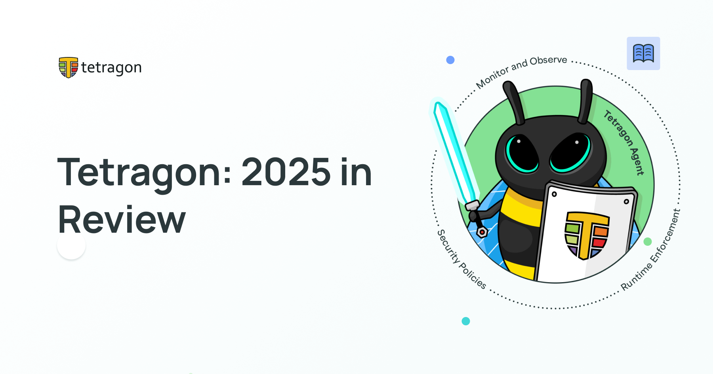

**_Author: Paul Arah, Isovalent@Cisco_**



As we close out another incredible year, we want to pause and say thank you to the entire Tetragon community. From contributors and maintainers to users, speakers, and the entire community, this year was shaped by your energy, curiosity, and commitment to advancing the standard of runtime security.

Tetragon has continued to grow because of the amazing people behind it: those writing code, testing edge cases, sharing feedback, publishing blogs, and teaching others what’s possible with eBPF-powered security observability and runtime enforcement. Together, we made meaningful progress both technically and as a community, laying a strong foundation for the future.

Below are some of the highlights that defined this year.

## Major Feature Highlights

### Tetragon for Windows (Preview)

This year marked an important milestone with the ongoing work to bring Tetragon’s security observability and runtime enforcement to the Windows ecosystem. The current preview already supports `process_exec_` and `process_exit_` events on Windows, opening the door to consistent, cross-platform visibility. While there’s more work ahead, this is a significant step toward expanding Tetragon’s reach beyond Linux.

### Persistent Enforcement

First introduced in the Tetragon 1.12 release in late 2024, persistent enforcement remains one of the most impactful features that shipped lately. With this persistent enforcement, enforcement policies continue running even if the Tetragon agent goes down, closing a critical security gap during agent restarts or failures. To enable persistent enforcement, configure Tetragon with `--keep-sensors-on-exit`. This ensures that when the tetragon process exits, enforcements policies stays active because they’re pinned in sysfs bpf tree under `/sys/fs/bpf/tetragon` directory.

### Flexible Enforcement Modes for Tracing Policies

This year also brought greater flexibility with the addition of enforcement modes. Tracing policies can now run in: Monitoring mode, where enforcement actions are ignored, or Enforcement mode, where policies are actively enforced. This makes it easier to test policies safely, validate behavior, and avoid unintended disruptions. Enforcement modes can be configured directly in the policy, at load time, or dynamically at runtime via gRPC.

### Attribute Resolution

Attribute resolution significantly improved the experience of writing tracing policies. It allows policy authors to dynamically extract specific attributes from kernel structures passed into kprobes and LSM hooks making policies more expressive and easier to reason about. For example, the policy below demonstrates extracting a parent process’s comm during binary execution:

```yaml
apiVersion: cilium.io/v1alpha1
kind: TracingPolicy
metadata:
  name: 'lsm'
spec:
  lsmhooks:
    - hook: 'bprm_check_security'
      args:
        - index: 0 # struct linux_binprm *bprm
          type: 'string'
          resolve: 'mm.owner.real_parent.comm'
      selectors:
        - matchActions:
            - action: Post
```

Using attribute resolution still requires you to read the kernel structure definitions to find what you’re looking for in the hook parameter attributes.

### Userspace Hooks (Uprobes & USDTs)

A major portion of userspace tracing support landed this year with uprobes and USDTs. These hooks allow Tetragon to attach directly to userspace functions and statically defined tracepoints, extending the same observability and enforcement model beyond the kernel. With userspace hooks, Tetragon now delivers deeper visibility into application behavior—bringing kernel-grade security insights to user-space programs.

### Community Voices

_One quote from a security engineer at a large social networking company captured this sentiment perfectly:
“The best situation is when other services and teams don't even realize that a security tool is running. That’s when you know you’ve done your job well, and that’s what Tetragon gives us… Tetragon had the best performance among all the tools we tested.”_

### Community Talks & Learning

The Tetragon community showed up in a big way across conferences, webinars, podcasts, and tutorials. In no particular order, highlights included:

- [Tetragon and eBPF for Network Engineers](https://www.youtube.com/watch?v=NZ2il-rZTUc)
- [eCHO Episode 196: Exploring Tetragon on Linux Servers](https://www.youtube.com/watch?v=Sjew34d7i1w)
- [Security Superpowers With eBPF and Tetragon - Liz Rice, Isovalent at Cisco](https://www.youtube.com/watch?v=u4lSpHSVZOw)
- [Agentic Bee: How To Get AI Agents To Talk To Tetragon](https://www.youtube.com/watch?v=YXl9xuIxylY)
- [Master Linux Security with Tetragon and Wazuh: Real-Time Monitoring and Seamless SIEM Integration](https://www.youtube.com/watch?v=Mfnrp3X1E-k)
- [Tetragon detects io_uring file access](https://www.youtube.com/watch?v=ujZnwkC08Hk&t=8s)

### User Stories & Blog Posts

This year also brought a steady stream of thoughtful user stories and technical deep dives, including:

- [Tetragon User Story: Why This Social Networking Company Made Tetragon a Default for their Kubernetes Clusters](https://cilium.io/blog/2025/04/15/tetragon-social-networking-user-story/)
- [Sinad User Story: Delivering Security and Observability for Workloads with Confidence](https://cilium.io/blog/2025/04/15/tetragon-user-sinad/)
- [Securing the Modern Process with Tetragon: Runtime Security for the Cloud-Native Kernel](https://cilium.io/blog/2025/11/4/process-tetragon/)
- [Linux Kernel Fundamentals for Effectively Writing Tetragon Tracing Policies](https://cilium.io/blog/2025/09/16/kernel-basics-for-tetragon/)
- [What is Runtime Security?](https://isovalent.com/blog/post/what-is-runtime-security/)
- [Why Tetragon Should Be Standard in Every Kubernetes Cluster: The Missing Runtime Security Layer](https://isovalent.com/blog/post/tetragon-security-standard/)

Each story reinforced a common theme: Tetragon is the standard for runtime security

### Looking Ahead

As we look toward the next year, we’re excited to keep building with you. More platforms, deeper visibility, stronger enforcement, and continued focus on performance and usability still remain the priority. Most importantly, we’re excited to continue growing a community that believes runtime security should be powerful, practical, and open.
Thank you for an amazing year of collaboration, learning, and progress. We can’t wait to see what 2026 holds for the Tetragon community.

Here’s to another year doing great things with eBPF and Tetragon. 💚🐝🐝🐝

See you in 2026!

For the Tetragon Community:

Paul Arah, Community Builder – Security
