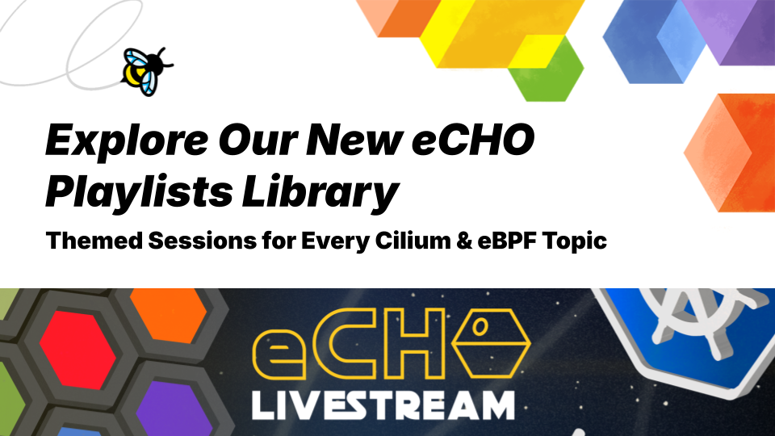

July 01st, 2025

Author: Donia Chaiehloudj, Isovalent@Cisco

eCHO (“eBPF & Cilium Office Hours”) is our weekly live-stream where maintainers, users, and special guests pull back the
curtain on all things Cilium, eBPF, Hubble, and Tetragon. Since episode #1 we’ve:

- Shipped 180 + sessions ranging from five-minute demos to full architecture deep-dives
- Answered live YouTube questions in real time
- Captured every recording so you can binge-watch at your own pace.

To make the library easier to navigate we’ve created theme-based playlist - think of them as fast-track learning paths.
Pick a topic, hit play, and work through the sessions in any order that fits your day. In total you’ll find 18 playlists,
grouped into seven themes that mirror the Cilium journey: Cilium in Production (installs and upgrades), Networking for Kubernetes
(policies and datapath), Runtime Security (Tetragon), Mesh Networking (service and cluster mesh), Gateway-API & Traffic Management,
All Things eBPF (development and observability), and Ecosystem & Community (releases, conferences, culture).

# 🚀 Cilium in Production

Running Cilium in a home lab is fun, but running it in anger across EKS, bare-metal, and on-prem clusters requires repeatable workflows and a few battle-tested tricks. The Cilium in Production playlist condenses those lessons into one place.

### What you’ll learn

- Choosing (and changing) data-plane modes on managed Kubernetes (EKS, AKS, GKE).
- Safe blue/green upgrades with Helm and Pulumi.
- Debugging the odd corner cases on OpenShift, vSphere, or air-gapped bare metal.
- Real-world migration stories from Calico, Flannel, and others.

<YoutubePlaylistGallery
playlists={[
{ id: 'PLDg_GiBbAx-m6W4UfeVxFNT5vtPDvel4a', label: 'eCHO Recaps: Deploying Cilium Playlist' },
{ id: 'PLDg_GiBbAx-mmWNec1zMhEal5f6WurrJL', label: 'eCHO Recaps: Cilium in the clouds Playlist' },
{ id: 'PLDg_GiBbAx-maWggVCCczWOWq4BxMZD5d', label: 'eCHO Recaps: Cilium with on-premise clusters Playlist' },
{ id: 'PLDg_GiBbAx-kTu6e-og1plHJAR1VNo6NN', label: 'eCHO Recaps: Migrating to Cilium Playlist' }
]}
/>

#### More resources

- Hands-on lab: [Install Cilium on EKS](https://isovalent.com/resource-library/labs/) – spin up a sandbox in minutes.
- Book: [Cilium Up and Running](https://isovalent.com/books/cilium-up-and-running/)

# 🌐 Networking for Kubernetes

Kubernetes ships with an “allow-all” networking and leaves the policy enforcement and performance tuning to your CNI.
The Networking for Kubernetes playlist tackles everything from first NetworkPolicy to packet-level performance tuning.

#### What you’ll learn

- Writing a default-deny policy and graduating to L7 HTTP and DNS rules.
- Following a single packet through XDP, tc, and the eBPF conntracker (“Life of a Packet”).
- Benchmarking NodePort vs Maglev vs BGP mode and knowing when to switch.
- Pros and cons of popular CNIs and why teams migrate to Cilium.

<YoutubePlaylistGallery
playlists={[
{ id: 'PLDg_GiBbAx-nD4ps3RpgRxc3oum6t51yB', label: 'eCHO Recaps: Cilium Network Policy Playlist' },
{ id: 'PLDg_GiBbAx-m2yEWqmYtD_yz1s7VLsHrl', label: 'eCHO Recaps: CNIs Playlist' },
{ id: 'PLDg_GiBbAx-nBjiLpW5QDGEZzQL1Y80Tz', label: 'eCHO Recaps: Life of a Packet Playlist' }
]}
/>

#### More resources

- Hands-on lab: [Isovalent Enterprise for Cilium: Network Policies](https://isovalent.com/labs/cilium-network-policies/)
- eBook: [Kubernetes Networking and Cilium for the Network Engineer](https://isovalent.com/blog/post/introducing-the-new-kubernetes-networking-and-cilium-for-the-network-engineer-ebook/)

# 🔀 Mesh Networking

Service-to-service and cluster-to-cluster traffic without sidecars or iptables tax. Two playlists cover both worlds.

#### What you’ll learn

- Stretching services across clusters with ClusterMesh fail-over.
- Integrating Envoy, and Gateway API without iptables overhead.

<YoutubePlaylistGallery
playlists={[
{ id: 'PLDg_GiBbAx-lTuFY7ho-N7NktqIgjhMDU', label: 'eCHO Recaps: Cilium Cluster Mesh Playlist' },
{ id: 'PLDg_GiBbAx-l5U7CdEHtg1DJL2kkOlPTE', label: 'eCHO Recaps: Cilium Service Mesh Playlist' }
]}
/>

#### More resources

- Hands-on lab: [Cilium Cluster Mesh Lab](https://isovalent.com/labs/cilium-cluster-mesh/), [Cilium Gateway API](https://isovalent.com/labs/cilium-gateway-api/)
- Blog post: [Cilium Mesh - One Mesh to Connect Them All](https://isovalent.com/blog/post/introducing-cilium-mesh/)

# 🔒 Runtime Security with Tetragon

Need process-level enforcement and instant CVE detection? The Tetragon playlist shows how eBPF can hook every `execve`,
file write, and socket call before turning them into actionable policies.

#### What you’ll learn

- Building allow/deny rules at PID & binary granularity.
- Detecting supply-chain attacks (e.g. XZ Utils CVE) in real time.
- Capturing least-privilege baselines for production workloads.

<YoutubePlaylistGallery
playlists={[
{ id: 'PLDg_GiBbAx-n-Jo3KifgM57-9FS83pOd8', label: 'eCHO Recaps: Tetragon Playlist' }
]}
/>

#### More resources

- Hands-on lab: [Tetragon Getting Started](https://isovalent.com/labs/tetragon-getting-started/)
- Blog post: [Detecting the XZ Utils CVE with Tetragon](https://isovalent.com/blog/post/ebpf-tetragon-xz-utils-cve-policy/)
- Doc: Quick-start guide — [docs.tetragon.io](http://docs.tetragon.io)

# 🐝 All Things eBPF

Whether you’re writing custom programs or just want better observability, these playlists cover the kernel side of life.

#### What you’ll learn

- eBPF architecture, verifier workflow, and key helper functions.
- Building custom programs and loaders with libbpf.
- End-to-end observability with BPFTrace, Hubble, and continuous profiling.
- Real-world use cases beyond containers like live VM migration by Loophole labs.

<YoutubePlaylistGallery
playlists={[
{ id: 'PLDg_GiBbAx-mxtjKVjFTooh6TpOlMlNsM', label: 'eCHO Recaps: eBPF powered runtime observability Playlist' },
{ id: 'PLDg_GiBbAx-nD4ps3RpgRxc3oum6t51yB', label: 'eCHO Recaps: Developing eBPF applications Playlist' },
{ id: 'PLDg_GiBbAx-k0eD5DDtci5MsHDVVOKotp', label: 'eCHO Recaps: eBPF performance' }
]}
/>

#### More resources

- Hands-on lab: [Getting started with eBPF](https://isovalent.com/labs/ebpf-getting-started/)
- Book: [Learning eBPF](https://isovalent.com/books/learning-ebpf/), O'Reilly book by Liz Rice

# 🎉 Ecosystem & Community

Stay current with release overviews, conference recaps, and behind-the-scenes chats with Cilium maintainers.

#### What you’ll learn

- Highlights and release notes for every Cilium, Hubble, and Tetragon release.
- Previews and recaps from KubeCon, eBPF Summit and more.
- Contributor AMAs, lightning talks, and behind the scenes culture stories.

<YoutubePlaylistGallery
playlists={[
{ id: 'PLDg_GiBbAx-nWmNVyJXSBc3ll-EDN70xx', label: 'eCHO Recaps: Releases Playlist' },
{ id: 'PLDg_GiBbAx-mPS0Y5X86Gj_M1D_gY-Zf4', label: 'eCHO Recaps: Conferences Playlist' },
{ id: 'PLDg_GiBbAx-mAs5fGNhVcr6QnTTp9Uvyt', label: 'eCHO Recaps: Community & Culture Playlist' }
]}
/>

#### More resources

- Blog posts:[Cilium Release 1.17](https://isovalent.com/blog/post/isovalent-networking-kubernetes-1-17/), [KubeCon Europe 2025 Wrap-Up](https://isovalent.com/blog/post/kubecon-europe-2025-wrap-up/)

# 👉 How to use this library

- Choose your theme above.
- Start the playlist episode.
- Read or try the linked blog or lab or download the eBook.

## Recap

| Theme                         | Playlist                                                                                                                        | Description                                                             |
| ----------------------------- | ------------------------------------------------------------------------------------------------------------------------------- | ----------------------------------------------------------------------- |
| **Cilium in Production**      | [**eCHO Recaps: Cilium in the Clouds**](https://www.youtube.com/playlist?PLDg_GiBbAx-mmWNec1zMhEal5f6WurrJL)                    | Installing and operating Cilium on EKS, AKS and GKE.                    |
|                               | [**eCHO Recaps: Deploying Cilium**](https://www.youtube.com/playlist?list=PLDg_GiBbAx-m6W4UfeVxFNT5vtPDvel4a)                   | Helm values, upgrades and CI/CD pipelines for day-2 ops.                |
|                               | [**eCHO Recaps: Cilium with on-premise clusters**](https://www.youtube.com/playlist?list=PLDg_GiBbAx-maWggVCCczWOWq4BxMZD5d)    | Blue/green roll-outs and war stories from other CNIs (Calico, Flannel). |
|                               | [**eCHO Recaps: Migrating to Cilium**](https://www.youtube.com/playlist?list=PLDg_GiBbAx-kTu6e-og1plHJAR1VNo6NN)                | Blue/green roll-outs and war stories from other CNIs (Calico, Flannel). |
| **Networking for Kubernetes** | [**eCHO Recaps: Cilium Network Policy**](https://www.youtube.com/playlist?list=PLDg_GiBbAx-nD4ps3RpgRxc3oum6t51yB)              | From default-deny to L7 HTTP/DNS rules and policy tracing.              |
|                               | [**eCHO Recaps: Life of a Packet**](https://www.youtube.com/playlist?list=PLDg_GiBbAx-nBjiLpW5QDGEZzQL1Y80Tz)                   | Step-by-step tour of a packet through the Linux datapath.               |
|                               | [**eCHO Recaps: CNIs**](https://www.youtube.com/playlist?list=PLDg_GiBbAx-m2yEWqmYtD_yz1s7VLsHrl)                               | Comparative dives into Cilium vs Calico, Flannel and more.              |
| **Runtime Security**          | [**eCHO Recaps: Tetragon**](https://www.youtube.com/playlist?list=PLDg_GiBbAx-n-Jo3KifgM57-9FS83pOd8)                           | Runtime process security and real-time CVE detection.                   |
| **Mesh Networking**           | [**eCHO Recaps: Cilium Cluster Mesh**](https://www.youtube.com/playlist?list=PLDg_GiBbAx-lTuFY7ho-N7NktqIgjhMDU)                | Multi-cluster service discovery, fail-over and global policies.         |
|                               | [**eCHO Recaps: Cilium Service Mesh**](https://www.youtube.com/playlist?list=PLDg_GiBbAx-l5U7CdEHtg1DJL2kkOlPTE)                | Sidecar-less service-mesh, Envoy filters and transparent mTLS.          |
| **eBPF**                      | [**eCHO Recaps: Developing eBPF Applications**](https://www.youtube.com/playlist?list=PLDg_GiBbAx-nD4ps3RpgRxc3oum6t51yB)       | Verifier tricks, helper functions and user-space loaders.               |
|                               | [**eCHO Recaps: eBPF-Powered Runtime Observability**](https://www.youtube.com/playlist?list=PLDg_GiBbAx-mxtjKVjFTooh6TpOlMlNsM) | Tracing, profiling and flow visibility with Hubble & BPFTrace.          |
|                               | [**eCHO Recaps: eBPF performance**](https://www.youtube.com/playlist?list=PLDg_GiBbAx-k0eD5DDtci5MsHDVVOKotp)                   | Measuring, benchmarking, and tuning eBPF programs.                      |
| **Ecosystem & Community**     | [**eCHO Recaps: Releases**](https://www.youtube.com/playlist?list=PLDg_GiBbAx-nWmNVyJXSBc3ll-EDN70xx)                           | What’s new in every Cilium, Hubble and Tetragon release.                |
|                               | [**eCHO Recaps: Conferences**](https://www.youtube.com/playlist?list=PLDg_GiBbAx-mPS0Y5X86Gj_M1D_gY-Zf4)                        | Key take-aways and demos from KubeCon, eBPF Summit and beyond.          |
|                               | [**eCHO Recaps: Community & Culture**](https://www.youtube.com/playlist?list=PLDg_GiBbAx-mAs5fGNhVcr6QnTTp9Uvyt)                | AMAs, contributor spotlights and behind-the-scenes stories.             |

# 📺 See you live!

- Subscribe on [YouTube](https://www.youtube.com/@eBPFCilium) and tap the bell 🔔 for stream reminders.
- Find all the notes for each episode on [HackMD](https://hackmd.io/@eCHO-live).
- Join our [Slack Workspace Cilium](https://slack.cilium.io/) for between episode chat.
- Submit your episode idea or guest request on [GitHub](https://github.com/isovalent/eCHO/issues/new/choose).

---

Happy watching and happy building with Cilium & eBPF! 🐝
