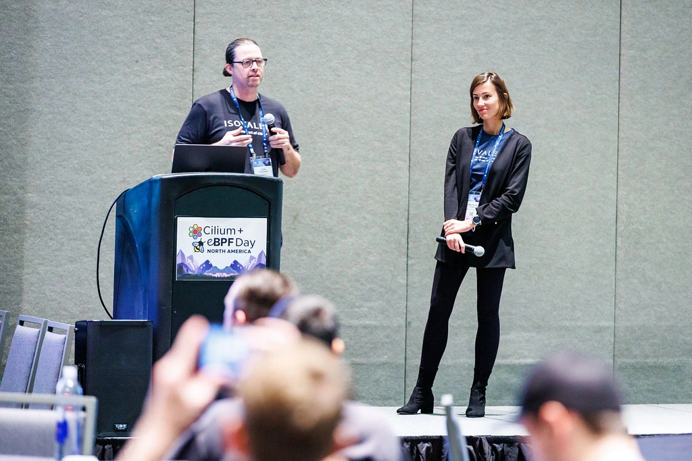

**_Author: Paul Arah, Isovalent_**

The Cilium community is buzzing to reunite again this April in London for KubeCon + CloudNativeCon EU and CiliumCon. As one of the most widely adopted open source projects in the cloud native ecosystem, Cilium continues to revolutionize networking, security, and observability. This year’s agenda for CiliumCon is designed to take you on a deep dive into the world of Cilium, Hubble, and Tetragon, featuring sessions led by end users, core contributors, and industry leaders. These talks cover everything from optimizing Cilium for performance and scale to exploring its role in bare metal machine learning workloads.

## Reminiscing KubeCon NA 2024 and Cilium + eBPF Day in Salt Lake City, Utah

The last time the Cilium community was at KubeCon + CloudNativeCon NA in Salt Lake City, Utah. KubeCon + CloudNativeCon NA was an immersive exploration into the world of Cilium, Tetragon, Hubble, and eBPF. Some of the biggest highlights include Cilium being voted the #1 most useful and mature Multi-Cluster Application Management tool in the CNCF end-user survey, Cilium Maintainer Joe Stringer being named CNCF Top Committer of 2024, and a lot of insightful talks from around the ecosystem.

Data from the KubeCon event’s team indicated that Cilium + eBPF Day at KubeCon was the most attended co-located event last year. This shows how much impact Cilium continues to have in the cloud native community and how the growth of the Cilium community continues to accelerate.

KubeCon NA 2024 featured [fantastic talks](https://www.google.com/url?q=https://cilium.io/blog/2024/10/04/cilium-kubecon-na-2024/) from well-known companies like Microsoft, eBay, Datagod, Samsung, Sony, Red Hat, and Reddit. If you want the one minute update from the project, check out the Keynote Cilium Project Update.

<iframe width="100%" height="600" src="https://www.youtube.com/embed/0_E-ta6GU8I?si=hxfwWyK1VDSCaW3I" frameborder="0" allow="accelerometer; autoplay; clipboard-write; encrypted-media; gyroscope; picture-in-picture" allowfullscreen></iframe>

## Anticipating CiliumCon and KubeCon + CloudNativeCon Europe 2025 Talks

This year’s CiliumCon promises excellent talks diving into the world of Cilium, Hubble, and Tetragon. Here’s a glimpse of what’s in store:

[CiliumCon | Welcome + Opening Remarks - Hemanth Malla, Program & Bill Mulligan, Co-Chairs](https://colocatedeventseu2025.sched.com/event/1u5f2/ciliumcon-welcome-opening-remarks-hemanth-malla-program-bill-mulligan-co-chairs)

Tuesday, April 1, 2025, 09:00 - 09:05 BST

The opening session for CiliumCon Europe 2025 by the co-chairs.

[That’s Just My Cup of Tea: Configuring Cilium for Performance and Scale - Liz Rice, Isovalent at Cisco & Neha Aggarwal, Microsoft](https://colocatedeventseu2025.sched.com/event/1u5f5/thats-just-my-cup-of-tea-configuring-cilium-for-performance-and-scale-liz-rice-isovalent-at-cisco-neha-aggarwal-microsoft)

Cilium’s out-of-the-box default settings prioritize compatibility over performance, making it easy to deploy and get started. However, for production-grade environments, it’s essential to tune the settings to unlock Cilium’s full potential for performance and scalability.

This talk will explore settings and options that make a real difference, from eBPF-based host routing and kube-proxy replacement to eBPF map sizing and multi-cluster setups. We’ll also look at cutting-edge features like BIG TCP and Netkit and future performance features the project has on the roadmap. Whether you’re looking to optimize your performance or scale to the next level, we’ll provide the tools to get your Cilium environment running at top speed—without “waiting for the kettle to boil”!

[High-Scale Networking for ML Workloads With Cilium - Luigi Zhou, G-Research](https://colocatedeventseu2025.sched.com/event/1u5f8/high-scale-networking-for-ml-workloads-with-cilium-luigi-zhou-g-research)

Tuesday, April 1, 2025, 09:45 - 10:10 BST

In G-Research’s ML environment of over 10,000 nodes, Cilium is used as the core network for on-premise, bare-metal clusters that scale to 1,000 nodes each. In this talk, we’ll discuss several Cilium features used in detail:

- Network policy to enforce strict security controls for segmenting and protecting market-sensitive information
- Host firewall to remove the need for external firewall appliances
- High-performance eBPF dataplane that directly improves ML job performance

We’ll also cover the implications of limiting Cilium’s identity labels to reduce policy map pressure, tuning conntrack garbage collection, and the performance implications of different policies at scale. Attendees will learn how to use Cilium’s built-in tools to observe and measure large deployments and what to look out for in large Kubernetes clusters.

[Sponsored Keynote: Cilium’s Honeycomb: Cultivating Technical Excellence in a Diverse Ecosystem - Donia Chaiehloudj, Isovalent at Cisco](https://colocatedeventseu2025.sched.com/event/1u5fB/sponsored-keynote-ciliums-honeycomb-cultivating-technical-excellence-in-a-diverse-ecosystem-donia-chaiehloudj-isovalent-at-cisco)

Tuesday April 1, 2025 10:15 - 10:20 BST

Join us as we celebrate the collective intelligence that forms Cilium's success. By highlighting diverse use cases, supported environments, users, and dedicated contributors, we will illustrate how this convergence of minds, ideas, and implementations cultivates technical excellence within the Cilium project.

[Improving Network Efficiency: The Power of Integrating Delegated IPAM With Cilium - Tamilmani Manoharan & Will Daly, Microsoft](https://colocatedeventseu2025.sched.com/event/1u5fE/improving-network-efficiency-the-power-of-integrating-delegated-ipam-with-cilium-tamilmani-manoharan-will-daly-microsoft)

Tuesday, April 1, 2025, 10:40 - 11:05 BST

Are you curious about how Azure integrated their native IPAM implementation with Cilium through the power of open standards? The secret is "Delegated IPAM," a widely used part of the CNI specification. Unlike other IPAM implementations that embed vendor-specific code in Cilium, delegated IPAM allows seamless integration with any platform using out-of-tree plugins. Azure users benefit from fast, scalable IPAM and native routing that avoids the encapsulation overhead of Cilium tunnel mode. Delegated IPAM acts as a bridge combining the benefits of both worlds without any compromises. Session participants will learn how to leverage delegated IPAM to provide similar integrations for cloud or on-prem environments with zero changes in the Cilium code.

[Simplifying Multi-Cluster Networking With Cilium and MCS-API: A Technical Deep Dive - Arthur Outhenin-Chalandre, Ledger & Marco Iorio, Isovalent at Cisco](https://colocatedeventseu2025.sched.com/event/1u5fH/simplifying-multi-cluster-networking-with-cilium-and-mcs-api-a-technical-deep-dive-arthur-outhenin-chalandre-ledger-marco-iorio-isovalent-at-cisco)

Tuesday April 1, 2025, 11:15 - 11:40 BST

Multi-Cluster Services API (MCS-API), a standard driven by SIG Multicluster, extends Services across multiple clusters and is now supported in Cilium. While Cilium already enables multi-cluster services via annotations, MCS-API support brings it to the next level: create a ServiceExport resource referencing an existing Service to make it available to all clusters, enjoy DNS integration through the clusterset.local domain, and support for advanced features like Gateway API. All complemented by EndpointSlice synchronization to enable external ingress controllers and more.

In this deep dive talk, expect to learn about the Cilium Cluster Mesh architecture, how we implemented MCS-API support, and all the lessons we learned. We’ll also demo scenarios unlocked by MCS-API support and hidden secrets like how we (ab)used the Kubernetes EndpointSlice controller to reconcile EndpointSlices from remote clusters with minimal code changes.

[Lightning Talk: Agentic Bee: How To Get AI Agents To Talk To Tetragon - Himal Kumar, FlowPulse.AI](https://colocatedeventseu2025.sched.com/event/1u5fK/cl-lightning-talk-agentic-bee-how-to-get-ai-agents-to-talk-to-tetragon-himal-kumar-flowpulseai)

Tuesday April 1, 2025 11:45 - 11:55 BST

Tetragon delivers powerful runtime security logs, offering unmatched granularity. However, these detailed insights can overwhelm users with an endless stream of alerts and events. Usual approaches include tracing policy tuning, aggregating, and then visualising data on dashboards, however, not everything is meant for human consumption.

This talk introduces a fresh approach: integrating Tetragon’s runtime telemetry with LLM-powered AI agents. By leveraging a simple Retrieval-Augmented Generation (RAG) architecture, we enable AI agents to automate workflows directly on top of Tetragon events. These agents can perform tasks such as correlating vulnerabilities with runtime context and extracting actionable insights for human consumption—without relying on dashboards.

[Lightning Talk: Mastering Zero Downtime Migrations Between Cilium Identity Allocation Modes - Anton Ippolitov, Datadog](https://colocatedeventseu2025.sched.com/event/1u5fN/cl-lightning-talk-mastering-zero-downtime-migrations-between-cilium-identity-allocation-modes-anton-ippolitov-datadog)

Tuesday April 1, 2025 12:00 - 12:10 BST

Cilium offers two options for storing security identities: KVStore mode and CRD mode. Both have their pros and cons when it comes to scalability, operational complexity, and cost.

Previously, there wasn't a straightforward method to migrate live Kubernetes clusters between these two modes without incurring downtime. In this talk, we'll discuss the challenges Datadog faced and our upstream contributions to seamlessly migrate hundreds of clusters from KVStore to CRD mode without causing network disruptions for users.

[Lightning Talk: High Availability for Cilium Egress Gateway - Angelo Conforti, Corner Banca SA](https://colocatedeventseu2025.sched.com/event/1u5fQ/cl-lightning-talk-high-availability-for-cilium-egress-gateway-angelo-conforti-corner-banca-sa)

Tuesday April 1, 2025 12:15 - 12:25 BST

Cilium is a leading CNCF project that has become the de-facto standard for Kubernetes networking. Among its many features is the Egress Gateway, which allows routing outgoing traffic from one or more workloads to a specific egress IP. However, this feature lacks built-in high availability, and the egress IP must be managed externally. The Cilium HAEgress Operator addresses this limitation by providing a high-availability solution for egress traffic, ensuring continuity during node failures through dynamic virtual IP migration between nodes.
This lightning talk introduces the project, its current state, and future developments to extend this standard Cilium feature.

[CiliumCon | Closing Remarks - Hemanth Malla, Program & Bill Mulligan, Co-Chairs](https://colocatedeventseu2025.sched.com/event/1u5fT/ciliumcon-closing-remarks-hemanth-malla-program-bill-mulligan-co-chairs)

Tuesday April 1, 2025 12:25 - 12:30 BST

The closing session for CiliumCon Europe 2025 by the co-chairs

[Simplifying the Networking and Security Stack With Cilium, Hubble, and Tetragon - Bill Mulligan & Anna Kapuścińska, Isovalent at Cisco; Dorde Lapcevic, Google; Amir Kheirkhahan, DBSchenker](https://kccnceu2025.sched.com/event/1tcxw/simplifying-the-networking-and-security-stack-with-cilium-hubble-and-tetragon-bill-mulligan-anna-kapuscinska-isovalent-at-cisco-dorde-lapcevic-google-amir-kheirkhahan-dbschenker?iframe=no&w=100%&sidebar=yes&bg=no)

Wednesday April 2, 2025 15:15 - 15:45 BST

oin us as we celebrate nearly a decade of Cilium, now the de-facto standard CNI for Kubernetes and a cornerstone of cloud native networking, observability, and security. This session provides updates on the latest Cilium release and showcases how its unified eBPF-powered stack is transforming Kubernetes environments by replacing fragmented toolchains with seamless, secure, scalable, and simplified solutions.

We’ll explore features like multi-cluster networking, scaling to 65,000 nodes, and service mesh use cases and dive into sub-projects Hubble for network observability and Tetragon’s security observability and runtime enforcement. Hear from contributors and adopters DB Schenker, Google, and Isovalent about how Cilium is simplifying the cloud native stack and solidifying its role as the comprehensive networking and security solution for modern cloud native architectures.

**Cilium Project Booth:** Finally, visit Cilium’s kiosk at 15B in the Project Pavilion to see live demos, explore new functionalities, and connect with the community.

Whether you are attending hands-on workshops, lightning talks, or networking with industry peers, you will find countless opportunities to interact with the Cilium community. Be sure to say Hi!

See you in London!
