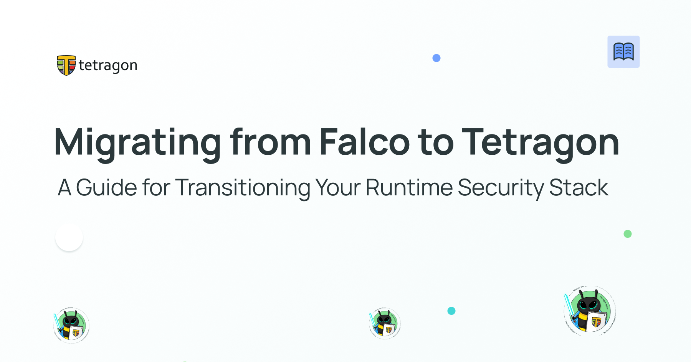
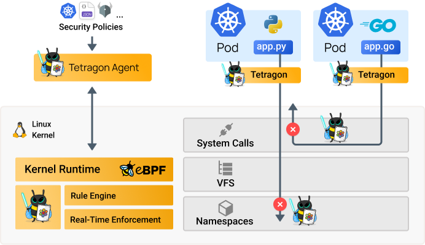

import authors from 'utils/author-data';



This guide helps current Falco users transition to Tetragon. It outlines key differences, explains how Falco constructs map to Tetragon, and addresses features without direct equivalents by suggesting alternative approaches. You’ll also learn how to integrate Tetragon into your runtime security stack. Whether you are migrating from Falco to Tetragon or considering it, this guide provides the background and technical details needed to make the transition confidently.

## How Tetragon Compares to Falco

Falco is primarily a visibility engine. It uses various event sources, including kernel modules, eBPF probes, and external plugins, to evaluate event streams against security rules and alert on suspicious activity. However, remediation actions such as killing a process or blocking a network connection must be handled externally. Teams often need to intervene manually, build automation pipelines, or integrate Falco with other tools for threat remediation. Tetragon takes a quite different approach. It offers deep kernel-level visibility and enforcement across the full spectrum of eBPF capabilities for observability, tracing, and security. These enforcement capabilities include killing offending processes, sending signals, overriding kernel function return values, and more. Tetragon security policies allow for a declarative description of what should be observed, what the system is allowed to do, and the corresponding enforcement actions when a security policy is violated.

Another core difference is Falco’s exclusive reliance on syscall monitoring for visibility. Falco automatically selects a set of syscalls to trace using the union between a base set of syscalls needed for its internal state management (eg: open, close, clone…) and the minimum set of syscalls required by the ruleset (adaptive syscall selection). While effective for many use cases, syscall-based monitoring can be susceptible to [TOCTOU (time-of-check/time-of-use) vulnerabilities](https://www.youtube.com/watch?v=yFl_ScKA300) where certain operations can occur between the syscall check and the actual kernel action, creating opportunities to evade monitoring.

Tetragon avoids this class of attacks by exposing the full spectrum of kernel primitives, including Linux Security Module (LSM) hooks, tracepoints, kprobes, and even uprobes. This lets users select observability and enforcement points that reflect the kernel's actual behavior. For example, file access policies can rely on LSM hooks rather than syscalls, ensuring decisions happen at the most authoritative point in the system.

This degree of flexibility that Tetragon offers also introduces a learning curve, and the level of depth requires users to consider which kernel hook points best match their security intent. Choosing the optimal hook point may require experimentation and familiarity with the kernel behavior for that specific security intent. But for users who care about deep kernel-level visibility and precise control, this is precisely the type of low-level control they seek.



Tetragon filters and aggregates events directly in the kernel using eBPF. In contrast, Falco sends raw events to userspace for rule evaluation. Tetragon only forwards “matched” events to userspace when they satisfy a policy, which significantly reduces the volume of data crossing the userspace/kernel boundary. As a result of this design, Tetragon is much less likely to drop events under high load.
Furthermore, Tetragon's performance advantage stems from its use of targeted kernel instrumentation points rather than broad system call monitoring. While Falco must hook into the entry/exit of every syscall to maintain visibility, Tetragon hooks directly into the specific kernel instrumentation point relevant to your policy. In real-world scenarios, this precision results in a much lower performance overhead.

There are additional advantages that Tetragon offers over Falco that this migration-focused guide cannot cover in detail. But in a nutshell, Tetragon is designed with a very lean performance footprint at scale. It can also observe operating system integrity, including kernel module activities and interactions with the eBPF subsystem. Because this visibility and enforcement operate at the kernel layer, Tetragon can even monitor the activities of other security tools, including Falco itself. Finally, Tetragon is cloud native, in a sense that it is able to react to Kubernetes state changes and relies upon native Kubernetes resources; Falco needs the recent falco-operator to have Kubernetes awareness.

## Migrating Falco Rules to Tetragon Tracing Policies

The rough equivalent of Falco rules in the Tetragon context is Tetragon tracing policies . Falco rules express conditions on syscall events or plugin-generated data; on the other hand, Tetragon tracing policies define which kernel hook points (kprobes, tracepoints, uprobes, LSM BPF) to attach to, which fields to extract from these hook points, and which corresponding enforcement or visibility actions to take.

However, not all Falco rules have a direct mapping to tracing policies. Some Falco rules depend on event sources that do not originate from the kernel and therefore cannot be expressed as Tetragon tracing policies. Although Tetragon ingests Kubernetes workload metadata and container runtime information to provide context for kernel events, it does not ingest Kubernetes audit logs, user-driven control-plane activity, cloud provider logs, etc. This means rules that rely on non-kernel event sources cannot be migrated into tracing policies. Some examples of Falco event sources that cannot be translated into Tetragon tracing policies include: Kubernetes Audit Events (API server audit logs, user actions, RBAC changes), AWS CloudTrail logs, Okta identity and authentication events, and most Falco external plugin events.

Tetragon is focused on kernel-level visibility and enforcement. As a result, rules based on these external sources should be fed into your SIEM or log analytics pipeline, where they can be correlated with Tetragon’s kernel and workload events to provide end-to-end context.

For Falco rules that rely on behaviors that are visible to the kernel, such as process execution, file access, privilege changes, networking activity, or syscall anomalies, you can translate them into their equivalent Tetragon tracing policies by selecting the appropriate kernel hook (LSM hooks, kprobes, tracepoints, etc.) and expressing conditions and enforcement logic there.

### Rewriting Falco Rules as Tetragon Tracing Policies

Falco Tetragon by default without any tracing policy loaded tracks all executions across Kubernetes clusters, virtual machines, and bare metal systems. This creates the foundation that allows Tetragon to attribute all system behavior back to a specific binary and its associated metadata (container, pod, node, and cluster).

NB: New users are often unclear about the scope of Tetragon’s default execution monitoring. Although Tetragon offers extensive visibility by default, it does not cover all scenarios. Many security intents require a specific Tracing Policy to be deployed. This confusion occurs because the default process execution monitoring already covers several important use cases, such as sudo invocations, SUID binary execution, and fileless execution, without extra configuration. For so many other security use cases, users must deploy a tracing policy. To support this, the Tetragon community offers a [vetted library of tracing policies](https://tetragon.io/docs/policy-library/observability/), which is an excellent starting point for users to explore writing tracing policies.
Consider this Falco rule below and see how we translate this into the equivalent Tetragon tracing policy. This Falco rule monitors attempts to access the /etc/shadow directory.

```yaml
- rule: Unauthorized Access to Sensitive Files
  desc: Detects attempts to access /etc/shadow by unauthorized users
  condition: >
    evt.type in (open, openat) and 
    fd.name = "/etc/shadow" and 
    not user.name = "root"
  output: >
    Unauthorized file access detected 
    (user=%user.name file=%fd.name command=%proc.cmdline container=%container.id)
  priority: WARNING
  tags: [filesystem, security]
```

There are multiple ways to go about writing the equivalent Tetragon tracing policy. For file access related tracing policies, LSM BPF is the recommended hook point because they always represent real enforcement points.

```yaml
apiVersion: cilium.io/v1alpha1
kind: TracingPolicy
metadata:
  name: 'block-sensitive-file-access'
spec:
  kprobes:
    - call: 'security_file_permission'
      syscall: false
      args:
        - index: 0
          type: 'file' # The file being accessed
      selectors:
        - matchArgs:
            - index: 0
              operator: 'Equal'
              values:
                - '/etc/shadow'
          matchActions:
            - action: Sigkill # Kill the process immediately
```

Tetragon tracing policies focus on behaviors rather than just events. The first step is to decide which behaviors to monitor, such as process execution or file access, and to define the security intent. Policies are then built around the basic operations that best show these behaviors.

### Migrating User-Defined Syscalls

Falco users often customize the syscalls monitored by Falco to optimize performance or focus on specific behaviors. This is typically achieved through Falco's adaptive syscall selection or user-defined syscall sets. During a migration, any syscall-based monitoring objectives must be mapped into their corresponding Tetragon tracing policies.

However, you will quickly discover that syscalls are not always the ideal hook point when crafting tracing policies. Syscall monitoring can be vulnerable to TOCTOU (time-of-check/time-of-use) issues and may miss crucial kernel-level state transitions. For example, when monitoring file access, relying solely on syscalls can create blind spots. In Tetragon, LSM (Linux Security Module) BPF hooks generally provide a more authoritative, real-time view of the action and are typically the better choice for both monitoring and enforcement.

Thus, migration is not always a 1:1 syscall translation; sometimes the optimal Tetragon hook point that best addresses your security intent is not a syscall at all, but could be a tracepoint or a kprobes for a specific kernel function. This blog post, titled [“Linux Kernel Fundamentals for Effectively Writing Tetragon Tracing Policies,”](https://cilium.io/blog/2025/09/16/kernel-basics-for-tetragon/) covers some prerequisite Linux fundamentals that can enable effectively writing good tracing policies.

### Rebuilding Your Alert Pipeline When Migrating From Falco to Tetragon

Falco users rely on Falcosidekick as a central component of their alert forwarding pipeline. Falcosidekick acts as an HTTP proxy for Falco events and provides a unified way to fan out alerts to chat platforms, storage services, SIEMs, incident-response tools, log stores, alerting systems, streaming systems, and more. It supports dozens of integrations out of the box.

When migrating to Tetragon, it is crucial to understand that there is no direct equivalent of Falcosidekick in the open source Tetragon ecosystem. Similar to Falco outputs, Tetragon emits events using a gRPC endpoint or JSON logs. It does not provide a built-in multi-destination alert routing layer like Falcosidekick. This layer can be achieved with minimal effort using a variety of tools in the CNCF open source ecosystem. With minimal effort, Tetragon can be integrated with SIEMs, incident response tools, log stores, and more.

### Conclusion

Beyond syscall monitoring, Tetragon extends runtime security to include deep kernel-level visibility and real-time enforcement, leveraging the full capabilities of eBPF. Successfully migrating from Falco to Tetragon requires a rethink of how security intent is expressed, choosing the appropriate kernel hook points for each security intent rather than relying exclusively on syscalls. Some Falco use cases, especially those derived from non-kernel event sources, will remain outside the scope of Tetragon and should instead be handled by SIEMs or log analytics platforms, where they can be correlated for full context.

Ultimately, what Tetragon offers is a powerful and authoritative foundation for runtime security, especially for teams that value enforcement, flexibility, performance, and kernel-level visibility. By understanding these differences and approaching migration as an opportunity to modernize your security architecture, you can transition from Falco to Tetragon with confidence and build a resilient runtime security stack that caters to the ever evolving security threat landscape.

## Additional Resources

- [Linux Kernel Fundamentals for Effectively Writing Tetragon Tracing Policies](https://cilium.io/blog/2025/09/16/kernel-basics-for-tetragon/)
- [Securing the Modern Process with Tetragon: Runtime Security for the Cloud-Native Kernel](https://cilium.io/blog/2025/11/4/process-tetragon/)
  [Tetragon Enterprise Distributions & Training](https://tetragon.io/enterprise/)

<BlogAuthor {...authors.PaulArah} />
