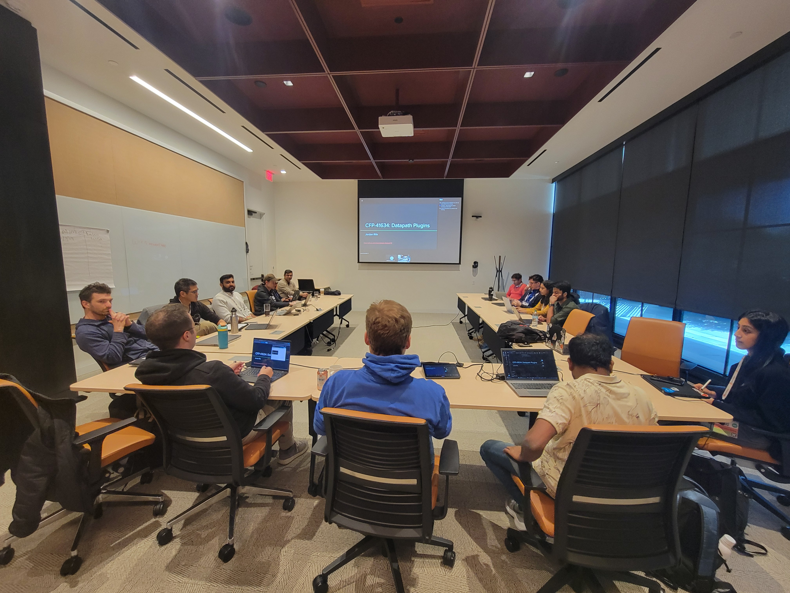

**_Author: Katie Meinders, Isovalent_**

As tulips begin to bloom across Amsterdam this March, the Cilium community is buzzing to reunite for [KubeCon + CloudNativeCon](https://events.linuxfoundation.org/kubecon-cloudnativecon-europe/) and [CiliumCon](https://events.linuxfoundation.org/kubecon-cloudnativecon-europe/co-located-events/ciliumcon/) Europe 2026. From ClusterMesh deployments spanning continents to eBPF-powered security at scale, this year's lineup showcases how Cilium continues to reshape networking, security, and observability across cloud native infrastructure. Here's your guide to the must-attend sessions and where to find the community during the show.

## CiliumCon

Join us on **Monday, 23 March**, for an afternoon of talks, community updates, and production use cases during CiliumCon. This year's agenda features end user stories from organizations like Roche and Etraveli Group, deep dives into new features like flow aggregation, and cutting-edge innovations including best practices for running Tetragon and multi-cluster networking at scale. Here’s a look at what you can expect:

[**Welcome + Opening Remarks**](https://colocatedeventseu2026.sched.com/event/2DZMa/ciliumcon-welcome-+-opening-remarks-hemanth-malla-mahe-tardy-program-committee-co-chairs?iframe=no)  
*Hemanth Malla & Mahé Tardy, Program Committee Co-Chairs | 13:25 - 13:30 CET*

Event co-chairs Mahé and Hemanth, will share the latest updates from the project and community.

[**Network Flow Aggregation: Pay for the Logs You Care About!**](https://colocatedeventseu2026.sched.com/event/2DY58/network-flow-aggregation-pay-for-the-logs-you-care-about-mereta-degutyte-anubhab-majumdar-microsoft?iframe=yes&w=100%&sidebar=yes&bg=no)  
*Mereta Degutyte & Anubhab Majumdar, Microsoft | 13:35 - 14:00*

Learn how a new flow aggregation feature reduces Hubble storage costs while maintaining observability quality through in-agent aggregation based on user-defined fields.

[**It Is Always DNS… Even at the Edge: Taming Proxy-Only Lookups With Cilium and eBPF**](https://colocatedeventseu2026.sched.com/event/2DY5u/it-is-always-dns-even-at-the-edge-taming-proxy-only-lookups-with-cilium-and-ebpf-hector-monsalve-roche-thomas-gosteli-tactummotum-gmbh?iframe=yes&w=100%&sidebar=yes&bg=no)  
*Hector Monsalve, Roche & Thomas Gosteli, TactumMotum GmbH | 14:10 - 14:35*

Discover how Roche is solving DNS challenges in protected environments where external lookups must occur through HTTP proxies, using Cilium's network policy traffic redirect and CoreDNS filtering, including a live demo.

[**⚡Lightning Talk: Accelerating Cilium: Our Journey on Offloading Cilium To DPU**](https://colocatedeventseu2026.sched.com/event/2DY66/cllightning-talk-accelerating-cilium-our-journey-on-offloading-cilium-to-dpu-vijay-inavolu-marvell-technologies?iframe=yes&w=100%&sidebar=yes&bg=no)  
*Vijay Inavolu, Marvell Technologies | 14:40 - 14:50*

See how Marvell is transparently offloading Cilium to DPUs with minimal code changes, including metrics on resource savings and a demo of hardware-accelerated security policies.

[**Sponsored Keynote - Built in the Open: Why Cisco Is Betting on eBPF, Cilium, and Tetragon**](https://colocatedeventseu2026.sched.com/event/2DZMf/ciliumcon-sponsored-keynote-tba-isovalent-at-cisco?iframe=yes&w=100%&sidebar=yes&bg=no)  
*Bill Mulligan, Isovalent at Cisco | 14:55 - 15:00*

Learn how, by investing upstream in Cilium, eBPF, and Tetragon, Cisco is aligning product innovation with community driven standards ensuring that what runs in Kubernetes today can extend consistently across clouds, data centers, and the network itself.

[**Connecting the World: Your Hands-on Guide To Cilium ClusterMesh and MCS-API**](https://colocatedeventseu2026.sched.com/event/2DY6j/connecting-the-world-your-hands-on-guide-to-cilium-clustermesh-and-mcs-api-arthur-outhenin-chalandre-ledger-quentin-swiech-s3ns?iframe=yes&w=100%&sidebar=yes&bg=no)  
*Arthur Outhenin-Chalandre, Ledger & Quentin Swiech, S3NS | 15:20 - 15:45*

S3NS shares their GitOps-ready blueprint for building secure multi-cluster platforms using ClusterMesh and Multi-Cluster Service API, scaling to hundreds of clusters worldwide.

[**Cloud Native Promises, On-Premises: Bump Your Load Balancing To V2 With Cilium**](https://colocatedeventseu2026.sched.com/event/2DY7S/cloud-native-promises-on-premises-bump-your-load-balancing-to-v2-with-cilium-mikael-johansson-lansberg-etraveli-group-ab?iframe=yes&w=100%&sidebar=yes&bg=no)  
*Mikael Johansson Länsberg, Etraveli Group AB | 15:55 - 16:20*

Learn how Etraveli Group replaced proprietary hardware appliances with Cilium's eBPF-powered load balancing to handle millions of daily flight searches with unified control and cloud native agility.

[**One Policy To Rule Them All? Scaling Tetragon Without Flooding Your Cluster**](https://colocatedeventseu2026.sched.com/event/2DY8B/one-policy-to-rule-them-all-scaling-tetragon-without-flooding-your-cluster-alessio-biancalana-suse?iframe=yes&w=100%&sidebar=yes&bg=no)  
*Alessio Biancalana, SUSE | 16:30 - 16:55*

SUSE explores per-workload security models with Tetragon, sharing techniques to achieve strong policy enforcement while minimizing performance and memory overhead at scale.

[**⚡Lightning Talk: What's Happening in Cilium? Current Projects You Need To See**](https://colocatedeventseu2026.sched.com/event/2DY8x/cllightning-talk-whats-happening-in-cilium-current-projects-you-need-to-see-martynas-pumputis-isovalent-at-cisco?iframe=yes&w=100%&sidebar=yes&bg=no)  
*Martynas Pumputis, Isovalent at Cisco | 17:00 - 17:10*

A fast-paced visual tour of major developments in the Cilium ecosystem, featuring video introductions from project authors themselves.

[**⚡Lightning Talk: Closing the Gap: Fair North–South Bandwidth Management for Tenants**](https://colocatedeventseu2026.sched.com/event/2DY8x/cllightning-talk-whats-happening-in-cilium-current-projects-you-need-to-see-martynas-pumputis-isovalent-at-cisco?iframe=yes&w=100%&sidebar=yes&bg=no)  
*Weizhou Lan, Daocloud | 17:15 - 17:25*

Daocloud presents a lightweight approach combining Cilium and Spiderpool to enable tenant-level ingress bandwidth management for load balancer services within Kubernetes.

## Featured KubeCon + CloudNativeCon Europe 2026 Talks

Beyond CiliumCon, you'll find Cilium featured throughout the main conference, from Bill Mulligan's celebration of Cilium's 10-year anniversary to Asana using invisible guardrails to create a secure platform with Cilium. Here are some of the highlights: 

[**Project Lightning Talk: Translating eBPF Into Business Value: Lessons From The Cilium Website**](https://kccnceu2026.sched.com/event/2EFwm/project-lightning-talk-translating-ebpf-into-business-value-lessons-from-the-cilium-website-bill-mulligan-maintainer?iframe=yes&w=100%&sidebar=yes&bg=no)  
*Bill Mulligan, Cilium Maintainer | Monday, 23 March | 09:52 - 09:57*

Practical patterns for translating deep technical capabilities into clear business outcomes through case studies and real-world results, without losing technical credibility.

[**10 Years of Cilium: Connecting, Securing, and Simplifying the Cloud Native Stack**](https://kccnceu2026.sched.com/event/2EF3l/10-years-of-cilium-connecting-securing-and-simplifying-the-cloud-native-stack-bill-mulligan-isovalent-at-cisco?iframe=yes&w=100%&sidebar=yes&bg=no)  
*Bill Mulligan, Isovalent at Cisco | Tuesday, 24 March | 14:30 - 15:00*

Celebrate Cilium's decade as the de-facto standard CNI with updates on the latest release, service mesh evolution, Tetragon's security observability, and how users are reshaping the cloud native stack.

[**Demystifying the Kubernetes Network Stack (From Pod to Pod)**](https://kccnceu2026.sched.com/event/2CW0A/demystifying-the-kubernetes-network-stack-from-pod-to-pod-simone-rodigari-microsoft?iframe=yes&w=100%&sidebar=yes&bg=no)  
*Simone Rodigari, Microsoft | Tuesday, 24 March | 17:00 - 17:30*

Trace a packet's journey through Kubernetes networking with diagrams and live demos, learning how CNIs like Cilium, kube-proxy, and DNS work together, plus practical debugging techniques.

[**From Classroom To Container: Teaching Distributed Systems With CNCF & Cloud Native Technologies**](https://kccnceu2026.sched.com/event/2CW2s/from-classroom-to-container-teaching-distributed-systems-with-cncf-cloud-native-technologies-matthias-haeussler-cgi?iframe=yes&w=100%&sidebar=yes&bg=no)  
*Matthias Haeussler, CGI | Wednesday, 25 March | 15:00 - 15:30*

A roadmap for integrating CNCF technologies like Cilium, Envoy, and OpenTelemetry into education, translating distributed systems theory into hands-on cloud native development.

[**Invisible Guardrails: Enabling Developer Velocity With a Secure Platform**](https://kccnceu2026.sched.com/event/2CW34/invisible-guardrails-enabling-developer-velocity-with-a-secure-platform-james-elias-sigurdarson-vignir-hafsteinsson-asana?iframe=yes&w=100%&sidebar=yes&bg=no)  
*James Elías Sigurðarson & Vignir Hafsteinsson, Asana | Wednesday, 25 March | 15:00 - 15:30*

Asana's approach to making the fastest developer path also the most secure, using Crossplane and Cilium to build invisible security guardrails directly into their platform.

[**Observing Chaos: Real-Time Monitoring of AI-Driven Kubernetes Destruction**](https://kccnceu2026.sched.com/event/2CW1T/observing-chaos-real-time-monitoring-of-ai-driven-kubernetes-destruction-josh-halley-cisco-ricardo-aravena-cncf?iframe=yes&w=100%&sidebar=yes&bg=no)  
*Josh Halley, Cisco & Ricardo Aravena, CNCF | Wednesday, 25 March | 17:30 - 18:00*

AI agents play DOOM against real Kubernetes workloads while OpenTelemetry and Cilium provide real-time observability, turning static chaos tests into adaptive challenges.

## A look back at KubeCon + CloudNativeCon and CiliumCon North America in Atlanta

This past November, the community gathered in Atlanta during KubeCon + CloudNativeCon and [CiliumCon North America](https://events.linuxfoundation.org/kubecon-cloudnativecon-north-america/co-located-events/ciliumcon/). CiliumCon attendees heard from Microsoft’s Shreya Jayaraman and Tamilmani Manoharan about scalable container networking with CiliumEndpointSlice, ESnet’s Kapil Agrawal about the organization’s use of Cilium for IPv6-only networking, and co-chair Hemanth Malla about parsing DNS in eBPF, plus much more.

Cilium was also featured in talks at other co-located events, including Cloud Native University, Observability Day, and VM on Kubernetes Day.

During the maintainers track, Bill Mulligan, Thomas Graf, and Neha Aggarwal [celebrated a decade of Cilium](https://www.youtube.com/watch?v=mCKwX74xIs4) as the de-facto standard CNI for Kubernetes, and looked ahead to the next ten years. Giri Kuncoro and Joseph Pallamidessi [shared insights](https://www.youtube.com/watch?v=y0qlhiKtDGo) into TikTok’s journey of making Cilium work for IPv6 only Kubernetes.

Contributors gathered during the [Cilium Developer Summit](https://github.com/cilium/dev-summits/blob/main/2025-NA/README.md) to discuss the project’s future, with representatives from Google, Isovalent, Microsoft, and more tackling topics like datapath plugins, scaling with network policies, and multi-network support. 

## Connect with the Cilium Community in Amsterdam

**Cilium Project Booth**: Be sure to visit Cilium’s booth in the Project Pavilion throughout KubeCon + CloudNativeCon for live demos, hands-on exploration of new features, and the chance to connect directly with maintainers, contributors, and community members. Whether you have technical questions, want to learn about contributing, or just want to share your Cilium story, stop by and say hello. We look forward to seeing you in Amsterdam!

Beyond the sessions, join us for hallway conversations, impromptu demos, and the chance to meet the contributors behind the features you use every day. Whether you're troubleshooting a deployment challenge, exploring new use cases, or considering contributing to the project, the Cilium community is here to help.
