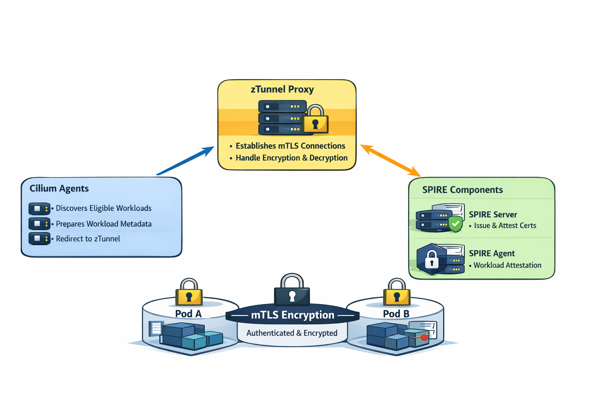

# Native mTLS for Cilium: Transparent Encryption Meets Cloud Native Identity

*Announcing native mutual TLS in the Cilium datapath — zero-drop, inline encryption with Kubernetes-native identity, no sidecars required.*



Today at [KubeCon + CloudNativeCon Europe 2026](https://events.linuxfoundation.org/kubecon-cloudnativecon-europe/) in Amsterdam, we are excited to announce **native mTLS support in Cilium** — a major step forward for transparent, zero-trust encryption in Kubernetes. This capability brings inline mutual TLS directly into the Cilium datapath, unifying authentication and encryption into a single operation. No sidecars, no dropped first packets, and no application changes required.

Mutual TLS has long been the gold standard for workload-to-workload security in cloud native environments, but achieving it has historically meant accepting significant operational complexity. With this release, Cilium eliminates that tradeoff.

## The Challenge: Authentication Without Encryption

Cilium's existing mutual authentication capability (introduced as beta in Cilium 1.14) was a significant innovation — using eBPF to verify workload identity at the datapath level. However, it addressed only half of the mTLS promise:

- **Authentication and encryption were separate concerns.** The mutual auth handshake proved identity, but actual traffic still traveled as plaintext unless IPsec or WireGuard was independently configured.
- **First packets were dropped.** When a new identity pair communicated for the first time, the initial packet was dropped while an out-of-band TLS 1.3 handshake completed between Cilium agents. Applications had to tolerate this retry penalty.
- **External dependencies were required.** A full SPIRE deployment was mandatory — adding infrastructure complexity for teams that simply wanted encrypted pod-to-pod communication.

The following diagram illustrates this existing flow:

```
                     FIRST PACKET (DROPPED)

  Pod A          BPF Datapath         Cilium Agent (A)       Cilium Agent (B)
    |                 |                     |                       |
    |-- 1. Packet --> |                     |                       |
    |                 |-- 2. Policy check:  |                       |
    |                 |   auth_type = SPIRE |                       |
    |                 |-- 3. auth_map       |                       |
    |                 |   lookup -> MISS    |                       |
    |                 |                     |                       |
    |   X DROPPED     |-- 4. Signal ----->>|                       |
    |                 |                     |-- 5. Get SPIFFE cert  |
    |                 |                     |   from SPIRE          |
    |                 |                     |== 6. TLS 1.3 ======>> |
    |                 |                     |   (out-of-band)       |
    |                 |                     |   7. Validate cert  <<|
    |                 |<<-- 8. Write -------|                       |
    |                 |   auth_map entry    |                       |


                     SUBSEQUENT PACKETS (ALLOWED, BUT PLAINTEXT)

  Pod A          BPF Datapath (A)                      BPF Datapath (B)    Pod B
    |                 |                                       |               |
    |-- 9. Packet --> |                                       |               |
    |                 |-- auth_map lookup -> HIT              |               |
    |                 |========= PLAINTEXT ================>> |-- forward --> |
```

While this approach is elegant for pure identity verification, it leaves a critical gap in environments that require confidentiality guarantees — which is, increasingly, every production Kubernetes cluster.

## Introducing Native mTLS: Ztunnel Integration

Cilium's native mTLS is powered by a [forked version of ztunnel](https://github.com/cilium/ztunnel) — a lightweight, per-node Rust proxy originally from Istio's ambient mesh — reengineered to integrate directly with the Cilium control plane and **SPIRE** as the certificate authority. We introduced native SPIRE support into ztunnel ([cilium/ztunnel#4](https://github.com/cilium/ztunnel/pull/4)), replacing the upstream CA dependency with SPIRE's Delegated Identity API. SPIRE is the **only** CA mode supported in Cilium's mTLS solution, providing a production-grade, [CNCF-graduated](https://www.cncf.io/projects/spiffe/) identity foundation.

Here is what this looks like in practice:

```
  Pod A             Ztunnel              Ztunnel              Pod B
  (enrolled)        (Node A)             (Node B)             (enrolled)
    |                  |                    |                    |
    |-- App traffic -->|                    |                    |
    |   (plaintext)    |                    |                    |
    |                  |                    |                    |
    |   PLAINTEXT      |  ENCRYPTED mTLS   |    PLAINTEXT       |
    |  --------------> |  ==============>  |  ----------------> |
    |                  |  HBONE tunnel     |                    |
    |                  |  HTTP/2 CONNECT   |  [ztunnel decrypts |
    |                  |  over mTLS 1.3    |   and delivers     |
    |                  |  to :15008        |   into pod]        |
    |                  |                    |                    |
```

**Every packet is encrypted.** There is no plaintext window, no dropped first packets, and no separate WireGuard or IPsec layer to configure. The connection is held inline by ztunnel until the mTLS tunnel is established, then traffic flows bidirectionally through an [HBONE](https://istio.io/latest/docs/ambient/architecture/hbone/) (HTTP/2 CONNECT) tunnel.

### How It Works

Traffic interception is handled through lightweight in-pod iptables rules — no sidecars, no CNI chaining:

1. **Pod enrollment**: When a namespace is labeled with `io.cilium/mtls-enabled=true`, the Cilium agent enrolls all pods in that namespace. It enters each pod's network namespace and installs iptables rules that redirect outbound traffic to ztunnel on port `15001`.

2. **mTLS tunnel establishment**: Ztunnel on the source node looks up the destination workload via XDS (streamed from the Cilium agent) and initiates an mTLS 1.3 connection to the destination node's ztunnel on port `15008`. The SPIFFE identity — `spiffe://<trust-domain>/ns/<namespace>/sa/<service-account>` — is embedded in the certificate and verified at both ends.

3. **Traffic delivery**: The destination ztunnel decrypts the traffic and delivers it into the target pod, bypassing the interception rules via an in-pod mark. The application sees a normal plaintext connection — it is completely unaware encryption happened.

4. **Certificate management via SPIRE**: Workload certificates are issued by **SPIRE**, the CNCF-graduated implementation of the SPIFFE standard. The Cilium operator automatically registers SPIRE entries for enrolled service accounts, and ztunnel obtains short-lived X.509-SVIDs directly from the local SPIRE agent via workload attestation. This provides a robust, standards-based identity foundation with automatic certificate rotation.

## Architecture Deep Dive

The control plane is cleanly split across the Cilium agent (per-node) and the Cilium operator (cluster-wide), following Cilium's Hive cell architecture.

### Agent-Side Control Plane

Each Cilium agent runs two servers that communicate with the local ztunnel instance, while SPIRE handles certificate issuance:

```
┌──────────────────────────────────────────────────────────────────┐
│  cilium-agent (per node)                                          │
│                                                                   │
│  ┌──────────────────────────────────────────────────────────┐     │
│  │ ZDS Server (Unix socket: /var/run/cilium/ztunnel.sock)   │     │
│  │ Pod enrollment/disenrollment via netns FD passing        │     │
│  └──────────────────────────────────────────────────────────┘     │
│  ┌──────────────────────────────────────────────────────────┐     │
│  │ XDS Server (Unix socket: /var/run/cilium/xds.sock)       │     │
│  │ Streams workload addresses + authorization policies      │     │
│  └──────────────────────────────────────────────────────────┘     │
│                              │                                    │
│                              ▼                                    │
│                         ztunnel proxy                             │
│                              │                                    │
│                              ▼                                    │
│                    SPIRE Agent (per node)                         │
│                    Workload attestation + X.509-SVID issuance     │
└──────────────────────────────────────────────────────────────────┘
```

- **ZDS (Ztunnel Discovery Service)**: Handles pod lifecycle. On enrollment, it enters the pod's network namespace, creates iptables redirect rules, and passes the netns file descriptor to ztunnel via protobuf over a Unix domain socket. On disenrollment, it cleans up.

- **XDS (xDS Discovery Service)**: Watches `CiliumEndpoint` and `CiliumEndpointSlice` resources and streams them as `istio.workload.Address` protos to ztunnel using gRPC Delta Aggregated Discovery Service (dADS). This tells ztunnel which workloads exist, their IPs, and whether they speak HBONE.

- **SPIRE Agent**: Runs as a DaemonSet alongside ztunnel on each node. Ztunnel obtains short-lived X.509-SVIDs (SPIFFE Verifiable Identity Documents) directly from the SPIRE agent through workload attestation. The SPIRE agent validates the workload's identity using Kubernetes selectors (namespace + service account) and issues certificates signed by the SPIRE server's trust chain.

### Operator-Side Control Plane

The Cilium operator handles cluster-wide SPIRE identity registration:

```
┌──────────────────────────────────────────────────────────────────┐
│  cilium-operator (cluster-wide)                                   │
│                                                                   │
│  Namespace Reflector ──► EnrolledNamespace Table (StateDB)        │
│  ServiceAccount Reflector ──► ServiceAccount Table (StateDB)      │
│                      │                                            │
│                      ▼                                            │
│           Enrollment Reconciler ──► SPIRE Server (entry CRUD)     │
└──────────────────────────────────────────────────────────────────┘
```

When a namespace is enrolled, the operator queries all service accounts in that namespace and creates corresponding SPIRE registration entries with SPIFFE IDs in the format `spiffe://<trust-domain>/ns/<namespace>/sa/<service-account>`, parented under `/ztunnel`. When a namespace is un-enrolled, those entries are cleaned up.

## Enrollment Model: Gradual Rollout by Namespace

A key design decision is that mTLS enrollment is **per-namespace**, controlled by a single label:

```yaml
apiVersion: v1
kind: Namespace
metadata:
  name: production
  labels:
    io.cilium/mtls-enabled: "true"
```

This gives platform teams a natural rollout mechanism: enable mTLS for individual namespaces as they are ready, without affecting the rest of the cluster. Mixed traffic scenarios work predictably:

| Source | Destination | Result |
|--------|-------------|--------|
| Enrolled | Enrolled | **Encrypted** (mTLS over HBONE) |
| Enrolled | Non-enrolled | Plaintext passthrough |
| Non-enrolled | Enrolled | Plaintext (captured by ztunnel, but not encrypted) |
| Non-enrolled | Non-enrolled | Normal Cilium datapath (no ztunnel involvement) |

Encryption only occurs when **both** pods are enrolled. Mixed traffic degrades gracefully to plaintext — no breakage, no hard failures.

## Why This Matters

### 1. Encryption by Default, Without Operational Overhead

Enrolled namespaces get mTLS with zero application changes. No code modifications, no sidecar injection, no certificate management burden on developers. Platform teams label a namespace and encryption is on.

### 2. No Dropped Packets

Unlike the existing mutual auth approach, ztunnel holds connections inline while the mTLS tunnel is established. There is no "first packet drop" penalty — connections succeed on the first attempt.

### 3. Kubernetes-Native Identity

Workload identity is expressed as `spiffe://<trust-domain>/ns/<namespace>/sa/<service-account>`, aligning directly with Kubernetes RBAC primitives. This is more natural and auditable than Cilium's numeric identity model used by legacy mutual auth.

### 4. Production-Grade Identity with SPIRE

Workload certificates are managed by [SPIRE](https://spiffe.io/), the CNCF-graduated reference implementation of the SPIFFE standard. SPIRE provides automatic certificate rotation, workload attestation via Kubernetes node and pod selectors, and a trust chain rooted in a dedicated SPIRE server. The Cilium operator automates SPIRE registration entry management — when a namespace is enrolled, all service account identities are automatically registered with SPIRE.

### 5. Ecosystem Convergence

By integrating ztunnel's L4 proxy capabilities with Cilium's eBPF-powered datapath and SPIRE's identity framework, this solution brings together three CNCF projects into a cohesive, standards-based mTLS stack. It establishes a clean path toward L7 waypoint proxies in the future, and it means Cilium users benefit from the combined innovation across the cloud native ecosystem.

## Comparison: Before and After

|                      | Existing Mutual Auth              | Native mTLS (Ztunnel)            |
|----------------------|-----------------------------------|----------------------------------|
| **Encryption**       | None (requires IPsec/WireGuard)   | Built-in mTLS on every packet    |
| **First packet**     | Dropped until handshake completes | Held inline — no drops           |
| **Identity**         | `spiffe://.../identity/<num-id>`  | `spiffe://.../ns/<ns>/sa/<sa>`   |
| **Enrollment**       | Per CiliumNetworkPolicy rule      | Per namespace label              |
| **Cert source**      | SPIRE only                        | SPIRE (automated registration)   |
| **Granularity**      | Per identity pair (BPF cache)     | Per workload pair (H2 mux)       |
| **App changes**      | None                              | None                             |

## Getting Started

Enabling native mTLS requires three things:

1. **Enable the ztunnel feature** in your Cilium Helm values:

```yaml
ztunnel:
  enabled: true
```

2. **Deploy ztunnel** as a DaemonSet (managed via Helm).

3. **Enroll namespaces** by adding the label:

```bash
kubectl label namespace <name> io.cilium/mtls-enabled=true
```

That's it. All pods in enrolled namespaces will automatically have their traffic encrypted with mTLS. You can verify the status with:

```bash
cilium status
```

The ztunnel component will appear in the output, showing enrollment state and certificate health.

## A Joint Effort: Microsoft and Isovalent

Native mTLS in Cilium is the product of a deep, joint engineering collaboration between **Microsoft** and **Isovalent** (the creators of Cilium, now part of Cisco). Microsoft's team has been given **maintainership of the ztunnel feature** in the upstream Cilium codebase, a reflection of the shared commitment to building this capability in the open, for the entire community.

The work spans multiple areas:

**Core control plane** — merged upstream into Cilium:
- Remote workload awareness ([#41945](https://github.com/cilium/cilium/pull/41945))
- ZDS server for pod enrollment ([#42364](https://github.com/cilium/cilium/pull/42364))
- Namespace-based mTLS enrollment ([#41944](https://github.com/cilium/cilium/pull/41944))
- XDS namespace filtering ([#43128](https://github.com/cilium/cilium/pull/43128))
- `cilium status` integration ([#43227](https://github.com/cilium/cilium/pull/43227))

**Datapath and deployment** — enabling production readiness:
- Idempotent in-pod iptables rules ([#42122](https://github.com/cilium/cilium/pull/42122))
- go-iptables library migration ([#42160](https://github.com/cilium/cilium/pull/42160))
- Helm-managed ztunnel DaemonSet ([#43763](https://github.com/cilium/cilium/pull/43763))
- Configurable SPIRE client ([#44136](https://github.com/cilium/cilium/pull/44136))
- Namespace enrollment reconciler for SPIRE ([#44275](https://github.com/cilium/cilium/pull/44275))

**Ztunnel fork** ([cilium/ztunnel](https://github.com/cilium/ztunnel)) — native SPIRE support:

A key piece of this collaboration was introducing native SPIRE support directly into ztunnel. Upstream ztunnel was designed exclusively for Istio's control plane and its built-in CA (istiod) — it had no concept of SPIRE as a certificate authority. We introduced SPIRE's Delegated Identity API into ztunnel ([#4](https://github.com/cilium/ztunnel/pull/4)), enabling ztunnel to obtain X.509-SVIDs directly from the local SPIRE agent via workload attestation. This includes PID-based attestation where each workload is individually verified by its container process ID, providing stronger security guarantees than metadata-only approaches. SPIRE is the **only** CA mode supported in Cilium's mTLS solution — there is no fallback to Istio's CA.

- Unix socket support for XDS ([#1](https://github.com/cilium/ztunnel/pull/1))
- Native SPIRE workload attestation via Delegated Identity API ([#4](https://github.com/cilium/ztunnel/pull/4))
- CI: container image build pipeline ([#7](https://github.com/cilium/ztunnel/pull/7))

**Testing** — comprehensive validation:
- Encryption connectivity tests ([#43229](https://github.com/cilium/cilium/pull/43229))
- Feature checks and e2e scenarios ([#43255](https://github.com/cilium/cilium/pull/43255), [#43803](https://github.com/cilium/cilium/pull/43803))

## Join Us at KubeCon Europe 2026

Come see native mTLS in action at [CiliumCon](https://events.linuxfoundation.org/kubecon-cloudnativecon-europe/co-located-events/ciliumcon/) and visit the Cilium project booth in the Project Pavilion throughout KubeCon + CloudNativeCon Europe 2026 in Amsterdam. Our team will be demonstrating the feature live and answering questions.

## Getting Involved

- [Cilium Documentation](https://docs.cilium.io/en/stable/)
- [Cilium GitHub](https://github.com/cilium/cilium)
- [Join the Cilium Slack](https://slack.cilium.io/)
- [Cilium Community](https://cilium.io/get-involved/)
- [CiliumCon Europe 2026](https://events.linuxfoundation.org/kubecon-cloudnativecon-europe/co-located-events/ciliumcon/)

---

*Native mTLS for Cilium — transparent, inline encryption with SPIRE-backed SPIFFE identity. No sidecars. No dropped packets. No compromises.*