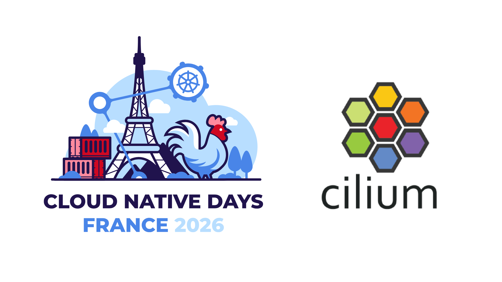
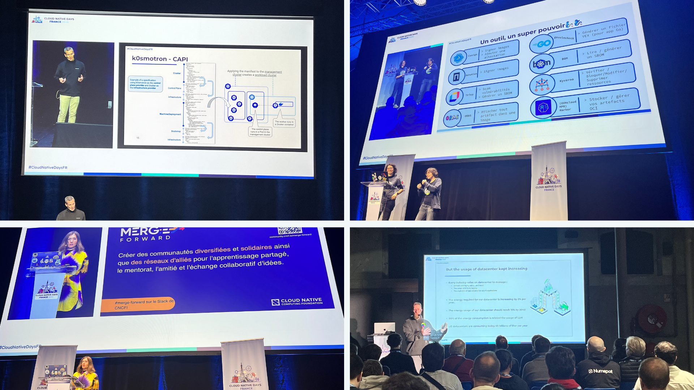
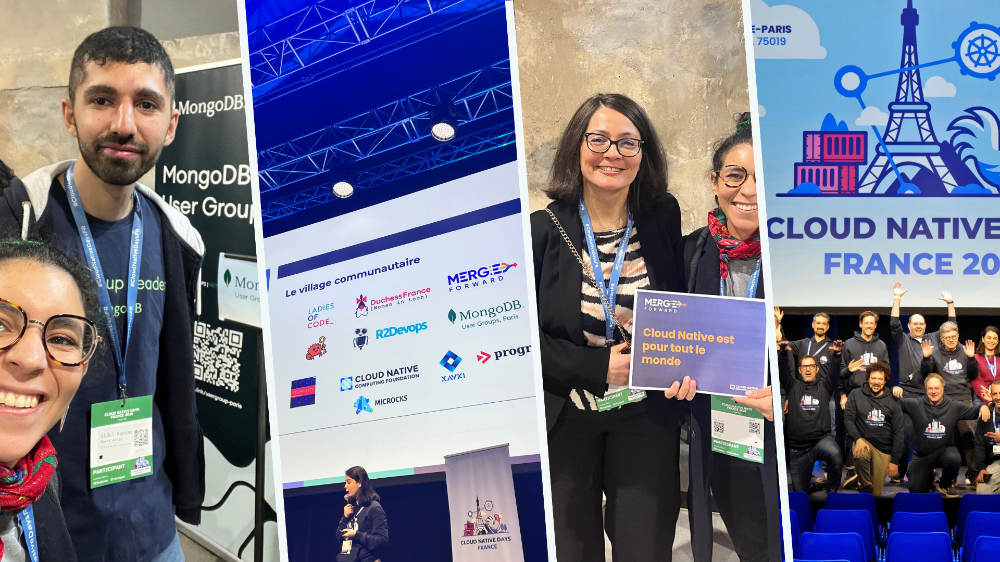

import coverImg from './cover.png'
import keynoteImg from './cndf-keynote.png'
import sessionsImg from './cndf-sessions.png'
import communityImg from './cndf-community.png'
import clustermesh1Img from './cndf-cilium-clustermesh1.jpg'
import clustermesh2Img from './cndf-cilium-clustermesh2.jpg'
import clustermesh3Img from './cndf-cilium-clustermesh3.jpg'
import dsr1Img from './cndf-cilium-dsr1.jpg'
import dsr2Img from './cndf-cilium-dsr2.jpg'
import lab1Img from './cndf-lab1.jpg'
import lab2Img from './cndf-lab2.jpg'

import authors from 'utils/author-data';

Two weeks ago, I attended **[Cloud Native Days France 2026](https://www.cloudnativedays.fr/)** for the very first time and it felt like stepping right into the heart of the French (and European) cloud native ecosystem.

More than **1,700 people**, **40 partners**, and **50+ talks** gathered at the CENTQUATRE-PARIS for a full day dedicated to Cloud Native, Kubernetes, DevOps, Open Source, and Platform Engineering.

Exactly the kind of conference where you want to be when you work on open source infrastructure.

## An opening keynote that set the bar very high

The day kicked off with an amazing keynote hosted by Jérôme Petazzoni, co-creator of Docker and one of the early voices who helped shape the modern DevOps movement. For many of us, his work influenced how we think about containers and infrastructure today. He's also an excellent speaker, sharp, funny, and incredibly clear.

Then came **Ricardo Rocha**, Chair of the CNCF Technical Advisory Board and Head of Infrastructure at CERN, with a mind-blowing talk:

**10 PB/s without exploding the budget, how CERN scales its infrastructure with cloud native and AI.**

With the next upgrade of the LHC (Large Hadron Collider), the massive particle accelerator at CERN, the amount of data produced by experiments will increase tenfold. We're talking about detectors generating petabytes of data every second, but the computing budget isn't increasing. They need to process 10× more data, with the same money.

To make that possible, CERN had to rethink its entire infrastructure, intelligently sharing GPUs and accelerators, supporting both large-scale batch processing and interactive workflows (yes, even SSH), running real-time AI models directly on detectors 100 meters underground, and embedding sustainability and carbon awareness directly into the architecture.

YouTube link: [Keynote d'ouverture Cloud Native Days France 2026](https://www.youtube.com/watch?v=lJXUhqHWCDo&list=PLmZ3gFl2Aqt_4_F40zEoUEweEctmtx4p2&index=1&t=5s&pp=iAQB)

## Cloud Native in the public sector

Another highlight was seeing open source used at the state level, with talks from DINUM (France's central digital government authority) and DGFIP (the national public finance administration) explaining how their inter-ministerial collaboration resulted in a shared, open source Kubernetes foundation powering government infrastructure.

Even more exciting was the announcement of closer collaboration with the CNCF, along with the intention to open-source parts of these projects. As a French engineer working in open source, that felt particularly meaningful, s because public investment, community, and long-term impact really align.

## Cilium… everywhere

And yes **Cilium was everywhere**.

### Multi-cluster networking, made real

The talk _"Le réseau multi-cluster, enfin simplifié"_ by **Arthur Outhenin-Chalandre** and **Quentin Swiech** was a perfect example of production-grade cloud native.

They gave a clear introduction to Cilium ClusterMesh, explained the architecture and configuration without hand-waving, and then… ran a live demo connecting two Kubernetes clusters, one in Paris, one in New York.

Seeing Hubble flows live, with packets moving across clusters and continents in real time demands huge respect for flawlessly pulling off live demos. Huge respect for pulling off live demos flawlessly.

YouTube Link: [REX Ledger - Le réseau multi-cluster, enfin simplifié : Guide pratique de Cilium ClusterMesh](https://www.youtube.com/watch?v=Zmakri4Kqyo&list=PLmZ3gFl2Aqt_4_F40zEoUEweEctmtx4p2&index=10&pp=iAQB0gcJCYcKAYcqIYzv)

<ImageGallery images={[
{ src: clustermesh1Img, alt: '' },
{ src: clustermesh2Img, alt: '' },
{ src: clustermesh3Img, alt: '' },
]} />

### Inside Cilium: Direct Server Return (DSR)

Another standout was _"Inside Cilium: Deep Dive sur DSR"_ by **Alexis La Goutte**.

In just 15 minutes, Alexis managed to demystify Direct Server Return, explain how eBPF and Cilium implement it efficiently, and visualize everything using Hubble and Wireshark.

Reducing latency, improving performance, and still keeping observability all explained clearly, keeping me awake even though it was directly after lunch.

YouTube Link: [Inside Cilium: Deep Dive sur DSR (Direct Server Return)](https://www.youtube.com/watch?v=1jAhnw18dn0&list=PLmZ3gFl2Aqt_4_F40zEoUEweEctmtx4p2&index=17&pp=iAQB)

<ImageGallery images={[
{ src: dsr1Img, alt: '' },
{ src: dsr2Img, alt: '' },
]} />

### Training at scale: 100,000 cloud native networking & security lab sessions

There was also a great session from my colleague Raphaël Pinson, "Training at scale: 100,000 cloud native networking & security lab sessions," where he shared how they built an interactive lab platform around Cilium, Tetragon, and Kubernetes more broadly. Using Kind, Containerlab, GitOps workflows, and distribution via Instruqt, these labs have already powered more than 100,000 hands-on sessions.

Do you want to test the labs? 👉 [https://isovalent.com/labs/](https://isovalent.com/labs/)

I've personally gone through several of these labs, and I genuinely love the approach: a ready-to-use, reproducible, ephemeral environment where you learn by doing. For me, that's the best way to learn, experiment, break things, observe what happens, and try again.

These labs help onboard engineers, support demos, validate new features, and are directly useful for customers who want a safe, hands-on environment to explore Cilium and Tetragon on their own. They also create feedback loops that continuously improve both the content and the product itself.

YouTube Link: [Formation à l'échelle: 100 000 sessions de labs réseau & sécurité cloud-native](https://www.youtube.com/watch?v=n_g60hLXZOk&list=PLmZ3gFl2Aqt_4_F40zEoUEweEctmtx4p2&index=32)

<ImageGallery images={[
{ src: lab1Img, alt: '' },
{ src: lab2Img, alt: '' },
]} />

## Hallway track > everything else

Beyond the talks, the real magic happened in the corridors. I randomly met several people running Cilium in production (always a good sign 😉), including [**Noe Charmet**](https://www.linkedin.com/in/charmet/), co-founder and CTO at [Shipfox](https://www.shipfox.io/), who shared how they operate highly optimized GitHub runners at scale. We discussed some of their current challenges and explored whether Tetragon could help, in particular how eBPF-based probes might bring deeper runtime visibility and stronger security signals with minimal overhead (and yes, their booth also had some very cool goodies, which never hurts to break the ice).

I also crossed paths with [**Edgar Oblette**](https://www.linkedin.com/in/eoblette/), who benchmarked Cilium against Istio in terms of CPU usage and power consumption during his internship at Orange.

## More great sessions (and too many to see all)

Like every good conference, Cloud Native Days FR forced some tough choices, with several strong talks running in parallel.

- **La famille k0s — simplifier le multi-cluster Kubernetes**, by **Luc Juggery (Exoscale)**, presented the k0s ecosystem and how its lightweight, pragmatic tooling helps reduce operational complexity when managing multiple Kubernetes clusters.

YouTube Link: [La famille k0s : une boîte à outils pour simplifier la gestion multi-cluster de Kubernetes](https://www.youtube.com/watch?v=Edo3e7KFqN8&list=PLmZ3gFl2Aqt_4_F40zEoUEweEctmtx4p2&index=14)

- **Du chaos à la clarté — VictoriaLogs & LogsQL**, by **Diana Todea (VictoriaMetrics)**, offered a clear and concrete look at building efficient, cost-effective logging pipelines using LogsQL, with strong integration into OpenTelemetry and Grafana.

YouTube Link: [Du chaos à la clarté : booster votre pipeline de logs avec VictoriaLogs et LogsQL](https://www.youtube.com/watch?v=la8coUmqriQ&list=PLmZ3gFl2Aqt_4_F40zEoUEweEctmtx4p2&index=6)

- **Questions pour un conteneur – édition Supply Chain**, by **Aurélie Vache** and **Shérine Khoury**, used an interactive format to make software supply chain security approachable while staying grounded in real-world concerns.

YouTube Link: [Questions pour un conteneur - édition Supply Chain](https://www.youtube.com/watch?v=FShI5Ot0Uxk&list=PLmZ3gFl2Aqt_4_F40zEoUEweEctmtx4p2&index=9)

- **Passons au cloud-native durable**, by **Henrik Rexed**, connected Kubernetes efficiency, AI workloads, and environmental impact, highlighting CNCF projects like Kepler, KubeGreen, and vCluster as concrete paths toward greener platforms.

YouTube Link: [Passons au cloud-native durable](https://www.youtube.com/watch?v=ZNo90IMUQyw&list=PLmZ3gFl2Aqt_4_F40zEoUEweEctmtx4p2&index=37&pp=iAQB)

Together, these sessions reinforced the key theme of the day. Modern cloud native systems must balance performance, cost, security, and sustainability, all at once.

## Communities at the core!

Cloud Native Days FR is a community-driven, francophone event with a strong focus on open source and concrete feedback from the field. Developers, SREs, platform engineers, architects, but also CTOs and decision-makers all shared the same space and same conversations.
That diversity really showed throughout the day: some talks were deeply technical, others more human or organizational. But all of them shared one thing, a desire to build sustainable, understandable, and production-grade cloud native systems.

The density of communities represented and the ease with which conversations started. Throughout the day, I crossed paths with members of [**Merge Forward**](https://community.cncf.io/merge-forward/), [**TechNovations**](https://technovationchallenge.org/fr/) (formerly Women Techmakers), [MongoDB user groups](https://www.meetup.com/pro/mongodb-user-groups/), including [**Stéphane**](https://www.linkedin.com/in/sestegra/), [**Ahlem**](https://www.linkedin.com/in/ahlem-jaouadi/), and [**Abdul**](https://www.linkedin.com/in/abed-attal/), with whom I had great conversations, as well as CNCF community contributors, all sharing the same curiosity and willingness to learn from each other.

These informal discussions, sometimes between two talks, sometimes at dedicated booths or while waiting for swag, were a strong reminder that beyond technology, the cloud native ecosystem is above all a network of people building, sharing, and growing together.

And the momentum doesn't stop there: the next major cloud native event in France will be [**Kubernetes Community Days Provence**](https://cloudnative-provence.fr/), taking place on **December 10th**. I am very excited to join the organizing team, so stay tuned, more to come very soon 🚀

And a huge shout-out to the volunteers who made the event run so smoothly. Conferences like this don't happen by magic.

<BlogAuthor {...authors.DoniaChaiehloudj} />
