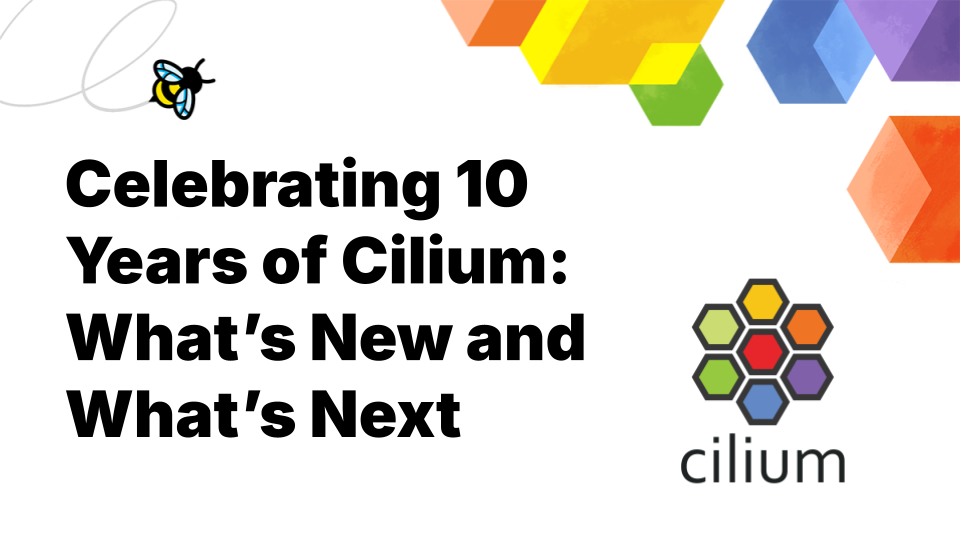

**_Author: Katie Meinders, Isovalent_**

Cilium is officially 10 years old and has firmly established itself as the default CNI for production cloud native deployments. It has been adopted by all of the major cloud providers, and, driven by customer demand, many other clouds and Kubernetes distributions are investing heavily in Cilium as their CNI of choice. According to the recent State of Kubernetes Networking report, Cilium represents over 60% of CNI deployments, more than double the next alternative.

This stability is also a reflection of the community behind the technology. Cilium is now made up of a growing community of over 1,010 developers, and the project now has over 23,600 GitHub stars. Annual development activity has grown 55x since year one, with nearly 10,000 PRs contributed in 2025 alone.

Looking ahead to the next decade, Cilium is already established as the networking data plane for AI. Microsoft and Google are already using Cilium to run some of the largest AI training clusters in the world. Organizations like ESnet and TikTok are running Cilium in IPv6-only data centers with massive scale. Simultaneously, Tetragon is positioned to redefine the runtime security landscape while tools like Cluster Mesh and KubeVirt together will enable organizations to run both VMs and containers on a consistent networking plane.

The Cilium community is coming together this week during CiliumCon and KubeCon + CloudNativeCon in Amsterdam to celebrate 10 years of the project and to align the roadmap with the workload demands of the next decade. Some of the recent project developments include the release of Cilium 1.19, a complete guide to the project with Cilium Up and Running, a new Children’s book, and new production case studies from OVHcloud and Zynga.

## Cilium 1.19 

Released in February, Cilium 1.19 continues the project's momentum with improvements across networking, policy, and observability.

- **ztunnel integration for mTLS:** Enroll namespaces into ztunnel for transparent Layer 4 mutual TLS (mTLS) pod to pod traffic, without requiring application changes. [Read more about the significance of this new feature and the work that has gone into it.](https://cilium.io/blog/2026/03/23/native-mtls-cilium/)
- **Expanded IPv6 support.** IPv6 support was added to both Cilium's L2 service advertising and tunnel networking, removing limitations for teams running IPv6-first or dual stack environments.
- **Multi-Pool IPAM reaches stable.** Multi-Pool IPAM graduated from beta to stable and got a meaningful upgrade. Teams can now assign pod IPs based on workload identity, enforce strict pool matching, and preserve real source IPs for routed traffic, giving operators both flexibility and security without tradeoffs.
- **Smarter DNS network policies.** A new wildcard prefix makes it easier to write DNS-based egress policies that cover full subdomain hierarchies in a single rule, reducing complexity and the risk of overly broad access permissions.
- **Hubble flow log aggregation.** Hubble can now aggregate flow logs before export, grouping traffic by namespace, service, or verdict over a set interval. For busy clusters, this dramatically reduces log volume while keeping the context needed for monitoring and analytics.

## Cilium Up and Running

[Cilium: Up and Running](https://isovalent.com/blog/post/cilium-up-and-running/), the latest book in O’Reilly’s “ Up and Running” series is now available.

The book is a complete guide to Cilium and covers all angles: use cases, configuration, and gotchas plus practical tutorials and an accompanying lab. It is for anyone with an interest in Kubernetes networking, whether just starting out or looking to add features in production workloads.

Nico Vibert, Filip Nicolic, and James Laverack spent more than a year writing, testing, refining the content based on hands-on experience and real world Cilium user feedback.

The book is available for purchase, a digital copy can be downloaded for free from Isovalent’s website, or signed copies will be available this week from Isovalent’s booth #730. 

## Cilium Children’s Book

Following the release of Buzzing Across Space: The Illustrated Children’s Guide to eBPF comes episode two, Buzzing Beyond Clouds: The Illustrated Children’s Guide to Cilium. The story follows Obee and L4LB as they seek to connect and protect the cloud native galaxy. 

To avoid the lure of the Dark Side, education for all, and particularly for children, is essential. This new story will take readers on a trip to a galaxy far, far away, and if you’re not already familiar with Cilium, you may learn a thing or two about the project, as well.

The book will be available as a digital copy on the Cilium website, and signed copies will be available this week from Isovalent’s booth #730.

## Cilium in Production: new case studies: Zynga and OVHcloud

Cilium now has nearly 100 case studies and production user stories, and more than 170 public adopters, with use cases growing increasingly sophisticated. This month, Cilium has published case studies with [OVHcloud](https://www.cncf.io/case-studies/ovhcloud/) and [Zynga](https://www.cncf.io/case-studies/zynga/).

OVHcloud adopted Cilium as the default CNI in its Managed Kubernetes Service, driven by customer demand and the need for a future-ready networking layer. Cilium's eBPF-based architecture reduces load on management clusters serving thousands of tenants, while advanced network policies enforce strict tenant separation at scale. "Many users want the ability to choose their CNI during cluster creation, and Cilium is the clear leader in this space,” said Joël Le Corre, Cloud Architect, Containers & Orchestration at OVHcloud.

At Zynga, the team migrated to Cilium to solve scalability challenges and consolidate their networking stack, replacing AWS VPC CNI, kube-proxy, and Istio with a single platform. By replacing kube-proxy with eBPF-based load balancing, conntrack entries dropped from around 300,000 per node, or 5x the default Linux limit, to effectively zero. "Once we switched over to Cilium, connection limits were no longer a concern. That issue is gone completely."

Both organizations already have new Cilium features on their roadmap. OVHcloud is exploring Cluster Mesh for multi-region connectivity, while Zynga is rolling out Gateway API and evaluating L7 network policies for more granular application-layer traffic control.

## Join Us in Amsterdam

Ten years in, Cilium is not just keeping pace with the demands of cloud native infrastructure — it is helping define what comes next. From AI training clusters at hyperscale to IPv6-only data centers, from a growing library of production case studies to a new O'Reilly book and a children's book, the project is as active and community-driven as ever.

If you're at [KubeCon + CloudNativeCon](https://events.linuxfoundation.org/kubecon-cloudnativecon-europe/) this week, come celebrate with us. Find the Cilium booth in the Project Pavillion, join the conversations at CiliumCon, and pick up a signed copy of Cilium: Up and Running and Buzzing Beyond Clouds at Isovalent’s booth #730. Here's to the next decade.

