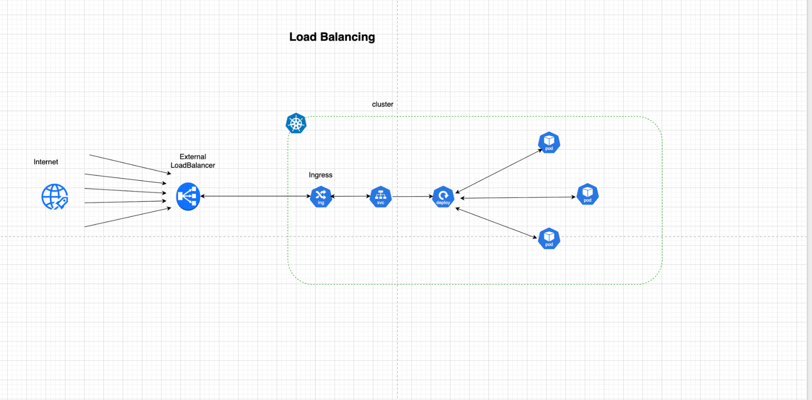
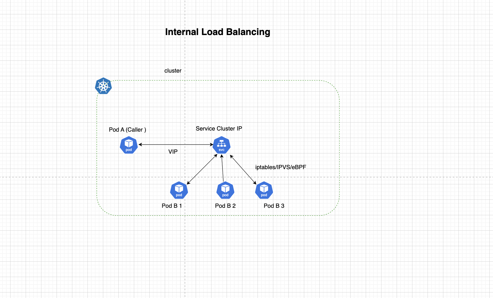
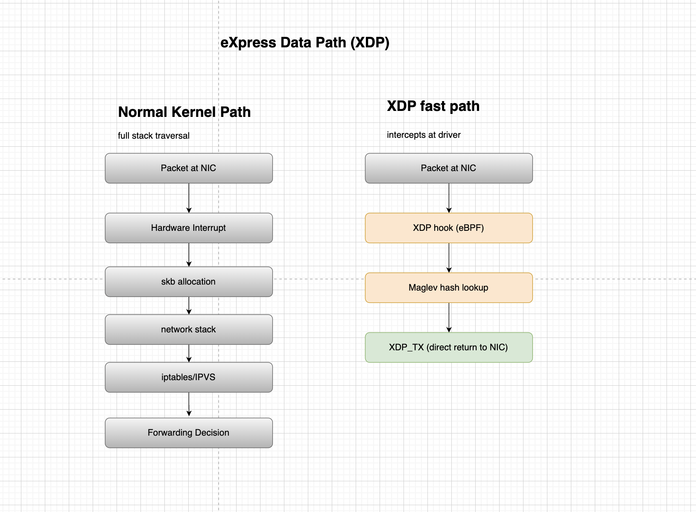

import authors from 'utils/author-data';

# Understanding Kubernetes Load Balancing

# I.Introduction

Since pods are ephemeral, constantly changing, replaced, scaled up, scaled down, and, the IP addresses change. To ensure proper utilization and desired performance, each healthy running instance of your application has to get a portion of the traffic. Traffic has to be distributed by load balancing between these instances; the distribution weight will depend on the algorithm.

**Kubernetes Load Balancing** is a means to distribute network traffic to application instances. This can be within the same cluster or different compute regions or clusters.

## Services in Kubernetes

Services are used to expose applications running inside the cluster behind a single outward-facing endpoint, even when the workload is split across multiple backends. This is what makes load balancing possible.

## Why Kubernetes Load Balancing?

The main goals that Load Balancing is trying to achieve are Service Reliability, Availability, and Performance (Horizontal Scalability).
Load balancing ensures reliability by using health checks and readiness probes to steer traffic away from failing pods. By distributing incoming requests across multiple replicas, it guarantees high availability, ensuring that the failure of a single pod or even an entire physical node does not result in application downtime.

# II.How does Kubernetes Load Balancing Work?

Speaking of Load Balancing in Kubernetes, clusters can be split into two perspectives.

## Types of Load Balancing

Not all load balancing works the same way. Different layers of the network stack offer different trade-offs between performance, intelligence, and flexibility. Understanding these distinctions helps in choosing the right approach for a given workload, whether you need raw throughput at the network edge or fine-grained routing logic at the application level.

### Internal Load Balancing

Internal load balancing refers to the distribution of traffic within a Kubernetes cluster itself among pods of the same application or service.
Kubernetes uses services to implement internal load balancing. For internal load balancing services with designated cluster IPs (reachable within the cluster), fit the purpose.

When pod A needs to talk to pod B inside the same cluster, it doesn’t use pod B’s direct IP; instead, it uses a Kubernetes service (stable virtual IP).
By default, Virtual IPs are managed by kube-proxy, a network agent running on each node. Kube-proxy watches the Kubernetes API for changes to Services and Endpoints and translates them into local networking rules.

Originally, this was done using iptables, which relies on sequential list processing, or IPVS, which improved performance through hash tables and advanced algorithms like Round-robin and Least Connection.

However, as clusters scale, the overhead of managing thousands of iptables rules can degrade performance. To improve performance, Cilium can replace kube-proxy and its iptables. By using eBPF, Cilium processes packets at the lowest level of the network stack without the context switching required by iptables. This provides significantly higher throughput, lower latency, and more granular security (Network Policies).

While kube-proxy is limited to Layer 4 (IP/Port), Cilium can perform Layer 7 (HTTP/gRPC) load balancing and observability, providing a more identity-aware networking layer that is both faster and more resilient at scale.

### External Load Balancing

External load balancing is the gateway that connects outside users to services running inside the cluster. While internal load balancing manages East-West traffic (pod-to-pod), external load balancing handles North-South traffic (internet-to-pod).

This is achieved through three primary methods:

- NodePort, which exposes a specific port on every node's IP.
- LoadBalancer, which integrates with infrastructure providers.
- Ingress, which acts as a Layer 7 smart router (handling hostnames and SSL), sits behind one of the aforementioned service types.

For users not running in a cloud environment, such as those on bare metal or on-premises data centers, Kubernetes does not have a native "out-of-the-box" load balancer implementation.

In these cases, tools like Cilium Load Balancer and MetalLB are used, acting as a software-defined load balancer that monitors the cluster and assigns a virtual IP (VIP) from a pre-configured range to the service. It then uses standard network protocols like ARP (Layer 2\) or BGP (Layer 3\) to announce to the local network that the service is reachable at that specific IP.
This allows local environments to have the same "Type: LoadBalancer" experience as cloud users without relying on a cloud provider's hardware.

## Layers of Kubernetes Load Balancing

In Kubernetes, load balancing happens across distinct layers of the OSI model, depending on where traffic originates and what information is needed to route it.

### Data Link Layer: L2-Aware Load Balancers

The Data Link layer is the second layer of the OSI model, responsible for node-to-node data transfer between directly connected devices.

L2-Awareness allows Kubernetes services to be reachable via Address Resolution Protocol (ARP) for IPv4 or Neighbor Discovery Protocol (NDP) for IPv6. Using a feature like Cilium L2 Announcements, a leader node responds to network queries by broadcasting its own MAC address as the destination for a Service's Virtual IP. This bridges the gap between the physical switch and the virtual cluster, making services visible on the local area network (LAN) without requiring complex routing protocols like BGP.

Before Kubernetes can distribute traffic to pods, the external network must first know which physical node in the cluster owns the Service IP. In cloud environments, this is handled by the provider’s Software Defined Network. However, in on-premises or bare-metal environments, the cluster must manage its own physical identity.

#### L2-Aware Load Balancing and Service Announcement in Cilium

An L2-aware load balancer is a networking solution designed to bridge the gap between a physical network (Layer 2 of the OSI model) and a virtualized environment like Kubernetes.

Standard load balancers usually operate at Layer 4 (IPs and Ports) or Layer 7 (URLs and Cookies), and an L2-aware load balancer handles the first mile of a packet's journey, finding the physical machine that owns a specific Virtual IP.

L2-Aware Load Balancer introduces the ability for Kubernetes services to be reachable via Address Resolution Protocol (ARP) announcements. L2 Announcements is a feature that makes services visible and reachable on the local area network. This feature is primarily intended for on-premises deployments within networks without BGP-based routing, such as office or campus networks or home labs.

When used, this feature will respond to ARP/NDP queries for ExternalIPs and/or LoadBalancer IPs. These IPs are Virtual IPs (not installed on network devices) on multiple nodes, so for each service, one node at a time will respond to ARP/NDP queries and respond with its MAC address. This node will perform load balancing with the service load balancing feature, thus acting as a north/south load balancer. To use this mode, Kube-proxy Replacement must be enabled.

**Failover and Availability**
To ensure that external traffic always has a reliable path into the cluster, Cilium implements an automated Failover mechanism. Since local networks typically associate a single Service IP with a single physical node at any given time, Cilium must ensure there is always one "active" responder while preventing conflicts where multiple nodes try to claim the same traffic.

**L2 Pods Announcements**
Layer 2-pod announcement is a means that allows individual pods to be directly visible on the local network by assigning each pod an IP address from the local network range and broadcasting its presence to the physical switch.

Read More: [https://docs.cilium.io/en/stable/network/l2-announcements/](https://docs.cilium.io/en/stable/network/l2-announcements/)

### Transport Layer: L4 Load Balancers

The transport layer is the fourth layer of the OSI model, responsible for managing end-to-end communication, flow control, segmentation, and error correction between host systems.

Once a packet has physically reached a node, Layer 4 load balancing determines which specific pod should receive it based on IP addresses and TCP/UDP ports. L4 load balancers are highly efficient because they do not inspect the data inside the packet; they simply forward traffic based on the connection header.

In Kubernetes, standard ClusterIP and LoadBalancer services operate at this layer. Traditionally managed by kube-proxy using iptables or IPVS, modern CNIs like Cilium now handle this via eBPF. This allows for high-performance North-South (external to internal) and East-West (pod to pod) distribution with minimal latency.

### Application Layer: L7 Load Balancers

The application layer is the top-most layer of the OSI model, which is a direct interface between end-user applications and the network.

Layer 7 Load Balancers operate using application contexts, including HTTP headers, URL paths, or gRPC methods. This allows advanced routing such as sending /api traffic to one set of pods and /web traffic to another. Ingress controllers and Application Load Balancers operate here.

# III. Cilium Standalone XDP L4 Load Balancer

XDP (eXpress Data Path) is a high-performance packet processing framework built on eBPF. Traditional load balancers process packets after the kernel has already done significant work; interrupts, buffer allocation, and traversing firewall chains. XDP skips all of that by intercepting packets as early as possible, before any of that overhead kicks in.

The Cilium XDP L4LB comes with full IPv4/v6 dual-stack support that can be deployed and programmed independently of Kubernetes.

Read More: [https://cilium.io/blog/2022/04/12/cilium-standalone-L4LB-XDP/](https://cilium.io/blog/2022/04/12/cilium-standalone-L4LB-XDP/)

## How Cilium Implements XDP L4LB

In a Cilium-managed cluster, the XDP load balancer operates as a "stand-alone" or "integrated" gateway. When an external packet destined for a Service IP hits the node:

1. XDP Hook: The eBPF program attached to the NIC intercepts the packet.
2. Maglev Lookup: Cilium uses a consistent hashing algorithm (Maglev) to select a backend Pod, ensuring that traffic from the same flow always hits the same destination.
   Kubernetes service load balancing implemented by Cilium or Kube-proxy selects backends randomly and ensures that the traffic remains sticky to that backend. In the case of node failure, the upstream load balancer selects a different load balancing node that has no context of the failed node. This can lead to an unexpected disruption on connection oriented protocols.
   Maglev consistent hashing minimizes such disruption by ensuring each load-balancing node has a consistent view and ordering of the backend lookup table.
3. Encapsulation/DSR: The packet is either encapsulated (VXLAN/Geneve) or sent via Direct Server Return (DSR) to the target node.
4. XDP_TX: The modified packet is sent back out the same interface immediately, completely bypassing the host's networking stack. XDP_TX is an XDP action that involves TX bouncing the received packet page back out the same NIC it arrived on.

Read More: [https://cilium.io/blog/2020/11/10/cilium-19/](https://cilium.io/blog/2020/11/10/cilium-19/)

## Operating Modes

L4 LoadBalancers work in two modes:

### Passthrough Mode

Packets are forwarded without inspecting application data, and the same TCP connection is used from the client to the backend. There is no connection termination in L4 LB. Connections are terminated by backend servers, and responses from backend servers are sent directly to clients with Direct Server Return (DSR). Pass-through LoadBalancers can not terminate SSL certificates.

### Proxy Mode

In this operating mode, the load balancer terminates a connection from the client and initiates a different connection to the downstream service. In proxy mode, the Load Balancer fully handles the TCP handshake, resulting in more flexibility for routing decisions to destinations.

# IV. Summary

Kubernetes load balancing is a critical architecture for managing traffic across ephemeral, scaled application instances. By decoupling fixed service endpoints from transient pod IP addresses, it ensures Service Reliability, High Availability, and Performance.

To achieve production-grade resilience, these layers use health checks and automated failover mechanisms. Whether through traditional proxy modes or high-performance passthrough with Direct Server Return (DSR) and Maglev consistent hashing, Kubernetes load balancing ensures that network traffic is distributed predictably and efficiently across the entire cluster lifecycle.

Cilium redefines this stack by replacing legacy components like kube-proxy and iptables with a unified, eBPF-native data path. This shift provides three distinct advantages across the networking layers **Foundation (L2/L3)** Cilium bridges the gap for on-premises and bare-metal environments, **Performance (L4/XDP)** By leveraging XDP (eXpress Data Path), Cilium processes packets at the earliest possible point in the network driver and **Intelligence (L7/Ingress)**, At the application level, Cilium provides identity-aware routing.

<BlogAuthor {...authors.CharityMbisi} />
