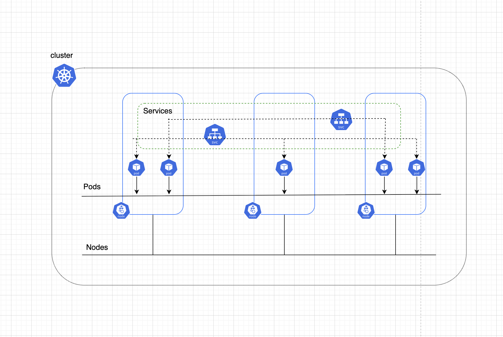
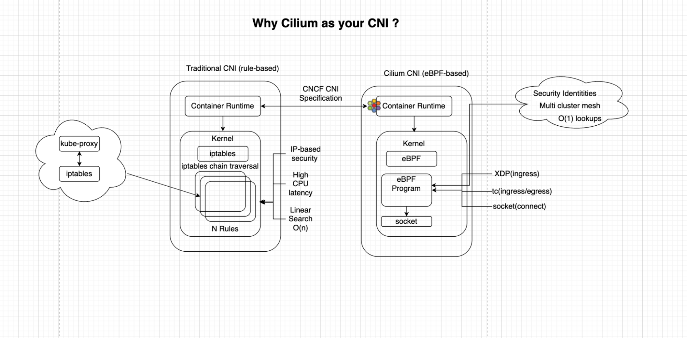
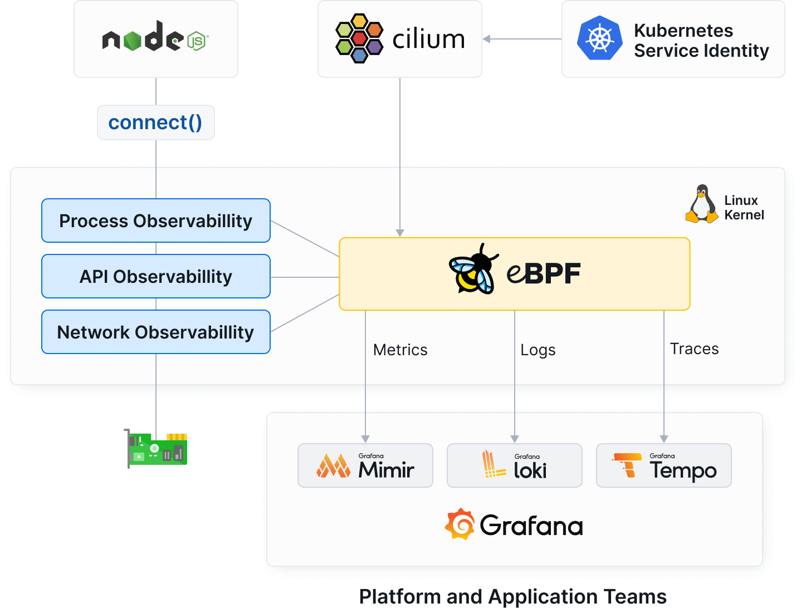
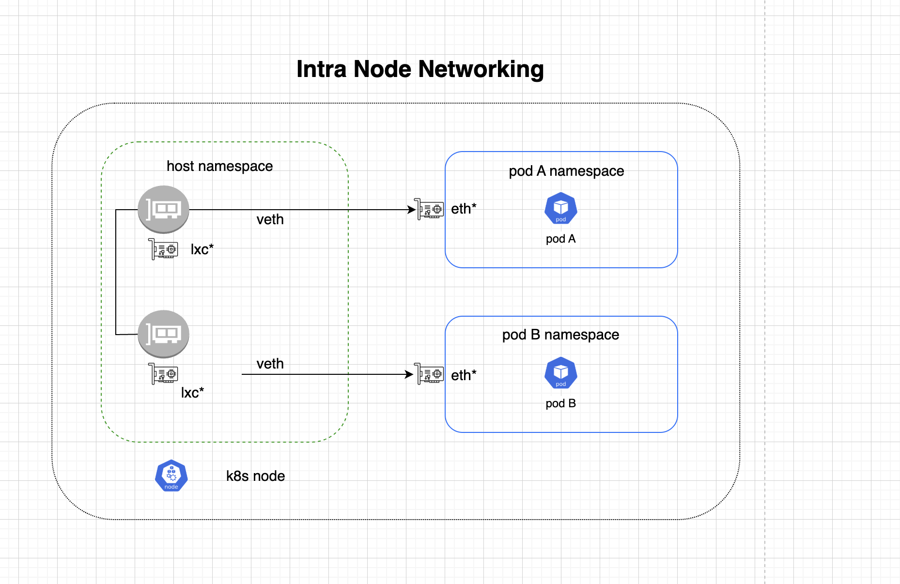
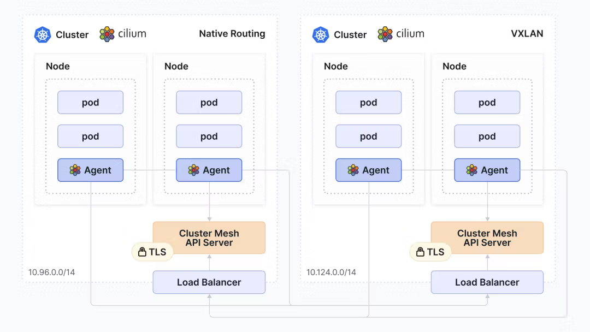

import authors from 'utils/author-data';

# Understanding Kubernetes Networking

# I.Introduction: Rules of the Game

Kubernetes is all about orchestrating applications across machines. Kubernetes networking enables communication across nodes, pods, and external services using a flat network[^1] structure and allows pods, services, nodes, and external resources to communicate inside a Kubernetes cluster. Container runtimes use an implementation of the Container Network Interface (CNI) specification to manage the network.

A CNI plugin is not built into Kubernetes itself. Instead, Kubernetes calls the network plugin when pods are created. A CNI plugin ensures all pods are assigned IPs, configures routes, and ensures that traffic reaches the destination.

### Fundamental Rules of Kubernetes Networking

- Flat Network Structure: all pods can reach each other without special gateways, whether on the same or different nodes.
- Every pod gets its own IP address. **The "IP-per-Pod" concept**

The goal is for each pod to have an IP in a flat shared networking namespace that has full communication with other pods across the network. IP-per-pod creates a clean, backward-compatible model where pods can be treated much like VMs or physical hosts from the perspectives of port allocation, networking, naming, service discovery, load balancing, application configuration, and migration.

- No Internal NAT: Internal pods communication doesn’t use Network Address translation.
- The same network namespace for containers inside the same pod: containers in the same pod share an IP address and share port space.
- Services as stable access points: services provide virtual IPs that map to backend pods.
- Overlay or underlay networks: Some CNIs use overlay networks to encapsulate traffic. Others rely on Layer 3 routing to encapsulate traffic.

Read More: [https://isovalent.com/blog/post/what-is-kubernetes-networking/](https://isovalent.com/blog/post/what-is-kubernetes-networking/)

### Core Networking Requirements

- Highly coupled Container to Container communications: containers within the same pod share the same network namespace. Communication is done via localhost.
- Pod-to-Pod communications:
  Every pod can communicate directly with any other pod across nodes without NAT since each pod is assigned a real IP. This enables all naming or discovery mechanisms to work out of the box.
- Pod to Service communications: A service is an abstraction of a group of pods. Services are assigned Virtual IPs proxied to pods in a service. Since pods are ephemeral workloads, they don’t need to care about pod IP changes; Kubernetes automatically tracks these via Service EndpointSlice. Kube-proxy keeps track of the iptables to track VIP services; Cilium does this smartly by replacing iptables with eBPF. With eBPF, packet decisions happen at the earliest hook, and faster network policy evaluation with a low CPU overhead.
- External to Internal communications: Exposing and accessing services, such as external services or databases, from outside the Kubernetes cluster.

Read More: [https://github.com/kubernetes/design-proposals-archive/blob/main/network/networking.md](https://github.com/kubernetes/design-proposals-archive/blob/main/network/networking.md).

### Why does traditional networking fail in a dynamic, containerized world?

Containerised environments run resources with an ephemeral nature, and hence it’s hard to have the same traditional networking principles.

# II. Why Cilium as your CNI?

Container Network Interface is a CNCF project that specifies the relationship between a Container Runtime interface (CRI), such as containerd, responsible for container creation, and a CNI plugin tasked with configuring network interfaces within the container upon execution.

Read More: [https://kubernetes.io/docs/concepts/extend-kubernetes/compute-storage-net/network-plugins/](https://kubernetes.io/docs/concepts/extend-kubernetes/compute-storage-net/network-plugins/)
[https://isovalent.com/blog/post/demystifying-cni/](https://isovalent.com/blog/post/demystifying-cni/)

Many CNI plugins satisfy basic Kubernetes networking requirements, but Cilium addressed the networking requirements with a different approach, building directly in the Linux kernel with eBPF.
eBPF allows Cilium to embed logic or programs into the Linux kernel dynamically.

The following are key capabilities that Cilium offers to support the Kubernetes networking model.

1. Performance and Scalability: Cilium avoids old routing technologies like iptables or IPVS that limit performance and scalability.
2. Identity-based security: Instead of managing security via ephemeral IP addresses, Cilium assigns a unique security identity to pods based on metadata. Most CNIs can enforce network policies at L3 and L4, but Cilium extends this capability to provide L7 control capabilities too.
3. Multi-cluster connectivity: Cilium provides the ability to connect multiple clusters across different clouds.
4. Transparent Encryption: Kubernetes lacks native pod-to-pod encryption. Two common solutions to this problem are embedding encryption within the application or using a service mesh. Embedding encryption within the app is complex and requires application and security expertise. Cilium provides a straightforward solution for enabling the encryption of all node-to-node traffic with just one switch, no application changes, or additional proxies.
5. Observability: Cilium's Metrics and Tracing export feature provides a seamless and integrated solution, empowering users to monitor, analyze, and optimize their Kubernetes environments with ease. By leveraging the power of Prometheus metrics, combined with Hubble's network behavior insights, Cilium enables users to gain deep visibility into their applications and network while simplifying the setup and configuration process.

# III.How do packets move?

After we have all pods allocated with IP addresses, here comes the Cilium data path. It is a set of eBPF programs Cilium uses to process, route, and forward packets within the Kubernetes cluster. The CNI determines the actual path that data takes through the Linux kernel and Kubernetes cluster.

## Building Blocks

1. Network Namespaces

Every pod is given an illusion to assume it’s running its own network namespace, providing a dedicated network stack (interfaces, routing tables, and firewall rules).

2. Veth Pairs

Virtual Ethernet (veth) pairs are connected virtual Ethernet interfaces that act as a tunnel between network namespaces. Data sent into one interface appears on the other, facilitating communication between isolated networking stacks.

## Layer 1: Intra-Node Networking

When packets are sent from pod A to pod B on the same host, packets exit the pod A namespace through the peer interface.

With a traditional CNI, this packet might be passed through slow iptables chains. Cilium instead intercepts this packet immediately using the eBPF program running on the veth pair interfaces. It then consults internal maps for security policies and identity. Hence, decisions are made directly in the data path at the earliest possible moment. This gives Cilium the capability to scale without CPU overhead. Finally, the packet is forwarded to pod B’s interface.

## Layer 2: Inter-Node Networking

When a packet is destined for a Pod on a different node, Cilium must decide how to move it across the physical network fabric. There are two primary routing models.

1. ### Native Routing Mode

In native routing, the underlying network is aware of your Pod IP address. In this mode, Cilium is more than just a CNI as it’s capable of BGP peering with your router or TOR devices. Cilium advertises all IP addresses it assigns to the router. In this setup, Cilium communicates directly with an external BGP-capable router, FRR. This allows external traffic to be routed directly to nodes. With this model, you need to think carefully about IPAM and address ownership, BGP peering topology and failure domains, route aggregation and scale, interaction between L2/L3 modes, and the physical network.

In native routing mode, when a packet from pod A in node A is dispatched, it’s routed through the host network stack and placed directly onto the physical network without any encapsulation. The underlying fabric uses the destination pod IP to route the traffic.

Read More: [https://docs.cilium.io/en/latest/network/concepts/routing/\#native-routing](https://docs.cilium.io/en/latest/network/concepts/routing/#native-routing)

2. ### Encapsulation/Overlay Mode

In overlay mode, Cilium creates a virtual “mesh” of tunnels over your existing physical network. By using UDP-based encapsulation protocols like VXLAN or Geneve, Cilium effectively abstracts the Pod network from the underlying infrastructure. Overlay mode hides the complexity of Pod IP addresses, meaning the physical switch or router only needs to know how to reach the Nodes, not the individual Pods.

#### How does the Data Travel

When a pod sends a packet, it transforms, leaving the host:

- The Inner Packet: Contains the original Pod-to-Pod data and the source/destination Pod IPs.
- The Outer Header: The original packet is wrapped (encapsulated) in a UDP header that uses the Node’s IP address as the source and destination.

Because the physical network only sees Node-to-Node traffic, connectivity is highly resilient.

#### The Trade-offs

While Overlay mode introduces a small amount of encapsulation overhead (extra bytes in the packet header), it provides operational simplicity. In this mode, Cilium creates a virtual network that sits on top of the existing physical infrastructure.

Read More: [https://docs.cilium.io/en/latest/network/concepts/routing/\#encapsulation](https://docs.cilium.io/en/latest/network/concepts/routing/#encapsulation)

| Feature     | Native Routing                                    | Encapsulated (Overlay)            |
| :---------- | :------------------------------------------------ | :-------------------------------- |
| Complexity  | High (requires configuration on physical network) | Lower (Works out of the box)      |
| Performance | High (no overhead)                                | Moderate (encapsulation overhead) |
| Visibility  | Pod IPs visible to the network                    | Pod IPs hidden from the network   |

# IV. Service, Service Discovery & Cluster DNS

Since pods are ephemeral and each time a new pod spins up, it is assigned a different IP address by the CNI, other applications and clients need to use pod identities that do not change. A group of pods running an application is exposed as a network application using services. Services in Kubernetes are just an abstraction to help expose groups of pods over the network.

A Service defines a logical set of endpoints (pods) aligned with a policy on how to make those pods accessible. The set of pods targeted by a service is determined by a label selector, which identifies pods based on assigned key-value pairs.

Every service is assigned a DNS name that maps to the cluster IP of the service.

## Service Types

The following are the kinds of services supported in Kubernetes:

1. ### Cluster IP

Exposes a service using an IP address that is accessible only within the cluster. This is a default type when a service type is not specified. You can ingest traffic from the public internet to a cluster IP service using ingress or the Gateway API.

2. ### NodePort

Exposes a service on each node's IP at a static port. Kubernetes creates a Cluster IP to which the node port traffic will be forwarded.

3. ### LoadBalancer

Exposes the service externally using an external LoadBalancer. Traffic from the external LoadBalancer is directed to the backend pods. While Cloud providers (like AWS or GCP) automatically provision a managed load balancer for this purpose, Bare Metal environments require a specialised controller to handle this traffic.
In bare metal environments, Cilium facilitates this in two primary ways: Border Gateway Protocol (BGP) and L2 Announcements.

4. ### ExternalName

Maps the service to a DNS name rather than a set of Pods. Instead of using selectors to route traffic to internal Pods, it acts as a Canonical Name (CNAME) record within the cluster’s DNS.
When a Pod tries to reach a service of kind externalName, the cluster’s DNS service returns the value defined in the externalName field instead of a cluster IP.

5. ### Headless

A Headless service is a service that allows a client to connect to whatever Pod it prefers, directly.
Headless services don't configure routes and packet forwarding using virtual IP addresses and proxies; instead, headless Services report the endpoint IP addresses of the individual pods via internal DNS records, served through the cluster's DNS service. Headless services are useful for stateful applications.

Read More: [https://kubernetes.io/docs/concepts/services-networking/service/](https://kubernetes.io/docs/concepts/services-networking/service/)

## Cluster DNS

Cluster DNS can be set using add-ons. DNS stands for Domain Name System. It provides a naming system for computers on the Internet. It translates domain names to IP addresses. In a cluster, services are accessed with service names. The Kubernetes DNS server is the only way to access externalName services.

## Service Discovery

Service discovery in Kubernetes may be provided in different ways; DNS-Based Service Discovery is the most common means of discovery and the recommended method.

When a Service is created, the Cluster DNS automatically generates records mapping the Service name to its corresponding Cluster IP, allowing applications to communicate via stable hostnames rather than volatile IP addresses. To facilitate this, the Kubelet configures each Pod’s /etc/resolv.conf file to point toward the internal DNS service, enabling containers to perform lookups natively. This resolution is context-aware: while a standard query is scoped to the Pod's local namespace by default, services in other namespaces can be reached by using their Fully Qualified Domain Name (FQDN), ensuring precise service discovery across the entire cluster.

## Virtual IPs and Service Proxies

Every node runs a kube proxy (if not replaced completely). Kube proxy implements a virtual IP mechanism for services of type other than ExternalName. Kube proxy watches the control plane for the addition or removal of service and endpointSlice objects. In most deployments of Cilium, kube-proxy is replaced completely by eBPF programs.

## How Cilium Optimizes Service Discovery?

While Kubernetes manages DNS records, Cilium handles high-performance routing that makes discovery work at scale.

- eBPF vs. iptables: traditionally kube-proxy uses iptables rules to route traffic. Cilium replaces this with eBPF hash lookup tables, which are very optimized.
- DNS queries visibility: With Hubble, you can see which pods are querying DNS records and whether those queries are succeeding or not.
- DNS proxy: Cilium uses a DNS proxy to listen for DNS traffic. This adds a layer of granularity for security enforcement. This allows you to write security policies based on FQDN and not only IPs.

# V. Summary

The Kubernetes networking model requires an understanding of the shift from static, physical infrastructure to dynamic, software-defined environments. While the fundamental rules, such as the IP-per-Pod model and Flat Network Structure, provide the necessary consistency for distributed applications, traditional networking tools often struggle to keep pace with the ephemeral nature of containers.

Cilium doesn't just fulfill the CNI specification; it has become the industry-standard foundation for cloud native infrastructure by moving networking logic directly into the Linux kernel via eBPF. This shift has led to massive adoption across the ecosystem, with major cloud providers (including Google, AWS, and Azure) choosing Cilium as their default networking layer. As a CNCF-graduated project with a vibrant, global community, Cilium has effectively set the new benchmark for networking, security, observability, and scale in the modern enterprise.

As organizations increasingly deploy compute-intensive AI and machine learning workloads across hybrid environments, the requirements for security, observability, and operational scale have become non-negotiable. Cilium has set a standard in Kubernetes networking by leveraging eBPF to provide the high-performance, identity-based networking infrastructure necessary to meet these modern demands.

[^1]: Flat network is a network architecture where all devices can communicate to each other without going through any NAT.

<BlogAuthor {...authors.CharityMbisi} />
