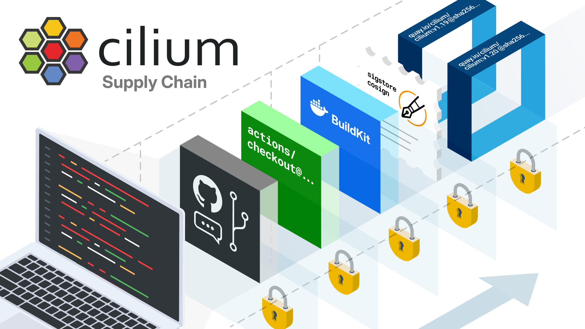

import authors from 'utils/author-data';

<style>{`
  .supply-chain-post pre { font-size: 0.82em; line-height: 1.45; }
`}</style>



<div className="supply-chain-post">

The last twelve months have been rough on the open source supply chain. [Axios was compromised on npm](https://www.stepsecurity.io/blog/axios-compromised-on-npm-malicious-versions-drop-remote-access-trojan) and shipped a remote access trojan inside otherwise normal-looking releases. [LiteLLM's PyPI package was hijacked](https://futuresearch.ai/blog/litellm-pypi-supply-chain-attack/) to exfiltrate environment variables. [Typosquatted forks of Trivy](https://rosesecurity.dev/2026/03/20/typosquatting-trivy.html) were published to catch people who fat-finger `go install`. And the canonical example, the [2020 SolarWinds breach](https://en.wikipedia.org/wiki/2020_United_States_federal_government_data_breach), is still the cautionary tale we keep coming back to: attackers got into the build system and pushed malware through normal Orion updates to roughly 18,000 organizations, including U.S. federal agencies, NATO, and Microsoft. The malware sat dormant for months. The breach went undetected for the better part of a year.

Cilium runs in the kernel-level networking path of millions of Kubernetes pods. If our supply chain were compromised, the blast radius would not be small. Hardening the project against that scenario is something we work on continuously, and we wanted to write down what we actually do, in detail. Most of what follows isn't Cilium-specific: any open source project running CI/CD on GitHub Actions can apply these patterns. We've also called out where we still fall short, in case any of it makes a useful starting point for someone else.

## TL;DR

If you don't have time to read the whole thing, here's what Cilium does to harden its supply chain today, organized by which layer of the pipeline each control lives at:

| Layer                                            | Control                                                                                       | What it does                                                                                                                                                                                                                     |
| ------------------------------------------------ | --------------------------------------------------------------------------------------------- | -------------------------------------------------------------------------------------------------------------------------------------------------------------------------------------------------------------------------------- |
| **Who triggers builds**                          | [Trigger control via Ariane](#workflow-trigger-restrictions-with-ariane)                      | Only verified org members can fire CI workflows from PR comments, against an explicit allow-list of workflows.                                                                                                                   |
| **What code CI executes**                        | [Two-phase checkouts for `pull_request_target`](#separating-trusted-and-untrusted-code-in-ci) | Trusted code (composite actions, scripts, signing logic) is loaded from the base branch; the PR head is only used as Docker build context, never executed as a script.                                                           |
| **Who reviews CI changes**                       | [CODEOWNERS gates](#codeowners-as-a-review-gate)                                              | Anything under `.github/` requires review from the security-focused CI team, and `auto-approve.yaml` requires a maintainer.                                                                                                      |
| **What dependencies CI pulls in**                | [SHA-pinned actions and images](#pinning-github-actions-by-sha-digest)                        | Every `uses:` references a 40-character commit SHA; container images are pinned by `@sha256:` digest. [Renovate](#automated-updates-with-a-trust-boundary) keeps the pins fresh and waits 5 days before picking up new releases. |
| **What Go modules ship in the binary**           | [Vendored Go dependencies](#go-module-vendoring)                                              | Everything is checked into `vendor/` and reviewed by the `@cilium/vendor` team, so a typosquatted or hijacked module shows up as a diff at review time.                                                                          |
| **What workflows are even allowed to look like** | [Static analysis on workflows](#catching-mistakes-with-static-analysis)                       | CodeQL enforces explicit `permissions:` on every workflow, actionlint catches unsafe patterns, and both flag GitHub Actions expression injection in `run:` blocks.                                                               |
| **What credentials are reachable**               | [CI vs. production credential isolation](#ci-vs-production-credential-isolation)              | CI credentials can only push to `*-ci` development tags; production registry credentials sit behind a protected `release` environment that requires maintainer approval.                                                         |
| **What consumers can verify**                    | [Signed releases](#signing-and-attesting-what-we-ship)                                        | Every release image and Helm chart is signed with [Sigstore Cosign](https://github.com/sigstore/cosign) using keyless OIDC, with SBOM attestations attached.                                                                     |
| **Where we still fall short**                    | [Gaps we're still closing](#what-were-still-working-on)                                       | No SLSA provenance yet, no PR-time dependency review, no `govulncheck` in CI, and a handful of internal `@main` references that need to move to a dedicated composite-actions repo.                                              |

The rest of the post walks through each row in more depth, including the design decisions behind them and the things we deliberately chose _not_ to do (like forking every third-party action into our own org).

## Controlling who runs what

The first question in any CI supply chain story is: who can trigger a build, and what code does it execute? Plenty of CI compromises start right here, by tricking the system into running attacker-controlled code with elevated privileges.

<span id="workflow-trigger-restrictions-with-ariane" />

### Workflow trigger restrictions with Ariane

[Ariane](https://github.com/cilium/ariane) is a GitHub bot we wrote in-house to dispatch CI workflows from PR comments. When a maintainer types `/test` or `/ci-eks` on a pull request, Ariane checks that the commenter belongs to the `organization-members` team, figures out which workflows to fire (including dependencies, like tests that need a fresh image build first), and dispatches them via `workflow_dispatch`.

The interesting bit is the allow-list. Only verified org members can trigger workflows, and the set of workflows that can be triggered is enumerated by hand in the config:

[`.github/ariane-config.yaml`](https://github.com/cilium/cilium/blob/main/.github/ariane-config.yaml)

```yaml
allowed-teams:
  - organization-members

triggers:
  /test\s*:
    workflows:
      - conformance-aws-cni.yaml
      - conformance-clustermesh.yaml
      - conformance-eks.yaml
    # ...and so on
    depends-on:
      - /build-images-dependency
  /ci-aks:
    workflows:
      - conformance-aks.yaml
    depends-on:
      - /build-images-dependency
```

A random external commenter typing `/test` in a PR is ignored. They can't kick off our expensive cloud-provider conformance suites or burn through our CI minutes.

<span id="separating-trusted-and-untrusted-code-in-ci" />

### Separating trusted and untrusted code in CI

When somebody opens a PR we need to build their code, but we obviously can't trust it. This is the classic [`pull_request_target` problem](https://securitylab.github.com/resources/github-actions-preventing-pwn-requests/). We avoid `pull_request_target` where we can, but a handful of workflows still need it, and we wrap those in mitigating controls.

The image build workflow is the canonical example. It splits the checkout in two:

[`.github/workflows/build-images-ci.yaml`](https://github.com/cilium/cilium/blob/main/.github/workflows/build-images-ci.yaml)

```yaml
- name: Checkout base or default branch (trusted)
  uses: actions/checkout@de0fac2e4500dabe0009e67214ff5f5447ce83dd # v6.0.2
  with:
    ref: ${{ github.base_ref || github.event.repository.default_branch }}
    persist-credentials: false

# ...trusted setup steps run here, including loading composite actions...

# Warning: since this is a privileged workflow, subsequent workflow job
# steps must take care not to execute untrusted code.
- name: Checkout pull request branch (NOT TRUSTED)
  uses: actions/checkout@de0fac2e4500dabe0009e67214ff5f5447ce83dd # v6.0.2
  with:
    persist-credentials: false
    ref: ${{ steps.tag.outputs.sha }}
```

The first checkout grabs the _base branch_ (code that's already been reviewed and merged) so we can load our composite actions, scripts, and the Cosign signing logic from a known-good source. Only after that does the workflow check out the PR head, and that checkout is used purely as build context for `docker build`. Nothing from the PR branch is ever executed as a script.

We get security reports about this pattern fairly regularly. Automated scanners and well-meaning researchers see "`pull_request_target` plus a second checkout" and flag it as a vulnerability. In the general case they're right too. In ours, the workflow is intentionally designed so the pattern is safe:

- **No `run:` steps execute scripts from the untrusted checkout.** Every shell block after the second checkout is written inline in the workflow YAML (disk usage checks, file copies, digest output). Nothing is sourced from the PR branch.
- **No composite actions are loaded from the untrusted checkout either.** All composite actions (`set-runtime-image`, `cosign`, `set-env-variables`) come from the trusted base-branch checkout or from the saved `../cilium-base-branch/` directory. We're also working on moving these composite actions into a dedicated repository so we don't have to check out source to run them at all.
- **Docker BuildKit does execute the untrusted Dockerfile**, and that's the whole point of building a CI image from a PR. BuildKit runs in isolation: no GitHub Actions environment variables, no repo secrets, no access to the runner's Docker credential store. The build args we pass contain no secrets, just the runtime image reference and the operator variant name.
- **Untrusted data flows into exactly one trusted action.** The `runtime-image*.txt` file from the PR is fed into the trusted `set-runtime-image` action, which checks the image reference starts with `quay.io/cilium/` and strips newlines so an attacker can't smuggle in a `GITHUB_ENV` injection. There's no way to repoint the build to anything outside the Cilium namespace.
- **Only CI credentials are in scope.** The Docker login uses `QUAY_USERNAME_CI` / `QUAY_PASSWORD_CI`, which can only push to the `-ci` development registry. Production credentials aren't on the runner at all.

The worst-case outcome of a compromised PR build is a malicious CI image landing in the development registry, which is the same blast radius any CI system that builds contributor code carries. We do appreciate every report and read each one carefully, but this pattern is intentional.

<span id="codeowners-as-a-review-gate" />

### CODEOWNERS as a review gate

We lean on [CODEOWNERS](https://docs.github.com/en/repositories/managing-your-repositorys-settings-and-features/customizing-your-repository/about-code-owners) pretty heavily so that changes always land in front of the people with the most context. For CI configuration that means anything under `.github/` is owned by `@cilium/github-sec` (our security-focused CI team) plus `@cilium/ci-structure`, and the `auto-approve.yaml` workflow is owned by `@cilium/cilium-maintainers`:

[`CODEOWNERS`](https://github.com/cilium/cilium/blob/main/CODEOWNERS)

```
/.github/                          @cilium/github-sec @cilium/ci-structure
/.github/ariane-config.yaml        @cilium/github-sec @cilium/ci-structure
/.github/renovate.json5            @cilium/github-sec @cilium/ci-structure
/.github/workflows/                @cilium/github-sec @cilium/ci-structure
/.github/workflows/auto-approve.yaml  @cilium/cilium-maintainers
```

Nobody can change the CI pipeline without an explicit review from the team responsible for keeping it safe.

## Locking down dependencies

Once you control who triggers builds, the next question is what code those builds pull in. A pinned workflow that fetches a compromised dependency is still a compromised workflow.

<span id="pinning-github-actions-by-sha-digest" />

### Pinning GitHub Actions by SHA digest

The single highest-leverage thing any project can do here is stop trusting mutable tags.

Every `uses:` directive in our workflow files references actions by full 40-character commit SHA, with the human-readable version stuck on the end as a comment:

```yaml
- uses: actions/checkout@de0fac2e4500dabe0009e67214ff5f5447ce83dd # v6.0.2
```

If somebody compromises the `v6` tag on `actions/checkout` and force-pushes malicious code, our workflows won't pull it. They're pinned to a specific commit. Same story for every third-party action we use: `docker/build-push-action`, `sigstore/cosign-installer`, `golangci/golangci-lint-action`, dozens more. We pin container images used directly in workflow steps the same way, by `@sha256:` digest, so even the tools we run inside CI are content-addressed.

Pinning has one annoying blind spot, which is transitive dependencies. When we pin `actions/checkout@de0fac2e...` we know exactly which code runs for that action. But if `actions/checkout` itself references another action by tag (`uses: some-org/some-helper@v1`), that resolution happens at runtime and is invisible to us. An attacker who pops the nested dependency can still reach our pipeline.

A fix is on the way: workflow-level dependency locking was announced in GitHub's [2026 Actions security roadmap](https://github.blog/news-insights/product-news/whats-coming-to-our-github-actions-2026-security-roadmap/). It would add a `dependencies:` section to workflow YAML that locks all direct _and transitive_ action dependencies by commit SHA, similar to what `go.mod` + `go.sum` do for Go. We'll adopt it as soon as it ships.

<span id="automated-updates-with-a-trust-boundary" />

### Automated updates with a trust boundary

Maintaining SHA pins by hand would be miserable, so we don't. Our [Renovate configuration](https://github.com/cilium/cilium/blob/main/.github/renovate.json5) extends the `helpers:pinGitHubActionDigests` preset and sets `pinDigests: true` globally. When a new action version drops, Renovate opens a PR bumping the SHA. We stay current without ever falling back to a mutable ref.

Renovate runs as a [self-hosted bot](https://github.com/cilium/cilium/blob/main/.github/workflows/renovate.yaml) on an hourly schedule, using a dedicated GitHub App with fine-grained permissions instead of a personal access token. `vulnerabilityAlerts` is on, so known CVEs in the dependency tree turn into PRs straight away.

We [recently added](https://github.com/cilium/cilium/pull/45491) a Renovate cooldown so we don't pick up brand-new releases the moment they appear. Given the current pace of supply chain attacks, those few days are usually the window in which a compromised package gets noticed and yanked:

[`.github/renovate.json5`](https://github.com/cilium/cilium/blob/main/.github/renovate.json5)

```json5
{
  // Dependency cooldown: skip versions published less than 5 days ago
  "matchUpdateTypes": ["major", "minor", "patch"],
  "minimumReleaseAge": "5 days"
},
{
  "matchPackageNames": [
    "actions/{/,}**",                  // GitHub's official actions
    "docker/{/,}**",                   // Official Docker actions
    "cilium/{/,}**",                   // Our own ecosystem
    "k8s.io/{/,}**",                   // Kubernetes official
    "sigs.k8s.io/{/,}**",              // Kubernetes SIGs
    "golang.org/x/{/,}**",             // Go experimental
    "github.com/golang/{/,}**",        // Go official org
    "github.com/prometheus/{/,}**",
    "github.com/hashicorp/{/,}**",
    "go.etcd.io/etcd/{/,}**",
    // ...trimmed
  ],
  "automerge": true,
  "automergeType": "pr",
  "groupName": "auto-merge-trusted-deps",
  "reviewers": ["ciliumbot"]
}
```

Updates from this allow-list auto-merge after CI passes. Everything else needs a human review.

The [auto-approve workflow](https://github.com/cilium/cilium/blob/main/.github/workflows/auto-approve.yaml) adds another belt-and-suspenders check: it verifies that the PR was created by `cilium-renovate[bot]` _and_ that the review request was actually triggered by the bot itself, not by a human pretending to be it:

```yaml
if: ${{
  github.event.pull_request.user.login == 'cilium-renovate[bot]' &&
  (github.triggering_actor == 'cilium-renovate[bot]' ||
  github.triggering_actor == 'auto-committer[bot]')
  }}
```

If those conditions don't hold, no auto-approval happens.

<span id="go-module-vendoring" />

### Go module vendoring

All Go dependencies are vendored and committed to the repo. CI [verifies there's no drift](https://github.com/cilium/cilium/blob/main/.github/workflows/lint-go.yaml) between `go.mod`, `go.sum`, and `vendor/`. Builds are reproducible and don't talk to external module proxies at build time, so a tampered module on a proxy never reaches us. We also run license checks (`go run ./tools/licensecheck`) to keep dependencies with unwanted licenses out of the tree.

### Would forking actions into our own org be even safer?

In theory, yes. If we forked every third-party action into `cilium/` and pinned to our own fork's SHA, an upstream compromise wouldn't reach us at all. Some high-security projects do exactly this.

We've decided against it, mostly because the operational cost is real and the security win is smaller than it first looks:

- **Maintenance burden.** We use dozens of third-party actions. Keeping forks in sync with upstream security patches becomes a part-time job, and a stale fork with unpatched vulnerabilities is itself a security problem.
- **Missed improvements.** Upstream actions regularly fix bugs and ship security features. Forks add friction to picking those up.
- **Renovate complexity.** Our update pipeline would have to track upstream releases, open PRs against each fork, and then update the consuming workflows. The chain doubles in length.

SHA pinning gives us the immutability guarantee that actually matters: a specific commit is a specific commit, regardless of which org hosts it. Combined with Renovate proposing updates as new versions come out, we get the security benefit without the operational tax. If a major action provider got repeatedly compromised, forking the high-risk ones is a reasonable escalation, but we haven't been pushed to that point.

### The same tradeoff applies to Go dependencies

The "should we fork it?" question applies just as much to our Go dependency tree. Cilium pulls in hundreds of Go modules: Kubernetes client libraries, gRPC, etcd, Prometheus, the works. Forking and maintaining all of them isn't realistic.

Go is in a slightly better starting position than npm or PyPI because import paths explicitly include the source (`github.com/stretchr/testify`), which kills off the [Dependency Confusion](https://medium.com/@alex.birsan/dependency-confusion-4a5d60fec610) attack class entirely. Typosquatting is still a real threat, though. [Michael Henriksen's research](https://michenriksen.com/archive/blog/finding-evil-go-packages/) found typosquatted Go packages in the wild, including a fork of `urfave/cli` registered as `utfave` (one transposed letter) that phoned home with hostname, OS, and architecture. Swapping that callback for a reverse shell would have been a one-line change.

And typosquatting isn't the worst case. SolarWinds showed that a legitimate, widely-trusted vendor can have its build pipeline compromised and then push malware through normal updates. Same can happen to any Go module: an attacker who gets into a maintainer's account publishes a malicious release, the proxy caches it, and anyone running `go get` pulls it in. That's why we vendor: it moves the trust decision from build time, where it's invisible, to review time, where a human can see the diff.

Vendoring is the main defense here. A typosquatted import path shows up as a diff in `vendor/` during code review instead of silently resolving from a module proxy. It doesn't catch the typo at the moment it's introduced (it relies on a reviewer noticing the unfamiliar path in the PR), but combined with CODEOWNERS gating it has held up well so far.

We're also deliberate about which dependencies we take on. The Renovate config has an explicit list of disabled dependencies that we manage by hand, either because they need coordinated updates (like `sigs.k8s.io/gateway-api` alongside conformance tests), because we maintain a fork with project-specific patches (like `github.com/cilium/dns`), or because the dependency is one we develop ourselves and want to bump deliberately (like `github.com/cilium/ebpf`, which isn't a fork but a standalone Go library maintained under the Cilium org). Changes to `vendor/` are reviewed by the dedicated [`@cilium/vendor`](https://github.com/cilium/cilium/blob/main/CODEOWNERS) team via the same CODEOWNERS mechanism above.

There's a Go proverb worth quoting here: ["A little copying is better than a little dependency."](https://go-proverbs.github.io/) We take that one seriously beyond style. We [periodically audit our third-party libraries](https://github.com/cilium/cilium/pull/45078) and actively shrink the tree. If a dependency exists only to provide a small utility function, we replace it with a few lines copied inline. Every dependency you remove is one that can never be compromised, the vendor tree gets smaller, and reviewing future dependency changes gets easier. The benefits compound.

<span id="catching-mistakes-with-static-analysis" />

## Catching mistakes with static analysis

Even with the right policies in place, mistakes happen. A well-meaning contributor can add a workflow without `permissions:`, or use `ubuntu-latest` instead of a pinned runner. We use static analysis to catch this stuff before review.

Where workflows need write access (release signing, OIDC for Cosign), they declare only the specific scope they need, like `id-token: write` or `contents: write`. Where they don't, they declare `permissions: read-all` or `permissions: {}` to opt out of the broader defaults. We don't rely on memory for this, though. [CodeQL runs on every push and PR](https://github.com/cilium/cilium/blob/main/.github/workflows/codeql.yaml) with the `actions/missing-workflow-permissions` rule turned on, and the workflow fails any modified workflow file that doesn't set permissions explicitly.

On top of that, [actionlint](https://github.com/cilium/cilium/blob/main/.github/workflows/lint-workflows.yaml) statically checks every workflow file for syntax errors, unsafe patterns, and misconfigurations. The same lint pipeline also enforces project conventions: every job and step has a `name`, no job uses the floating `ubuntu-latest` runner tag (we pin to `ubuntu-24.04`), and there's no trailing whitespace in workflow files.

One vulnerability class is worth singling out: **GitHub Actions expression injection**. The `${{ }}` syntax in workflow YAML is a text substitution that happens before bash sees the line at all. If an attacker controls the value being substituted (a PR title, a branch name), they can inject arbitrary shell commands via `;`, `$(...)`, or backticks. Bash has no idea where the value came from. The fix is to assign the value to an environment variable first and reference it as `"$MY_VAR"` in the `run:` block, so bash treats it as a single variable regardless of contents. The GitHub security team reported this to us a while back, and we fixed every instance. It's a subtle bug that's easy to introduce and hard to spot in review, which is exactly why static analysis matters: both [actionlint](https://github.com/cilium/cilium/blob/main/.github/workflows/lint-workflows.yaml) and [CodeQL](https://github.com/cilium/cilium/blob/main/.github/workflows/codeql.yaml) flag `${{ }}` usage in `run:` blocks where untrusted input flows in.

## Protecting credentials

We assume any individual layer can fail. If a CI workflow ever does get compromised, the question becomes: what can the attacker actually reach? The answer should be: nothing that matters.

### Strong defaults

By default our `GITHUB_TOKEN`s are scoped to [minimal read permissions](https://docs.github.com/en/repositories/managing-your-repositorys-settings-and-features/enabling-features-for-your-repository/managing-github-actions-settings-for-a-repository#setting-the-permissions-of-the-github_token-for-your-repository) on `contents` and `packages`. Workflows that need anything more have to opt in explicitly, so a workflow that forgets to declare permissions doesn't end up with broad org-wide write access.

<span id="ci-vs-production-credential-isolation" />

### CI vs. production credential isolation

We keep two distinct sets of registry credentials behind separate GitHub [protected environments](https://docs.github.com/en/actions/deployment/targeting-different-environments/managing-environments-for-deployment):

- **CI credentials** can push to our development image registry (`quay.io/cilium/*-ci`) and are available to CI builds. Even if a CI workflow is compromised somehow, these credentials cannot push to production image tags.
- **Production credentials** sit behind the [`release` environment](https://docs.github.com/en/actions/deployment/targeting-different-environments/managing-environments-for-deployment), which requires an explicit maintainer approval before a workflow run can touch them. No fork, no feature branch, and no CI build can reach those secrets. Only tag-triggered release builds that a maintainer has approved can.

Worst-case, in a CI compromise, the attacker can publish a malicious `-ci` image. They cannot publish to `quay.io/cilium/cilium:v1.x.x` or `docker.io/cilium/cilium:v1.x.x`. The credentials simply aren't on the runner.

Every `actions/checkout` call also sets `persist-credentials: false`, so the `GITHUB_TOKEN` never ends up in the runner's git config where a later step could grab it.

<span id="signing-and-attesting-what-we-ship" />

## Signing and attesting what we ship

The previous sections are about preventing bad things from getting into the pipeline. This one is about letting consumers verify what comes out of it.

Every container image we release (`cilium`, `operator-*`, `hubble-relay`, `clustermesh-apiserver`) is signed with [Sigstore Cosign](https://github.com/sigstore/cosign) using keyless OIDC. There are no long-lived signing keys for anyone to steal.

A reusable composite action handles the signing pipeline:

[`.github/actions/cosign/action.yaml`](https://github.com/cilium/cilium/blob/main/.github/actions/cosign/action.yaml)

```yaml
- name: Install Cosign
  uses: sigstore/cosign-installer@cad07c2e89fa2edd6e2d7bab4c1aa38e53f76003 # v4.1.1

- name: Generate SBOM
  uses: anchore/sbom-action@e22c389904149dbc22b58101806040fa8d37a610 # v0.24.0
  with:
    artifact-name: sbom_${{ inputs.sbom_name }}.spdx.json
    output-file: ./sbom_${{ inputs.sbom_name }}.spdx.json
    image: ${{ inputs.image_tag }}

- name: Sign Container Image
  shell: bash
  run: cosign sign -y "${{ inputs.image }}"

- name: Attach SBOM Attestation
  shell: bash
  run: |
    cosign attest -y \
      --predicate "./sbom_${{ inputs.sbom_name }}.spdx.json" \
      --type spdxjson \
      "${{ inputs.image }}"
```

This runs for every release image build and for our Helm chart OCI artifacts. Verification instructions are in the [Cilium docs](https://docs.cilium.io/en/stable/configuration/verify-image-signatures/#verify-signed-container-images).

Release builds also run inside [protected environments](https://docs.github.com/en/actions/deployment/targeting-different-environments/managing-environments-for-deployment) (`release`, `release-tool`, `release-helm`) so production registry credentials are gated behind environment protection rules. You can't trigger a release build from a fork or a feature branch.

## The Cilium security team

If you've ever reported a security issue to the project (via [GitHub security advisories](https://github.com/cilium/cilium/security/advisories) or [security@cilium.org](mailto:security@cilium.org)), you've already interacted with [Cilium's Security Team](https://github.com/cilium/community/blob/main/roles/Security-Team.md). Beyond triaging vulnerability reports, the team also runs the operational side of supply chain security:

- Auditing and rotating credentials and permissions across the GitHub organization.
- When necessary, carrying out incident investigation and audits.
- Monitoring for patterns in our security issues and industry developments in order to propose mitigations and controls in areas where our security posture is weak.

## Additional layers

A few smaller things worth mentioning:

- **Tag immutability.** Once a GitHub release is published, the tags and assets attached to it can't be modified. The setting lives in the repository's _Settings → Releases_ page.
- **DCO sign-off enforcement.** Every commit must carry a `Signed-off-by` line. Our [maintainers-little-helper](https://github.com/cilium/cilium/blob/main/.github/maintainers-little-helper.yaml) config blocks merges with a `dont-merge/needs-sign-off` label until a sign-off is present.
- **Third-party security audits.** We've been audited by [ADA Logics](https://adalogics.com), and we maintain a published [threat model](https://docs.cilium.io/en/latest/security/threat-model/).

<span id="what-were-still-working-on" />

## What we're still working on

We audited our `.github/` directory against current best practices (OpenSSF Scorecard, SLSA, StepSecurity recommendations) and turned up a number of real gaps. The bigger ones:

- **No SLSA provenance.** Every `docker/build-push-action` call sets `provenance: false`. We sign images with Cosign, but we don't generate SLSA build provenance attestations. Consumers can verify _who_ signed an image, but not _how_ it was built. Adopting `slsa-framework/slsa-github-generator` (or at minimum enabling BuildKit-native provenance) is on the list.
- **No dependency review at PR time.** We rely on Renovate's `vulnerabilityAlerts` to flag known-vulnerable dependencies, but that's reactive. Wiring in [actions/dependency-review-action](https://github.com/actions/dependency-review-action) would catch malicious or vulnerable new dependencies _before_ they merge.
- **No `govulncheck` in CI.** We fuzz and we lint, but we don't yet run Go's official vulnerability scanner, which checks whether our code actually calls vulnerable functions rather than just whether a vulnerable package shows up in `go.sum`.
- **68 internal `@main` references.** A bunch of conformance and scale-test workflows reference `cilium/cilium/.github/actions/set-commit-status@main`, which is a mutable branch ref. It's lower risk than a third-party tag, but inconsistent with our SHA-pinning policy. The plan is to move all of our composite actions out of cilium/cilium into a dedicated repository, which removes the need for `@main` here.

A few smaller items in the same audit:

- No [OpenSSF Scorecard](https://securityscorecards.dev/) workflow for continuous supply chain health monitoring.
- Our `SECURITY-INSIGHTS.yml` expired in January 2025 and hasn't been updated. (We actually noticed this while writing this post.)
- No `go mod verify` step to validate vendor directory integrity against `go.sum` checksums.

If any of these look like a good first issue and you want to send a PR, we'd take it.

---

## GitHub's 2026 Actions security roadmap and how it maps to what we do

In April 2026, GitHub published their [Actions security roadmap](https://github.blog/news-insights/product-news/whats-coming-to-our-github-actions-2026-security-roadmap/) describing platform-level changes across three layers: ecosystem, attack surface, and infrastructure. Reading it felt like validation of problems we've been working around for years, and a real signal that the platform is finally catching up to what large open source projects need. Here's how it maps to what we do today.

### Dependency locking: making SHA pinning first-class

We pin every action by SHA and lean on Renovate to keep those pins current, but we still have a blind spot for transitive references. GitHub's planned `dependencies:` section in workflow YAML would lock all direct _and transitive_ dependencies by commit SHA, with hash verification before execution starts. That closes the gap.

### Policy-driven execution: centralizing what we enforce per-file today

We restrict who can trigger workflows (Ariane's allow-list), which events are allowed (per-workflow configuration), and who can approve releases (protected environments). All of that is currently encoded across dozens of YAML files plus a custom bot, and auditing the full picture means reading every file.

GitHub's planned workflow execution protections, built on rulesets, would let us define those controls centrally at the org level: which actors can trigger workflows, which events are permitted, which repositories the rules apply to. We could prohibit `pull_request_target` org-wide except for the workflows where we've intentionally designed a safe two-phase checkout, instead of relying on code review and CODEOWNERS to enforce it.

### Scoped secrets: closing the implicit inheritance gap

CI vs. production credential isolation is one of our strongest controls, but within a given environment, secrets are still scoped pretty broadly: any workflow running in that environment can access them.

Scoped secrets would let us bind credentials to specific workflow paths, branches, or even individual reusable workflows. A release credential could be restricted not just to the `release` environment but to the specific `release.yaml` workflow file, so a new workflow added to that environment (by accident or by an attacker) wouldn't inherit the credentials. That's a meaningful step beyond what protected environments alone provide.

The roadmap also separates secret management from repository write access. Today anyone with write access to a repo can manage its secrets. GitHub plans to move secret management into a dedicated custom role, which lines up with the least-privilege principle we already apply to workflow permissions but can't currently apply to secret administration.

### Native egress firewall

GitHub's planned native egress firewall would restrict outbound network access from GitHub-hosted runners. It runs outside the runner VM at L7, so it's immutable even if an attacker gets root inside the runner. Organizations would define allowed domains, IP ranges, and HTTP methods, and anything else gets blocked.

For Cilium it's less critical than the rest. Our most security-sensitive workflows (release builds, image signing) already run with credential isolation and least-privilege permissions, which limits what a compromised step could do even with unrestricted network access. Building an accurate egress allow-list for a project that talks to container registries, Go module proxies, cloud APIs, and Sigstore would be a significant chunk of work. Public preview is expected in 6 to 9 months, so we'll evaluate then.

### Actions Data Stream: making CI observable

Our workflows produce logs, but we don't have centralized telemetry for them. If a workflow starts behaving oddly (resolving unexpected dependencies, running longer than usual, making strange network calls), we'd have to notice it manually.

Actions Data Stream would deliver near real-time execution telemetry to external systems (S3, Azure Event Hub), covering workflow execution details, dependency resolution patterns, and eventually network activity. For an open source project with hundreds of workflow runs per day, that's a blind spot worth closing.

## The point

Supply chain security is mostly the practice of repeatedly asking "what if this thing I trust gets compromised?" and adding a layer that limits the blast radius when it does.

We've tried to build defense in depth: access controls so only trusted people can trigger builds, pinned digests so a compromised tag can't reach us, least-privilege permissions so a rogue action can't exfiltrate secrets, credential isolation so CI can never touch production, and signatures so users can verify what they're running.

None of this makes us invulnerable. But security by obscurity isn't really a thing, and the inverse is also true: the more open source projects share their defenses openly, the higher the collective bar for attackers. We've shown you ours, including the parts that aren't great yet. If you're running CI/CD for an open source project and you've solved something we haven't, open an issue, write your own post, or come tell us on Slack. The open source supply chain is only as strong as its weakest project, and the only way to strengthen it is together.

---

_Relevant resources: [OpenSSF Scorecard](https://securityscorecards.dev/) · [SLSA Framework](https://slsa.dev/) · [Sigstore](https://www.sigstore.dev/) · [StepSecurity Harden Runner](https://github.com/step-security/harden-runner) · [GitHub Actions Security Hardening](https://docs.github.com/en/actions/security-for-github-actions/security-hardening-for-github-actions) · [GitHub Actions 2026 Security Roadmap](https://github.blog/news-insights/product-news/whats-coming-to-our-github-actions-2026-security-roadmap/)_

</div>

<BlogAuthor {...authors.andreMartinsAndFerozSalam} />
