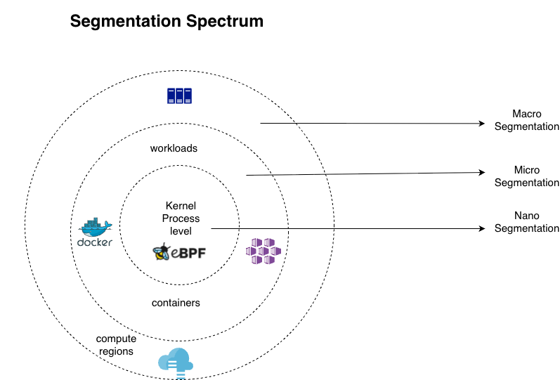
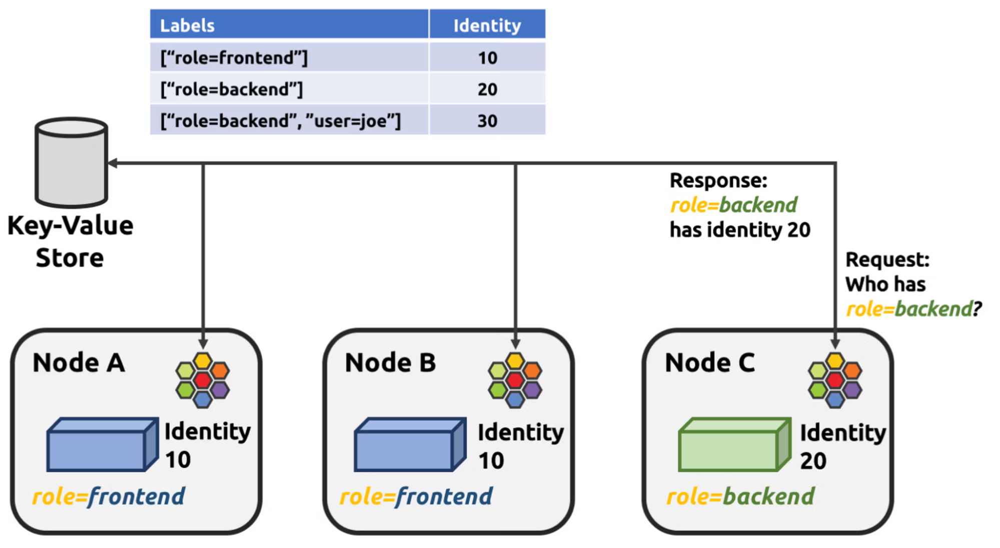
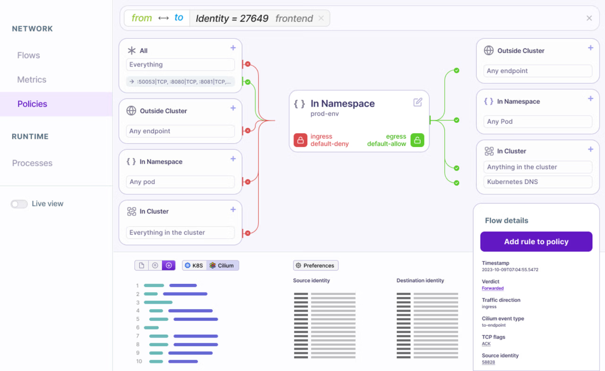
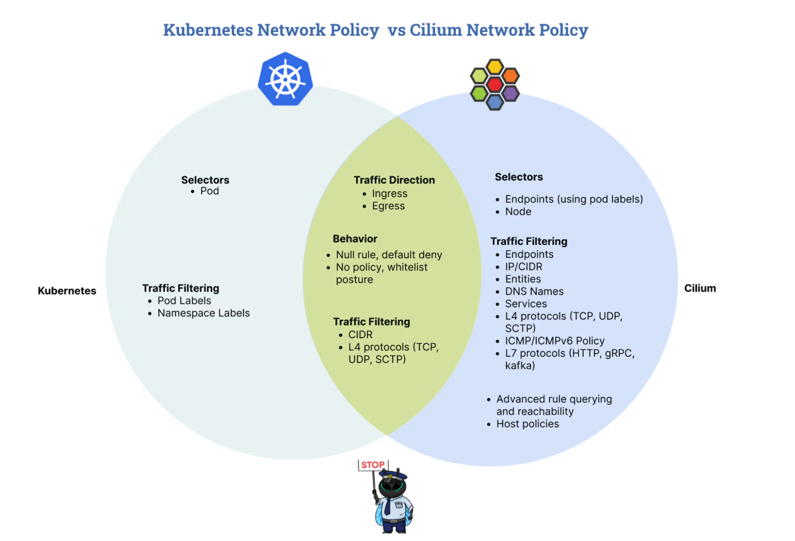
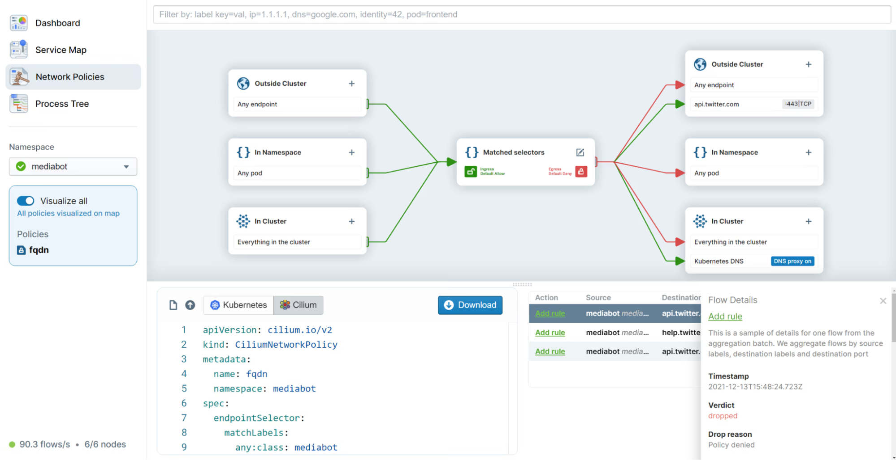

import authors from 'utils/author-data';

# Understanding Kubernetes Microsegmentation

## Introduction

Kubernetes Microsegmentation is the security practice of dividing a cluster into small, isolated segments to limit the blast radius of a potential breach. Kubernetes microsegmentation leverages workload identity, which encompasses metadata such as labels and namespaces, making it possible to define granular security policies that follow the application, regardless of where it is scheduled or what IP it is assigned.

_Figure 1. The Segmentation Spectrum. This diagram outlines three levels of security isolation, moving from broad to granular: Macro (compute regions), Micro (workloads and containers), and Nano (kernel-level processes via eBPF)._

## 1\. Why traditional firewalls don’t work in cloud native environments

When the first network firewalls appeared in the late 1980s and early 1990s, they served as barriers at the edge, acting as controls between inside and outside networks. That perimeter model worked when most traffic was north–south (entering or leaving the data centre).

## Why IP Addresses are the Wrong Primitive for Cloud Native Security

In traditional networking, an IP address was a reliable proxy for identity. If you knew the IP, you knew the server. In Kubernetes and cloud native architectures, this logic breaks down for three primary reasons:

### i) Ephemeral Nature of Resources

In Kubernetes, Pods are designed to be cattle, not pets. They are created and destroyed constantly due to scaling, updates, or failures.

IP Reuse: A Pod might live for only five minutes. Once it dies, its IP address is released back into the pool and may be assigned to a completely different service moments later.

### ii) Lack of Contextual Identity

An IP address is a network coordinate, not an identity. It tells you where a packet is coming from, but not who is sending it.

The "_What_" Matters; Security teams need to define rules like "_The Payment Service can talk to the Credit Card Database_." To enforce this via IPs, you would need to constantly update firewall rules every time a new Pod is scheduled. This creates a massive "policy lag" where security cannot keep up with the speed of development.

### iii) Scalability and Performance

Traditional Linux networking relies on iptables to manage IP-based rule chains.
iptables checks rules sequentially. In a cluster with thousands of Pods, an IP-based rule list can grow so long that network latency increases significantly because the system has to "read" through thousands of lines for every single packet. Cilium uses eBPF to replace sequential iptables rule evaluations with high-performance BPF hash maps. When a packet arrives, eBPF instantly maps the source and destination IP addresses to their corresponding Numeric Security Identities using a cluster-wide cache, then executes a constant-time $O(1)$ policy check.

## 2\. What is Kubernetes Microsegmentation?

Kubernetes Microsegmentation is the security practice of isolating individual workloads (Pods) and strictly controlling the traffic between them. Unlike traditional segmentation, which creates broad perimeters around entire data centers or VLANs, microsegmentation applies security policies at the individual workload level.

### i) The Zero-Trust Principle: "Never Trust, Always Verify."

In a microsegmented environment, the network operates under the assumption that the inside is just as dangerous as the outside.

- Default Deny: By default, all communication between Pods is blocked.
- Explicit Allowing: A connection is only permitted if there is a specific security policy that allows it.
- Identity-Based: Instead of trusting an IP address, the system verifies the identity of the workload (using Kubernetes labels, such as app: settings or role: database) before allowing a packet to pass.

### ii). Eliminating the "Flat Network."

By default, Kubernetes has a flat network structure, meaning any Pod can talk to any other Pod across the entire cluster. While this makes deployment easy, it creates a massive security risk. Microsegmentation breaks this flat structure into thousands of tiny, isolated segments, effectively putting a miniature firewall in front of every single container.

## 3\. Identity-Based Security (The Cilium Way)

In a traditional network, a firewall rule looks like this: "_Allow traffic from 10.0.1.5 to 10.0.2.10_." As we’ve established, this fails in Kubernetes because those IPs are constantly changing. Cilium solves this by replacing volatile IPs with Security Identities.
Security Identity is a logical abstraction that represents a group of workloads (Pods) sharing the same security properties.

### i) From IPs to Logical Labels

Instead of managing a list of thousands of IP addresses, Cilium uses the metadata already present in Kubernetes.
Your security policy becomes human-readable and intent-based: "_Allow role: frontend to talk to role: backend._"

Cilium doesn't care what the IP address is. If a Pod has the label role: frontend, it is automatically granted the permissions assigned to that identity.

### ii) How Numeric Identities Work

To keep the network fast, Cilium’s control plane translates complex strings of labels into a simple Numeric Identity (e.g., role: frontend might become ID 501).

**Assignment of Numeric Identity:**
The local Cilium agent collects the pod's labels upon creation. These security-relevant labels are sorted and hashed, and the Cilium control plane assigns a globally synchronized Numeric Identity to that unique label footprint.

**Grouping:**
If you have 100 replicas of a frontend pod, they all share the same numeric identity; that is to say, all pods sharing the same security-relevant labels receive the same numeric identity.

**The Identity Table:**
Cilium maintains a map across the cluster that links every IP address to its current Numeric Identity. When a packet is sent, Cilium stamps the packet with this identity.

_Figure 2. The Cilium Identity Table. This diagram shows how Cilium uses a central Key-Value store to map workload labels to unique numeric identities, sharing this cluster-wide mapping across individual nodes for identity-aware networking._

### iii) O(1) Efficiency in the eBPF Datapath

The eBPF datapath achieves high-speed enforcement by performing lookups in kernel-level eBPF maps, which function like high-performance hash tables. In legacy systems, as you add more pods, the firewall has to check more rules (this is known as O(n) complexity). With Cilium and eBPF, security enforcement happens in constant time, or O(1).

**Identity Lookup:**
When a packet enters or leaves a pod, the eBPF program retrieves the source identity from a local eBPF Endpoint Map. It simply looks at the numeric ID stamped on the packet and checks it against a HashMap.

**Policy Verification:**
Instead of scanning complex lists of firewall rules, the datapath consults a Policy Map. A combination of source identity and destination identity is used as a key.

**Packet Marking:**
For cross-node traffic, the source identity is often embedded directly into the packet header (using VXLAN or Geneve metadata) so that the receiving node doesn’t have to resolve it.

_Figure 3. Identity-Based Policy Interface in Hubble UI. This dashboard visualizes how network rules are constructed and monitored using logical workload identities._

## 4\. Kubernetes vs Cilium Network Policies

Kubernetes includes a NetworkPolicy resource, which is often insufficient for modern security requirements. The primary difference lies in visibility and depth.

Kubernetes Network Policies are application-centric constructs for defining network segmentation rules at various levels in the cluster. Kubernetes Network Policies serve as firewalls, enabling security, namespace isolation, and traffic restriction (ingress/egress) through the use of labels and selectors.

We can define network security policies at layers 3 and 4 of the OSI model, i.e., IP, TCP, UDP, and SCTP. Although the network policy specification is part of Kubernetes, the implementation is handled by a Container Network Interface (CNI); therefore, using a CNI that supports network policies is imperative.

[Read More about Cilium Network Policies](https://isovalent.com/blog/post/intro-to-cilium-network-policies/)

### The Layer 3/4 Limitation

Native Kubernetes Network Policies operate at Layer 3 (IP) and Layer 4 (Port/Protocol). This means you can write a rule that says:
"_Allow the Frontend Pod to talk to the Carts Service on Port 8080/TCP_."

The problem is that, once that port is open, the Frontend can do anything on that port. If an attacker compromises the Frontend, they can send DELETE /orders or POST /admin/shutdown just as easily as a legitimate GET /items.
At Layer 4, the network is blind to the actual intent of the traffic.

### Layer 7 API-Aware Segmentation

Cilium extends the Kubernetes network policy model by adding Layer 7 (Application Layer) visibility. This allows you to define policies based on the specific API calls being made.
Instead of just opening a port, you can enforce the Principle of Least Privilege at the API level.

Example of policy granularity
HTTP: Allow GET /public/ but block POST /admin/.
gRPC: Allow the GetProduct method but block UpdateProduct.

### Supported Protocols

Kubernetes Native Network policy only supports IP, TCP, UDP, and SCTP protocols. Cilium Network policies extend support to protocols like gRPC and HTTP.

| Feature           |     Kubernetes Network Policy     |                   Cilium Network Policy                    |
| ----------------- | :-------------------------------: | :--------------------------------------------------------: |
| Enforcement Layer |        L3 / L4 (IP & Port)        |                    L3, L4, and L7 (API)                    |
| Protocol Support  |          TCP, UDP, SCTP           |                   HTTP, gRPC, DNS                   |
| Granularity       | All traffic on a port is allowed. |        Only specific API methods/paths are allowed.        |
| Observability     |      Only "Allow/Deny" logs.      | Deep visibility into API paths, headers, and status codes. |
| Scope             |          Namespace-only.          |                Namespace and Cluster-wide.                 |

_Table 1: Kubernetes Native Network Policies vs Cilium Network Policies._

_Figure 4. Kubernetes vs. Cilium Network Policies. This Venn diagram compares standard Kubernetes network policies with Cilium's extended capabilities._

## 5\. Implementing a "Default Deny" Strategy

The default deny strategy is an aggressive network policy strategy that involves configuring security controls (firewalls, applications) to block all traffic or actions by default, allowing only specifically authorized activities. Default Deny is a zero-trust approach that requires explicit permission for communication.

### Phase 1: See Everything with Hubble

Before you can restrict traffic, you must first identify the existing traffic. Hubble is Cilium's observability layer, providing a real-time service map of your cluster.

**Service Map**
Visualizes exactly which services are talking to each other.
**Flow Logs**
Audit every connection attempt, including metadata like which labels were used and which protocol was detected.
**Identify Shadow Traffic**
Discover forgotten connections like a legacy monitoring agent or an external API call that would be broken by a blind security policy.

_Figure 5. Network Policy Visualization and Flow Auditing in Hubble UI. This dashboard provides a unified interface for authoring and monitoring security rules._

### Phase 2: Refine Your Labels

Identity-based security is only as good as your metadata. Since Cilium creates Security Identities based on labels, you must ensure your labeling scheme is consistent and granular.
Instead of broad labels like env: prod, use specific pairs:

- app: billing-api
- tier: backend
- version: v2.1

Good labeling doesn't just help with security; it makes your entire observability stack and CI/CD pipeline easily observable and organized, but also makes it possible to communicate well about policy enforcement decisions and effects.

### Phase 3: Audit Mode, The Test Drive

Cilium allows you to test policies without actually dropping packets. This is known as Audit Mode. This is useful for prototyping and testing the side effects of policies in the same environment we are about to enforce.

When you deploy a policy in Audit Mode, Cilium will log what would have been dropped if the policy were active. This allows you to:

1. Apply your "Default Deny" policy in audit mode.
2. Check Hubble logs for "Policy Deny" events.
3. Add "Allow" rules for legitimate traffic that you missed.
4. Once the "Deny" logs hit zero, switch the policy to Enforcement Mode.

### Phase 4: Full Enforcement

Once you are confident in your rules, you move to true Microsegmentation. At this stage, any packet that doesn't match an "Allow" rule is silently dropped by the eBPF datapath. This ensures that even if a new, malicious process starts in a Pod, it has nowhere to go.

1. [Read Kubernetes Network Policies Comprehensive Guide](https://isovalent.com/blog/post/kubernetes-network-policies-ebook/)
2. [Read about Cilium Network Policies & Enforcement Modes](https://docs.cilium.io/en/stable/security/policy/intro/)

## 6\. Advanced Microsegmentation Architectures

Depending on the size of the cluster and the number of workloads running, it will grow to a point where Pod-to-Pod rules aren’t enough. You will need to manage traffic that crosses boundaries, from internal namespaces, external firewalls, or the underlying host operating system.

### Cross-Namespace Communication

By default, Kubernetes NetworkPolicy is namespace-scoped. Cilium uses the **_CiliumClusterwideNetworkPolicy_** resource, which allows you to define a single security rule that applies across the entire cluster, regardless of namespace. It’s perfect for enforcing global rules, like ensuring no pod in any namespace can reach a specific sensitive database unless explicitly permitted.

### Egress Gateways: Bridging the New and the Old

A common pain point in Kubernetes clusters is connecting to external services (like a legacy Oracle DB) that sit behind a traditional hardware firewall. These firewalls expect a static IP, but Kubernetes pods have dynamic IPs.

**_Cilium Egress Gateway_** allows you to designate specific nodes as gateways. Traffic from your pods to a specific external IP is routed through these gateways, which mask the pod IP with a stable, predictable node IP. This lets you maintain microsegmentation inside the cluster while satisfying the static requirements of the legacy world outside.

### Host-Layer Segmentation

Most security strategies focus on reducing the attack surface on the Pods, but what about the Node itself? If an attacker gets onto the host (the virtual machine), they can often bypass Pod-level controls.
**Cilium Host Policies** provides a mechanism to secure the host network namespace of Kubernetes nodes. It allows you to segment the control plane traffic, SSH access, and node-to-node communication using the same identity-aware logic you use for your applications.

## 7\. Compliance and Auditing

In regulated industries (FinTech, Healthcare), being secure isn't enough; you have to prove it. Microsegmentation is the foundation for meeting frameworks like PCI-DSS, SOC2, and GDPR.
Cilium helps satisfy audit requirements by enforcing strict segmentation and providing detailed, immutable logs of all network communications. Cilium is a framework-agnostic compliance solution for Kubernetes.

Tetragon further extends these capabilities by offering visibility into runtime behaviors and system calls, facilitating the enforcement of runtime security policies, and supporting potential work around anomaly detection or streamlined compliance reporting.

[Read the complete Whitepaper on Implementing Cilium for Compliance Use Cases](https://isovalent.com/blog/post/implementing-cilium-for-compliance-use-cases-controlplane-isovalent-whitepaper/)

## 8\. Summary

As architectures continue to evolve toward AI-driven workloads and multi-cloud meshes, microsegmentation isn't just a nice-to-have; it is the fundamental building block of a resilient cloud native strategy.

By implementing microsegmentation, you achieve three critical outcomes:

1. Zero Trust Architecture: You treat the internal network with the same scrutiny as the public internet, ensuring every connection is authorized.
2. Attack Surface Reduction: You prevent lateral movement, ensuring a single compromised container does not lead to a cluster-wide breach.
3. Future-Proof Compliance: As highlighted in the Blueprint for Kubernetes Compliance, microsegmentation isn't just a technical configuration; it is a strategic foundation. It allows teams to map technical eBPF controls directly to global frameworks like NIST SP 800–53 and 800–190.

For leadership teams, microsegmentation provides the observability required to pass audits without the manual overhead of legacy systems.

Microsegmentation ensures that your environment is not only secure but also compliant by design, allowing your organization to navigate the ever-changing landscape of cloud native regulations with confidence.

<BlogAuthor {...authors.CharityMbisi} />
