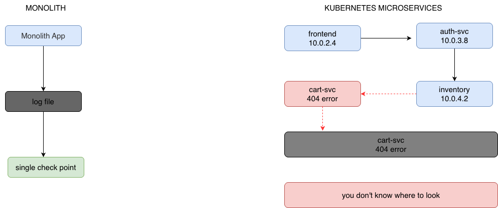
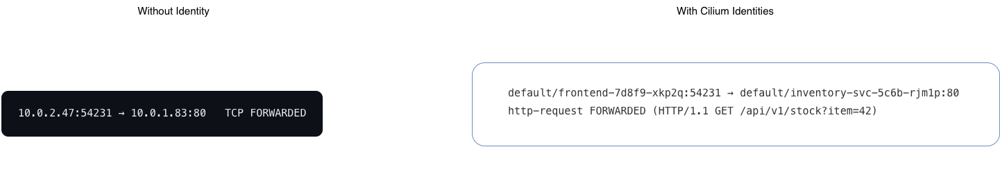
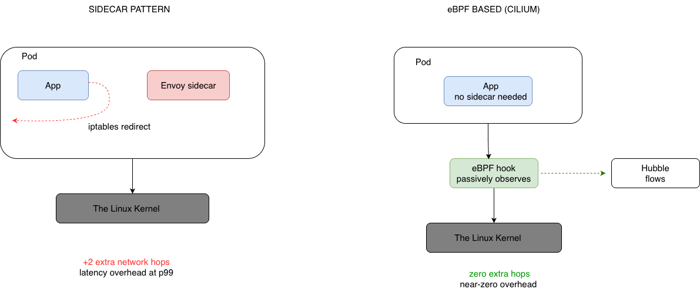
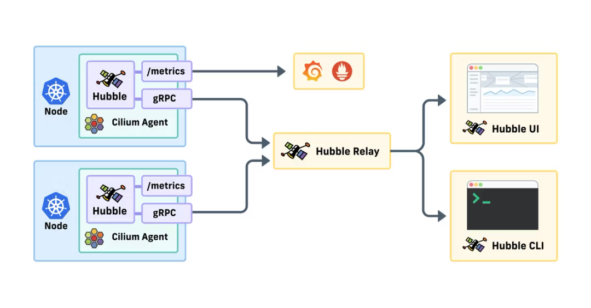
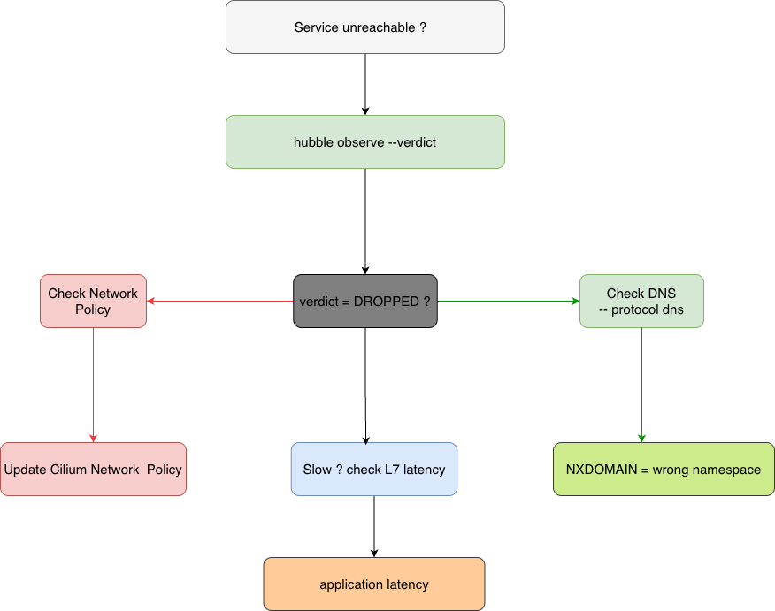

import authors from 'utils/author-data';

# Understanding Kubernetes Network Observability

## 1\. Introduction

Kubernetes Network Observability is the ability to gain a deep understanding, monitor, and troubleshoot network communication happening inside and outside your Kubernetes cluster.
From just being able to answer, “_Is the network up?_” to “_Why is the backend pod in namespace n experiencing intermittent 500 errors when communication to the inventory service?_”

Traditional networking tools, such as tcpdump and iptables, were designed for a different world. In Kubernetes environments, resources are ephemeral, IP addresses change frequently, and pods can be moved between nodes. We aren’t able to gather much context of what is happening in the networking layer with tcpdump or ping.

In a microservices architecture, a single user request can now be orchestrated to 3 different services, of which each might be running across different pods, namespaces, and nodes before it ever reaches a response. When that request returns a 500 error, where exactly do you start looking?

Answering that requires a fundamentally different kind of observability tool, one that understands the language the Kubernetes networking model actually speaks.

_Fig: In a monolith, one log file is enough. In Kubernetes, a 404 can originate anywhere in the call chain. Traditional tools give you IPs, not service names._

[Read the Introduction to Network Observabilityw with Hubble](https://cilium.io/blog/2024/08/14/hubble-for-network-security-and-observability-part-1/](https://cilium.io/blog/2024/08/14/hubble-for-network-security-and-observability-part-1/)

## 2\. Three Layers of Kubernetes Network Observability

To be confident about your network observability, it must span three layers.

### L3/L4 \- Flow visibility

The foundation of network observability is the flow layer. At Layer 3 and 4, you can answer the most basic questions: which source IP is talking to which destination IP, on which port, using which protocol, and how many bytes are being transferred. This is the data that classic tools like netstat and iptables were built to surface.
In a Kubernetes cluster, this layer alone is nearly useless without enrichment. A typical production cluster might have thousands of pods scattered across nodes, with individual IP allocations abstracted from a massive, shared /16 cluster CIDR block.

### L7 \- Application Visibility

Layer 7 is where observability gets genuinely useful for debugging. Instead of knowing that an application on port 80 is talking to something else on port 80, you can see the HTTP method (GET, POST, PUT), the URL path (/api/v1/orders), the gRPC service and method, and critically, HTTP response codes.
This is the difference between "_packets are moving between these two pods_" and "*the frontend is calling POST /v1/checkout on cart-service and getting 503 Service Unavailable back at 40 requests per second.*" One of those sentences lets you page the right team immediately.

### Identity Enrichment

This is Cilium's key differentiator. Every single network flow at both L3/L4 and L7 is annotated with Kubernetes-native identity metadata: the Pod name, Namespace, Deployment label selectors, Node, and the Cilium security identity assigned to that workload. This is what makes Hubble actually readable in a large cluster

That is actionable. You understand the conversation in terms of the services your team actually owns IP addresses become secondary.

True Kubernetes network observability is a stack. All three layers are necessary; Cilium provides them from a single eBPF-based data plane.

ReadMore:[https://cilium.io/blog/2024/08/14/hubble-for-network-security-and-observability-part-1/](https://cilium.io/blog/2024/08/14/hubble-for-network-security-and-observability-part-1/)

## 3\. How does eBPF enable Kernel-level Network Visibility

To understand why Cilium's observability is qualitatively different from other tools, you need to understand where in the system each approach actually runs. That difference is eBPF.

eBPF lets you run sandboxed programs directly inside the Linux kernel, dynamically, without recompiling it or loading kernel modules. For networking, this is transformative; the kernel handles every single packet, and eBPF lets you instrument that handling in-place, at the exact moment it happens.

### Challenges with Sidecar Observability Pattern

Most service meshes achieve observability by injecting a sidecar proxy (usually Envoy) into every pod, sometimes one per node or namespace.

Traffic is intercepted and redirected through this proxy before being forwarded on. The result is detailed visibility, but at a cost, since every network connection makes additional hops through the sidecar.

Under load, that overhead compounds. Implementing HTTP visibility with eBPF has a dramatically lower latency impact than the sidecar approach, especially at the p99 percentile that matters most during incidents.

eBPF sidesteps this entirely because it instruments traffic inside the kernel transparently, observing and profiling packets within the execution path without having to redirect or copy them to a user-space proxy daemon.

eBPF-based visibility is ground-truth accurate. If a packet is dropped, the kernel knows exactly why, whether it was a network policy verdict, a routing failure, or a conntrack miss, and Hubble surfaces that reason directly. Sidecar proxies only see what reaches them; they're blind to drops that happen before the packet arrives.

### Continuous Monitoring vs Sampling

Traditional monitoring often relies on sampling, capturing 1 in N packets to keep overhead manageable. This works for steady-state analysis but falls apart during the exact moments you care about most: traffic spikes, brief error storms, and intermittent policy violations.

eBPF programs run with near-zero overhead, which means Cilium can observe every single network event in a cluster without sampling, giving you an accurate record during an incident, not a statistical approximation.

Fig: Sidecars intercept and redirect traffic before passing it on, adding latency hops. eBPF instruments traffic inside the kernel at the moment; it's processed with no redirection or application changes needed.

[Read about the difference removing the sidecars for eBPF makes for a service mesh](https://isovalent.com/blog/post/2021-12-08-ebpf-servicemesh)

## 4\. Real-time Network Observability with Hubble for Cilium

Hubble is the observability component of Cilium. It sits directly on top of the eBPF datapath and gives you three interfaces into the same stream of network truth: a service map, a command-line interface.

Each of them aligns with the Kubernetes networking context; they know about pods, namespaces, labels, and policies, which is what separates Hubble from anything you could approximate with raw packet capture.

Hubble can operate at the node level via the local Hubble API on each Cilium agent, or cluster-wide via Hubble Relay, which aggregates flows from every node into a single queryable endpoint. In a Cluster Mesh setup, it can provide visibility across multiple clusters simultaneously.

### Service Map & Hubble UI

Hubble UI gives platform teams a graphical layer over the same flow data. The service map is a live, automatically generated graph of every service-to-service communication in your cluster, a dependency graph. The service map is a visual component of Hubble UI. Hubble observes actual traffic and draws connections as they happen, annotating each edge with request rates and error percentages. In practice, this is useful for two things: understanding what you actually built (the real dependency graph, not the one from last quarter's architecture diagram) and spotting unexpected relationships of services talking to things they shouldn't.

### The Hubble CLI

It is a command-line interface for interacting with Hubble, think of Hubble observe as tail \-f for your entire cluster's network, but one that understands Kubernetes. You can filter by namespace, pod label selector, verdict (FORWARDED vs DROPPED), protocol, or HTTP status code.

You can also trace DNS queries, filter to only HTTP traffic for a specific pod, or watch policy verdicts as policies are applied.

_Fig: Hubble Relay aggregates flow data from every Cilium agent, making the full cluster network visible through a single CLI command or web interface._

Read More:

1. [https://docs.cilium.io/en/stable/observability/hubble/setup/](https://docs.cilium.io/en/stable/observability/hubble/setup/)
2. [https://cilium.io/blog/2024/08/19/hubble-for-network-security-and-observability-part-2/](https://cilium.io/blog/2024/08/19/hubble-for-network-security-and-observability-part-2/)
3. [https://cilium.io/blog/2019/11/19/announcing-hubble/](https://cilium.io/blog/2019/11/19/announcing-hubble/)

## 5\. Troubleshooting Day 2 Problems

Day 1 is getting the cluster running. Day 2 is everything after the intermittent failures, the inexplicable latency, the "works in staging, broken in production" bugs that drive teams mad. This is where network observability pays for itself. Below are the three scenarios that surface most often in production clusters.

### DNS Resolution Failures

DNS failures in Kubernetes often present as mysterious service-not-found errors. The application logs say "connection refused" or "no such host," but which DNS query failed, on which pod, and to what name?
Hubble has first-class DNS visibility. Every DNS query and response is captured with the pod identity attached.

### Policy Verdicts

Network failures vs. an intentional drop; whether traffic is being dropped because something is broken or because a network policy is working exactly as intended, these failures look identical from the application's perspective, a connection that just doesn't happen.

Hubble resolves this instantly. The verdict field on every flow tells you precisely why. This eliminates the most common source of cross-team friction during incidents.

### Latency Analysis

Answering questions like “Is it network latency or application latency?” Of course, the service is slow. Is the latency in the network, or is the upstream service just slow to respond?

Without L7 visibility, you can't tell. With Hubble, you can observe the HTTP response times on each hop.

Network transit time within a cluster is typically sub-millisecond. If Hubble shows 220 ms HTTP latency on a specific service-to-service call, the latency is inside the destination service's code, not the network. That's the conversation you need to have with the backend team, armed with data instead of speculation.

Fig: A Hubble-based diagnostic decision tree. Each branch maps directly to a Hubble observing filter flag.

Read More:

1. [https://docs.cilium.io/en/stable/observability/hubble/hubble-cli/](https://docs.cilium.io/en/stable/observability/hubble/hubble-cli/)
2. [https://cilium.io/blog/2024/08/27/hubble-for-network-security-and-observability-part-3/](https://cilium.io/blog/2024/08/27/hubble-for-network-security-and-observability-part-3/)

## 6\. Integrating with Your Observability Stack

Hubble is not a silo. The flow data it collects can be exported into the tools your team already relies on for metrics, alerting, security analysis, and distributed tracing. Here's how each integration works in practice.

### Prometheus & Grafana

Cilium exports a rich set of Prometheus metrics out of the box: packet rates, drop counts, policy verdict distributions, DNS query latency, and HTTP response code breakdowns per service pair. These turn the raw event stream into time-series data you can graph, alert on, and trend over time.

Cilium ships pre-built Grafana dashboards that surface the four golden signals: latency, traffic, errors, and saturation at the service level. You don't need to build them from scratch. Connect your Prometheus instance, import the dashboards, and you have production-grade SLO visibility within minutes.

[Read the official Cilium observability metrics documentation](https://docs.cilium.io/en/stable/observability/metrics/)

## 7\. Reducing Incident Response Time with Network Observability

Having a clear sight of what is going on under the hood helps prevent finger-pointing between teams. The app team is requesting the network team to clarify why something is happening, and the network team is pointing fingers at the DevOps team. Three teams on a call. Customers are seeing errors. Forty minutes in and still no diagnosis.

Hubble replaces that conversation with a clear sight of what is happening. The verdict field in every flow record is a ground-truth fact produced by the kernel. Either a packet was forwarded, or it was dropped, and if it was dropped, the reason is attached. That ends the finger-pointing because it removes the ambiguity that makes finger-pointing possible.

## 8\. Summary

Network observability in Kubernetes is the foundation that makes security policy iteration, incident response, capacity planning, and compliance all possible.

Having data and an explanation of what is happening under the hood will give you and your team confidence and direction in times when everyone could break and dodge responsibility.

You cannot secure what you cannot see. When you own the data, you own the narrative; It transforms chaotic troubleshooting into a quick, deterministic, evidence-based response.

<BlogAuthor {...authors.CharityMbisi} />
