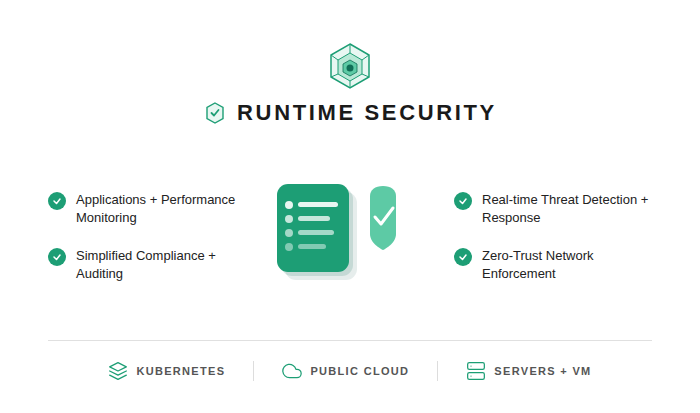
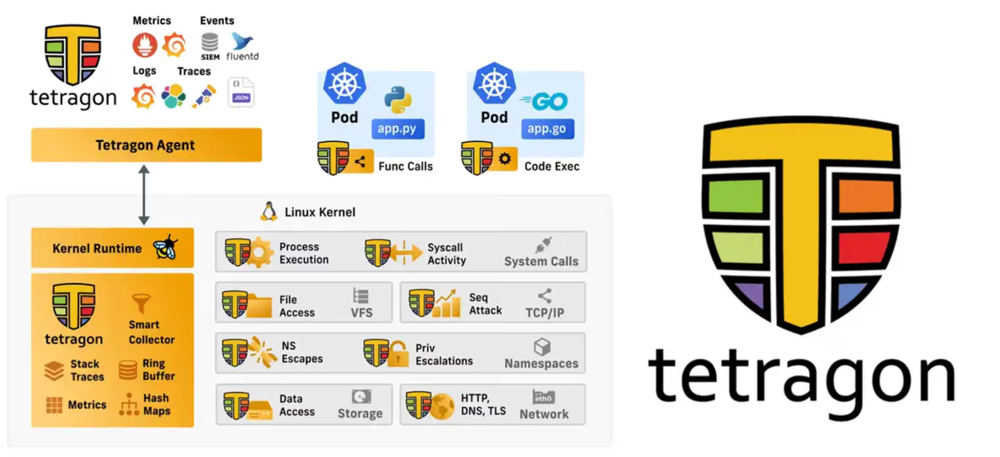
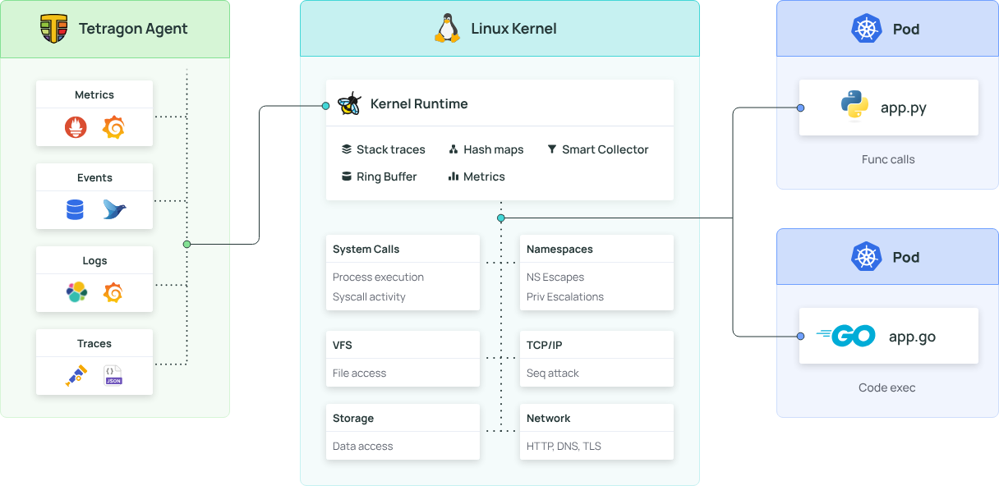
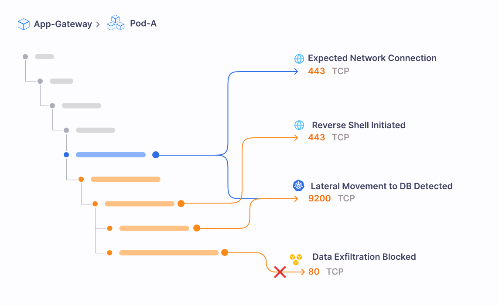
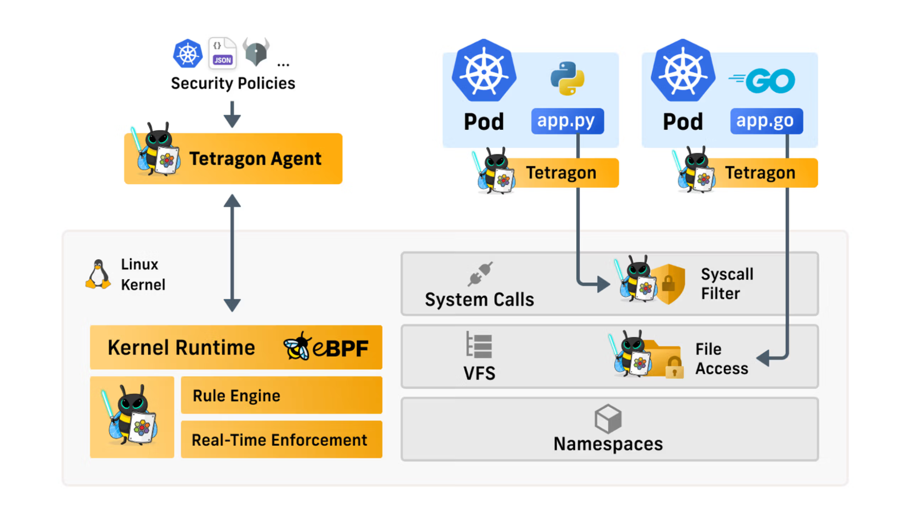
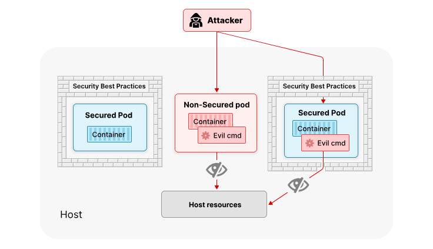
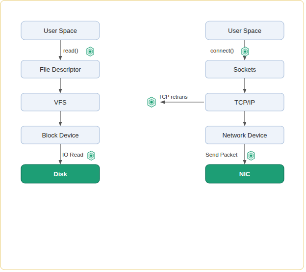
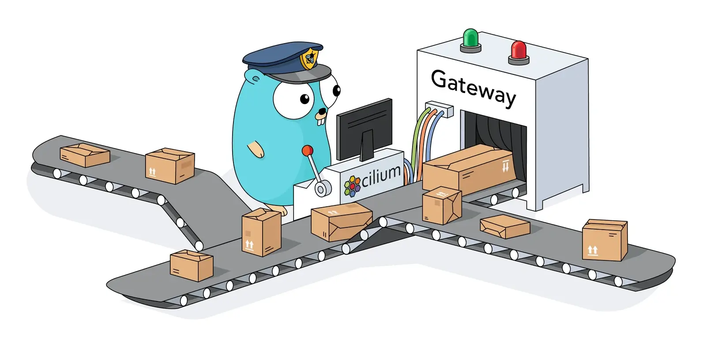
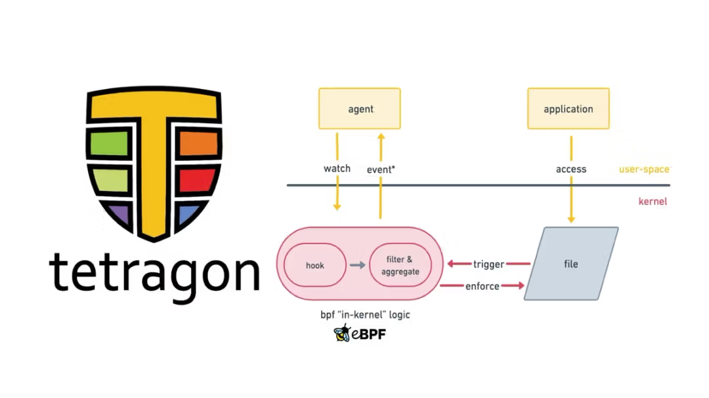

import authors from 'utils/author-data';

# **Kubernetes Runtime Security: The Guide**

# **I. Introduction**

Runtime security is the continuous process of protecting applications, workloads, and infrastructure while they are actively running. While pre-deployment security focuses on securing the blueprint, runtime security is about defending the live environment. It is the active surveillance and defense of your cluster against zero-day exploits, insider threats, and post-exploitation behavior.

For years, the gold standard of container security has focused heavily on pre-deployment gates, such as vulnerability image scanning and static configuration checks. While crucial, this approach is entirely predictive; it only catches known risks.
True security requires moving from static gates to active protection. Security cannot stop when a container passes a scan and enters production. Runtime security picks up exactly where the continuous integration/continuous deployment (CI/CD) pipeline ends, monitoring real-time system calls, network behavior, and file integrity as code executes.

This highlights the need for deep visibility into all system calls and processes executing within the operating system, as well as the workloads that run on top of it.

_Figure 1: Key aspects of Runtime Security that the Cilium ecosystem offers._

## **Why Scanned Images Still Need Active Runtime Monitoring**

A clean container scan is a green light, not a lifetime guarantee. Relying solely on pre-deployment image scanning leaves a massive blind spot for several critical reasons:

- Zero-Day Vulnerabilities: An image scan only flags vulnerabilities that are already cataloged in public CVE databases. It cannot protect against zero-day exploits or vulnerabilities that exist in your running code but have not yet been discovered by the security community.
- Configuration Drift and Runtime Injections: Even if an image is perfectly secure, the surrounding configuration can change. Attackers can exploit exposed Kubernetes APIs or environment variables to inject malicious payloads, modify binaries, or execute unauthorized code directly into memory at runtime.
- Insider Threats and Credential Theft: If an attacker steals valid credentials or compromises a trusted third-party dependency (a supply chain attack), they can bypass perimeter checks entirely. In this case, without runtime monitoring, these events can’t be spotted and mitigated.

## **Cilium Tetragon**

**Tetragon** is a specialized cloud native runtime security and observability solution built from the ground up to leverage eBPF. By compiling and executing security logic directly within the Linux kernel, Tetragon transforms runtime security from a slow, reactive log-parsing exercise into an intelligent, low-overhead, and identity-aware shield.

Instead of sitting outside the application looking in, Tetragon operates at the lowest level of the operating system to deliver deep behavioral monitoring and enforcement.

## **Why Tetragon**

Tetragon brings the following capabilities:
**Kernel-Level Precision:** Tetragon intercepts system execution at the kernel boundary. It doesn't just watch network packets; it tracks system calls (syscalls), file access, namespace changes, and process execution with cryptographic certainty.

**Kubernetes-Aware Identity:** Tetragon automatically maps raw kernel-level events (like a process execution or a file write) to high-level Kubernetes metadata (Pods, Namespaces, Deployments, and Labels). Instead of telling you that "PID 4052 executed a binary," Tetragon tells you that "the frontend pod in the production namespace executed a shell."

**Real-Time Mitigation and Inline Enforcement:** Unlike other tools that alert you _after_ a breach has occurred, Tetragon can be configured to take action. Because it operates in the kernel, it can instantly block a malicious action, such as killing a compromised process or shutting down a socket connection just after a security policy is violated, preventing lateral movement before an attacker can take a single step. All these happen via user-defined policies of what should be allowed and denied.

_Figure 2. Tetragon Architecture for Real-Time Enforcement. This diagram illustrates how Tetragon leverages eBPF within the Linux kernel to monitor deep system activities like process execution, file access, and network traffic._

[Read More about Runtime Security](https://isovalent.com/blog/post/what-is-runtime-security/)

# **II. The Kubernetes Runtime Threat Model**

To defend a Kubernetes cluster, you must understand how attackers operate once they bypass your initial defenses. In a cloud native world, the perimeter is porous. Attackers do not necessarily need to breach a firewall; they might exploit a zero-day vulnerability in a public-facing web app or leverage a compromised third-party library.

Kubernetes runtime security threat model unfolds via the following vectors.

**i) Container Escape & Privilege Escalation**
Containers are not virtual machines; they are just isolated processes. If an attacker compromises a pod, their first goal is often to escape it. By exploiting a vulnerability in the shared Linux kernel or abusing misconfigured privileges (like mounting the host filesystem or running as root), an attacker can break out of their containerized namespace to gain root access to the underlying Kubernetes worker node.

**ii) Lateral Movement**
Once a foothold is established, attackers attempt to map the internal network and move "east-west" across the cluster. In a default, flat Kubernetes network, a compromised frontend pod can often communicate directly with a backend database or internal API. Attackers exploit this lack of identity-aware segmentation to pivot to higher-value targets.

**iii) Cryptomining and Resource Abuse**
Not all attacks are designed to steal data. Often, attackers simply want to hijack your computing resources. Cryptomining is one of the most common runtime threats, where attackers silently deploy malicious payloads that consume your cluster's CPU and memory limits, driving up cloud bills and starving legitimate applications of resources.

**iv) Data Exfiltration**
The ultimate goal of many breaches is stealing sensitive information, customer databases, proprietary code, or API keys. At runtime, data exfiltration often looks like a legitimate pod suddenly initiating outbound connections to an unknown external IP address or using DNS tunneling to quietly push data out of the cluster.

**v) Supply Chain Attacks**
Sometimes, the threat is already inside the house. Supply chain attacks occur when malicious code is injected into a trusted open source dependency or base image. These attacks lie dormant during CI/CD checks and only wake up at runtime to execute unauthorized processes or phone home to command-and-control (C2) servers.

## **Why Container Isolation is not Enough**

Containers don’t provide a hard security boundary in the system they run. Relying on basic container isolation and Kubernetes-native controls is not enough for defending against advanced runtime threats.

**i) The Linux Kernel is Shared**
Unlike virtual machines, which each have their own operating system, every container on a Kubernetes node shares the same underlying Linux kernel. Containers rely on Linux features like namespaces (for isolation) and cgroups (for resource limits). If an attacker finds an exploit in the shared kernel, the namespace illusion vanishes. Compromising the kernel means compromising every single pod running on that node.

**ii) Runtime dynamics**
Image scanners are essentially spell-checkers for vulnerabilities. They compare your container's filesystem against a known list of bad signatures (CVEs). However, they cannot prevent an attack where an attacker uses legitimate, scanned tools (like curl, wget, or bash) to download malware and execute it in memory.

**iii) Kubernetes RBAC Does Not Control Syscalls**
Kubernetes Role-Based Access Control (RBAC) is excellent for the control plane. It determines who can delete a pod, read a secret, or scale a deployment. However, RBAC has zero visibility into the data plane or the host OS. RBAC cannot control which system calls applications can make.

[Read Why Runtime Security Matters in Modern Cloud Environments](https://isovalent.com/blog/post/what-is-runtime-security/#why-runtime-security-matters-in-modern-cloud-environments)

# **III. How Tetragon Works: eBPF-Based Kernel Visibility**

To understand why Cilium Tetragon is so highly regarded for runtime security, you have to look at where it operates: directly inside the Linux kernel via eBPF. Tetragon is not like most security tools that sit in user-space, guessing what applications are doing. Instead, it turns the kernel itself into a security sensor and enforcement engine.

_Figure 3. Tetragon's eBPF-Based Kernel Visibility. This diagram demonstrates how Tetragon bypasses user-space limitations by operating directly inside the Linux kernel._

## **Kernel is a Zero Ground**

In any Linux-based system (which includes virtually all Kubernetes worker nodes), the kernel is the zero ground. Applications and containers cannot access the network, read a file, or start a new process on their own. They must politely ask the kernel to do it for them via a System Call (syscall).

Because every single action must pass through the kernel, it is the ideal place for security enforcement. If a security tool lives in user-space, a compromised container with root privileges can blind, bypass, or kill the tool. But when security is embedded in the kernel via eBPF, it is effectively invisible and untouchable to the workloads running above it. Tetragon deploys eBPF programs as sensors, observing the entire system from a privileged vantage point.

## **Probes**

In the eBPF ecosystem, **probes** are the mechanisms used to attach an eBPF program to a specific execution point in the system. They act as sensors that wake up and collect data the exact moment a specific function is called. Probes are generally used for observation and tracing.

### **Types of Probes**

There are three primary types of probes used by Tetragon:

**i) kprobes (Kernel Probes)**
These are dynamic. They allow Tetragon to attach an eBPF program to almost any function inside the Linux kernel. If you want to know exactly when the kernel function responsible for opening a file (do_sys_open) is triggered, a kprobe intercepts it, records the data, and returns control to the kernel.

**ii) tracepoints**
These are static, hardcoded markers intentionally placed by Linux kernel developers in the source code specifically for debugging and tracing. They are highly stable across different kernel versions, making them incredibly reliable for observing standard kernel behavior (like network packet transmission or system calls).

**iii) uprobes (User Probes)**
While kprobes watch the kernel, uprobes watch user-space applications. Tetragon can use uprobes to hook directly into the functions of a running application or a shared library. A common use case is attaching a uprobe to an SSL/TLS library (like OpenSSL) to inspect data before it gets encrypted and sent over the network.

## **Hooks**

Hooks are designed for enforcement, while probes are meant for watching. Hooks are designed for active enforcement, which is facilitated by the Linux Security Module (LSM).
LSM hooks are used strategically to remediate access to kernel internal objects.

## **Process Ancestry**

Ancestry is a genealogical process of how a process is born. In Linux, every process (except the very first init process) is spawned by another process, creating a parent-child relationship. When monitoring for kernel security events, a single isolated process can’t tell the whole story about itself.
Knowing who started a process is what determines the intent, whether it’s a runtime breach or just a normal action.
Tetragon tracks the process execution chain, which gives a context of what started with who. A curl being executed by a node worker agent sounds like a routine, while a curl executed by a system user tells a different intent.

## **O(1) Efficiency and In-kernel Filtering**

Traditional security and networking tools often struggle with performance at scale. For example, legacy network filtering (like iptables) processes rules sequentially (an O(n) operation). If you have 10,000 rules, the system checks them one by one, causing massive CPU overhead and latency.
eBPF solves this by using eBPF Maps, highly efficient, constant-time (O(1)) hash tables that live in the kernel. When Tetragon checks if an IP is malicious or if a process is allowed, it performs a near-instantaneous lookup, regardless of how many rules are applied.

## **Context Enrichment**

A raw kernel event is extremely low-level. The kernel only knows that Process ID (PID) 4096 opened a network connection. To a security analyst, PID 4096 is meaningless. Tetragon solves this via Kubernetes Context Enrichment.
It continuously maps raw PIDs, network namespaces, and cgroups to high-level Kubernetes constructs. When Tetragon outputs a security event, it tells you exactly which Kubernetes Namespace, Pod Name, Container ID, and label were responsible for the kernel action.

_Figure 4. Kubernetes Context Enrichment. This enriched process tree illustrates how Tetragon translates meaningless, low-level kernel events (like raw PIDs) into actionable security insights mapped directly to specific Kubernetes resources._

[Read More About Tetragon Events](https://tetragon.io/docs/concepts/events/)

# **IV. Process Execution Monitoring**

The most fundamental signal in runtime security is the execution of processes. Every attack, whether it is a sophisticated data exfiltration campaign, a cryptominer, or a simple lateral movement script, must eventually execute code. If you can definitively answer what is running, spawned by what, and as which user, you have the foundation to stop almost any runtime threat.

Because Cilium Tetragon operates directly within the kernel via eBPF, it observes process execution with perfect fidelity. Clever user-space tricks or fast-executing scripts cannot bypass it.

## **Process Exec and Exit Events**

In a Linux system, **process_exec** is used to trace when a process starts, and when it exits, either by completing a termination signal, **process_exit** is invoked.
Tetragon captures an active user ID, command line arguments passed, and a binary name being executed; likewise, on exit, a process exit code is captured.

## **Why Process Ancestry Matters**

A single process execution rarely tells the whole story. Being capable of knowing the process call tree on the other end gives a clearer intent on who is doing what using what.

To accurately detect threats without generating a massive amount of false positives, security tools must understand the process ancestry.

## **Detecting Reverse Shells**

A reverse shell is a remote access technique where a compromised target machine initiates an outbound connection to an attacker-controlled system. This is sometimes called the phone home technique. Since most of the default configurations leave the egress traffic unprotected, outbound connections are likely allowed.

Tetragon’s ability to correlate process execution and network activity can help to easily detect what is actually initiating those outbound connections.

**Detecting Fileless Execution**
Most anti-virus scanners and sanitizing programs rely on examining files on a disk. Attackers know this, which changes their strategies to fileless malware.
Using utilities like memfd_create, attackers can create anonymous files and return the file descriptor that references them. This makes it possible to download payloads/scripts directly into RAM and execute them without writing the file to disk.

Up to that point, the attackers can clearly bypass scanners and anti-virus; the only point to catch them is in the kernel.

**Binary Allow-Listing**
The runtime security model has shifted from reactive to proactive enforcement. Instead of a reactive block listing, you proactively allow which binaries to execute. Since container runtimes are built with a purpose, all the utility programs they rely on are known, and only those are allowed to be executed at runtime.

[Read More About eBPF-based Security Observability & Runtime Enforcement](https://isovalent.com/blog/post/2022-05-16-tetragon/)

# **V. Network Runtime Security**

Network runtime security protects actively running applications and workloads by monitoring live traffic and system behavior in real-time. It operates on the assumption that some threats will bypass perimeter defenses, actively blocking malicious actions like data exfiltration, unauthorized connections, and lateral movement as they happen.

Network runtime security requires connecting the runtime process identity to network behavior. You must answer not just "which IP is talking to which IP," but "which specific process, spawned by which user, is opening this socket."

## **Process to Network Correlation**

Cilium Tetragon can link every single network connection to the exact process that opened it, complete with its full ancestry tree.
Imagine a security alert flags an outbound connection from your web server pod to an external IP. A traditional network monitor only tells you the pod's IP and the destination IP.

With eBPF and Tetragon, you get the full story:

- Scenario A: The connection was opened by the nginx application binary itself, routing legitimate user traffic.
- Scenario B: The connection was opened by curl, which was spawned by bash, which was spawned by nginx.

Scenario B tells a drastically different story: the web server was exploited to open a reverse shell, which is now attempting to download a malicious payload. Tetragon’s process-to-network correlation makes this distinction instantly obvious.

_Figure 5. Process to Network Correlation. Tetragon visualizes the exact process ancestry for every network connection, instantly distinguishing legitimate application traffic from suspicious spawned child processes._

## **Detecting Unexpected Outbound Connections**

In the event of a security breach on a host system, once an attacker gains a foothold in a container, their next move is almost always to establish a connection to an external Command and Control (C2) server or to download additional malware.

Because Tetragon monitors the kernel's network socket requests in real time, it can detect and block unexpected outbound connections the millisecond a compromised process attempts them. By defining baseline network behaviors for your workloads, any deviation, like a Redis database suddenly initiating an outbound HTTPS request, is immediately flagged and blocked at the kernel level.

## **DNS Exfiltration Detection**

Data exfiltration doesn't always happen over obvious HTTP/TCP connections. Attackers frequently use DNS tunneling to sneak sensitive data out of a cluster. They encode stolen data into DNS queries (e.g., _user-password-hash.malicious-domain.com_), knowing that most firewalls allow outbound DNS traffic by default.

Tetragon monitors DNS requests directly at the socket and process level. It can enforce policies that restrict which processes are allowed to make DNS queries or flag abnormally large/frequent DNS requests originating from non-system processes, neutralizing a common exfiltration vector.

## **Monitoring tcp_connect and tcp_close**

Most network monitoring tools rely on packet sniffing (like tcpdump or deep packet inspection) to analyze traffic. This is incredibly CPU-intensive and struggles at scale.

Instead of looking at the packets on the wire, Tetragon hooks directly into the Linux kernel functions that manage the lifecycle of a connection, specifically tcp_connect (when a connection is initiated) and tcp_close (when it ends). This provides granular, O(1) efficiency visibility into network state, duration, and bandwidth usage without the overhead of capturing and parsing raw packets.

## **Runtime Network Enforcement vs. Network Policy**

It is essential to distinguish between standard Kubernetes Network Policies or Cilium Network Policies and Tetragon's runtime network enforcement. Cilium Network Policy (CNP) operates at the network layer.

Tetragon Runtime Enforcement operates at the process layer. It dictates that only the node process inside Pod A is allowed to initiate the connection to Pod B. If an attacker breaches Pod A and attempts to use netcat to connect to Pod B, Tetragon blocks the connection, even though the CNP technically allows pod-to-pod traffic.

Using both together creates a zero-trust architecture that secures both the network perimeter and the internal execution environment.

_Figure 6. Runtime Network Enforcement. Tetragon operates at the granular process layer via eBPF to filter system calls and file access, blocking malicious application behaviors even if network-layer policies technically permit the connection._

1. [Read More About Hyperscaling Security With Isovalent Enterprise](https://isovalent.com/blog/post/hyperscaler-security/)
2. [Read About Top Tetragon Use Cases (1)](https://isovalent.com/blog/post/top-tetragon-use-cases/)
3. [Read About Top Tetragon Use Cases (2)](https://isovalent.com/blog/post/top-tetragon-use-cases-part-2/)

# **VI. Privilege Escalation Detection**

Privilege escalation is a form of cyber attack where an attacker exploits a bug, design flow, or misconfiguration in the operating system or application to gain elevated unauthorized access to resources.

This escalation can be vertical, where a user elevates privileges of the same user account, or horizontal, which involves an attacker switching from one user with low privileges to another one with high privileges.

In a Kubernetes environment, privilege escalation rarely looks like a traditional password cracking attempt. Instead, it involves abusing the shared Linux kernel and the porous boundaries of containerization. Attackers look for misconfigurations such as pods running with privileged: true, mounted host filesystems, or overly permissive Linux capabilities.

When a pod is compromised, the attacker's immediate goal is to mutate their current restricted identity into a highly privileged one (usually root on the host operating system). Tetragon monitors the exact system calls that facilitate this mutation.

_Figure 7. Kubernetes Privilege Escalation. This diagram illustrates how an attacker exploits a compromised, non-secured pod to execute malicious commands and break out of container isolation to access underlying host resources._

[Read More About Container Escape Attacks](https://isovalent.com/blog/post/2021-11-container-escape/)

## **SUID Binary Execution Monitoring**

One of the oldest privilege escalation techniques in Linux involves SUID (Set Owner User ID) binaries. If a binary has the SUID bit set, it executes with the privileges of the file's owner (often root), regardless of who actually ran the command (like sudo or passwd). Attackers hunt for custom or vulnerable SUID binaries within a container to execute arbitrary code as root.

Tetragon hooks into process execution (process_exec). It evaluates the file metadata at the kernel level, instantly detecting and logging when an unauthorized user attempts to execute an SUID binary to elevate their permissions.

[Read More About Process Execution](https://tetragon.io/docs/use-cases/process-lifecycle/process-execution/)

# **VII. Tracing Policy: Writing and Managing Runtime Policies**

Visibility and enforcement are only good as the rules that govern them. In the Cilium and Tetragon ecosystem, these rules are defined declaratively using a Kubernetes Custom Resource definition (CRD) known as TracingPolicy, for clusterwide rules, TracingPolicyNamespaced for namespace-specific rules.

## **Tracing Policy Anatomy**

A tracing policy has three components:
i) Hook Point: The exact location in the Linux kernel where Tetragon will attach its eBPF sensor can be kprobes for internal kernel functions or tracepoints for static kernel markers, and uprobes for user-space application functions.

ii) Selectors: The in-kernel BPF filtering logic that determines if the hooked event should be processed or ignored.

iii) Actions: The specific response Tetragon executes when an event matches the hook and selectors criteria.

## **Selector Types**

Passing every single kernel event to the user space for analysis would immediately overload a system. Tetragon addresses this by using selectors to evaluate context and drop irrelevant events directly inside the kernel.

Selectors allow security teams to create highly granular rules.
i) matchArgs & matchReturnArgs: filters based on the exact arguments passed to a system call.
ii) matchBinaries & matchParentBinaries: restricts policy to specific execution chains.
iii) matchNamespaces & matchCapabilities: detects when a process attempts to change its isolation boundaries or elevate its Linux privileges.
iv) Kubernetes Identity Filters: ensure policies only apply to specific workloads based on Kubernetes labels, rather than blanket application of rules.

[Read More About Policy Selectors](https://tetragon.io/docs/concepts/tracing-policy/selectors/)

## **Action Types**

Once an event matches the hook and passes the selector filters, Tetragon executes an Action. Because the eBPF program runs synchronously within the kernel, these actions occur before the system call completes.

1. Post (Default): Generates a rich, JSON-formatted observability event and sends it to the user-space agent or a SIEM integration.
2. NoPost: Silently drops the event. This is incredibly useful for filtering out known, safe noise.
3. Sigkill: The cornerstone of runtime enforcement. It instantly sends a fatal kill signal to the process attempting the malicious action, terminating the threat before it executes.
4. Override: Instead of killing the process, this action seamlessly alters the return value of the system call. For example, it can return an EPERM (Permission Denied) error to the application, thwarting the attack without crashing the entire container.

_Figure 8: Tetragon hook points across the Linux kernel file I/O and network execution paths._

[Read About How to Use Tetragon Without Cilium](https://isovalent.com/blog/post/can-i-use-tetragon-without-cilium-yes/)

## **Policy Rollout Strategy**

When applying for a new policy, it is advised not to start with enforcement directly until the impact has been analyzed.

New policies should be applied with detection mode first, using the POST action first. Monitor the output in SIEM tools.
Once a legitimate application is confirmed, the policy can then be put in enforcement mode.

[Read More About Tetragon Tracing Policy](https://tetragon.io/docs/concepts/tracing-policy/)

# **VIII. Compliance Use Cases**

Security is about stopping the attack; compliance is about proving to an auditor that you can and did stop the attack.
In Kubernetes, where pods are ephemeral, workloads share the underlying compute resources. Three different application pods can be scheduled on the same host. This increases the risk of security attacks, as a single compromised host grants an attacker access to most workloads, provided network policies permit connectivity.
To remediate the risk, Tetragon can be used to implement security compliance standards.

## **Egress Security**

Many compliance mandates require strict control over how data is transmitted outside the environment. However, businesses often need their modern Kubernetes microservices to communicate with legacy, on-premises databases, or third-party APIs (like payment gateways) that are protected by firewalls.

Because Kubernetes pod IPs constantly change, configuring a traditional firewall to allow traffic from a cluster usually means opening wide IP ranges, a massive compliance violation.

Cilium solves this through two primary egress controls:

i) DNS-Based Egress (toFQDNs): Instead of allowing an IP range, Cilium allows egress policies based on domain names. You can write a policy stating that a pod can only communicate with api.stripe.com. Cilium dynamically resolves the IP and enforces the policy at the kernel level, regardless of how often Stripe's IPs change.

ii) Static Egress Gateway: Cilium can route traffic from specific, dynamic Kubernetes namespaces through a highly available gateway node, assigning the traffic a stable, static IP address. This allows you to integrate dynamic Kubernetes workloads seamlessly with firewalls, maintaining strict, IP-based compliance without sacrificing cloud-native scalability.

**\*Figure 9\. Cilium Static Egress Gateway.** This illustrates how Cilium routes dynamic cluster traffic through a central gateway node, providing a stable, predictable IP address to satisfy strict external firewall requirements.\*

## **Host-Level Protection**

A core requirement of almost all security frameworks is protecting the underlying operating system. If an attacker bypasses a container and compromises the worker node, the entire cluster is at risk.

Tetragon’s eBPF visibility does not stop at the container boundary; it extends to the host itself. It provides native **File Integrity Monitoring (FIM)** to detect unauthorized changes to critical host files (like /etc/shadow or /etc/kubernetes/manifests), logs all host-level syscall activity, and alerts on privilege escalation attempts. This ensures that the infrastructure housing your workloads is just as auditable as the workloads themselves.

_Figure 10. File Integrity Monitoring. File Monitoring with eBPF and Tetragon._

[Read About Top Tetragon Use Cases (2)](https://isovalent.com/blog/post/top-tetragon-use-cases-part-2/)

## **Compliance Frameworks**

i) **PCI-DSS (Payment Card Industry Data Security Standard)**: PCI-DSS requires strict microsegmentation of the Cardholder Data Environment (CDE). Using Cilium’s identity-aware Layer 3, Layer 4, and Layer 7 Network Policies, you can enforce a Zero Trust architecture, cryptographically proving that out-of-scope pods cannot communicate with the CDE. Furthermore, Cilium's transparent encryption (IPsec/WireGuard) seamlessly encrypts cardholder data in transit without requiring application code changes.

ii) **SOC 2 Type II**: SOC 2 requires continuous monitoring, strict access controls, and robust incident response capabilities over an extended period. Tetragon’s ability to track process ancestry and correlate it with network activity provides a tamper-proof audit trail. If an auditor asks, "Who accessed this database last month?", Tetragon provides the exact pod identity, binary, and user that opened the connection.

iii) **NIST SP 800-190 (Application Container Security Guide):** This NIST framework specifically dictates the need to monitor container runtime behaviors, network traffic, and filesystem access. Tetragon is essentially purpose-built for NIST 800-190, directly addressing its requirements by enforcing binary allow-lists, restricting sensitive system calls, and blocking anomalous network connections synchronously in the kernel.

**iv) CIS Kubernetes Benchmark:** While the CIS Benchmark is primarily a prescriptive guide for static configuration (like disabling root access or securing the Kubelet API), Tetragon acts as a powerful compensating control. If a legacy application must run with elevated privileges (violating a CIS benchmark), Tetragon can heavily restrict and monitor exactly what that privileged container is allowed to do at runtime, satisfying auditors who require mitigated risk.

[Read More About Cilium for Compliance](https://isovalent.com/blog/post/implementing-cilium-for-compliance-use-cases-controlplane-isovalent-whitepaper/)

# **IX. Summary**

The cloud-native ecosystem has reached a tipping point. However, this massive adoption has created an equally massive, dynamic attack surface that legacy tools simply cannot protect.

The industry is collectively realizing that preventing attacks at the perimeter is no longer sufficient; security must exist where the applications actually live and execute.
Moving forward, organizations must adopt a true Zero-Trust architecture that spans from the network layer (Cilium CNI) all the way up to the application and process layer (Tetragon). Threats like fileless malware, supply chain compromises, and zero-day exploits become more sophisticated.

<BlogAuthor {...authors.CharityMbisi} />
