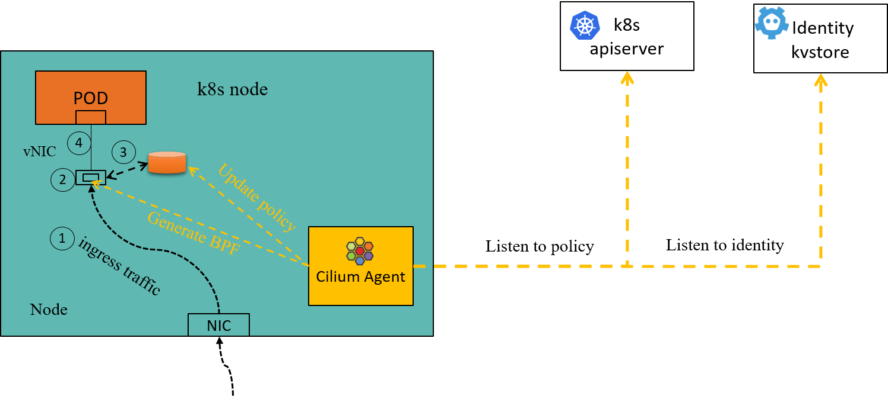
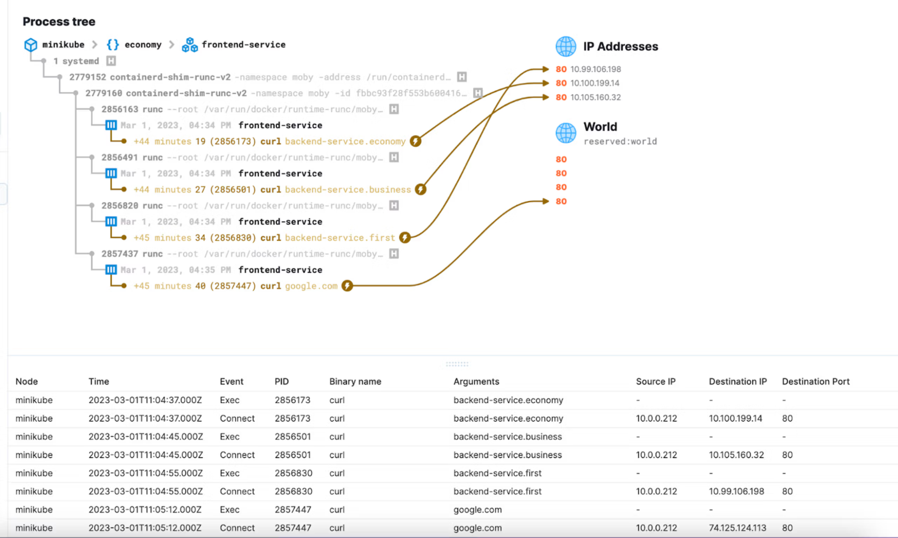
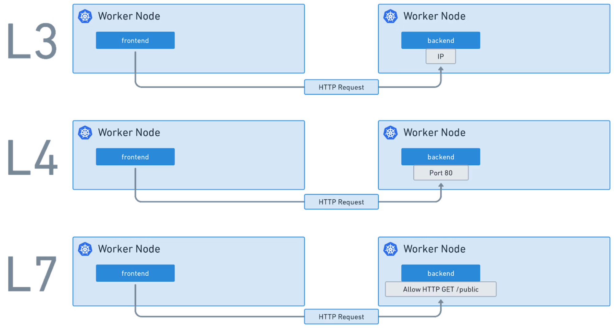
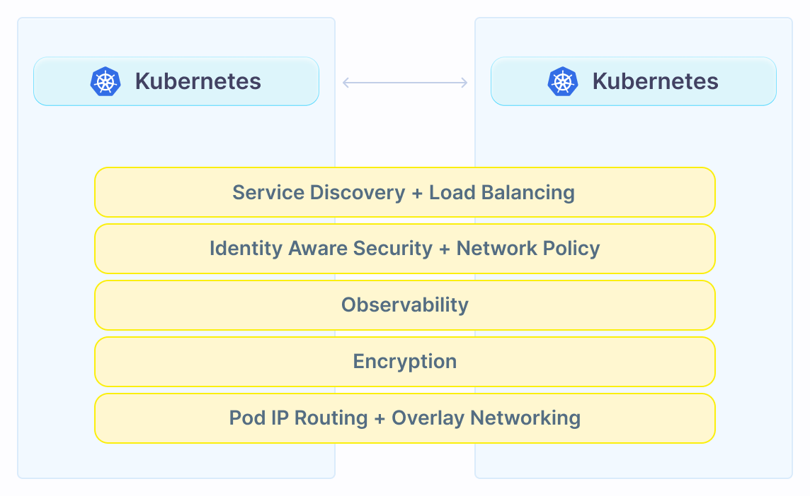
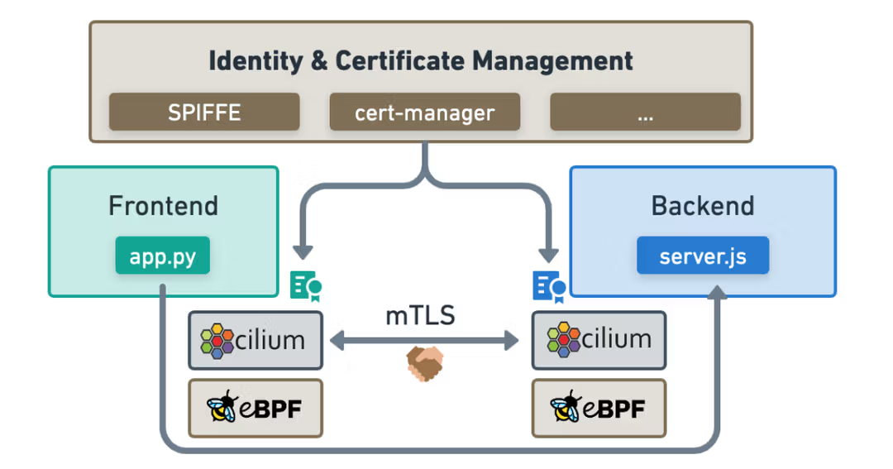
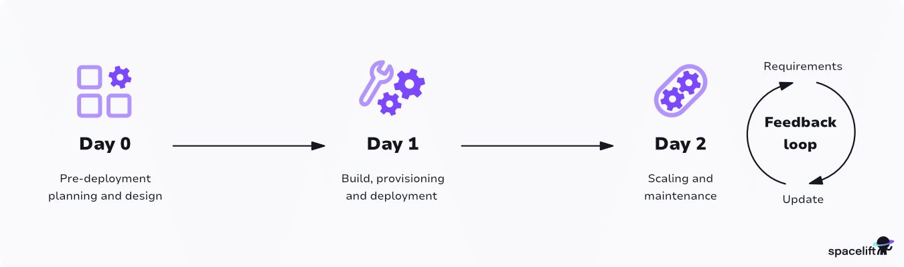
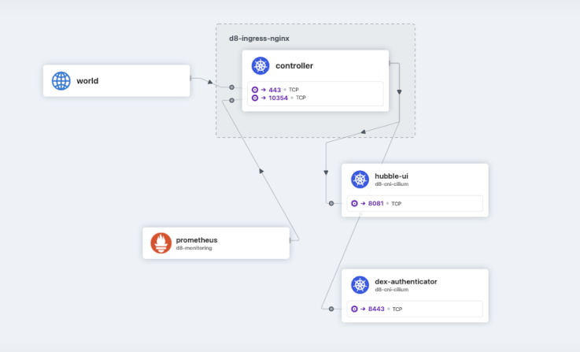

import authors from 'utils/author-data';

# Understanding Kubernetes Network Security

# 1\. Introduction

The ephemeral nature of cloud-native workloads has fundamentally changed the Network Security models. In a microservices architecture where resources are constantly being created and destroyed, firewalls based on IP addresses are not enough. The current state of the art is shifting towards Kubernetes-native, Identity-Based Security, a necessary evolution to keep pace with the container orchestrator.

Kubernetes network security is transitioning from IP/port-based rules to intent-based policies defined by Kubernetes-native identity and metadata, such as Pod names and labels. Cilium, leveraging eBPF technology, facilitates this shift by enabling security policy enforcement directly inside the Linux kernel’s data plane. This approach provides a robust, high-performance solution that understands the application context of communication, a key requirement for cloud-native platforms.

_Figure 1: Cilium Agent node-level architecture translating Kubernetes network policies and identities into eBPF enforcement rules for pod traffic._

## Network Attack Surfaces

A significant security hole is the Layer 4 (L4) limitation of legacy tools and native Kubernetes Network Policies. While a policy might correctly restrict traffic to a specific port, such as Port 8080/TCP, it offers no visibility into the actual application-layer intent. Once the port is open, an attacker who compromises a Pod can execute unauthorized actions like DELETE /orders or POST /admin/shutdown just as easily as a legitimate GET /items. This Layer 7 (L7) blindness exposes the application to API-based attacks, highlighting the risk of relying solely on basic Layer 3/4 filtering.

# 2\. Limitations of the Legacy Network Security Model

The foundational principles of traditional network security were designed for a static world, making them insufficient to handle the dynamic nature of cloud-native environments and Kubernetes. The shortcomings of legacy approaches are clear in four key areas:

## Inability to Handle Ephemeral IP Addresses

In Kubernetes, Pods are ephemeral, constantly spinning up, moving, and being destroyed, which leads to unpredictable IP address changes (IP Churn). Traditional security models rely on fixed IP addresses to define firewall rules, an approach that breaks down when IP addresses are volatile. The modern approach, championed by Cilium, shifts this focus from volatile IP addresses to Identity-based security, where unique security identities are assigned to Pods based on Kubernetes metadata and labels. This means that the security policy is based on intent (e.g., "Allow role: frontend to talk to role: backend") rather than specific, rapidly changing IP addresses.

## Performance Bottlenecks

Most networking technologies often introduce a performance bottleneck, frequently relying on complex rule processing. For instance, the use of technologies like iptables or IPVS limits both performance and scalability. With these technologies, adding more Pods means the firewall has to check more rules, resulting in an O(n) complexity. Cilium, by leveraging eBPF (Extended Berkeley Packet Filter), moves networking and security logic directly into the Linux kernel. This allows security enforcement to happen with constant time complexity, or O(1), by using kernel-level eBPF maps (high-performance hash tables) for identity and policy verification, enabling faster policy evaluation with low CPU overhead.

## Lack of Identity-Awareness

Modern distributed applications rely on technologies such as containers to facilitate agility in the deployment of new versions of their application and to scale out on demand. This results in a large number of containers starting in a short period of time. Typical container firewalls secure workloads by filtering source IP addresses, destination IP addresses, and ports. IP addresses in Kubernetes are ephemeral. Traditional firewalls are also not cloud-native-aware and are mostly not capable of being programmed dynamically when applications scale out or new versions are deployed. Updating the Firewall constantly to adapt to the constant changes becomes impossible at scale.

## Default-Allow

The default state of Kubernetes networks is a flat network structure where, by default, all pods can communicate with each other. This "default-allow" posture creates a significant security hole, allowing an attacker who compromises a single container to move laterally throughout the cluster (lateral movement). To mitigate this risk, a Default Deny strategy must be implemented as part of a Zero Trust Architecture. This approach aggressively blocks all traffic or actions by default, allowing only explicitly authorized activities. Tools like Hubble, Cilium's observability layer, help in this transition by visualizing existing traffic before enforcement, allowing teams to prototype and test policies in Audit Mode before moving to full enforcement.

# 3\. Kubernetes Network Security with eBPF

The shift from IP-based security to Kubernetes-native identity requires a foundation that can operate at the data plane with speed and context. This foundation is the Extended Berkeley Packet Filter (eBPF). Cilium uses eBPF (extended Berkeley Packet Filter) to overcome these limitations by moving security to the kernel level.

By leveraging eBPF, Cilium gets the ability to insert security rules based on service/pods/container identity rather than an IP address for identification, as in the traditional system. As a result, eBPF makes applying security policies in a dynamic container environment scalable by decoupling security from IP addressing, providing stronger security isolation

## The Kernel as the Ideal Enforcement Point

The Linux kernel is the primary handler for all networking traffic. eBPF allows network and security logic to be safely embedded directly into the kernel's data path, executing security policy decisions at the earliest possible moment without relying on slow, outdated methods like iptables or IPVS.

_Figure 2: Runtime observability interface correlating container process trees with specific network connection events._

## Cilium Network Policies and Layer 7

Cilium leverages eBPF to extend basic Layer 3/4 Kubernetes Network Policies to Layer 7 (Application Layer) controls. This enables fine-grained, API-aware segmentation, meaning policies can allow specific HTTP methods (e.g., GET /items) while blocking others (e.g., POST /admin/shutdown), strictly enforcing the Principle of Least Privilege.

_Figure 3: Comparison of L3, L4, and L7 network policies, illustrating Cilium's ability to enforce fine-grained, API-aware security controls._

# 4\. Pillars of Kubernetes Network Security

Kubernetes network security is strongest when it is treated as a layered model, not a single control. In dynamic clusters, pod IPs change, services scale up and down, and traffic patterns shift constantly. Cilium’s approach, powered by eBPF, focuses on enforcing security close to the workload while using Kubernetes identity, metadata, and application-aware context instead of relying only on IP addresses.

_Figure 4: Core networking, security, and observability layers unifying multiple Kubernetes clusters into a single, seamless environment._

## Identity-Based Access Control

The first pillar is identity. Traditional firewalls often depend on IP addresses and ports, but Kubernetes workloads are short-lived and constantly rescheduled. Cilium decouples security from network addressing by assigning identities based on Kubernetes metadata such as labels, namespaces, pods, and service accounts.

This enables policies such as “frontend can talk to backend on port 443” or “only this service account can call this API,” even as pods move across nodes or receive new IPs. Isovalent describes this as a foundation for microsegmentation and least-privilege access across services.

## Network Policy and Microsegmentation

Network policies define which workloads can communicate, in which direction, and on which ports or protocols. Kubernetes NetworkPolicy provides basic ingress and egress controls at L3/L4, while Cilium extends this with CiliumNetworkPolicy and CiliumClusterwideNetworkPolicy for richer enforcement across L3-L7.
With Cilium, teams can implement:

- Namespace isolation
- Default-deny policies
- Pod-to-pod and service-to-service allow rules
- Egress controls for external services
- Cluster-wide policies for shared security baselines
- Layer 7 controls for HTTP, DNS, and other application protocols

This turns the cluster network into a set of explicit trust boundaries instead of a flat network where every workload can reach every other workload by default.

## Application-Aware L7 Security

Kubernetes security needs more than “allow TCP/80.” Many services share the same ports, especially HTTP and HTTPS APIs, so port-based controls alone cannot express real application intent.

Cilium supports Layer 7 policy enforcement, allowing teams to define controls based on application-layer behavior. For example, a policy can allow one service to make only GET /public requests while denying other HTTP methods or paths. This helps reduce blast radius when a service is compromised because the attacker inherits only the precise network permissions the workload actually needs.

## Encryption and Mutual Authentication

Encryption protects data in transit between workloads and nodes. Cilium supports transparent encryption using IPsec or WireGuard, allowing traffic between Cilium-managed endpoints, and in some configurations, host traffic to be encrypted without requiring application changes.
For stronger workload identity verification, Cilium also supports mutual authentication through its service mesh capabilities. This helps ensure that communication is not only encrypted but also tied to verified identities, which is especially important for zero-trust Kubernetes environments.

[Read More About Encryption](https://docs.cilium.io/en/latest/security/network/encryption/)

# 5\. The Anatomy of a Rule

A NetworkPolicy is a Kubernetes object, and its rule structure (the "anatomy") consists of four primary parts: Selector (who is this for), direction (which way is traffic moving), the peer, and the action.

## Subject Selectors and Identity

Cilium Network Policies shift from volatile IP addresses to Identity-Based Security. Policies use Kubernetes metadata and labels known as Subject Selectors to define the enforcement point for both source and destination workloads (e.g., _role: frontend_ talking to _role: backend_). This logical abstraction is pre-computed by the control plane into a single, cluster-wide Numeric Security Identity ($O(1)$ lookup complexity), allowing the eBPF kernel maps to execute high-speed packet filtering instantly.

## Default Deny Posture

A core element of a Zero Trust architecture, the Default Deny posture aggressively blocks all communication unless it is explicitly permitted by a policy. Teams can safely transition to this model by using Hubble (Cilium's observability layer) to visualize existing traffic and test policies in Audit Mode before moving to full enforcement.

## Ingress & Egress Semantics

Rules control the flow of traffic _into_ the workload (Ingress) and _out of_ the workload (Egress). For external communication, Cilium Egress Gateway can be used to secure egress access by routing traffic to specific external services through designated nodes, providing a stable, predictable source IP that satisfies traditional firewalls outside the cluster.

## Layer 7 Inspection

This capability extends security beyond Layer 3/4 filtering to address the Layer 7 blindness in network policies. It allows for fine-grained, API-aware security (e.g., DNS-aware rules) by enabling policies to inspect the application content. For instance, a policy can allow a _GET /public_ request while explicitly blocking a sensitive _POST /admin/shutdown_ command, strictly enforcing the Principle of Least Privilege.

[Read More About Cilium Network Policies](https://isovalent.com/blog/post/intro-to-cilium-network-policies/)

# 6\. Advanced Security Patterns

Cilium supports stronger patterns such as transparent encryption, mutual authentication, and host-layer segmentation to protect traffic and infrastructure without adding unnecessary operational complexity.

**Transparent Encryption (mTLS)**
Kubernetes lacks native pod-to-pod encryption, often requiring complex service mesh sidecars. Cilium solves this by providing **Transparent Encryption** for node-to-node traffic using technologies like IPsec or WireGuard, without requiring application changes. Recently, Cilium introduced **Native mTLS with ztunnel**, which unifies authentication and encryption directly within the Kubernetes data path, offering high-performance, identity-aware security for East-West traffic.

_Figure 5: Transparent mTLS encryption and identity management for pod-to-pod communication powered by Cilium and eBPF._

**Host-Layer Segmentation**
Security strategies must also extend to the Node itself to prevent attackers who compromise the host from bypassing pod-level controls. **Cilium Host Policies** apply the same identity-aware security logic used for applications to secure the host network namespace, segmenting control plane traffic and SSH access.

# 7\. Day 2 Operations: Observability, Auditing, and Compliance

Day 2 operations represent the ongoing, post-deployment phase of the IT lifecycle, focused on managing, monitoring, and optimizing systems already in production. Day 2 Operations include the longest operational phase after software has been deployed and operationalized.

Day-2 operations can be succinctly characterized as 'business as usual' tasks, constituting the phase that sustains product functionality, enabling customers to enjoy it seamlessly whenever needed.

_Figure 6: The IT operational lifecycle illustrating the progression from initial Day 0 planning to continuous Day 2 operations and maintenance._

## Hubble for Network Observability

As the observability layer built on eBPF, Hubble provides deep, real-time insights into networking, service, and application behavior, helping teams turn reactive firefighting into proactive optimization. It provides a Service Map and flow logs enriched with Kubernetes identity metadata (Pod names, Labels, Security ID), allowing operators to troubleshoot issues and understand the conversation in terms of services, not volatile IP addresses.

_Figure 7: Hubble Service Map providing real-time, identity-aware visualization of Kubernetes network flows._

## Auditing and Compliance

For regulated industries (FinTech, Healthcare), meeting compliance frameworks like SOC2, PCI-DSS, and GDPR requires to be detailed auditing. Cilium facilitates this by enforcing strict segmentation and generating detailed, immutable network flow logs. Tetragon further extends this capability by providing runtime security and visibility into system calls, supporting real-time threat protection and streamlined compliance reporting.

## Importance of Day 2 Operations

It's important to have Day 2 operations in mind when laying the groundwork for your software in Day 0 and Day 1, especially for cloud-native technologies. Having the right maintenance tools in place earlier on will help your organization avoid issues in the future.
Some common challenges during Day 2 operations include having trouble visualizing the performance of your software and difficulty integrating updates. Managing all the moving parts of your software is especially challenging with cloud-native systems such as Kubernetes, as they become increasingly more complex with scale.

# 8\. Summary

Kubernetes network security works best as a layered model, rather than relying on a single feature or firewall rule. Because workloads are dynamic, short-lived, and constantly moving across nodes, teams need security controls that follow workload identity rather than static IP addresses. A strong approach combines identity-based network policies, microsegmentation, transparent encryption, application-aware controls, observability, and host-level protection. Together, these layers reduce unnecessary access, limit lateral movement, and facilitate the enforcement of the least privilege across the cluster.

Cilium strengthens this model by using eBPF to enforce security close to workloads in the Linux kernel, while integrating with Kubernetes identities such as labels, namespaces, and service accounts. It gives teams more precise control over which services can communicate, how traffic is secured, and how policy decisions are enforced across pods, nodes, and clusters. With Hubble, teams also gain the visibility needed to understand service dependencies, troubleshoot denied traffic, audit policy behavior, and validate compliance requirements. The result is a Kubernetes network that is not only more secure but also easier to observe, operate, and improve over time.

<BlogAuthor {...authors.CharityMbisi} />
