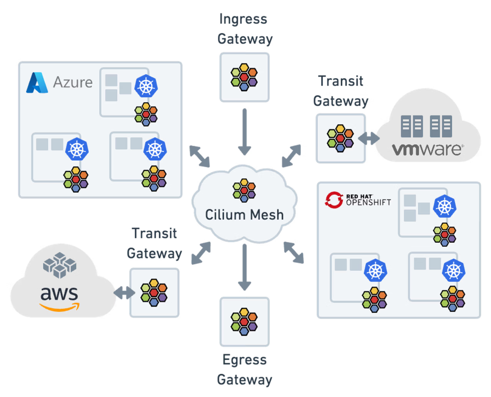
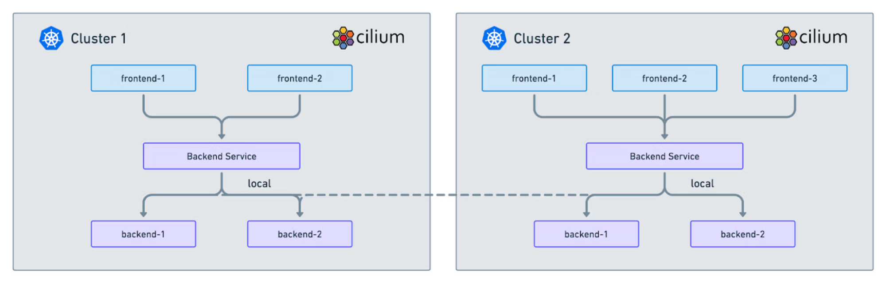
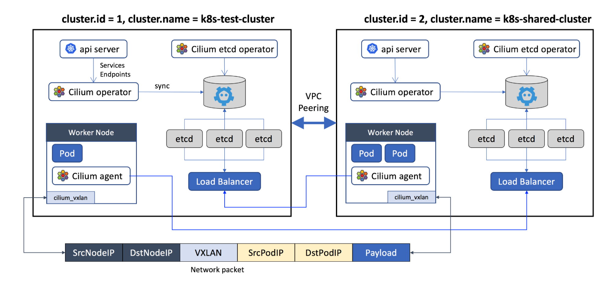
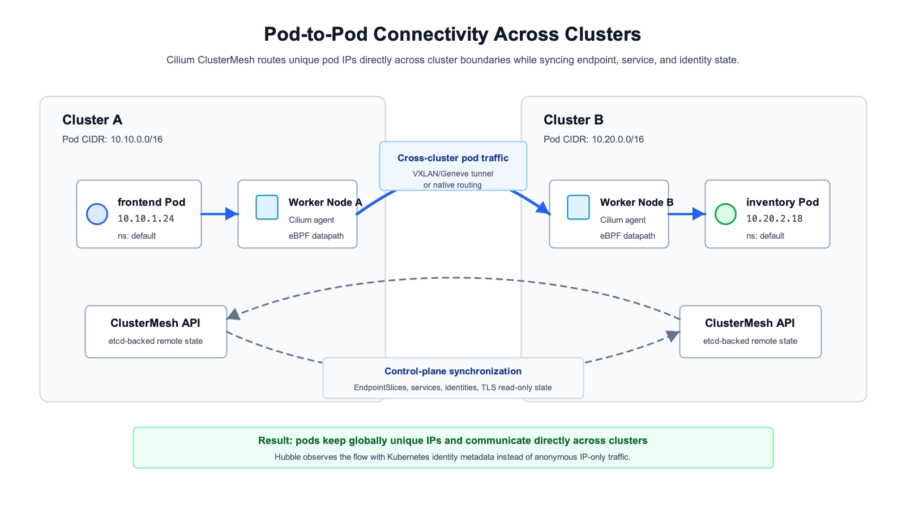
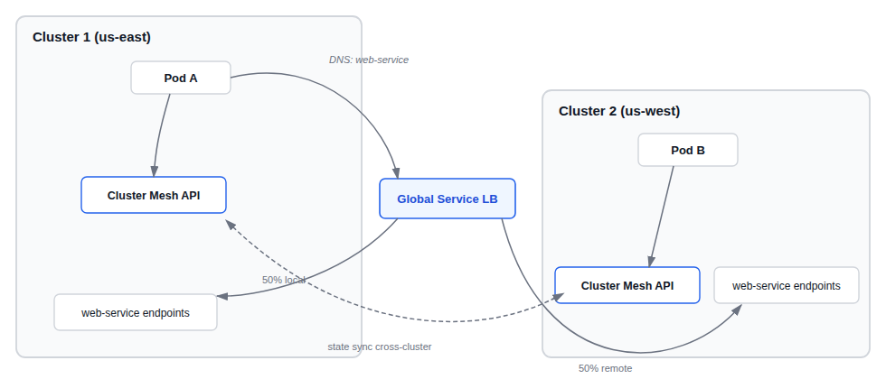
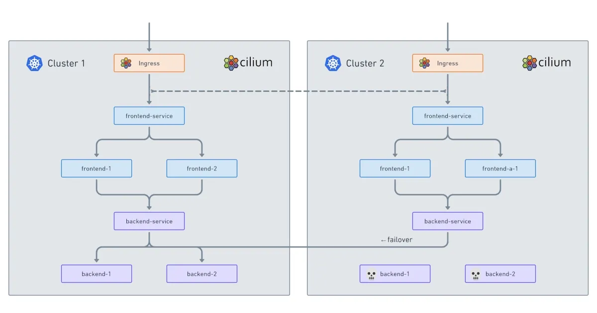
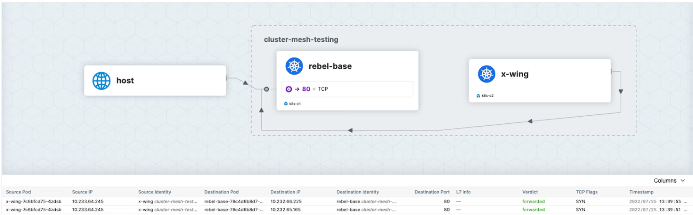

import authors from 'utils/author-data';

# **Multi-Cluster Kubernetes Explained**

# **Introduction**

As enterprises scale their cloud native infrastructure, a single Kubernetes cluster often becomes not enough for meeting requirements related to isolation, availability, scale, and/or geographic distribution. Multi-cluster Kubernetes is an architectural approach that involves deploying and managing multiple independent clusters to support a unified application environment.

By dividing resources into targeted groups, companies can localize for efficiency, isolate potential failures, and tailor specific technology or cluster needs without overlapping operational concerns.

There are various ways to segment workloads from one another in Kubernetes. You can run them on different pods or set up different namespaces. But if you want the maximum level of granularity and the high availability and performance benefits that it can bring, a multi-cluster Kubernetes deployment is the way to go.

Edge computing can also require connecting hundreds of clusters across disparate locations and infrastructures. Without a networking solution to manage this scale and complexity, you will just have a bunch of computers talking to themselves rather than each other and your customers.

# **I. Why Multi-Cluster?**

Transitioning from a single large cluster to multiple smaller clusters can be driven by several critical operational concerns:

- **Low Latency**: In a single-cluster architecture, workloads are deployed to one region or data center. This means users interacting with your application from across the globe will inevitably experience high network delays due to the physical distance data must travel. By adopting a multi-cluster approach, you can distribute workloads geographically, placing compute resources in regions closer to your end-users or edge devices. This drastically reduces round-trip times and ensures a highly responsive application experience.

- **High Availability and Disaster Recovery**: Distributing workloads across clusters in different availability zones or regions ensures that the failure of a single cluster or provider region does not lead to total application downtime.
- **Workload scalability:** Running multiple clusters may enhance your ability to scale workloads up when necessary. If everything runs in a single cluster, it’s harder to determine which specific workloads require more resources or additional replicas, especially if you lack performance data for individual workloads (which may be the case if you are only tracking cluster-level health). You are also more likely to run into “noisy neighbor” issues when running everything in a single cluster. And for very large clusters, you may hit the ceiling on the cluster size that Kubernetes supports; currently, you can’t have more than 5,000 nodes per cluster.
- **Compliance and Data Sovereignty:** Specific clusters can be localized to certain jurisdictions to meet regulatory requirements regarding data residency.
- **Hard Multitenancy**: While namespaces provide soft isolation, separate clusters offer a stronger security boundary for different teams, environments (Dev/UAT/Prod), or sensitive workloads.
- **Organizational Growth and Acquisitions**: As companies scale organically or engage in Mergers and Acquisitions (M\&A), they frequently inherit disparate infrastructure, different cloud providers, or existing Kubernetes environments. Instead of undertaking a massive, high-risk migration to consolidate these discrete workloads into a single monolith, connecting them via a multi-cluster architecture provides a seamless, non-disruptive path to infrastructure integration while allowing acquired teams to maintain their operational autonomy.

# **II. Multi-Cluster Architecture Patterns**

Organizations deploy Kubernetes across multiple clusters for various reasons such as resilience, compliance, regulatory isolation, team autonomy, or geographic distribution. Before choosing a topology, it's important to understand the trade-offs each pattern introduces in terms of operational complexity, blast radius, latency, and cost.

## **Active-Active**

In an active-active topology, two or more clusters simultaneously serve live production traffic. Workloads are replicated across all clusters, and load is balanced between them. This pattern reduces blast radius and enables failover, supporting resilience through active-active approaches. With Cilium ClusterMesh, global services can span clusters so that pods in Cluster A and Cluster B both act as backends for the same service; traffic flows to whichever is healthy.

**Best for:** High-availability applications, geo-distributed workloads, zero-downtime deployments.
**Trade-off:** Requires state synchronization between clusters; data consistency logic adds complexity.

## **Active-Standby**

Here, one cluster handles all live traffic (active), while a second cluster sits warm and ready to take over (standby). The standby cluster runs replicated workloads but does not serve traffic under normal conditions. Failover is triggered manually or automatically when the active cluster degrades.

With Cilium's service.cilium.io/affinity annotation, you can express topology-aware preference, for instance, pinning traffic to the local cluster under normal conditions and allowing spillover to the remote cluster only during failure. Setting the affinity to local marks local endpoints as preferred, and changing the value to remote shifts traffic to the remote cluster's endpoints.

**Best for:** Disaster recovery, regulated workloads requiring a clear primary/secondary designation.
**Trade-off:** Standby capacity is idle under normal operations, increasing cost.

[Read More About Service Affinity](https://docs.cilium.io/en/latest/network/clustermesh/affinity/)

## **Cluster per Environment**

Each Software Development Lifecycle environment (development, staging, production) gets its own cluster. This is one of the most common patterns in enterprise Kubernetes adoption and provides hard boundaries between lifecycle stages.

Separating environments (dev/staging/prod) or tenants into dedicated clusters avoids noisy-neighbor effects and misconfiguration leakage. ClusterMesh is not always required here; typically, inter-cluster communication between environments is intentionally restricted, but it can be used to mirror services or support integration testing across environment boundaries with a fine-grained network policy.

## **Cluster per Region**

As enterprises diversify product offerings across the globe, it’s important to make sure that users connect to their services from the nearest access point. Hence, instead of attempting to stretch a single Kubernetes cluster across geographic regions, which often results in high latency, organizations deploy distinct clusters in different geographic regions.

Another reason for an enterprise to run a cluster per region is data residency compliance requirements. GDPR mandates strict data residency requirements, ensuring personal data of EU residents is stored and processed within specific geographic locations or under adequate safeguards.

## **Cluster per Tenant**

Also known as hard multitenancy, this pattern provisions a dedicated Kubernetes cluster for each customer, business unit, or internal department. While Kubernetes namespaces, Network Policies, and RBAC offer soft isolation, they still share the same control plane and underlying host kernels, which might not meet strict compliance requirements.

By assigning a cluster per tenant, you eliminate the noisy neighbor problem and ensure a strict security boundary. A common challenge here is IP exhaustion or overlapping IPs across dozens of tenant clusters.

## **Hub and Spoke Topology**

In a hub-and-spoke topology, a central hub cluster acts as the core shared-services center, connecting out to multiple spoke clusters where the actual workloads run. Instead of deploying operational tooling in every single cluster, the hub hosts centralized services like observability stacks (Hubble/Prometheus), secrets management (HashiCorp Vault), CI/CD runners, or centralized DNS.

With Cilium ClusterMesh, you can expose these specific shared services from the Hub to the Spokes without requiring the Spokes to be meshed with each other.

# **III. Implementing Inter-Cluster Connectivity via Cilium ClusterMesh**

Cilium enables seamless multi-cluster connectivity through a feature called **ClusterMesh**.

_Fig 1: Cilium ClusterMesh connecting heterogeneous Kubernetes environments across Azure, AWS, Red Hat OpenShift, and VMware through unified Ingress, Egress, and Transit Gateways._

Cluster Mesh connectivity is high performance, as data flows directly from one worker node to another without intermediate proxies. It preserves the workload identity for cross-cluster traffic, meaning that network observability tooling, such as Cilium’s Hubble, as well as network policies, continue to operate just as they do within a single cluster.

## **Key Capabilities of ClusterMesh**

- **Multi-Cluster Connectivity:** Cilium provides the ability to connect multiple clusters across different cloud providers or on-premises environments.
- **Identity-Based Security:** Security identities assigned to pods are maintained across cluster boundaries, allowing for consistent L3/L4 and L7 network policies regardless of where a pod is running.
- **Global Services:** Services can be defined as "global," enabling traffic to be load-balanced across pods in multiple clusters. This allows for automatic failover; if a service in Cluster A fails, traffic is redirected to the healthy backends in Cluster B.
- **Transparent Encryption:** Cilium can enable node-to-node encryption across clusters without requiring application changes or sidecar proxies.

_Fig 2: Cilium ClusterMesh global service load balancing, frontend and backend services spanning two clusters with automatic failover to healthy backends in Cluster 2._

## **Architectural Requirements Checklist**

To successfully implement Cilium ClusterMesh and achieve inter-cluster connectivity, your infrastructure must meet a specific set of foundational network requirements:

1. **Non-overlapping Pod CIDRs**: In a standard ClusterMesh deployment, every cluster must be assigned a unique, non-overlapping Pod IP subnet (CIDR). This ensures that Pod IPs are globally unique across the entire mesh, allowing Cilium to route traffic directly to a specific pod without relying on complex Network Address Translation (NAT) rules.
2. **Node-to-node IP Connectivity**: The worker nodes in all participating clusters must be able to reach each other over the network. Clusters are connected and routed across cloud providers using native VPC peering, dedicated interconnects (like AWS Direct Connect or Azure ExpressRoute), or via secure IPSec/WireGuard tunnels.
3. **Native Routing CIDR**: When using direct routing instead of encapsulation (tunneling), the network infrastructure must know how to route the Pod CIDRs. This requires configuring the underlying VPC network to recognize the pod IP ranges so that traffic can flow natively between nodes across different clusters.
4. **Consistent Datapath Mode:** While it is possible to mix some configurations, it is highly recommended that meshed clusters use a consistent datapath mode (e.g., all clusters using VXLAN/Geneve tunneling, or all clusters using direct native routing). This reduces troubleshooting complexity and ensures consistent performance.
5. **DNS Across Clusters:** For seamless service discovery, the Kubernetes DNS service (like CoreDNS) needs to be aware of the ClusterMesh. Cilium integrates with the service routing plane underneath Kubernetes DNS. When CoreDNS resolves a global service hostname to a local virtual ClusterIP, Cilium's eBPF layer translates that IP target into a list of globally available backend pods, regardless of which cluster they reside in.

_Fig 3: Cilium ClusterMesh internal architecture, two clusters connected via VPC Peering, showing etcd state synchronization, Cilium agents, Load Balancers, and the VXLAN encapsulated network packet structure for cross-cluster pod traffic._

[Read More About Cilium Cluster Mesh](https://isovalent.com/blog/post/introducing-cilium-mesh/)

# **IV. Deep Dive: How ClusterMesh Operates Under the Hood**

Unlike traditional multi-cluster setups that rely on heavy routing layers or centralized API gateways, Cilium leverages the Linux kernel to create a seamless, flat network topology across your entire multi-cluster environment.

In many traditional architectures, cross-cluster communication requires traffic to traverse a complex maze of ingress controllers, egress gateways, and sidecar proxies. Cilium fundamentally changes this paradigm. Cilium Cluster Mesh implements IP forwarding without proxies or gateways. Because the routing logic is embedded directly in the kernel, data flows directly from one worker node to another without intermediate proxies.

## **The clustermesh-apiserver**

At the heart of Cilium's multi-cluster architecture is the clustermesh-apiserver. Rather than relying on a single, global database that could act as a single point of failure, Cilium takes a decentralized approach.

Cilium's Cluster Mesh uses etcd as an external key-value store to exchange information across multiple Cilium instances. The clustermesh-apiserver manages this dedicated etcd instance for the cluster, tracking the state of endpoints, services, and network identities. To allow other clusters to connect and read this state, the Cilium control plane is exposed to the VPCs using the service annotation 'Internal' for load balancer type.

## **KVStoreMesh**

Once the _cluster mesh-apiserver_ exposes the cluster's state, the clusters need a safe way to synchronize this data. This is where the KVStoreMesh concept comes in.

Instead of pushing data directly into a remote cluster's primary database (which is risky), each cluster in the network operates its own etcd cluster with replication occurring on a read-only basis to ensure that failures in a cluster do not bring down other clusters. Cilium agents watch the remote KVStores in a pull-based, read-only fashion. If the network link between Cluster A and Cluster B goes down, both clusters simply continue operating securely using their locally cached state.

## **Identity Propagation**

One of the most complex challenges in multi-cluster networking is maintaining the security context when a packet leaves one cluster and enters another. Traditional networks rely on IP addresses, which are ephemeral and lose meaning across cluster boundaries.

Cilium solves this through identity propagation. The key to seamless pod-to-pod networking is Cilium's implementation of identity-based networking that identifies which pods and services can communicate using labels instead of IP addresses to enforce access controls. Because this identity is embedded in the eBPF datapath, Cilium preserves workload identity for cross-cluster traffic, meaning that network observability tooling, such as Cilium's Hubble, as well as network policies, continue to operate just as they do within a single cluster.

## **Certificate Management**

Because ClusterMesh involves control plane data (etcd synchronization) and data plane traffic (pod-to-pod communication) traversing underlying networks often crossing different VPCs or public internet links, security is paramount.

- **Control Plane Security**: TLS authenticates the client and server with the certificates and keys that are managed as Kubernetes secrets. This ensures that only authorized clusters can connect to the remote clustermesh-apiserver to read the KVStore state.
- **Data Plane Encryption**: For the actual application traffic flowing between nodes across clusters, encryption between all endpoints, clusters, pods, and services can be automatically and transparently applied at the platform level without requiring application modifications. This transparent encryption (using IPsec or WireGuard) ensures that data in transit remains fully secure regardless of the underlying cloud provider or network infrastructure.

# **V. Pod-to-Pod Connectivity Across Clusters**

The minimum requirement for a successful multi-cluster network is for Kubernetes pods to easily communicate with one another across clusters. Historically, connecting isolated Kubernetes clusters required exposing workloads via Ingress controllers, API gateways, or complex NAT rules.

Cilium ClusterMesh eliminates this friction. Cluster Mesh connectivity is high performance, as data flows directly from one worker node to another without intermediate proxies. This flattens the network, allowing a pod in one cluster to directly address the IP of a pod in another cluster just as if they were on the same physical node.

_Fig 4: Pod-to-Pod connectivity across Cilium ClusterMesh, frontend pod in Cluster A (10.10.0.0/16) communicating directly with inventory pod in Cluster B (10.20.0.0/16) via eBPF datapath and VXLAN/native routing, with bidirectional control-plane synchronization of EndpointSlices, services, and identities._

## **How Pod IPs become routable Across Clusters**

To achieve this flat network topology, several networking prerequisites must align:

- Non-Overlapping Pod CIDRs: The most critical requirement is that each cluster must be assigned a unique, non-overlapping Pod IP subnet (CIDR). If Cluster A uses 10.10.0.0/16, Cluster B must use something different, like 10.20.0.0/16. This ensures that every pod across your entire infrastructure has a globally unique IP address.

- Node-to-Node Reachability: ClusterMesh does not magically bypass firewalls. The worker nodes across different clusters must be able to route traffic to one another. Clusters are connected and routed through VPCs using either the standard API from any cloud provider, an on-premise infrastructure via regular IPSec-based VPN gateways and tunnels, or directly through network headers.

## **Encapsulation Mode vs Native Routing Across Cluster Boundaries**

When a packet leaves a pod in Cluster A destined for a pod in Cluster B, Cilium can route the pod IPs in a few different ways. You must choose the right datapath mode based on your underlying infrastructure:

**Encapsulation Mode (Tunneling)**: By default, Cilium wraps the pod traffic inside a VXLAN or Geneve tunnel. The underlying cloud provider or physical network only sees traffic moving from Node A's IP to Node B's IP; the internal pod IPs are hidden inside the tunnel.

Pros: Incredibly easy to set up. It works on almost any infrastructure because the underlying network doesn't need to know how to route pod IPs.
Cons: The encapsulation process adds a small amount of overhead (header size and CPU cycles) to every packet.

**Native Routing (Direct Routing)**: In this mode, Cilium relies on the underlying network (like AWS VPC CNI, Azure Delegated IPAM, or on-premises BGP routers) to natively understand and route the pod IPs. No tunneling is used.

Pros: Maximum performance. By avoiding the encapsulation overhead of tunnel mode, Native Routing provides the lowest possible latency and highest throughput, crucial for data-heavy workloads like AI/ML training or massive databases.

Cons: Requires advanced configuration of the underlying network infrastructure to ensure it can natively route the distinct Pod CIDRs across cluster boundaries.

## **EndpointSlice Synchronization**

Routing packets is only half the battle; the clusters also need to know where to send them. This is where service discovery comes into play.

In a single Kubernetes cluster, when you create a Service, the Kubernetes control plane generates an EndpointSlice, a scalable list of the healthy pod IPs backing that service. In a multi-cluster setup, Cilium agents securely synchronize these endpoint, identity, and service states across cluster boundaries.

Recent advancements in Cilium have taken this a step further by natively supporting the Multi-Cluster Services API (MCS-API), a Kubernetes SIG standard. By using EndpointSlice synchronization, Cilium can dynamically reconcile EndpointSlices from remote clusters. If a backend pod in Cluster B scales up or crashes, the Cilium clustermesh-apiserver instantly synchronizes that state change over the etcd control plane, updating the available endpoints for Cluster A in real-time. This allows load balancing to shift dynamically without relying on external DNS polling.

## **Verifying Cross-Cluster Pod Connectivity**

Once your ClusterMesh is established, verifying and troubleshooting the connectivity requires the right tools. Because Cilium preserves workload identity for cross-cluster traffic, you can use native Cilium and Hubble tooling to debug cross-cluster flows just as easily as local ones.

- Verify the Mesh Status: Use the Cilium CLI to ensure the clusters are actively peering and the etcd control planes are synchronizing.
- Run the Multi-Cluster Connectivity Test: The Cilium CLI includes a robust, automated testing suite that deploys test pods in both clusters and validates IP routing, global service load balancing, and network policy enforcement across the boundary.
- Observe with Hubble: If a connection fails, you don't need to guess if a network policy or a routing rule dropped it. Because the network is fully observable without additional code changes, you can use the Hubble CLI to instantly trace the flow.

[Read More About Routing & Service Mesh](https://isovalent.com/blog/post/topology-aware-routing-and-service-mesh-across-clusters-with-cluster-mesh/)

# **VI. Global Services and Cross-Cluster Load Balancing**

In a multi-cluster environment, developers need a way to expose an application running in multiple clusters under a single, unified service name. Cilium handles this natively without requiring complex external load balancers or API gateways.

## **Global Services**

Cilium routes connections between pods in multiple clusters if a 'global services' annotation is added to a Kubernetes service deployment. To enable this, you deploy a standard Kubernetes Service in each cluster and attach the following metadata annotation: io.cilium/global-service: "true".

Implementing this annotation immediately solves the pod-to-pod communication problem and eliminates the need for internal load balancers and DNS records with cross-cluster identity-based networking. Cilium connects clusters without proxies or gateways by representing each global workload as if the workload runs as a pod.

_Fig 5: Cilium Global Service load balancing across two clusters, Pod A in Cluster 1 (us-east) resolves web-service via DNS, with the Global Service LB distributing 50% of traffic to local endpoints and 50% to remote endpoints in Cluster 2 (us-west) through bidirectional ClusterMesh API state synchronization._

## **How Global Load Balancing Works**

When a pod in Cluster A attempts to reach a Global Service, the hostname resolves to a standard local ClusterIP via internal CoreDNS. The eBPF datapath then hooks the connection at the socket layer, dynamically translating that single virtual IP into the direct backend Pod IPs of healthy instances across the entire synchronized multi-cluster mesh.

## **Service Affinity**

While load balancing across clusters is powerful, cross-cluster traffic often incurs higher latency and egress costs. Cilium solves this using the service.cilium.io/affinity annotation.

- By setting affinity to local, Cilium will prioritize routing traffic to backend pods within the same cluster.
- It only spills traffic over to the remote cluster if all local endpoints fail or degrade, ensuring optimal performance under normal conditions while maintaining disaster recovery capabilities.

_Fig 6: Cilium service affinity traffic is prioritized to local backend pods within each cluster, with cross-cluster spillover (dashed) triggered only when all local endpoints in Cluster 1 fail or degrade._

## **Shared Services**

Using a Hub and Spoke topology, global services allow organizations to centralize common operational tools. Cilium Cluster Mesh provides cloud architects and platform operators with the flexibility to centralize commonly used services like shared secrets, DNS, and other global services from a hub. This prevents you from having to deploy heavy monitoring or vault instances into every cluster.

## **Handling Unreachable Clusters**

Because Cilium leverages the underlying capabilities of Kubernetes, there is no need to modify any of Kubernetes' fundamental architectures. Services that are available to other clusters are kept healthy using Kubernetes' liveness and readiness probes, where services are added and removed as necessary when pods scale up and down, or they become unhealthy. If a cluster goes offline, the cluster mesh-apiserver instantly removes those endpoints from the mesh, ensuring traffic is only routed to healthy clusters.

[Read About Setting Up a ClusterMesh](https://docs.cilium.io/en/stable/network/clustermesh/clustermesh/)

# **VII. Network Policy Across Cluster Boundaries**

Extending connectivity across clusters introduces new security challenges. If Cluster A is compromised, you must ensure the attacker cannot freely pivot into Cluster B.

## **How Identity-Based Policy Works Across Clusters**

Because network policies are implemented at the kernel level, all traffic can be observed and monitored with Prometheus and visualized with Hubble without requiring developers to instrument their code.

The key to seamless pod-to-pod networking is Cilium's implementation of identity-based networking that identifies which pods and services can communicate using labels instead of IP addresses to enforce access controls. When traffic leaves one cluster, the security identity (represented as a numeric ID) is embedded in the network packet. The receiving cluster evaluates this identity against its own local network policies before allowing the packet to reach the destination pod.

## **Writing Cross-Cluster Policies**

Writing a cross-cluster policy is identical to writing a local CiliumNetworkPolicy. Because identities are synchronized, you can restrict traffic based on cluster names. For example, using the **_io.cilium.k8s.policy.cluster_** label, you can write a policy stating that the frontend pod in cluster-1 is only allowed to talk to the backend pod in cluster-2, effectively micro-segmenting your mesh.

## **Default-Deny Across Cluster Boundaries**

The best practice in Kubernetes security is the Default-Deny posture. By creating a baseline policy that denies all ingress and egress traffic, you force developers to explicitly define what cross-cluster communication is permitted. Cilium honors this posture seamlessly; if a global service does not have an explicit network policy allowing the cross-cluster identity, the eBPF datapath will drop the packets at the source node.

## **FQDN Policy in Multi-Cluster**

Cilium also supports DNS-based (FQDN) policies across clusters. If a pod in a remote cluster needs to reach an external API (like api.stripe.com), you can enforce egress security at the DNS level, ensuring that even within a vast multi-cluster mesh, workloads can only communicate with approved external domains.

## **Limitations**

It is important to note that standard ClusterMesh deployments require non-overlapping Pod CIDRs across all clusters. While Isovalent Enterprise for Cilium offers advanced NAT capabilities for overlapping IPs, using standard open source Cilium with overlapping subnets can severely complicate identity propagation and direct pod routing.

# **VIII. Multi-Cluster Observability with Hubble**

Maintaining visibility in a multi-cluster environment is crucial for troubleshooting and security purposes. When traffic traverses multiple infrastructure boundaries, blind spots are unacceptable.

## **Hubble**

Hubble is built on top of Cilium and eBPF to enable deep visibility into the communication and behavior of services as well as the networking infrastructure. Because the identity-aware datapath spans the mesh, Hubble provides platform teams with a single management plane for load-balancing, observability, and security enforcement between nodes from multiple Kubernetes clusters.

_Fig 7: Cilium Hubble UI showing cluster mesh visualization._

## **Filtering Flows by Cluster**

Using the Hubble CLI or UI, operators do not need to guess where a packet was dropped. Because the cluster name is attached to the flow identity, an engineer can instantly filter network telemetry to show only cross-cluster traffic (e.g., traffic originating in cluster-aws and destined for cluster-onprem).

## **Cross-Cluster Dependency Mapping**

Through the Hubble UI, security and platform teams can view a real-time, graphical dependency map. If a global service spans three clusters, Hubble visually maps the traffic flows between them, indicating protocol types, bandwidth usage, and highlighting dropped packets in red. This allows SREs to instantly pinpoint if a multi-cluster outage is due to a crashed pod, a misconfigured network policy, or a cloud provider network partition.

# **IX. Summary**

Multi-cluster Kubernetes is no longer an edge case; it is a necessity for enterprise-grade resilience and scale. Organizations now require the ability to control and observe multi-cluster architectures that can seamlessly discover services, load balance across zones, perform cross-cloud disaster recovery, and deliver low-latency services globally.

Although Kubernetes makes it simple to scale distributed applications on a single cluster, its native networking model introduces significant operational complexity and performance overhead when attempting to connect workloads across multiple clusters. Historically, bridging these environments meant relying on heavy proxies, API gateways, and external load balancers.

By leveraging eBPF-native solutions like Cilium, organizations are overcoming these networking bottlenecks. Through features like ClusterMesh, Cilium provides the high-performance, identity-aware infrastructure required to treat multiple clusters as a single, cohesive environment. It preserves workload identity for all cross-cluster traffic, meaning that security policies and network observability tooling such as Cilium's Hubble continue to operate exactly as they do within a local cluster.

<BlogAuthor {...authors.CharityMbisi} />
