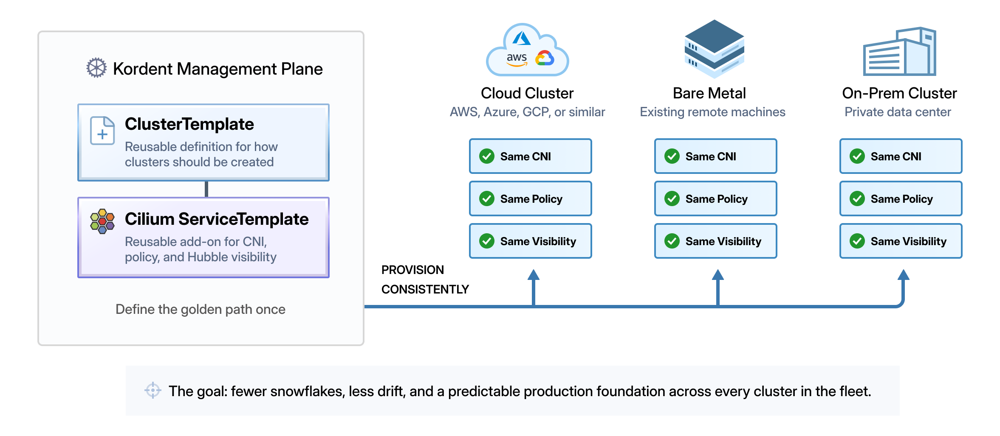

import authors from 'utils/author-data';

# How k0rdent and Cilium Turn Kubernetes Sprawl into a Platform

If you have spent time running Kubernetes in the real world, you know the catch: standing up one cluster is the easy part. The hard part starts when one cluster becomes ten, then a hundred, spread across cloud providers, bare metal, and on-prem environments.

That is where k0rdent and Cilium fit together very well.

**k0rdent** gives platform teams a single control plane to provision, template, and manage fleets of clusters declaratively and consistently. **Cilium**, built on eBPF, provides the networking, identity-based security, and observability those clusters need for production.

Together, they help turn cluster sprawl into a repeatable platform pattern. Instead of bolting on networking, policy, and visibility one cluster at a time, teams can make them part of the cluster definition from the start.

In this post, we will look at why platform teams pair k0rdent and Cilium, then walk through a hands-on example using a k0rdent `ClusterDeployment` with Cilium as the CNI.

Let's dig in.

## Built Once, But is it Consistent Everywhere?

If you run a platform team, you're already juggling a growing fleet, workloads that need management, and a list of things that must stay consistent across every cluster. k0rdent and Cilium work well together because they address both sides of that problem: how clusters get built and how they behave once they are running.

The drift usually shows up in small but painful ways. One cluster has Cilium configured differently, another is missing a policy that exists everywhere else, and another has incomplete visibility when a service-to-service call starts failing. Those differences are easy to create by hand and hard to debug at 2 a.m.

k0rdent's answer is to treat the cluster as a template, and Cilium fits into that model directly. Cilium is available in the k0rdent catalog as a validated service template, meaning it can be attached to a cluster as a reusable add-on. Define it once, and every cluster k0rdent provisions can come up with the same Cilium foundation: CNI, policies, and observability included from the start.



Visibility is also a factor. "Service A can't reach service B" is easy or hard depending entirely on what you can see. Cilium ships with Hubble, which gives you L3 through L7 flow visibility without sidecars by leveraging eBPF, and k0rdent helps make that visibility part of the standard cluster template rather than something enabled one cluster at a time. When something breaks, you can see where the traffic was dropped and why, and on which cluster it happened.

Put it together and the practical result is that the platform team can run a much larger fleet, because the clusters are built the same way and behave predictably.

## From Template to Running Cluster

With the why out of the way, let's see what this actually looks like in practice. In this section we'll walk through deploying a k0rdent `ClusterDeployment` that uses Cilium as its CNI, so that the cluster comes up already networked the way we want rather than waiting for someone to wire it in afterward.

A quick note on assumptions before we start. This walkthrough assumes you already have a k0rdent Management cluster up and running. If you don't, the [official quickstart](https://docs.k0rdent.io/latest/quickstarts/quickstart-1-mgmt-node-and-cluster/#install-a-kubernetes-cluster-as-the-management-cluster) walks you through setting one up. We'll also be deploying onto bare metal hosts, which means we'll be using the `remote-cluster` `ClusterTemplate` to bring those existing machines under management.

A `ClusterTemplate` is k0rdent's reusable definition for how a cluster should be created. The `remote-cluster` template is useful when the infrastructure already exists, as it lets k0rdent connect to those machines over SSH and bootstrap them into a managed child cluster..

### Deploying the Remote Cluster Template

For this example we're working with three Linux machines on the same network. One is the k0rdent node running our Management cluster. The other two, `worker1` and `worker2`, are the bare metal hosts that will become our child cluster.

Because k0rdent provisions bare metal remote machines over SSH, the first thing we need is root SSH access to both workers. Let's generate a dedicated key pair for this so we're not reusing anything else, then copy it out to each host.

```shell
ssh-keygen -f ~/.ssh/idk0r
ssh-copy-id -i ~/.ssh/idk0r.pub root@worker1
ssh-copy-id -i ~/.ssh/idk0r.pub root@worker2
```

Next, k0rdent needs a credential object so it knows how to authenticate against those workers. We install the `remote-credential` chart, then base64-encode the private key we just created and patch it into the secret k0rdent expects.

```shell
helm install remote-credential oci://ghcr.io/k0rdent/catalog/charts/remote-credential -n kcm-system
REMOTE_SSH_KEY_B64=$(cat ~/.ssh/idk0r | openssl base64 -A)
kubectl patch secret remote-ssh-key -n kcm-system -p='{"data":{"value":"'$REMOTE_SSH_KEY_B64'"}}'
```

Here's where the pairing actually comes together. We install Cilium into k0rdent as a service template, which is what makes it something we can reference from a `ClusterDeployment` later.

```shell
helm upgrade --install cilium oci://ghcr.io/k0rdent/catalog/charts/kgst \
--set "chart=cilium:1.19.0" -n kcm-system
```

Once it's installed, a quick check confirms the template is registered and valid.

```shell
kubectl get servicetemplates -A | grep cilium
```

Now, we set up the cluster we want. We can do this with a `ClusterDeployment` that references the `remote-cluster` template for the bare metal hosts and the `cilium` service template for the CNI.

Create a file called `remote-cld-cilium.yaml`:

```
apiVersion: k0rdent.mirantis.com/v1beta1
kind: ClusterDeployment
metadata:
  name: remote
  namespace: kcm-system
  labels:
    type: remote
spec:
  template: remote-cluster-1-0-22
  credential: remote-credential
  propagateCredentials: false
  config:
    controlPlaneNumber: 1
    k0smotron:
      service:
        type: NodePort
    machines:
    - name: worker1
      address: 192.168.1.5
      user: root
      port: 22
    - name: worker2
      address: 192.168.1.6
      user: root
      port: 22
    k0s:
      version: v1.35.3+k0s.0
    network: # prepare for cilium
      calico: null
      provider: custom
    kubeProxy:
      disabled: true
  serviceSpec:
    services:
    - template: cilium-1-19-0
      name: cilium
      namespace: kube-system
      values: |
        cilium:
          cluster:
            name: cilium
          hubble:
            tls:
              enabled: false
            auto:
              method: helm
              certManagerIssuerRef: {}
            ui:
              enabled: false
              ingress:
                enabled: false
            relay:
              enabled: false
          ipv4:
            enabled: true
          ipv6:
            enabled: false
          envoy:
            enabled: false
          egressGateway:
            enabled: false
          kubeProxyReplacement: "true"
          serviceAccounts:
            cilium:
              name: cilium
            operator:
              name: cilium-operator
          localRedirectPolicy: true
          ipam:
            mode: cluster-pool
            operator:
              clusterPoolIPv4PodCIDRList:
              - "192.168.224.0/20"
              - "192.168.210.0/20"
              clusterPoolIPv6PodCIDRList:
              - "fd00::/104"
          tunnelProtocol: geneve
          k8sServiceHost: "{{ .Cluster.spec.controlPlaneEndpoint.host }}"
          k8sServicePort: "{{ .Cluster.spec.controlPlaneEndpoint.port }}"
```

A couple of things worth calling out. We're disabling `kubeProxy` and setting `calico: null` because Cilium is going to take over that job with its eBPF datapath, and `kubeProxyReplacement` is set to `"true"` to make that explicit.

Now, we can apply the `remote-cld-cilium.yaml` file, creating the cluster.

```shell
kubectl apply -f remote-cld-cilium.yaml
```

From there, k0rdent takes over, reaching out to the workers over SSH, bootstraps k0s, and rolls out Cilium as the CNI as part of the same process.

We can get the status of the `ClusterDeployment` with:

```shell
kubectl get cld -A
```

Once you see the status of "READY" being "True", the cluster is ready to go\!

```shell
NAMESPACE    NAME     READY   SERVICES   TEMPLATE                MESSAGES          AGE
kcm-system   remote   True    1/1        remote-cluster-1-0-22   Object is ready   15m
```

### Running a Cilium Test

Once the `ClusterDeployment` reports ready, we can pull the child cluster's kubeconfig straight from the secret k0rdent created and have a look around.

Extract the secret, decode it, and save it to a file:

```shell
kubectl get secret remote-kubeconfig -n kcm-system -o=jsonpath={.data.value} | base64 -d > kcfg_remote.yaml
```

Verify Cilium is up and running:

```shell
kubectl --kubeconfig kcfg_remote.yaml get pods -A -l app.kubernetes.io/part-of=cilium
```

The output should show the Cilium pods running in the `kube-system` namespace:

```shell
NAMESPACE     NAME                               READY   STATUS    RESTARTS   AGE
kube-system   cilium-mgw7b                       1/1     Running   0          4h42m
kube-system   cilium-operator-758fc644d7-jjq8h   1/1     Running   0          4h43m
kube-system   cilium-operator-758fc644d7-nhdr4   1/1     Running   0          4h43m
kube-system   cilium-rxcfw                       1/1     Running   0          4h38m
```

Now that we verified that Cilium is running, we can do a quick `CiliumNetworkPolicy` test.

First, we'll deploy a small sample workload: a `webapp` that serves both a `/public` and a `/private` endpoint, along with a `client` pod we can use to reach it.

```shell
kubectl --kubeconfig kcfg_remote.yaml \
apply -f \
https://gist.githubusercontent.com/christianh814/0d4c0d9529fe630775fa3f54f1725f80/raw/8e89d8d5d89f014e3d7899e32b4d71fe6498e93d/sample-workload.yaml
```

With no policy in place, the `client` pod can reach both endpoints. Both of these calls return data:

```shell
$ kubectl --kubeconfig kcfg_remote.yaml exec -it client-pod -- curl http://webapp/public
[
  {
    "id": 1,
    "body": "public information"
  }
]

$ kubectl --kubeconfig kcfg_remote.yaml exec -it client-pod -- curl http://webapp/private
[
  {
    "id": 1,
    "body": "secret information"
  }
]
```

That `/private` endpoint handing back "secret information" to anyone who asks is exactly the kind of thing we'd want to lock down. So let's write a `CiliumNetworkPolicy` that only allows the `client` to issue an HTTP `GET` against `/public`, and nothing else.

```shell
kubectl --kubeconfig kcfg_remote.yaml apply -f -<<EOF
apiVersion: "cilium.io/v2"
kind: CiliumNetworkPolicy
metadata:
  name: "allow-public-get"
spec:
  description: "Allow HTTP GET /public from app=client to app=webapp"
  endpointSelector:
    matchLabels:
      app: webapp
  ingress:
  - fromEndpoints:
    - matchLabels:
        app: client
    toPorts:
    - ports:
      - port: "80"
        protocol: TCP
      rules:
        http:
        - method: "GET"
          path: "/public"
EOF
```

Note that this isn't a simple "can these two pods talk" rule. We're filtering at Layer 7, allowing a specific method on a specific path. That's something a traditional L3/L4 CNI can't express on its own. With the policy applied, let's run the exact same two requests again.

```shell
$ kubectl --kubeconfig kcfg_remote.yaml exec -it client-pod -- curl http://webapp/public
[
  {
    "id": 1,
    "body": "public information"
  }
]

$ kubectl --kubeconfig kcfg_remote.yaml exec -it client-pod -- curl http://webapp/private
Access denied
```

The `/public` request still works exactly as before, but the call to `/private` now comes back with `Access denied`. Cilium is inspecting the HTTP request and enforcing our intent at the application layer, and we got there without deploying a service mesh, a sidecar, or anything beyond the cluster k0rdent handed us. The CNI we declared in the template is already doing real work.

## Summary

In this walkthrough, k0rdent gave us a declarative way to stand up a cluster on bare metal, and because Cilium was defined in the template as a service, that cluster came up already networked, already secured, and ready to enforce a Layer 7 policy the moment it was online. Nothing was bolted on after the fact. The networking was part of the cluster definition from the start.

The value becomes clearer when you move from a single cluster to a fleet. The same template that produced a working CNI and policy engine here gives every cluster the same foundation, whether it lands on a Cloud Service Provider or a rack in your own data center. Networking, security, and observability stop being things each team wires up on their own and become part of what a cluster means in your environment. That consistency is what lets a platform team support a growing fleet without the drift, snowflakes, and the guesswork during late-night troubleshooting.

k0rdent and Cilium are each strong on their own, but together they close the gap between a cluster that's running and a cluster that's ready for production. That's why platform teams are choosing to pair the two in their environments.

<BlogAuthor {...authors.ChristianHernandez} />
