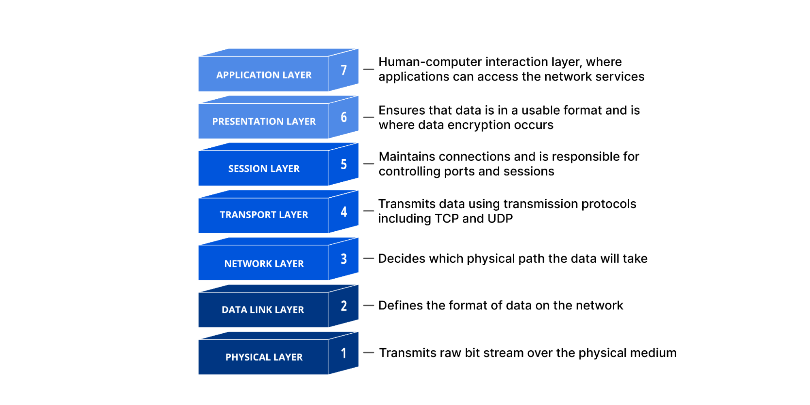
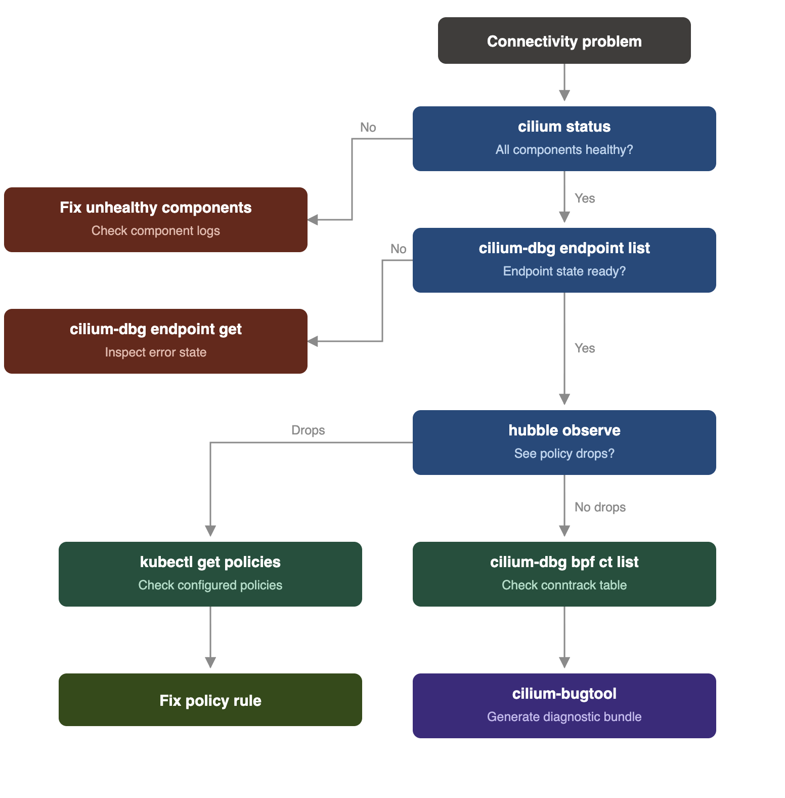
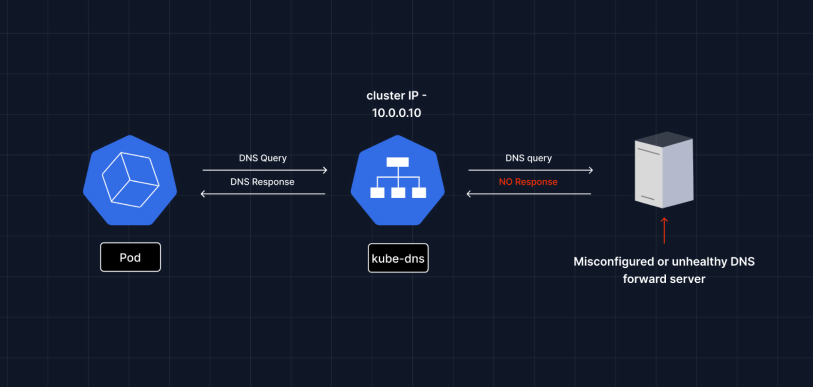

import authors from 'utils/author-data';

# Troubleshooting Kubernetes Networking

# 1.0 Introduction

Networking is notoriously one of the most common failure points encountered in workloads deployed within a Kubernetes environment. Because a cluster consists of hundreds or thousands of ephemeral compute resources (pods, nodes, and services) constantly spinning up, shutting down, and scaling, the underlying network layer bears the immense responsibility of keeping everything connected. When an application breaks in Kubernetes, **_it is probably a network issue_**.

Before container orchestration, it was somewhat easy to troubleshoot outages led by networking challenges. Servers had static IP addresses, physical switches had predictable ports, and firewalls relied on static rules. Kubernetes completely shatters this model.
The challenges of debugging Kubernetes networks stem directly from its highly dynamic architecture:

- **Ephemeral IP Addresses**: Pod IPs change every time a deployment is scaled, restarted, or rescheduled to a new node. Tracking down a connection failure using a raw IP address from an hour-old log file is often useless, as that IP may now belong to a completely different application.
- **Complex Abstractions**: Traffic routing relies on overlapping, virtualized abstractions like ClusterIPs, NodePorts, Ingress controllers, and CoreDNS.
- **The iptables Black Box**: Historically, Kubernetes relied heavily on kube-proxy and massive, sequential lists of iptables rules to route traffic. When a packet is unexpectedly dropped, tracing it through thousands of generic rules to find the exact misconfiguration is incredibly difficult and completely lacks appliscreen readercation-level context.

Misconfiguration is consistently reported as the leading source of Kubernetes incidents [\[Red Hat 2024\]](https://www.redhat.com/en/resources/kubernetes-adoption-security-market-trends-overview), while networking and DNS faults, though less frequent, are disproportionately difficult to localise.

# 2.0 OSI Stack

Kubernetes abstracts away physical infrastructure, but the OSI model does not disappear; it shifts. Every packet sent between pods, services, nodes, or external clients still traverses all seven layers. What changes is who owns each layer: the Linux kernel, the CNI plugin, kube-proxy (or its replacement), CoreDNS, Ingress controllers, and application code. Each operates at different OSI levels, and when something breaks, the layer boundary is usually where you start your investigation.

Cilium's datapath is unique because it operates simultaneously at Layers 2-7 through kernel hooks, including TC (traffic control), XDP (Layer 2/3), kprobes, and socket-level filters (Layer 4), as well as Envoy-integrated Layer 7 parsing. This means a single Cilium-equipped cluster can surface and debug issues at every OSI layer through one unified toolchain: Hubble, cilium-dbg, and the BPF map inspection commands.



_Figure 1: OSI stack. Image credit: Cloudflare, "What is the OSI Model?" Cloudflare Learning Center. [https://www.cloudflare.com/learning/ddos/glossary/open-systems-interconnection-model-osi/](https://www.cloudflare.com/learning/ddos/glossary/open-systems-interconnection-model-osi/)_

## Physical Layer: Node and NIC Failures

Although Kubernetes doesn't manage physical hardware directly, L1 failures surface immediately in cluster networking.

### Symptoms

- Node becomes NotReady in `kubectl get nodes`
- All pods on the affected node become unreachable
- cilium status reports Cluster health: 0/N reachable for the affected node

Common causes in cloud and on-prem

- MTU mismatch between the host NIC and the overlay tunnel. Cilium's VXLAN encapsulation adds 50 bytes of overhead. If the underlay MTU is 1500 and Cilium uses 1500 for pod traffic, frames are silently dropped during fragmentation.
- NIC queue saturation on high-throughput nodes.

[Read More about MTU Overhead](https://docs.cilium.io/en/stable/network/concepts/routing/)

Cilium Commands

`# Inspect the route MTU on the cilium_host interface`

```shell
root@server:~# kubectl -n kube-system exec ds/cilium -- ip link show cilium_host
4: cilium_host@cilium_net: <BROADCAST,MULTICAST,NOARP,UP,LOWER_UP> mtu 1500 qdisc noqueue state UP mode DEFAULT group default qlen 1000
    link/ether 5e:9d:ba:cf:a2:84 brd ff:ff:ff:ff:ff:ff

```

`# Check MTU configuration used by Cilium`

```shell
root@server:~# kubectl -n kube-system exec -it ds/cilium -- cilium status --verbose | grep -i mtu
                                           │   ├── mtu
                                           │   │   ├── job-endpoint-mtu-updater                        [OK] Endpoint MTU updated (14m, x1)
                                           │   │   └── job-mtu-updater                                 [OK] MTU updated (1500) (14m, x1)

```

`# Verify MTU on the overlay interface (if using tunnel mode)`

```shell
root@server:~# kubectl -n kube-system exec ds/cilium -- ip link show cilium_vxlan
5: cilium_vxlan: <BROADCAST,MULTICAST,UP,LOWER_UP> mtu 1500 qdisc noqueue state UNKNOWN mode DEFAULT group default
    link/ether 3a:0d:29:2d:1f:14 brd ff:ff:ff:ff:ff:ff

```

## Data Link: ARP, MAC Resolution, Bridge Issues

With symptoms like pods on the same node failing to communicate, and intermittent packet loss between pods on adjacent nodes.

Common causes

- ARP flux: nodes with multiple interfaces can reply to ARP requests from the wrong interface, causing asymmetric routes.
- Bridge netfilter disabled: if net.bridge.bridge-nf-call-iptables is off, kube-proxy-based clusters break at L2/L3 boundary (less relevant with Cilium's full eBPF replacement, but still matters during migration)
- Cilium is using veth device mode, where the veth peer goes missing after pod restart, due to race conditions.

`# List all endpoints and their MAC / IP state`

```shell
root@server:~# kubectl -n kube-system exec ds/cilium -- cilium-dbg endpoint list
ENDPOINT   POLICY (ingress)   POLICY (egress)   IDENTITY   LABELS (source:key[=value])   IPv6   IPv4           STATUS
           ENFORCEMENT        ENFORCEMENT
2179       Disabled           Disabled          1          reserved:host                                       ready
2216       Disabled           Disabled          8          reserved:ingress                     10.244.2.108   ready
2450       Disabled           Disabled          4          reserved:health                      10.244.2.19    ready
root@server:~#

```

`# Check if the veth pair for a specific endpoint is intact`

```shell
root@server:~# kubectl -n kube-system exec ds/cilium -- ip link show | grep lxc
7: lxc_health@if6: <BROADCAST,MULTICAST,UP,LOWER_UP> mtu 1500 qdisc noqueue state UP mode DEFAULT group default qlen 1000
root@server:~#

```

## Network Layer: IP Routing, IPAM, Overlay Tunnels

This is the most frequently hit layer in Kubernetes networking incidents. Most "pod can't reach pod on another node" issues live here.

Most of the time, issues in this layer are characterised by a timeout in ping between two pods, an internode traffic drop while intra-node traffic is ok, and CoreDNS unreachable with a timeout.

Common causes:

- IPAM exhaustion: Cilium's default cluster-pool IPAM allocates pod CIDRs per node. If the CIDR is exhausted, new pods fail to launch with IP assignment errors.
- Missing or stale BPF route entries after node restarts.
- VXLAN tunnel mismatch: Two nodes on different overlay VTEP configurations can't establish a tunnel.
- IP masquerade misconfigured: pods can reach the cluster network but not external services because SNAT rules aren't applied correctly.

Cilium Commands
`# Check IPAM allocation state`
`kubectl -n kube-system exec ds/cilium -- cilium-dbg bpf ipmasq list`

```shell
root@server:~# kubectl -n kube-system exec ds/cilium -- cilium-dbg bpf ipmasq list
No entries found.
root@server:~#

```

`# Inspect the IP address manager`
`kubectl -n kube-system exec ds/cilium -- cilium-dbg ip list`

```shell
root@server:~# kubectl -n kube-system exec ds/cilium -- cilium-dbg ip list
IP                IDENTITY                                                                            SOURCE
0.0.0.0/0         reserved:world
10.244.0.0/24     reserved:world
10.244.1.0/24     reserved:world
10.244.0.76/32    reserved:ingress
10.244.0.127/32   reserved:remote-node
10.244.0.139/32   reserved:health
10.244.1.112/32   reserved:remote-node
10.244.1.230/32   reserved:health
10.244.1.251/32   reserved:ingress
10.244.2.17/32    k8s:app=local-path-provisioner                                                      custom-resource
                  k8s:io.cilium.k8s.namespace.labels.kubernetes.io/metadata.name=local-path-storage
                  k8s:io.cilium.k8s.policy.cluster=kind-kind
                  k8s:io.cilium.k8s.policy.serviceaccount=local-path-provisioner-service-account
                  k8s:io.kubernetes.pod.namespace=local-path-storage
10.244.2.72/32    reserved:host
10.244.2.73/32    reserved:ingress
10.244.2.76/32    k8s:io.cilium.k8s.namespace.labels.kubernetes.io/metadata.name=kube-system          custom-resource
                  k8s:io.cilium.k8s.policy.cluster=kind-kind
                  k8s:io.cilium.k8s.policy.serviceaccount=coredns
                  k8s:io.kubernetes.pod.namespace=kube-system
                  k8s:k8s-app=kube-dns
10.244.2.127/32   reserved:health
10.244.2.149/32   k8s:io.cilium.k8s.namespace.labels.kubernetes.io/metadata.name=kube-system          custom-resource
                  k8s:io.cilium.k8s.policy.cluster=kind-kind
                  k8s:io.cilium.k8s.policy.serviceaccount=coredns
                  k8s:io.kubernetes.pod.namespace=kube-system
                  k8s:k8s-app=kube-dns
172.18.0.2/32     reserved:remote-node
172.18.0.3/32     reserved:kube-apiserver
                  reserved:remote-node
172.18.0.4/32     reserved:host
root@server:~#

```

`# List all BPF routing entries`
`kubectl -n kube-system exec ds/cilium -- cilium-dbg bpf ipcache list`

```shell
root@server:~# kubectl -n kube-system exec ds/cilium -- cilium-dbg bpf ipcache list
IP PREFIX/ADDRESS   IDENTITY
10.244.0.139/32     identity=4 encryptkey=0 tunnelendpoint=172.18.0.3 flags=hastunnel
10.244.1.0/24       identity=2 encryptkey=0 tunnelendpoint=172.18.0.2 flags=hastunnel
10.244.2.72/32      identity=1 encryptkey=0 tunnelendpoint=0.0.0.0 flags=<none>
10.244.0.0/24       identity=2 encryptkey=0 tunnelendpoint=172.18.0.3 flags=hastunnel
10.244.1.112/32     identity=6 encryptkey=0 tunnelendpoint=172.18.0.2 flags=hastunnel
10.244.2.17/32      identity=3388 encryptkey=0 tunnelendpoint=0.0.0.0 flags=<none>
172.18.0.2/32       identity=6 encryptkey=0 tunnelendpoint=0.0.0.0 flags=<none>
172.18.0.3/32       identity=7 encryptkey=0 tunnelendpoint=0.0.0.0 flags=<none>
172.18.0.4/32       identity=1 encryptkey=0 tunnelendpoint=0.0.0.0 flags=<none>
10.244.1.230/32     identity=4 encryptkey=0 tunnelendpoint=172.18.0.2 flags=hastunnel
10.244.2.73/32      identity=8 encryptkey=0 tunnelendpoint=0.0.0.0 flags=<none>
10.244.2.149/32     identity=48339 encryptkey=0 tunnelendpoint=0.0.0.0 flags=<none>
10.244.0.76/32      identity=8 encryptkey=0 tunnelendpoint=172.18.0.3 flags=hastunnel
10.244.0.127/32     identity=6 encryptkey=0 tunnelendpoint=172.18.0.3 flags=hastunnel
10.244.1.251/32     identity=8 encryptkey=0 tunnelendpoint=172.18.0.2 flags=hastunnel
10.244.2.76/32      identity=48339 encryptkey=0 tunnelendpoint=0.0.0.0 flags=<none>
10.244.2.127/32     identity=4 encryptkey=0 tunnelendpoint=0.0.0.0 flags=<none>
0.0.0.0/0           identity=2 encryptkey=0 tunnelendpoint=0.0.0.0 flags=<none>
root@server:~#

```

`# Check the ipcache — maps pod IPs to identities and tunnel endpoints`
`kubectl -n kube-system exec ds/cilium -- cilium-dbg bpf ipcache get <pod-ip>`

```shell
root@server:~# kubectl -n kube-system exec ds/cilium -- cilium-dbg bpf ipcache get 10.244.1.45
10.244.1.45 maps to identity identity=6026 encryptkey=0 tunnelendpoint=172.18.0.2 flags=hastunnel
root@server:~#

```

`# Verify tunnel map (VXLAN/Geneve mode)`

```shell
root@server:~# kubectl -n kube-system exec ds/cilium -c cilium-agent -- cilium-dbg node list
Name                           IPv4 Address   Endpoint CIDR   IPv6 Address   Endpoint CIDR   Source
kind-kind/kind-control-plane   172.18.0.3     10.244.0.0/24                                  custom-resource
kind-kind/kind-worker          172.18.0.4     10.244.2.0/24                                  local
kind-kind/kind-worker2         172.18.0.2     10.244.1.0/24                                  custom-resource
root@server:~#

```

`# Run Cilium's built-in connectivity test`

```shell
root@server:~# cilium connectivity test
ℹ️  Monitor aggregation detected, will skip some flow validation steps
✨ [kind-kind] Creating namespace cilium-test-1 for connectivity check...
✨ [kind-kind] Deploying echo-same-node service...
✨ [kind-kind] Deploying DNS test server configmap...
✨ [kind-kind] Deploying same-node deployment...
✨ [kind-kind] Deploying client deployment...
✨ [kind-kind] Deploying client2 deployment...
✨ [kind-kind] Deploying client3 deployment...
✨ [kind-kind] Deploying echo-other-node service...
✨ [kind-kind] Deploying other-node deployment...
✨ [host-netns] Deploying kind-kind daemonset...
✨ [host-netns-non-cilium] Deploying kind-kind daemonset...
ℹ️  Skipping tests that require a node Without Cilium
⌛ [kind-kind] Waiting for deployment cilium-test-1/client to become ready...

```

Hubble (L3 drops)

`# Watch all dropped flows at L3 with reason`

```shell
root@server:~# hubble observe --type drop --last 200 -o jsonpb | jq '.flow | {src: .source.pod_name, dst: .destination.pod_name, reason: .drop_reason_desc}'
{
  "src": null,
  "dst": null,
  "reason": "UNSUPPORTED_L3_PROTOCOL"
}
{
  "src": null,
  "dst": null,
  "reason": "UNSUPPORTED_L3_PROTOCOL"
}

```

`# Watch traffic between two specific pods`

```shell
root@server:~# hubble observe --from-pod default/frontend --to-pod default/backend --follow


```

##

## Transport Layer: TCP/UDP Services

Network issues in this layer are characterised by failure in TCP connections despite being able to ping it, NodePort services being reachable from only a few nodes but not others, uneven distribution of traffic in Load Balancer services, and exhausted connections in the nf_conntrack table.
Common Causes:

- Cilium service map out of sync with Kubernetes Endpoints: endpoints change faster than Cilium's reconciliation loop, especially during rolling deploys.
- kube-proxy running alongside Cilium in partial replacement mode, creating conflicting NAT rules.
- BPF NAT map full (default 524288 entries) on very high-connection-rate nodes
- Session affinity misconfiguration is causing stickiness to terminate pods.

Cilium Commands

`# List all Cilium-managed services and their backends`

```shell
root@server:~# kubectl -n kube-system exec ds/cilium -- cilium-dbg service list
ID   Frontend                 Service Type   Backend
1    10.96.0.1:443/TCP        ClusterIP      1 => 172.18.0.4:6443/TCP (active)
2    0.0.0.0:30464/TCP        NodePort
4    0.0.0.0:30977/TCP        NodePort
6    10.96.183.162:80/TCP     ClusterIP
7    10.96.183.162:443/TCP    ClusterIP
8    10.96.248.144:443/TCP    ClusterIP      1 => 172.18.0.3:4244/TCP (active)
9    0.0.0.0:31234/TCP        NodePort       1 => 10.244.1.248:4245/TCP (active)
11   10.96.218.16:80/TCP      ClusterIP      1 => 10.244.1.248:4245/TCP (active)
12   0.0.0.0:31235/TCP        NodePort       1 => 10.244.1.174:8081/TCP (active)
14   10.96.108.211:80/TCP     ClusterIP      1 => 10.244.1.174:8081/TCP (active)
15   10.96.0.10:53/TCP        ClusterIP      1 => 10.244.1.82:53/TCP (active)
                                             2 => 10.244.1.102:53/TCP (active)
16   10.96.0.10:53/UDP        ClusterIP      1 => 10.244.1.82:53/UDP (active)
                                             2 => 10.244.1.102:53/UDP (active)
17   10.96.0.10:9153/TCP      ClusterIP      1 => 10.244.1.82:9153/TCP (active)
                                             2 => 10.244.1.102:9153/TCP (active)
18   172.18.255.200:80/TCP    LoadBalancer
19   172.18.255.200:443/TCP   LoadBalancer
20   10.96.141.89:80/TCP      ClusterIP      1 => 10.244.2.163:80/TCP (active)
root@server:~#

```

`# Check a specific service's backend health`

```shell
root@server:~# kubectl -n kube-system exec ds/cilium -- cilium-dbg service list
ID   Frontend                 Service Type   Backend
1    10.96.0.1:443/TCP        ClusterIP      1 => 172.18.0.4:6443/TCP (active)
2    0.0.0.0:30464/TCP        NodePort
4    0.0.0.0:30977/TCP        NodePort
6    10.96.183.162:80/TCP     ClusterIP
7    10.96.183.162:443/TCP    ClusterIP
8    10.96.248.144:443/TCP    ClusterIP      1 => 172.18.0.3:4244/TCP (active)
9    0.0.0.0:31234/TCP        NodePort       1 => 10.244.1.248:4245/TCP (active)
11   10.96.218.16:80/TCP      ClusterIP      1 => 10.244.1.248:4245/TCP (active)
12   0.0.0.0:31235/TCP        NodePort       1 => 10.244.1.174:8081/TCP (active)
14   10.96.108.211:80/TCP     ClusterIP      1 => 10.244.1.174:8081/TCP (active)
15   10.96.0.10:53/TCP        ClusterIP      1 => 10.244.1.82:53/TCP (active)
                                             2 => 10.244.1.102:53/TCP (active)
16   10.96.0.10:53/UDP        ClusterIP      1 => 10.244.1.82:53/UDP (active)
                                             2 => 10.244.1.102:53/UDP (active)
17   10.96.0.10:9153/TCP      ClusterIP      1 => 10.244.1.82:9153/TCP (active)
                                             2 => 10.244.1.102:9153/TCP (active)
18   172.18.255.200:80/TCP    LoadBalancer
19   172.18.255.200:443/TCP   LoadBalancer
20   10.96.141.89:80/TCP      ClusterIP      1 => 10.244.2.163:80/TCP (active)
root@server:~#

```

`# Inspect the BPF load balancer map (frontend VIP → backends)`

```shell
root@server:~# kubectl -n kube-system exec ds/cilium -- cilium-dbg bpf lb list
SERVICE ADDRESS              BACKEND ADDRESS (REVNAT_ID) (SLOT)
10.96.218.16:80/TCP (1)      10.244.1.248:4245/TCP (11) (1)
10.96.248.144:443/TCP (1)    172.18.0.3:4244/TCP (8) (1)
10.96.141.89:80/TCP (1)      10.244.2.163:80/TCP (20) (1)
10.96.0.10:53/TCP (0)        0.0.0.0:0 (15) (0) [ClusterIP, non-routable]
10.96.108.211:0/ANY (0)      0.0.0.0:0 (0) (0) [ClusterIP, non-routable]
0.0.0.0:31235/TCP (1)        10.244.1.174:8081/TCP (12) (1)
10.96.141.89:0/ANY (0)       0.0.0.0:0 (0) (0) [ClusterIP, non-routable]
172.18.0.3:31234/TCP (0)     0.0.0.0:0 (10) (0) [NodePort]
172.18.0.3:31235/TCP (1)     10.244.1.174:8081/TCP (13) (1)
....
```

`# Check BPF NAT table (active SNAT mappings)`

```shell
root@server:~# kubectl -n kube-system exec ds/cilium -- cilium-dbg bpf nat list
TCP OUT 172.18.0.3:34178 -> 54.234.221.194:443 XLATE_SRC 172.18.0.3:34178 Created=408sec ago NeedsCT=1
TCP IN 54.234.221.194:443 -> 172.18.0.3:34178 XLATE_DST 172.18.0.3:34178 Created=408sec ago NeedsCT=1
TCP IN 172.18.0.4:6443 -> 172.18.0.3:58624 XLATE_DST 172.18.0.3:58624 Created=667sec ago NeedsCT=1
TCP OUT 172.18.0.3:59112 -> 172.18.0.4:4240 XLATE_SRC 172.18.0.3:59112 Created=297sec ago NeedsCT=1
TCP OUT 172.18.0.3:54010 -> 13.249.228.49:443 XLATE_SRC 172.18.0.3:54010 Created=406sec ago NeedsCT=1

```

`# Check connection tracking table`

```shell
root@server:~# kubectl -n kube-system exec ds/cilium -- cilium-dbg bpf ct list global
TCP OUT 172.18.0.3:58624 -> 172.18.0.4:6443 expires=19466 Packets=0 Bytes=0 RxFlagsSeen=0x18 LastRxReport=11461 TxFlagsSeen=0x1a LastTxReport=11461 Flags=0x0010 [ SeenNonSyn ] RevNAT=0 SourceSecurityID=0 BackendID=0 NatPort=0
TCP OUT 10.244.2.148:38566 -> 10.244.0.34:4240 expires=19462 Packets=0 Bytes=0 RxFlagsSeen=0x1a LastRxReport=11462 TxFlagsSeen=0x1a LastTxReport=11462 Flags=0x0010 [ SeenNonSyn ] RevNAT=0 SourceSecurityID=0 BackendID=0 NatPort=0

```

`# Compare Kubernetes services with what Cilium has programmed`
`# (discrepancies = sync lag or bug)`

```shell
root@server:~# kubectl get svc --all-namespaces
NAMESPACE     NAME              TYPE           CLUSTER-IP      EXTERNAL-IP      PORT(S)                      AGE
default       backend-service   ClusterIP      10.96.141.89    <none>           80/TCP                       10m
default       kubernetes        ClusterIP      10.96.0.1       <none>           443/TCP                      3h11m
kube-system   cilium-envoy      ClusterIP      None            <none>           9964/TCP                     15m
kube-system   cilium-ingress    LoadBalancer   10.96.183.162   172.18.255.200   80:30977/TCP,443:30464/TCP   15m
kube-system   hubble-metrics    ClusterIP      None            <none>           9965/TCP                     15m
....
root@server:~#

```

```shell
root@server:~# kubectl -n kube-system exec ds/cilium -- cilium-dbg service list
ID   Frontend                 Service Type   Backend
1    10.96.0.1:443/TCP        ClusterIP      1 => 172.18.0.4:6443/TCP (active)
2    0.0.0.0:30464/TCP        NodePort
4    0.0.0.0:30977/TCP        NodePort
6    10.96.183.162:80/TCP     ClusterIP
7    10.96.183.162:443/TCP    ClusterIP
8    10.96.248.144:443/TCP    ClusterIP      1 => 172.18.0.3:4244/TCP (active)
9    0.0.0.0:31234/TCP        NodePort       1 => 10.244.1.248:4245/TCP (active)
11   10.96.218.16:80/TCP      ClusterIP      1 => 10.244.1.248:4245/TCP (active)
12   0.0.0.0:31235/TCP        NodePort       1 => 10.244.1.174:8081/TCP (active)
14   10.96.108.211:80/TCP     ClusterIP      1 => 10.244.1.174:8081/TCP (active)
15   10.96.0.10:53/TCP        ClusterIP      1 => 10.244.1.82:53/TCP (active)
                                             2 => 10.244.1.102:53/TCP (active)
...
```

Hubble for L4 Drops

`# Watch TCP-specific drops`

```shell
root@server:~# hubble observe --type drop --protocol TCP --follow


```

`# Filter by specific port`

```shell
root@server:~# hubble observe --to-port 80 --follow


```

`# Check policy verdicts at L4`

```shell
root@server:~# hubble observe --type policy-verdict --follow

```

## Session Layer: Connection Tracking and Keep-Alive Issues

Kubernetes doesn't surface a dedicated session layer, but TCP session management is a real operational concern in long-lived microservice connections.

Connections appear active in the application but not in BPF ConTrack Maps.

**Common Causes:**

- BPF connection tracking idle timeout (default 300s for TCP established) terminates long-lived connections silently.
- NAT timeout is too aggressive for idle database connections.
- TCP keep-alive is not configured at the application level, and connections silently close mid-stream.

Cilium Commands

`# View CT timeouts and current CT table`

```shell
root@server:~# kubectl -n kube-system exec ds/cilium -- cilium-dbg bpf ct list global | head -50
TCP IN 10.244.1.46:56068 -> 10.244.2.219:4240 expires=11750 Packets=0 Bytes=0 RxFlagsSeen=0x1b LastRxReport=11740 TxFlagsSeen=0x1b LastTxReport=11740 Flags=0x0413 [ RxClosing TxClosing SeenNonSyn FromTunnel ] RevNAT=0 SourceSecurityID=6 BackendID=0 NatPort=0
TCP OUT 10.244.2.148:44772 -> 10.244.1.106:4240 expires=11711 Packets=0 Bytes=0 RxFlagsSeen=0x1b LastRxReport=11701 TxFlagsSeen=0x1b LastTxReport=11701 Flags=0x0013 [ RxClosing TxClosing SeenNonSyn ] RevNAT=0 SourceSecurityID=0 BackendID=0 NatPort=0

```

`# Check Cilium config for current CT settings`

```shell
root@server:~# kubectl -n kube-system exec ds/cilium -- cilium-dbg config | grep -i conntrack
ConntrackAccounting               : Disabled
root@server:~#


```

## Presentation Layer: TLS, mTLS, Certificate Issues

This is normally characterised by TLS handshake timeout or certificate verification failed; mTLS between pods fails after certificate rotation.

Common Causes

- Cilium WireGuard encryption is enabled on some nodes but not all (mixed encryption state).
- certificate expiry in the SPIFFE/SPIRE integration causes identity verification failures.
- Ingress TLS secret missing or expired, causing 503 from the Ingress controller.

Commands

`# Check WireGuard encryption status on all nodes`

```shell
root@server:~# kubectl -n kube-system exec ds/cilium -- cilium-dbg encrypt status
Encryption: Disabled
root@server:~#

```

`# Check node-to-node encryption state`

```shell
root@server:~# kubectl -n kube-system exec ds/cilium -- cilium-dbg node list
Name                           IPv4 Address   Endpoint CIDR   IPv6 Address   Endpoint CIDR   Source
kind-kind/kind-control-plane   172.18.0.4     10.244.0.0/24                                  custom-resource
kind-kind/kind-worker          172.18.0.3     10.244.2.0/24                                  local
kind-kind/kind-worker2         172.18.0.2     10.244.1.0/24                                  custom-resource
root@server:~#

```

Hubble for TLS Drops

```shell
# Watch flows with encryption status
hubble observe --follow -o jsonpb | jq 'select(.flow.is_reply == false) | {src: .flow.source.pod_name, dst: .flow.destination.pod_name, encrypted: .flow.traffic_direction}'


{
  "src": null,
  "dst": "hubble-relay-5bbf66658c-k6958",
  "encrypted": "INGRESS"
}
{
  "src": null,
  "dst": "hubble-relay-5bbf66658c-k6958",
  "encrypted": "INGRESS"
}


```

## Application Layer: HTTP, gRPC, DNS, FQDN Policies

This is where Cilium visibly exceeds. Cilium extends network policy enforcement to Layers 3, 4, and 7, enabling more granular control over ingress and egress traffic based on application behavior, including DNS support and mTLS.

The following are the common challenges in the application layer.

- Misconfigured Network Policies are a common issue
- DNS resolution failure

Symptoms

- HTTP 403/404 responses that only affect specific paths, not the whole service
- DNS resolution fails for external FQDNs, but pod IPs are reachable
- gRPC calls time out on specific methods but not others
- CiliumNetworkPolicy with HTTP rules is blocking traffic that should be allowed

`# List all endpoints with L7 policy`

```shell
root@server:~# kubectl -n kube-system exec ds/cilium -- cilium-dbg endpoint list
ENDPOINT   POLICY (ingress)   POLICY (egress)   IDENTITY   LABELS (source:key[=value])                                              IPv6   IPv4           STATUS
           ENFORCEMENT        ENFORCEMENT
180        Disabled           Disabled          10064      k8s:app=frontend                                                                10.244.2.199   ready
                                                           k8s:io.cilium.k8s.namespace.labels.kubernetes.io/metadata.name=default
                                                           k8s:io.cilium.k8s.policy.cluster=kind-kind
                                                           k8s:io.cilium.k8s.policy.serviceaccount=default
                                                           k8s:io.kubernetes.pod.namespace=default

```

`# Inspect FQDN cache (is the DNS entry resolved and cached?)`

```shell
root@server:~# kubectl -n kube-system exec ds/cilium -- cilium-dbg fqdn cache list
Endpoint   Source   FQDN   TTL   ExpirationTime   IPs
root@server:~#

```

`# Watch all HTTP flows cluster-wide (requires L7 visibility enabled)`

```shell
root@server:~# hubble observe --protocol http --follow


```

`# Watch DNS queries and responses`

```shell
root@server:~# hubble observe --protocol dns --follow

```

`# Trace a specific pod's HTTP traffic`

```shell
root@server:~# hubble observe --from-pod default/frontend --protocol http --follow

```

`# Watch TCP specifically`

```shell
root@server:~# hubble observe --protocol tcp --follow
Jun 24 23:10:00.032: 172.18.0.3:58624 (host) -> 172.18.0.4:6443 (kube-apiserver) to-network FORWARDED (TCP Flags: ACK, PSH)
Jun 24 23:10:00.286: 172.18.0.3:58636 (host) -> 172.18.0.4:6443 (kube-apiserver) to-network FORWARDED (TCP Flags: ACK, PSH)
Jun 24 23:10:00.669: 10.244.0.99:37982 (world) -> kube-system/hubble-relay-5bbf66658c-k6958:4245 (ID:14331) to-overlay FORWARDED (TCP Flags: ACK, PSH)

```

`# Show L7 policy verdicts (ALLOW vs DENY with path detail)`

```shell
root@server:~# hubble observe --type policy-verdict --protocol http --follow

```

## Cross-layer Challenges Common in Kubernetes

These challenges often happen when failures occur across different layers of the stack.

- MTU Cascade: Incorrect MTU settings can result in packet drops and performance degradation. This is particularly difficult to diagnose, as it might only happen when transferring large payloads. To detect this in your cluster, prioritise using Hubble to monitor and analyse your network traffic. It is important to verify Cilium MTU configuration.
- Policy Drift: This occurs when the current state of your cluster configuration deviates from the defined state as specified in code templates. To detect this in your cluster, prioritise using Hubble to monitor.

# 2.0 The Cilium Diagnostic Toolkit

Cilium provides a comprehensive set of built-in troubleshooting tools that leverage its eBPF data plane to expose information that is impossible to obtain with traditional networking tools. When a pod can't connect to a service, traceroute and tcpdump provide incomplete answers because they operate outside the kernel eBPF context where Cilium performs its work.

`# Overall Healthcheck`

```shell
root@server:~# cilium status --verbose
    /¯¯\
 /¯¯\__/¯¯\    Cilium:             OK
 \__/¯¯\__/    Operator:           OK
 /¯¯\__/¯¯\    Envoy DaemonSet:    OK
 \__/¯¯\__/    Hubble Relay:       OK
    \__/       ClusterMesh:        disabled

DaemonSet              cilium                   Desired: 3, Ready: 3/3, Available: 3/3
DaemonSet              cilium-envoy             Desired: 3, Ready: 3/3, Available: 3/3
Deployment             cilium-operator          Desired: 1, Ready: 1/1, Available: 1/1
Deployment             hubble-relay             Desired: 1, Ready: 1/1, Available: 1/1
Deployment             hubble-ui                Desired: 1, Ready: 1/1, Available: 1/1
Containers:            cilium                   Running: 3
                       cilium-envoy             Running: 3
                       cilium-operator          Running: 1
                       clustermesh-apiserver
                       hubble-relay             Running: 1
                       hubble-ui                Running: 1


```

`# Check all Cilium pods`

```shell
root@server:~# kubectl get pods -n kube-system -l k8s-app=cilium
NAME           READY   STATUS    RESTARTS   AGE
cilium-5pks9   1/1     Running   0          8m50s
cilium-rl6n5   1/1     Running   0          8m50s
cilium-wdvhp   1/1     Running   0          8m50s
root@server:~#

```

`# Perform endpoint inspection`

```shell
root@server:~# kubectl exec -n kube-system  cilium-6vxzs -- cilium-dbg endpoint list
ENDPOINT   POLICY (ingress)   POLICY (egress)   IDENTITY   LABELS (source:key[=value])                                   IPv6   IPv4           STATUS
           ENFORCEMENT        ENFORCEMENT
126        Disabled           Disabled          8          reserved:ingress                                                     10.244.0.14    ready
839        Disabled           Disabled          4          reserved:health                                                      10.244.0.196   ready
2424       Disabled           Disabled          1          k8s:node-role.kubernetes.io/control-plane                                           ready
                                                           k8s:node.kubernetes.io/exclude-from-external-load-balancers
                                                           reserved:host
root@server:~#

root@server:~# kubectl exec -n kube-system  cilium-6vxzs -- cilium-dbg endpoint get 839
[
  {
    "id": 839,
    "spec": {
      "label-configuration": {},
      "options": {
        "ConntrackAccounting": "Disabled",
        "Debug": "Disabled",
        "DebugLB": "Disabled",
        "DebugPolicy": "Disabled",
        "DropNotification": "Enabled",
        "MonitorAggregationLevel": "Medium",
        "PolicyAccounting": "Enabled",
        "PolicyAuditMode": "Disabled",
        "PolicyVerdictNotification": "Enabled",
        "SourceIPVerification": "Enabled",
        "TraceNotification": "Enabled"
      }
    },
...


```

`# Running Connectivity Test`

```shell
root@server:~# cilium connectivity test
ℹ️  Monitor aggregation detected, will skip some flow validation steps
✨ [kind-kind] Creating namespace cilium-test-1 for connectivity check...
✨ [kind-kind] Deploying echo-same-node service...
✨ [kind-kind] Deploying DNS test server configmap...
✨ [kind-kind] Deploying same-node deployment...
✨ [kind-kind] Deploying client deployment...
✨ [kind-kind] Deploying client2 deployment...
✨ [kind-kind] Deploying client3 deployment...
✨ [kind-kind] Deploying echo-other-node service...
✨ [kind-kind] Deploying other-node deployment...
✨ [host-netns] Deploying kind-kind daemonset...
✨ [host-netns-non-cilium] Deploying kind-kind daemonset...
ℹ️  Skipping tests that require a node Without Cilium
✨ [kind-kind] Deploying Ingress resource...

```


_Figure 2: Cilium connectivity troubleshooting decision tree_

Policy Troubleshooting

Cilium offers command-line utilities to interact with and troubleshoot network policies. The infrastructure team can simulate the policy decision for a specific source or destination port combination and show exactly which rule is permitting or denying the flow, without sending real traffic.

`# Get an effective policy for an endpoint`

```shell
root@server:~# kubectl -n kube-system exec ds/cilium -- cilium-dbg policy get
[]
Revision: 1
root@server:~#
```

Log Inspection

Logs are the audit trail for everything the agent tried and failed to do. Cilium agent logs are verbose by default; the key is filtering for actionable signals rather than reading every line.

`# Get Cilium logs`

```shell
root@server:~# kubectl -n kube-system logs -f ds/cilium -c cilium-agent
Found 3 pods, using pod/cilium-6th6g
time=2026-06-27T14:00:11.756428436Z level=info msg="Memory available for map entries (0.250% of 8322646016B): 20806615B"
time=2026-06-27T14:00:11.756524087Z level=info msg="option bpf-ct-global-tcp-max set by dynamic sizing to 131072"
time=2026-06-27T14:00:11.756538881Z level=info msg="option bpf-ct-global-any-max set by dynamic sizing to 65536"
...
```

Endpoint regeneration log lines are particularly useful. Every time a pod's policy changes (new NetworkPolicy, label update, pod restart), Cilium regenerates the endpoint's eBPF programs. A regeneration failure means the pod's policy is stale.

# 3.0 Cluster Network State

One of the most dangerous failure modes in Kubernetes networking is the one that looks like nothing. Pods schedule, nodes appear Ready, **_kubectl get pods_** shows green, but traffic silently fails, DNS resolutions time out, or cross-namespace calls drop without a clear error.

Silence in Cilium can mean:

- A controller is reconciling but silently erroring. Controllers retry on failure and don't surface errors unless you explicitly check controller status. Run **_cilium-dbg status \--verbose_** and look for controllers with a non-zero failure count.
- Hubble flows are missing. If Hubble shows no flows for a pod that should be receiving traffic, the eBPF program may not be loaded on that node, or the endpoint hasn't been picked up by the agent. Check the cilium-dbg endpoint list and verify the pod's endpoint exists.
- eBPF programs aren't attached. The agent may be running but failing to attach programs to a new interface. This produces no obvious error in kubectl get pods, but traffic will bypass Cilium entirely. Verify with cilium-dbg bpf metrics list.
- KVStore lag. If you're using etcd as the KVStore, a lagging or partitioned etcd means node identities and policies are stale. Traffic may still flow based on cached state until the cache expires.

## Cilium Agent Health Check

The Cilium agent runs as a DaemonSet pod. A pod in Running state doesn't guarantee the agent is fully functional; it means the container started. True health requires checking what the agent reports about itself.

**Check agent status across all nodes.**

```shell
root@server:~# kubectl -n kube-system get pods -l k8s-app=cilium -o wide
NAME           READY   STATUS    RESTARTS   AGE   IP           NODE                 NOMINATED NODE   READINESS GATES
cilium-9p44h   1/1     Running   0          86s   172.18.0.4   kind-worker2         <none>           <none>
cilium-hlntk   1/1     Running   0          86s   172.18.0.2   kind-worker          <none>           <none>
cilium-jzkj4   1/1     Running   0          86s   172.18.0.3   kind-control-plane   <none>           <none>
root@server:~#

```

Look for OOMKill events, failed readiness probes, and init container failures. Cilium's init container (cilium-init) is responsible for setting up the host network before the main agent starts. Failures here mean the agent never reached a healthy state.

**Check the Cilium operator.**

```shell
root@server:~# kubectl -n kube-system get pods -l name=cilium-operator
NAME                               READY   STATUS    RESTARTS   AGE
cilium-operator-57f4d55695-gvhln   1/1     Running   0          5m19s
root@server:~#

root@server:~# kubectl -n kube-system logs deployment/cilium-operator --tail=100
time=2026-06-27T15:15:04.847030224Z level=info msg="Start hook executed" module=operator function=*job.groupHooks.Start duration=645ns
time=2026-06-27T15:15:04.847041107Z level=info msg="Start hook executed" module=operator function=*job.groupHooks.Start duration=572ns
```

The operator manages cluster-scoped resources, CiliumNode objects, IPAM pools, and CRD reconciliation. An unhealthy operator can leave nodes unable to acquire IP addresses, even when agent pods themselves look fine.

## Node Readiness

A node being Ready from Kubernetes' perspective and a node being fully operational from Cilium's perspective are different things. Kubernetes marks a node ready when its kubelet is healthy; Cilium readiness depends on the eBPF datapath being set up correctly.

```shell
root@server:~# kubectl get ciliumnode kind-worker2 -o yaml
apiVersion: cilium.io/v2
kind: CiliumNode
metadata:
  creationTimestamp: "2026-06-27T15:15:03Z"
  generation: 1
  labels:
    beta.kubernetes.io/arch: amd64
    beta.kubernetes.io/os: linux
    kubernetes.io/arch: amd64
    kubernetes.io/hostname: kind-worker2
    kubernetes.io/os: linux
...

```

The CiliumNode resource represents the node from Cilium's perspective. Its status section contains the IPAM state, including which IP addresses are allocated, which are available, and whether the node has successfully registered with the Cilium operator. A CiliumNode that hasn't been created, or whose spec diverges from the actual node's configuration, is a strong signal of an operator or RBAC problem.

**Verifying eBPF programs are loaded.**

```shell
root@server:~# kubectl -n kube-system exec cilium-jzkj4 -c cilium-agent -- bpftool prog list | head -n 5
61: cgroup_device  tag 3918c82a5f4c0360
        loaded_at 2026-06-27T13:19:14+0000  uid 0
        xlated 64B  jited 45B  memlock 4096B
64: cgroup_device  tag 3918c82a5f4c0360
        loaded_at 2026-06-27T13:19:14+0000  uid 0
root@server:~#
```

# 4.0 Pod Connectivity Problems

## When the Pod Is Not Running

A pod that hasn't reached the running state has a networking problem that happens before networking can be verified. Don't reach for Hubble yet; the issue is earlier in the lifecycle.
Start with kubectl describe pod.

```shell
root@server:~# kubectl describe pod nginx | head -n 5
Name:             nginx
Namespace:        default
Priority:         0
Service Account:  default
Node:             kind-worker2/172.18.0.4
root@server:~#
```

In the Events section, confirm the following details:

**FailedScheduling**: the pod was never placed on a node. This is a scheduler problem, not a network problem. But if it's failing due to IPAM exhaustion, it will appear here.

**NetworkPluginNotReady**: the CNI plugin (Cilium) hasn't signaled readiness to the kubelet yet. The Cilium DaemonSet pod on that node may be crashing or not yet fully initialized.

**Failed to create pod sandbox**: the container runtime couldn't set up the network namespace. This usually means the CNI binary isn't present at /opt/cni/bin/ or the CNI config at /etc/cni/net.d/ is malformed.

## When the Pod Is Running but Unreachable

A running pod that doesn't respond to traffic is one of the most common Cilium troubleshooting scenarios. The most likely causes are: NetworkPolicy blocking the traffic, the pod's eBPF endpoint not being regenerated after a policy change, or the pod's IP not being correctly advertised.

_First: Confirm the pod has an endpoint._

```shell
root@server:~# kubectl -n kube-system exec cilium-vnwrl  -- cilium-dbg endpoint list | grep 10.244.2.57
2043       Disabled           Disabled          64004      k8s:io.cilium.k8s.namespace.labels.kubernetes.io/metadata.name=default          10.244.2.57   ready
root@server:~#

```

The endpoint should be in a ready state. If it's not-ready, regenerating, or disconnected, the datapath isn't set up for that pod yet. Give it 10 \- 15 seconds; if it doesn't transition, check agent logs for regeneration errors.

### Second: Check Hubble for dropped flows

```shell
root@server:~# hubble observe --to-pod default/nginx --verdict DROPPED --follow

```

Then attempt to connect to the pod from a source. If drops appear in Hubble, the output will include the drop reason, typically **_Policy denied_** or **_CT: missing entry_**. A Policy denied drop means a NetworkPolicy is blocking the traffic. An **_CT: missing entry_** drop means the connection tracking table doesn't have a return-path entry, which suggests asymmetric routing.

_Third: Trace the policy._

```shell
root@server:~# kubectl exec -n kube-system ds/cilium -c cilium-agent -- cilium endpoint list
ENDPOINT   POLICY (ingress)   POLICY (egress)   IDENTITY   LABELS (source:key[=value])                                              IPv6   IPv4          STATUS
           ENFORCEMENT        ENFORCEMENT
381        Disabled           Disabled          54455      k8s:app=client                                                                  10.244.1.83   ready
                                                           k8s:io.cilium.k8s.namespace.labels.kubernetes.io/metadata.name=default
                                                           k8s:io.cilium.k8s.policy.cluster=kind-kind
                                                           k8s:io.cilium.k8s.policy.serviceaccount=default
                                                           k8s:io.kubernetes.pod.namespace=default
....

root@server:~# kubectl exec -n kube-system ds/cilium -c cilium-agent -- cilium policy get 1994
[]
Revision: 1
root@server:~#


```

The trace output shows you the exact policy decision. If no ingress rule matches, Cilium will tell you. This is far faster than reading NetworkPolicy YAML and mentally evaluating label selectors.

_Fourth: Verify Service routing_
If you're hitting the pod through a Service, it’s important to check the BPF service map.

```shell
root@server:~# CILIUM_AGENT_POD=$(kubectl -n kube-system get pods -l k8s-app=cilium -o jsonpath='{.items[0].metadata.name}')

kubectl -n kube-system exec $CILIUM_AGENT_POD -- cilium-dbg bpf lb list | grep 10.96.194.145
10.96.194.145:80/TCP (0)     0.0.0.0:0 (20) (0) [ClusterIP, non-routable]
10.96.194.145:0/ANY (0)      0.0.0.0:0 (0) (0) [ClusterIP, non-routable]
root@server:~#
```

A Service that has no backend entries in the BPF load balancer table will silently drop traffic even if the pod itself is healthy.

## Cross-Node Pod Connectivity

Cross-node failures are network-topology failures. When a pod on **Node A** can't reach a pod on **Node B**, the problem is usually in one of three layers: the underlay (physical or cloud routing), the Cilium tunnel or native routing configuration, or the eBPF programs on the receiving node.

```shell
root@server:~# kubectl -n kube-system exec ds/cilium -c cilium-agent -- cilium-dbg status --verbose | grep -E "Routing|Tunnel"
KubeProxyReplacement:   True   [eth0    172.18.0.2 fc00:f853:ccd:e793::2 fe80::b4cd:bdff:fe8f:95db (Direct Routing)]
Routing:                Network: Tunnel [vxlan]   Host: Legacy
  Devices:              eth0    172.18.0.2 fc00:f853:ccd:e793::2 fe80::b4cd:bdff:fe8f:95db (Direct Routing)
root@server:~#
```

Cilium supports two modes:

- **VXLAN / Geneve (tunnel mode);** pod traffic is encapsulated between nodes. Node-to-Node UDP connectivity on port 8472 (VXLAN) or 6081 (Geneve) must be allowed.
- **Native routing:** pod CIDR routes must be present in the underlay (via BGP, cloud routing tables, or static routes). No encapsulation means any routing gap in the underlay creates a black hole.

A missing route means the pod CIDR for the destination node hasn't been advertised. In BGP mode, check that the Cilium BGP control plane has established a session and is advertising prefixes:

```shell
kubectl -n kube-system exec <cilium-pod> -- cilium-dbg bgp peers

```

## Running Connectivity Tests with Cilium

Rather than constructing test traffic manually, Cilium includes a built-in connectivity test suite that validates the entire network stack end-to-end. It's the fastest way to confirm that a cluster's networking is fully operational after installation, an upgrade, or a configuration change.

_Run the full connectivity test._

```shell
cilium connectivity test

```

This deploys a set of test pods across your cluster and runs a structured battery of tests, including:

- Pod-to-pod connectivity within the same node
- Pod-to-pod connectivity across nodes
- Pod-to-Service connectivity
- Pod-to-external connectivity (egress)
- NetworkPolicy enforcement (allow and deny cases)
- DNS resolution
- L7 policy enforcement (if Hubble and Envoy are enabled)

_Run a subset of tests._

```shell
# Only pod-to-pod tests
cilium connectivity test --test pod-to-pod

# Exclude tests requiring external access
cilium connectivity test --test '!external-1.1.1.1'
```

The test name tells you the scenario. The flow line tells you the exact src/dst. From here, use **_hubble observe \--verdict DROPPED_** filtered to those pods to identify the drop cause.

_Use connectivity tests as a regression gate._

After any change to NetworkPolicy, Cilium configuration, or cluster topology, run the connectivity tests before marking the change complete. A clean pass means the full network stack datapath, policy engine, identity system, DNS, and Service load balancing are working as expected across all nodes.

# 5.0 Service and Load Balancing Connectivity Problems

Service failures in Kubernetes are deceptive. The pod may be healthy, the deployment may show all replicas ready, and yet traffic never arrives. With Cilium’s kube-proxy replacement, service load balancing runs entirely in the eBPF datapath, no iptables rules, no kube-proxy chains. That means the debugging path is different and faster than with traditional CNIs.

[Read More About Service Load Balancing](https://cilium.io/blog/2026/04/25/understanding-kubernetes-load-balancing/)

## Is the Service Selecting Any Pod?

The first question when a Service doesn't work is whether it has any backends at all. A Service with no matching pods will accept connections and immediately drop them silently, from the caller's perspective.

```shell
root@server:~# kubectl get endpoints nginx-service
Warning: v1 Endpoints is deprecated in v1.33+; use discovery.k8s.io/v1 EndpointSlice
NAME            ENDPOINTS         AGE
nginx-service   10.244.1.112:80   17s
root@server:~#


```

If the **_ENDPOINTS_** column is empty or shows **_\<none\>_**, the selector isn't matching any pods. Cross-check the Service's **_spec. selector_** against actual pod labels.

```shell
root@server:~# kubectl get svc nginx-service  -o jsonpath='{.spec.selector}'
{"run":"nginx"}
root@server:~#

root@server:~# kubectl get pods  --show-labels
NAME    READY   STATUS    RESTARTS   AGE     LABELS
nginx   1/1     Running   0          2m19s   run=nginx
root@server:~#

```

A single mismatched label, a typo, a version suffix, or a missing key is enough to produce zero backends. The Service exists, the pods exist, but they never find each other.

Also, verify pods are actually running and passing readiness probes. A pod in Running but failing its readiness check will be excluded from EndpointSlices automatically.

```shell
root@server:~# kubectl get pods  --show-labels
NAME    READY   STATUS    RESTARTS   AGE     LABELS
nginx   1/1     Running   0          2m19s   run=nginx

```

## ClusterIP Not Responding

You can validate the correct datapath state by running cilium-dbg bpf lb list to inspect the contents of the eBPF load balancing maps.

[Read More About Cilium Troubleshooting](https://docs.cilium.io/en/stable/operations/troubleshooting/)

```shell
root@server:~# kubectl -n kube-system exec ds/cilium -- cilium-dbg bpf lb list | grep 10.96.69.57
10.96.69.57:80/TCP (1)       10.244.1.112:80/TCP (20) (1)
10.96.69.57:80/TCP (0)       0.0.0.0:0 (20) (0) [ClusterIP, non-routable]
10.96.69.57:0/ANY (0)        0.0.0.0:0 (0) (0) [ClusterIP, non-routable]
root@server:~#
```

If the ClusterIP appears in the table with no backends listed, the endpoint hasn't been programmed into the BPF map. Check the Cilium operator logs and verify EndpointSlices are in sync. If the ClusterIP doesn't appear at all, the Service hasn't been picked up by Cilium's service reconciler.

Run **_cilium-dbg debuginfo_** and look for the section **_k8s-service-cache_**. In that section, you will find the contents of the service correlation cache. This cache is what Cilium uses to reconcile Kubernetes Services into BPF map entries. A stale or missing entry here explains why the datapath isn't programmed correctly.

## NodePort Not Reachable Externally

With the help of the cilium-dbg service list command, you can validate that Cilium's eBPF kube-proxy replacement created the NodePort service. Services with the NodePort will have entries for each device on every node.

[Read More About Kube Proxy Replacement](https://docs.cilium.io/en/stable/network/kubernetes/kubeproxy-free/)

```shell
root@server:~# kubectl -n kube-system exec ds/cilium -- cilium-dbg service list | grep NodePort

1    0.0.0.0:31234/TCP        NodePort       1 => 10.244.2.211:4245/TCP (active)
4    0.0.0.0:31235/TCP        NodePort       1 => 10.244.2.123:8081/TCP (active)
12   0.0.0.0:30452/TCP        NodePort
14   0.0.0.0:32142/TCP        NodePort
root@server:~#
```

If NodePort entries are missing for a node interface, the \--devices configuration may not include that interface. Check the Cilium ConfigMap:

```shell
root@server:~# kubectl -n kube-system get cm cilium-config -o jsonpath='{.data.devices}'
eth0
root@server:~#
```

The device list must include the interface on which external traffic arrives. If your nodes have multiple network interfaces (common in cloud environments), an interface not listed here will not have NodePort BPF programs attached, and external traffic arriving there will be ignored.
For external traffic specifically, it’s important to verify that your cloud provider’s security groups or firewall rules allow the NodePort default range (30000-32767 TCP/UDP) from external sources.

If the container runtime in your cluster is running in cgroup namespace mode, Cilium's kube-proxy replacement-based load balancing may not be effective, leading to connectivity issues. Verify cgroup attachment.

```shell
root@server:~# kubectl -n kube-system exec ds/cilium -- bpftool cgroup tree /run/cilium/cgroupv2/
CgroupPath
ID       AttachType      AttachFlags     Name
/run/cilium/cgroupv2
734      cgroup_inet_sock_release multi           cil_sock_release
731      cgroup_inet4_post_bind multi           cil_sock4_post_bind
735      cgroup_inet6_post_bind multi           cil_sock6_post_bind
745      cgroup_inet4_connect multi           cil_sock4_connect
...


```

## Debugging EndpointSlices

Cilium consumes EndpointSlices directly; it doesn't rely on the older Endpoints API. If EndpointSlices are missing, stale, or out of sync, the BPF load balancing table will not reflect the current backend state.

```shell
# List EndpointSlices for a service
root@server:~# kubectl get endpointslices -l kubernetes.io/service-name=nginx-service
NAME                  ADDRESSTYPE   PORTS   ENDPOINTS      AGE
nginx-service-krzb2   IPv4          80      10.244.1.112   15m
root@server:~#

# Inspect a specific slice
root@server:~# kubectl describe endpointslice nginx-service-krzb2
Name:         nginx-service-krzb2
Namespace:    default
Labels:       endpointslice.kubernetes.io/managed-by=endpointslice-controller.k8s.io
              kubernetes.io/service-name=nginx-service
              run=nginx
Annotations:  endpoints.kubernetes.io/last-change-trigger-time: 2026-07-19T12:25:21Z
AddressType:  IPv4
Ports:
  Name     Port  Protocol
  ----     ----  --------
  <unset>  80    TCP
Endpoints:
  - Addresses:  10.244.1.112

```

The following details must be present in the output

- addressType: should be IPv4 or IPv6 for dual stack.
- conditions. ready: only ready endpoints will be picked up.
- targetRef: should point to an existing pod in the expected namespace.

```shell
root@server:~# kubectl get endpointslices -l kubernetes.io/service-name=nginx-service -o jsonpath='{range .items[*]}{"addressType: "}{.addressType}{"\n"}{range .endpoints[*]}{"  - targetRef: "}{.targetRef.kind}{"/"}{.targetRef.name}{"\n    ready:     "}{.conditions.ready}{"\n"}{end}{end}'
addressType: IPv4
  - targetRef: Pod/nginx
    ready:     true
root@server:~#
```

## The Load Balancer Service Is Stuck in Pending

A LoadBalancer Service showing _\<pending\>_ in the EXTERNAL-IP column means no external IP has been assigned. The cause depends on your environment.

On bare metal or on-premise clusters using Cilium LB IPAM:
The ExternalIP field having a value of _\<pending\>_ means no LB IPs have been assigned. When LB IPAM is unable to allocate or assign IPs for the service, it will update the service conditions in the status.

To check for service status conditions:

```shell
root@server:~# kubectl describe svc nginx-service
Name:                     nginx-service
Namespace:                default
Labels:                   run=nginx
Annotations:              <none>
Selector:                 run=nginx
Type:                     ClusterIP
IP Family Policy:         SingleStack
IP Families:              IPv4
IP:                       10.96.69.57
IPs:                      10.96.69.57
Port:                     <unset>  80/TCP
TargetPort:               80/TCP
Endpoints:                10.244.1.112:80
Session Affinity:         None
Internal Traffic Policy:  Cluster
Events:                   <none>
root@server:~#
```

A reason for no_pool means no **_CiliumLoadBalancerIPPool_** has been created, or the pool's **_serviceSelector_** doesn't match this service.
LB IPAM is always enabled but dormant. The controller is only activated when the first IP Pool is added to the cluster. Create a pool if none exists

[Read More About LB IPAM](https://docs.cilium.io/en/stable/network/lb-ipam/)

## Session Affinity

Session affinity ensures that repeated connections from the same client are routed to the same backend pod. Without it, stateful applications or anything maintaining in-memory session state will behave erratically when connections are distributed across replicas.

Cilium implements session affinity natively in eBPF. The source for the affinity depends on the origin of a request. If a request is sent from outside the cluster to the service, the request's source IP address is used for determining the endpoint affinity. If a request is sent from inside the cluster, the client's network namespace cookie is used as the source when socket-LB is in use. This allows affinity to be implemented at the socket layer, where the endpoint selection happens before a network packet has been built.

[Read More About Cilium Session Affinity](https://docs.cilium.io/en/stable/network/kubernetes/kubeproxy-free/#session-affinity)

# 6.0 DNS Resolution Failures

DNS is a common cause for outages and incidents in Kubernetes clusters. When errors occur during DNS resolution, they are typically referred to as DNS resolution errors or DNS issues. Errors during connection to the returned IP are generally referred to as network connectivity issues. Keeping that distinction sharp saves significant debugging time; the symptoms can look identical at the application layer.

## Running DNS Resolution Tests inside Pods

When DNS issues occur, they often go unnoticed until significant damage has been done.

The first ideal step is to check whether nslookup is working properly.

```shell
root@server:~# kubectl run dnsutils --image=gcr.io/kubernetes-e2e-test-images/dnsutils:1.3 --command -- sleep 3600
pod/dnsutils created
root@server:~# kubectl exec -i -t dnsutils -- nslookup kubernetes.default
Server:         10.96.0.10
Address:        10.96.0.10#53

Name:   kubernetes.default.svc.cluster.local
Address: 10.96.0.1

root@server:~#
```

The following are common issues associated with DNS in Kubernetes

1. Delayed response: the DNS server is slow to respond due to congestion or server overload.
2. Incorrect DNS resolutions: usually because of out-of-date or incomplete records.
3. DNS records conflict: multiple pods or services use the same name or IP.
4. DNS lookup failures: When a lookup fails, it is most often due to the server being unreachable.
5. NXDOMAIN errors: the server can't find a request domain within its records.
6. External domain failures: Kubernetes DNS can’t resolve the external domain name, likely due to failure to connect to the external DNS server.



_Figure3:DNS resolution queries_

## Checking DNS Logs

Logs can be checked using the following command:

```shell
kubectl logs --namespace=kube-system -l k8s-app=kube-dns
```

Warnings or error messages in the logs may help you hone in on the source of your DNS problem, especially if the root of the issue lies with kube-dns itself as opposed to the network.

## Check kube-dns Resource Utilization

Checking the CPU utilization of the kube-DNS service can help you determine whether the server is simply overloaded. To view real-time CPU metrics, run:

```shell
root@server:~# kubectl logs --namespace=kube-system -l k8s-app=kube-dns
maxprocs: Leaving GOMAXPROCS=8: CPU quota undefined
.:53
[INFO] plugin/reload: Running configuration SHA512 = 61c4e97fd46a540ac8dda919cc898bd4e91207731b7b08b141e56fbd76fd591d82a4524df658474b8e3d867076fc7ba04e95992926333c1bcfaa75c46969808c
CoreDNS-1.12.0
linux/amd64, go1.23.3, 51e11f1
maxprocs: Leaving GOMAXPROCS=8: CPU quota undefined
.:53
[INFO] plugin/reload: Running configuration SHA512 = 61c4e97fd46a540ac8dda919cc898bd4e91207731b7b08b141e56fbd76fd591d82a4524df658474b8e3d867076fc7ba04e95992926333c1bcfaa75c46969808c
CoreDNS-1.12.0
linux/amd64, go1.23.3, 51e11f1
root@server:~#

```

# 7.0 Network Policy Drops

Network policy changes are among the most frequent operations in a Kubernetes cluster. They are also among the most delicate, as even a small mistake can lead to widespread traffic disruption. This section walks through several methods to make policy management safer, especially in Day 2 operations or brownfield deployments where clusters already run critical workloads. It shows how to test and validate changes before enforcing them, helping teams adopt a more reliable approach to policy rollout.

An endpoint can be put into default deny mode at ingress or egress if a rule selects the endpoint and contains the respective rule section. Any rule selecting the endpoint will have this effect. Understanding that default-deny is triggered implicitly, not by a dedicated deny rule, is the foundation of everything that follows.

Cilium network policies build upon Kubernetes NetworkPolicy, extending it with deeper visibility and more flexible rule types. Policies are used to allow or deny traffic based on defined rules, which can apply to ingress, egress, or both. These rules are evaluated at the datapath level, meaning enforcement takes place directly in the kernel through eBPF.

[Read More About Safely Managing Cilium Network Policies](https://www.cncf.io/blog/2025/11/06/safely-managing-cilium-network-policies-in-kubernetes-testing-and-simulation-techniques/)

## Identifying Policy-Denied Drops

The fastest way to identify a policy drop is through Hubble. Unlike iptables-based CNIs, where you parse iptables \-L output and mentally trace rule ordering, Cilium surfaces every policy decision as an observable flow event, including the direction and reason for each drop.

_Watch for drops in real time:_

```shell
# All policy-denied drops in the cluster
root@server:~# hubble observe --verdict DROPPED --follow


# Filter to a specific destination
hubble observe --verdict DROPPED \
  --to-pod default/backend --follow

# Filter by source pod
root@server:~# hubble observe --verdict DROPPED \
  --to-pod default/nginx --follow

# Show only policy-verdict events (broader than just drops)
root@server:~# hubble observe -t policy-verdict --follow


```

Using cilium-dbg monitor for low-level drop events:
When Hubble is not available, or you need lower-level detail:

```shell
root@server:~# kubectl -n kube-system exec ds/cilium --  cilium-dbg monitor --type drop
Listening for events on 8 CPUs with 64x4096 of shared memory
Press Ctrl-C to quit


```

## Policy Tracing

Policy tracing simulates the policy decision for a specific traffic flow without sending any real traffic. It's the most direct way to answer the question: "Should this traffic be allowed right now, given the policies in effect?"

```shell
# Trace by pod name
kubectl -n kube-system exec ds/cilium -- \
  cilium-dbg policy trace \
  --src-k8s-pod default/frontend \
  --dst-k8s-pod default/backend \
  --dport 8080/TCP

# Trace by label selectors
kubectl -n kube-system exec ds/cilium -- \
  cilium-dbg policy trace \
  --src-identity k8s:app=frontend,k8s:io.kubernetes.pod.namespace=default \
  --dst-identity k8s:app=backend,k8s:io.kubernetes.pod.namespace=default \
  --dport 8080/TCP

```

## Rendering the Effective Policy

The policy in effect for an endpoint is not simply the sum of kubectl get networkpolicy output. Cilium computes a realized policy per endpoint by evaluating all matching rules from Kubernetes NetworkPolicies, CiliumNetworkPolicies, and CiliumClusterwideNetworkPolicies and merging them into a single enforcement state. The realized policy is what actually runs in the datapath.

To determine which policy rules are currently in effect for an endpoint, the data from cilium-dbg endpoint list and cilium-dbg endpoint get can be paired with the data from cilium-dbg policy get. cilium-dbg endpoint get will list the labels of each rule that applies to an endpoint.

Step 1: Find the endpoint ID

```shell
root@server:~# # 1. Find the Cilium pod handling your nginx pod
TARGET_NODE=$(kubectl get pod nginx -o jsonpath='{.spec.nodeName}')
CILIUM_POD=$(kubectl -n kube-system get pods -l k8s-app=cilium --field-selector spec.nodeName=$TARGET_NODE -o jsonpath='{.items[0].metadata.name}')

# 2. Extract the Endpoint ID
EP_ID=$(kubectl -n kube-system exec $CILIUM_POD -- cilium-dbg endpoint list | grep nginx | awk '{print $1}')

# 3. Verify it found the ID
echo "Your Nginx Endpoint ID is: $EP_ID"
Your Nginx Endpoint ID is: k8s:run=nginx
root@server:~#
```

Note the endpoint ID and the security identity from the output.

Step 2: Check policy enforcement state

```shell
root@server:~# kubectl -n kube-system exec ds/cilium -- cilium-dbg endpoint list
ENDPOINT   POLICY (ingress)   POLICY (egress)   IDENTITY   LABELS (source:key[=value])                                   IPv6   IPv4           STATUS
           ENFORCEMENT        ENFORCEMENT
98         Disabled           Disabled          8          reserved:ingress                                                     10.244.0.12    ready
1050       Disabled           Disabled          1          k8s:node-role.kubernetes.io/control-plane                                           ready
                                                           k8s:node.kubernetes.io/exclude-from-external-load-balancers
                                                           reserved:host
2314       Disabled           Disabled          4          reserved:health                                                      10.244.0.227   ready
root@server:~#
```

The POLICY (ingress) and POLICY (egress) columns show Enabled or Disabled for each endpoint. An endpoint with 'Disabled' on both means no policy is selecting it; it's in default-allow mode. The moment a policy is selected, the selected direction becomes the enforced default-deny. If you see Disabled when you expect Enabled, check whether the policy's endpointSelector actually matches the pod's labels.

## Policymap Pressure

Each Cilium-managed endpoint has its own BPF policy map, a fixed-size hash table in kernel memory that holds all allowed traffic rules for that endpoint. The default maximum number of entries in the endpoint policy map is 16,384 per endpoint, configured via \--bpf-policy-map-max.
In large clusters with complex policies, especially those using many CIDR rules, fine-grained label selectors, or toFQDNs, this map can fill up. When it does, policy entries can't be added, and traffic that should be allowed gets dropped.

Common Pitfalls

1\. Implicit default-deny on first policy application
The most common surprise in Cilium policy management: the moment you apply the first NetworkPolicy or CiliumNetworkPolicy that selects a pod, all traffic not explicitly permitted by that policy is denied. Applying the first network policy triggers the default-deny behavior, which may unintentionally block traffic not yet accounted for in your policy definitions.
The fix is to apply audit mode first, observe all traffic, then write policies that cover every observed flow before enforcing.

2\. Forgetting to allow egress DNS
Any policy restricting egress must explicitly allow DNS on port 53\. Without it, the pod loses service discovery. This is the single most common policy-related incident in production Cilium clusters. Always include this egress rule in any policy applied to a namespace:

3\. Policy is per-direction, not per-endpoint
A policy that allows egress from Pod A to Pod B does not automatically allow ingress at Pod B. Note that while an egress rule may allow traffic from an endpoint, the receivers of that egress traffic may have ingress rules that deny it. Policy must be configured on both sides, the sender and the receiver. If both pods have policies applied, you need matching egress rules on the sender and ingress rules on the receiver.

4\. Label selector scope and namespace boundaries
Network policies imported directly with the Cilium API apply to all namespaces unless a namespace selector is specified. A CiliumClusterwideNetworkPolicy without a namespace selector applies globally. A regular CiliumNetworkPolicy scopes to its own namespace. Getting this wrong produces either overly permissive or unexpectedly restrictive behavior. Always check the namespace context of your policy resource type.

5\. toServices and toPorts cannot be combined
You cannot create an egress rule that simultaneously specifies a service and restricts ports. You must choose between defining traffic by service identity or by port. Attempting to combine toServices with toPorts in the same egress rule produces a policy that silently ignores one of the two constraints, leading to unexpected behavior.

6\. The cluster entity does not span ClusterMesh
A common misunderstanding when configuring entity-based L3 policies is that the cluster entity includes only endpoints in a local cluster and does not include other clusters in a ClusterMesh. If you're running ClusterMesh and your toEntities: cluster rule isn't allowing cross-cluster traffic, you need explicit selectors for the remote cluster's identities.

7\. toFQDNs rules without a DNS inspection rule
As covered in section 6.0, a toFQDNs rule does nothing without a companion L7 DNS rule that tells Cilium to intercept DNS responses. The traffic will be denied because Cilium never learned the IP mapping for the FQDN.

8\. Policy revision mismatch after rollout
After applying a new policy, verify that the agent has picked it up on every node.

[Read More About Cilium Network Policy Troubleshooting](https://docs.cilium.io/en/stable/security/policy/troubleshooting/)

# 8.0 Summary

Reactive troubleshooting, diagnosing a problem after it's already impacting production, is expensive. The gap between a network misconfiguration and its detection is often measured in minutes or hours, not seconds. The goal of this section is to close that gap by building a detection layer that surfaces issues before users notice them.

#### Troubleshooting Hierarchy

Every Cilium networking problem falls into one of four layers. Working top-down through this order eliminates entire categories of causes quickly

| Layer              | Check first                                    |
| :----------------- | :--------------------------------------------- |
| Agent health       | cilium status all subsystems OK?               |
| Endpoint state     | cilium-dbg endpoint list all endpoints ready?  |
| Traffic visibility | hubble observe \--verdict DROPPED any drops?   |
| Datapath state     | cilium-dbg bpf \* maps reflect expected state? |

It is also important to utilise Prometheus metrics for alerting as an early warning on every major failure.

<BlogAuthor {...authors.CharityMbisi} />
