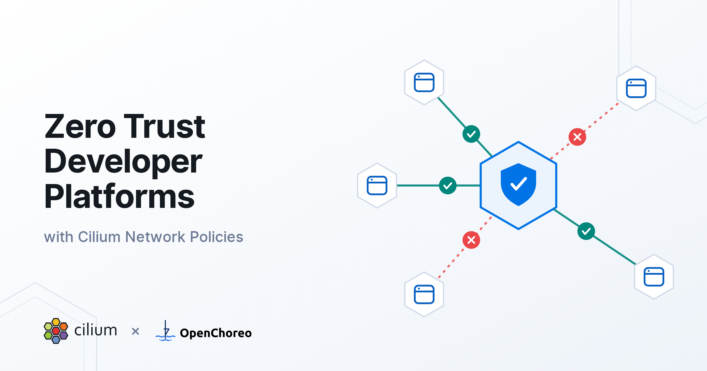
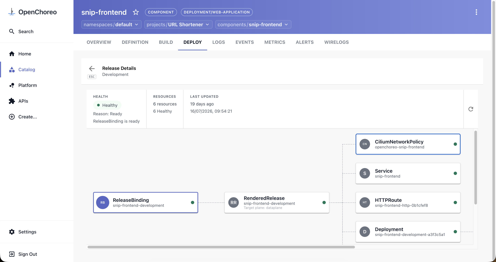
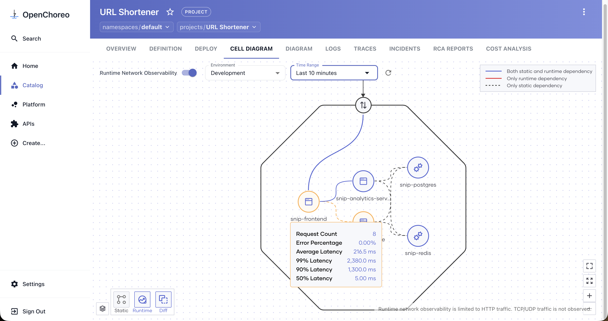
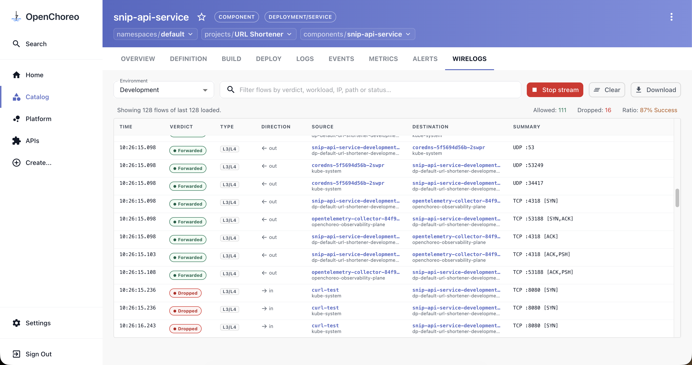
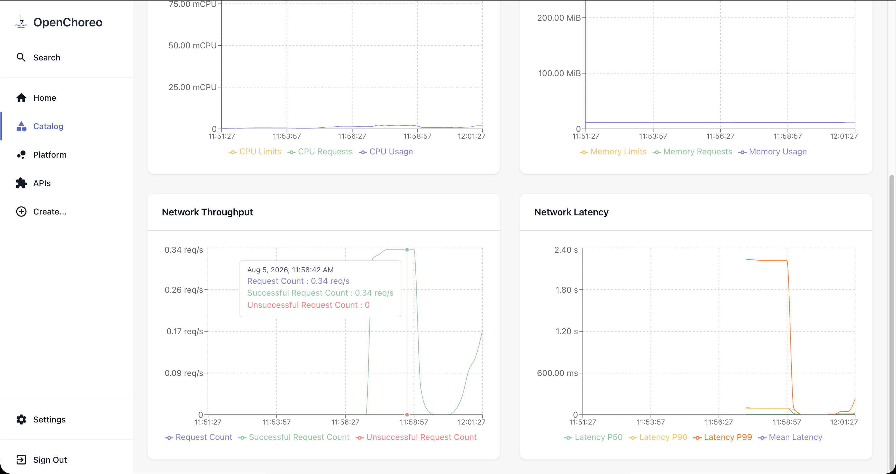

import authors from 'utils/author-data';



Every platform team eventually hits the same wall. Security wants zero trust where no workload talks to another unless the connection is explicitly sanctioned. Engineering wants to ship on Friday afternoon without filing a ticket with the platform engineering team to get an IP whitelisted. Both are right, and the network is where the argument plays out.

This doesn't have to be a trade-off for a platform team. It's a design problem at the platform layer itself, and it has a known solution: make network policies a _byproduct_ of deployment rather than a prerequisite to it.

## The limits of IP-based security in Kubernetes

Traditional network security assumes an address means something. A firewall rule permitting `10.4.2.17` to reach `10.4.8.9:5432` encodes a real intent, _the orders service may query the orders database_, but it encodes that intent in a fragile form.

Kubernetes breaks that form completely. Pods are scheduled, rescheduled, scaled, evicted, and rolled. The IP address that identified your payments service this morning may belong to a batch job by lunchtime. Any security model that depends on addresses staying still is accurate only until the next reschedule.

Standard Kubernetes NetworkPolicies improve on this by letting you declare intent with label selectors instead of addresses. But two problems remain.

First, even though the intent declaration is by label, enforcement still happens by address. The CNI resolves selectors into concrete pod IPs and programs iptables chains accordingly, reprogramming on every reschedule. On a busy cluster, these rule sets can grow into thousands of sequentially-evaluated entries: a well-documented source of latency and control-plane load.

Second, and more limiting, the NetworkPolicy API stops at Layer 4. A policy can allow port 8080 on a workload. However, it cannot say “allow `GET /orders` but not `DELETE /orders`”, or “this workload may reach _`api.stripe.com`_ and nothing else on the internet”. For most real threat models that's too broad; the interesting attacks happen inside connections you already allowed.

## The shift to identity-based network policies with Cilium

Cilium changes the primitive. Instead of translating labels into IP-keyed firewall rules, it assigns every workload a security identity derived from its labels and namespace, and enforces policy on that identity via eBPF programs attached directly to the kernel's networking hooks.

This maps naturally onto ephemeral workloads in Kubernetes. When a pod is rescheduled onto a different node with a different IP, nothing about the policy needs to change. The new pod carries the same labels, resolves to the same identity, and inherits the same permissions the moment it starts. Policy stops depending on infrastructure details.

Cilium can also reach higher up the OSI stack. For L7 rules, eBPF transparently redirects matched traffic to a per-node Envoy proxy with no sidecar and no application change. CiliumNetworkPolicy expresses application-aware rules: HTTP methods and paths, gRPC services, and DNS/FQDN-based egress. That’s what makes the least-privilege model actually achievable: "this service may call that service" becomes "this service may call exactly this operation on that service."

## Zero trust in developer platforms

Installing Cilium does not give you zero trust. It gives you the mechanism for it; a fast, identity-based enforcement engine that can express the exact rules you want. Orchestrating the policies to enforce zero trust while giving platform teams a way to govern them should come as a property of the developer platform built on top of Cilium.

There are several ways to achieve zero trust in a developer platform.

- **Developers author their own policies.** Nobody understands a service's dependencies better than the team that built it, so this is the most flexible option, and the policies it produces can be exactly right, at least at first. The difficulty isn't competence. CiliumNetworkPolicy becomes one more thing to learn and maintain, alongside the language and frameworks the service is actually written in. Services gain endpoints, drop dependencies, and get refactored, while the policy sits in a separate file that someone has to remember to update. Some drift open, because nothing breaks when they do. Some are never written at all. Some are written carefully and then quietly rot.

- **Platform teams pre-provision isolated environments with policy already applied.** This is a good, common pattern: developers receive an environment that is default-deny from the moment they get it, and they never touch a CiliumNetworkPolicy. The limits are granularity and change. A policy scoped to the whole environment can't know that one component listens on 8080 and another on 9090, so it either permits more than it should inside the boundary, or it needs a request to the platform team for every new endpoint, the exact ticket queue an Internal Developer Platform (IDP) exists to remove.

- **The platform derives policy, the platform team governs it.** If a developer states an endpoint's intended reach as part of deploying it, the platform has everything it needs to generate the policy itself. Policy stops being an artifact anyone maintains and becomes an output of deployment, while the platform team keeps control over any exceptions.

That third option is what makes a developer platform zero-trust by default. It rests on the following properties, which are not specific to any vendor:

- **Policy is derived from declared intent** rather than authored separately, so intent and enforcement cannot disagree.
- **Policy is regenerated as the workload changes**, so it cannot drift.
- **Default-deny is a byproduct**, not a checklist item. A workload is restricted because it was deployed, not because someone remembered.
- **The boundary is owned by the platform**, so it is held by construction rather than by convention.

None of that is achievable by just installing a CNI, and none of it requires developers to learn one. It requires abstractions that carry enough intent for the platform to act on.

## What this looks like in practice: OpenChoreo and Cilium

Those four properties are easy to state and harder to build. They require a platform that already knows what a workload is, not just where it's running. OpenChoreo is one example of a developer platform built this way, and it's a useful one to walk through concretely, since it wires the same identity-based model straight into Cilium.

[OpenChoreo](https://openchoreo.dev/) is an open-source internal developer platform for Kubernetes, and a CNCF sandbox project. Developers work with a simpler set of Kubernetes-native abstractions (Project, Component, Environment, ...) wired to a Backstage-based portal, CI/CD, GitOps, and observability, while platform teams keep full visibility of the underlying cluster. Individual capabilities ship as swappable modules from a growing ecosystem, including a networking module that builds on Cilium as the cluster CNI.

Its runtime model and abstractions provide exactly what is needed to have zero trust by default.

Each OpenChoreo **Project** becomes a [**Cell**](https://openchoreo.dev/docs/concepts/runtime-model/) at runtime: a secure, isolated runtime boundary that encapsulates all components of an application domain. Concretely, every (project, environment) pair maps to its own dedicated data-plane namespace, and every pod deployed into it is labelled with its full platform identity: which namespace, project, component, and environment. Components inside a cell communicate freely. Anything crossing a cell boundary goes through a defined gateway.

The other half of the picture is a single field that developers already fill in. When a developer declares an endpoint on their workload, they state its visibility:

| Visibility  | Who can reach it                                                                                         |
| :---------- | :------------------------------------------------------------------------------------------------------- |
| `project`   | Only components in the same project, within the same environment _(implicit — every endpoint gets this)_ |
| `namespace` | Any project in the same namespace within the same environment                                            |
| `internal`  | Across all namespaces in the platform                                                                    |
| `external`  | Exposed publicly, via the external gateway                                                               |

That's the entire developer-facing surface. No selectors, no port lists, no CRDs.

From there, OpenChoreo's built-in controllers do the translation. When a component is deployed, the platform renders the workload's Kubernetes resources and injects a network policy alongside them, built from the component's pod identity labels and its declared endpoint visibilities. The policy is regenerated on every reconcile, so it tracks the component as it changes rather than drifting from it.

For a single HTTP endpoint with `project` visibility, the result is a policy that selects the component by identity and admits traffic only from inside its own cell:

```yaml
apiVersion: cilium.io/v2
kind: CiliumNetworkPolicy
metadata:
  name: openchoreo-web-app
spec:
  endpointSelector:
    matchLabels:
      openchoreo.dev/component: web-app
      openchoreo.dev/project: my-project
  ingress:
    - fromEndpoints:
        - {} # any endpoint in this cell's namespace
      toPorts:
        - ports:
            - port: '8080'
              protocol: TCP
          rules:
            http: [{}] # routed via Envoy for L7 visibility
```

This YAML was not written by a developer to allow ingress into their component. It's rendered at deployment time. The important part is what it omits: because a CiliumNetworkPolicy selects this component, everything not listed is denied. Default-deny isn't a separate policy the platform team must remember to apply, it's the consequence of the component having a policy at all. Raise the endpoint to `namespace` visibility and an additional rule appears, scoped to the same namespace and environment. Mark it `external` and a rule admitting ingress from the platform's gateway appears. Neither requires the developer to know any of this happened.



> _Fig 1: OpenChoreo’s Backstage portal Kubernetes artifacts view for a deployed component, showing the generated `CiliumNetworkPolicy` listed alongside the Deployment, Service, and HTTPRoute._

For the platform engineer, adopting this is deliberately simple. Install Cilium as the CNI on the data-plane cluster, then annotate the `DataPlane`/`ClusterDataPlane` OpenChoreo custom resource to explicitly mark it as a Cilium-powered data plane.

```shell
kubectl annotate clusterdataplanes.openchoreo.dev default \
  openchoreo.dev/networkpolicyprovider=cilium --overwrite
```

Every subsequent deployment renders CiliumNetworkPolicies instead of standard Kubernetes NetworkPolicies. Without the annotation, OpenChoreo emits plain NetworkPolicies, so clusters without Cilium still get project isolation, just at L3/L4. Same developer abstraction, different enforcement engine underneath. That's what makes the abstraction worth having: the platform team can upgrade the enforcement model without touching a single application.

Currently, the generated policies use Cilium's L7 hook for network observability: an empty HTTP rule allows all requests on the port while routing them through Envoy so Hubble can observe them. They also cover ingress only: OpenChoreo does not yet derive egress rules from a developer-facing abstraction.

That doesn't leave egress ungoverned, it just moves the control point from the endpoint to the cell boundary. A `ProjectType` carries a list of resource templates that OpenChoreo renders into the cell namespace of every project of that type, and a template can be any namespace-scoped manifest, including a CiliumNetworkPolicy. The platform engineer writes the policy once and every cell created from that project type inherits it:

```yaml
apiVersion: openchoreo.dev/v1alpha1
kind: ClusterProjectType
metadata:
  name: standard-service
spec:
  resources:
    - id: cell-namespace # Isolated runtime namespace for workloads
      targetPlane: dataplane
      template:
        apiVersion: v1
        kind: Namespace
        metadata:
          name: ${metadata.namespace}
    - id: cell-egress # Templated network policy to secure egress from the cell boundary
      targetPlane: dataplane
      template:
        apiVersion: cilium.io/v2
        kind: CiliumNetworkPolicy
        metadata:
          name: cell-egress
          namespace: ${metadata.namespace}
        spec:
          endpointSelector: {} # every pod in the cell
          egress:
            - toFQDNs: # egress denied except for api.stripe.com
                - matchName: api.stripe.com
            - toEndpoints: # allow dns resolution
                - matchLabels:
                    k8s-app: kube-dns
                    k8s:io.kubernetes.pod.namespace: kube-system
              toPorts:
                - ports:
                    - port: '53'
                      protocol: UDP
                    - port: '53'
                      protocol: TCP
                  rules:
                    dns:
                      - matchPattern: '*'
```

Because those templates are evaluated with CEL against the project's parameters and per-environment configs, a platform engineer can expose the allowlist as a project parameter, rather than hard-coding it into the template. Developers then declare which hosts they need; the platform engineer controls the shape of the policy those declarations produce, and production can end up stricter than development. It’s the same derive-and-govern split described earlier for ingress, applied to egress using a general-purpose mechanism instead of a purpose-built one.

That distinction matters: this is a pattern, not a native abstraction. The platform engineer writes and maintains CiliumNetworkPolicy directly, and unlike endpoint visibility it does not fall back to plain NetworkPolicies on a non-Cilium data plane, since FQDN-based egress is a Cilium-specific capability. A first-class egress abstraction is on the roadmap, and the identity foundation is what makes that addition incremental rather than architectural.

## Identity that enforces zero trust also makes the network observable

Identifying workloads by platform identity instead of IP has a useful side effect: the network observability data arrives labelled with concepts developers actually use.

Because Hubble sees every flow and knows each endpoint's project, component, and environment, OpenChoreo can render network behaviour in the developer's own context rather than as a table of IP addresses. The [Cilium networking module](https://openchoreo.dev/ecosystem/item/networking-cilium/) for OpenChoreo surfaces the following network observability features:

- A runtime cell diagram showing which components are genuinely talking to each other, derived from live Hubble flows.
- Real-time wirelogs: a live stream of Hubble flow events, scoped per component, with source and destination resolved to platform identities rather than pod IPs.
- HTTP throughput and latency metrics per component, derived from Hubble's HTTP metrics.



> _Fig 2: Live component-to-component traffic within a cell_



> _Fig 3: Streaming network wirelogs for a component_



> _Fig 4: HTTP throughput and latency per component_

Teams often hesitate to lock things down because they can't tell what depends on what. Seeing the actual traffic removes the guesswork, and that's what makes a policy safe to tighten.

## Conclusion: Secure defaults, full velocity

Zero trust doesn't have to mean zero velocity. The two only conflict when security is a task appended to the end of the delivery path instead of a property of the path itself.

Identity-based policy makes the enforcement model durable enough to automate; a platform with real abstractions makes the automation invisible. Put them together and a developer declaring an endpoint's visibility produces an eBPF-enforced, default-deny, identity-based network boundary that survives every reschedule their workload will ever experience. All without the developer knowing the complexity underneath.

## References

- [Cilium documentation](https://docs.cilium.io/) — eBPF datapath, identities, and network policy reference
- [OpenChoreo Cilium networking module](https://openchoreo.dev/ecosystem/item/networking-cilium/) — installation, configuration, and compatibility matrix
- [OpenChoreo runtime model](https://openchoreo.dev/docs/concepts/runtime-model/) — cells, gateway topology, and isolation boundaries
- [OpenChoreo repository](https://github.com/openchoreo/openchoreo)

<BlogAuthor {...authors.AkilaInduranga} />
