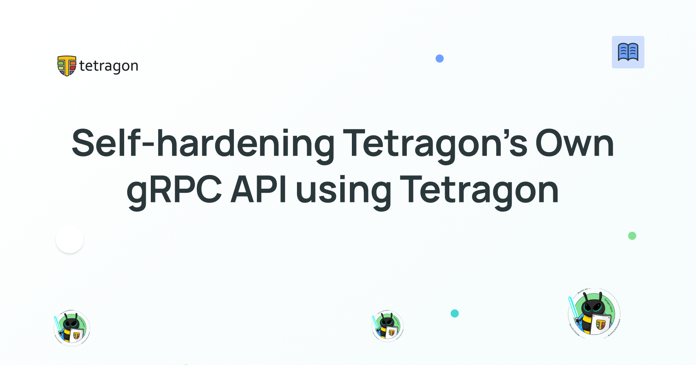
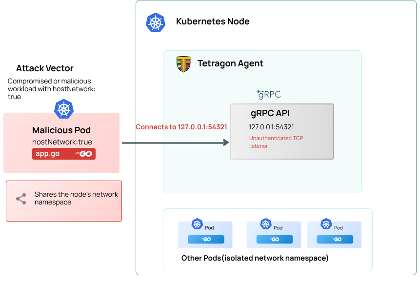

import authors from 'utils/author-data';



The deep visibility that Tetragon offers makes it a very powerful building block for securing modern Kubernetes environments. This is why some of the leading companies rely on Tetragon to provide both visibility and runtime security for their critical workloads and environments. But what happens when the security tool's own security posture needs to be hardened?

One important aspect of evaluating any security tool is its own security posture. Tetragon runs as a privileged process and exposes interfaces that allow other components to interact with it. These interfaces therefore become an integral part of Tetragon's security posture and must be considered alongside the workloads Tetragon protects. In this case, the vulnerable interface was the Tetragon gRPC API.

In Tetragon v1.7, a patch was introduced to address this issue by changing the default gRPC API listener from TCP to a Unix domain socket (UDS). However, users who have not yet upgraded to v1.7 or have legitimate technical reasons to continue exposing the gRPC API over TCP may still need an additional layer of network security. Rather than treating this solely as a problem to be solved outside of Tetragon, we can turn inward towards Tetragon's own capabilities to mitigate this gap.

In this post, we'll explore the details of the Tetragon gRPC API: what the API exposes, how a malicious actor with access to a workload on the same node could potentially interact with the API under certain configurations, how the Tetragon threat model helps us reason about the risk, and finally how this vulnerability can be patched live using Tetragon’s own enforcement capabilities. Beyond addressing this specific vulnerability, this approach demonstrates a broader principle: the same runtime security capabilities Tetragon uses to protect workloads can also enhance Tetragon's own security posture.

## Background

Tetragon supports two ways of exposing its gRPC API. The first is over TCP and the other is over UDP. UDP allows access control via filesystem permissions, whereas a TCP listener exposes a network-based attack surface accessible to other workloads sharing the host's network namespace. Before Tetragon v1.7, the Tetragon agent exposed its gRPC API over a local TCP listener by default. The API provides administrative functionality for interacting with the Tetragon agent, including operations that can modify tracing policies, change debugging settings, and otherwise alter the agent's behavior. Given Tetragon's privileged position on the node and its role in observing and enforcing security controls, access to this API is itself a vital security boundary.



Tetragon v1.7 changed this default. The gRPC API is now exposed over a Unix-domain socket by default, providing a more restrictive access boundary than a network listener. However, TCP remains a supported configuration for users with specific technical requirements to expose the gRPC API in this way. In those cases, operators must explicitly configure Tetragon to use a TCP listener.

The transport mechanism used to expose the API is even more important in Kubernetes. A TCP listener bound to 127.0.0.1 might appear to be accessible only from the local host. However, Kubernetes workloads configured with hostNetwork: true share the node's network namespace, including its loopback interface. Consequently, a compromised or malicious host-networked workload on the same node could potentially connect to an unauthenticated Tetragon gRPC API listening on the node's localhost interface.

Tetragon's [threat model](https://tetragon.io/docs/threat-model/) highlights this as a major consideration for operators when deploying Tetragon. The patch to change this behavior was made in Tetragon v1.7 and Tetragon now, by default exposes its gPRC API over UDP instead of TCP. This is not a reason to consider Tetragon's runtime security model ineffective. Rather, it illustrates an important principle in security: the security tool itself must be considered part of the threat model.

With that context, we can consider how Tetragon's own runtime enforcement capabilities can be used to close this gap for users who still use Tetragon with the gRPC API exposed over TCP.

## Protecting Tetragon with Tetragon

The recommended control is to eliminate the network exposure altogether. Users who do not need the gRPC API can outrightly disable it, while users who require it can configure Tetragon to expose the API through a Unix-domain socket instead of TCP. However, there are situations where neither option is immediately practical, for example, when upgrading Tetragon to v1.7 is not yet possible or users who need the gPRC API exposed over TCP for specific technical reasons.
In these cases, we can use Tetragon to provide its own mitigation. The Tetragon community and the Isovalent team wrote a [tracing policy](https://github.com/cilium/tetragon/security/advisories/GHSA-6qqg-3qf7-p3v5) we can deploy to prevent workloads from connecting to the Tetragon gRPC API. This is useful because the mitigation does not require changing how we interact with the API or introducing another security tool. Instead, we use Tetragon’s existing runtime enforcement to put an additional security boundary around the Tetragon agent.

### The security intent

Let’s evaluate the tracing policy a little closer. The goal of the policy is straightforward: Kubernetes workloads should not be able to connect to Tetragon's administrative gRPC API, ensure that Tetragon's API should remain accessible only to legitimate host-level processes and not to Kubernetes workloads running on the node.

The policy therefore needs to distinguish between legitimate connections originating from the host and connections originating from workloads. Conceptually, we want to enforce the following rule:
Tetragon can enforce this at the point where a process attempts to establish a socket connection. Rather than waiting for the gRPC request to reach the API, we prevent the connection from being established in the first place.
Below is the policy, and we’ll break this down piece by piece:

```yaml
apiVersion: cilium.io/v1alpha1
kind: TracingPolicy
metadata:
  name: CVE-2026-65960
  annotations:
    created-at: '2026-07-02T10:12:45Z'
    description: Unauthenticated Tetragon gRPC admin API accessible from hostNetwork pods
spec:
  kprobes:
    - call: security_socket_connect
      syscall: false
      args:
        - index: 1
          type: sockaddr
      data:
        - index: 0
          source: current_task
          type: uint32
          resolve: cred.euid.val
          label: euid
      selectors:
        - matchArgs:
            - index: 1
              operator: SAddr
              values:
                - 127.0.0.1
            - index: 1
              operator: SPort
              values:
                - '54321'
          matchNamespaces:
            - namespace: Cgroup
              operator: NotIn
              values:
                - host_ns
          matchActions:
            - action: Post
            - action: NotifyEnforcer
              argError: -1
        - matchArgs:
            - index: 1
              operator: SAddr
              values:
                - 127.0.0.1
            - index: 1
              operator: SPort
              values:
                - '54321'
          matchData:
            - index: 0
              operator: NotEqual
              values:
                - '0'
          matchNamespaces:
            - namespace: Cgroup
              operator: In
              values:
                - host_ns
          matchActions:
            - action: Post
            - action: NotifyEnforcer
              argError: -1
      message: cve-embargo vulnerability protection
  enforcers:
    - calls:
        - security_socket_connect
```

The policy uses a `kprobe` on the kernel’s `security_socket_connect` hook. This hook is an LSM hook that fires anytime a process attempts to make an outbound socket connection. Using this specific hook gives Tetragon visibility into processes attempting to open socket connections and, importantly in the context of this tracing policy, provides access to the destination address and port.

The policy then applies two checks. First, it identifies connections to `127.0.0.1` on port `54321`. These are the connections we are interested in because they target the Tetragon gRPC API.

**N/B:** If you have configured Tetragon to expose its gRPC API on a different address or port, you will need to adjust the SAddr and SPort values in the policy accordingly. The recommended policy can also be used for ≧v1.7 users who explicitly choose to expose the gRPC API over TCP.

Secondly, the policy determines whether the connection originates from a process running in the host’s cgroup namespace or from a Kubernetes workload. Connections associated with the host are allowed to proceed, while connections originating from non-host workloads are reported and denied.

### The Policy in Practice

To demonstrate the mitigation, let's set up a simple Kind-based Kubernetes cluster and intentionally deploy Tetragon v1.6, which predates the fix introduced in v1.7.

First, we create the Kind cluster and mount the host's `/proc` filesystem into the Kind node. This allows Tetragon to correctly access the host process information from within the Kind environment.

```
cat <<EOF > kind-config.yaml
apiVersion: kind.x-k8s.io/v1alpha4
kind: Cluster
nodes:
  - role: control-plane
    extraMounts:
      - hostPath: /proc
        containerPath: /procHost
EOF
kind create cluster --config kind-config.yaml
EXTRA_HELM_FLAGS=(--set tetragon.hostProcPath=/procHost) # flags for helm install

```

We can then install Tetragon v1.6 using the Cilium Helm repository

```
helm repo add cilium https://helm.cilium.io
helm repo update
helm install tetragon ${EXTRA_HELM_FLAGS[@]} cilium/tetragon -n kube-system --version=1.6.0
kubectl rollout status -n kube-system ds/tetragon -w
```

Next, we deploy a small pod containing grpcurl, a command-line tool for interacting with gRPC services. The pod is configured with `hostNetwork: true`, which causes it to share the network namespace of the Kind node.

```
cat <<EOF | kubectl apply -f -
apiVersion: v1
kind: Pod
metadata:
  name: grpc-client
spec:
  hostNetwork: true
  containers:
    - name: grpcurl
      image: fullstorydev/grpcurl:latest-alpine
      command: ["sleep", "infinity"]
EOF
```

We can now open a shell inside the pod.

```
kubectl exec -it grpc-client -- /bin/sh
```

From inside the grpc-client pod, we attempt to connect to Tetragon's gRPC API.

```
grpcurl -plaintext 127.0.0.1:54321 list

Failed to list services: server does not support the reflection API
```

Tetragon does not expose the gRPC reflection API, so grpcurl cannot enumerate the available services and returns. While this may look like an error, it is useful for our demonstration. The request has successfully reached the Tetragon gRPC server; the server is responding that reflection is not supported. This confirms that the hostNetwork pod can establish a connection to the Tetragon API listening on 127.0.0.1:54321.

At this point, we have reproduced the security boundary described in the advisory: a Kubernetes workload sharing the host network namespace can reach Tetragon's unauthenticated gRPC API.
We can observe the Tetragon events for the grpc-client pod and see that outbound socket connections are being allowed

```
kubectl exec -ti -n kube-system ds/tetragon -c tetragon -- tetra getevents -o compact --pods grpc-client

🚀 process default/grpc-client /bin/sh
🚀 process default/grpc-client /bin/grpcurl -plaintext 127.0.0.1:54321 list
🚀 process default/grpc-client /bin/grpcurl -plaintext 127.0.0.1:54321 list
```

Applying the tracing policy

We can now deploy the Tetragon tracing policy that prevents Kubernetes workloads from connecting to the API.

```
kubectl apply -f https://raw.githubusercontent.com/cilium/tetragon/refs/heads/main/examples/tracingpolicy/cves/cve-2026-65960.yaml
```

Now the policy is applied, let's try the same connection again from the grpc-client pod. This time, the connection is rejected before the request can reach the Tetragon gRPC server. Before applying the policy, the connection reached the Tetragon gRPC server. After applying the policy, Tetragon intercepts the connection attempt at `security_socket_connect` and denies it because it originates from a Kubernetes workload.

```
grpcurl -plaintext 127.0.0.1:54321 list

Failed to dial target host "127.0.0.1:54321": connection error: desc = "transport: error while dialing: dial tcp 127.0.0.1:54321: connect: connection refused"
```

We have therefore used Tetragon to establish a security boundary around its own API, preventing workloads from reaching an interface that could otherwise be used to alter Tetragon's behavior.

# Conclusion

The recommendation is to deploy/upgrade toTetragon v1.7, which mitigates this risk. For users who cannot yet upgrade or who need to continue using a TCP-based gRPC listener should be aware of the additional attack surface this introduces, then this blog describes the perfect use case of Tetragon protecting itself.

# Additional Resources

- [Tetragon Threat Model](https://tetragon.io/docs/threat-model/)
- [GitHub Security Advisory: GHSA-6qqg-3qf7-p3v5](https://github.com/cilium/tetragon/security/advisories/GHSA-6qqg-3qf7-p3v5)

<BlogAuthor {...authors.PaulArah} />
