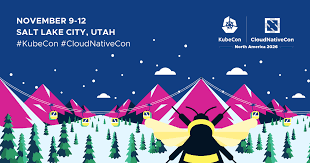
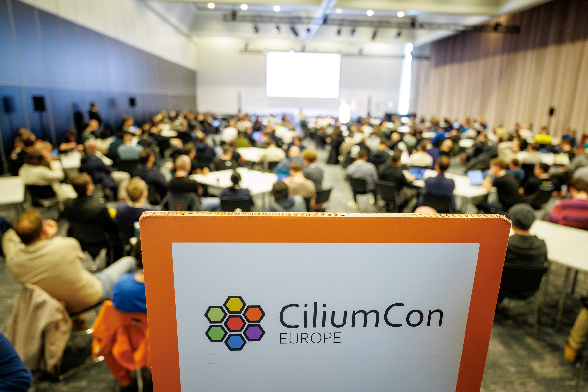
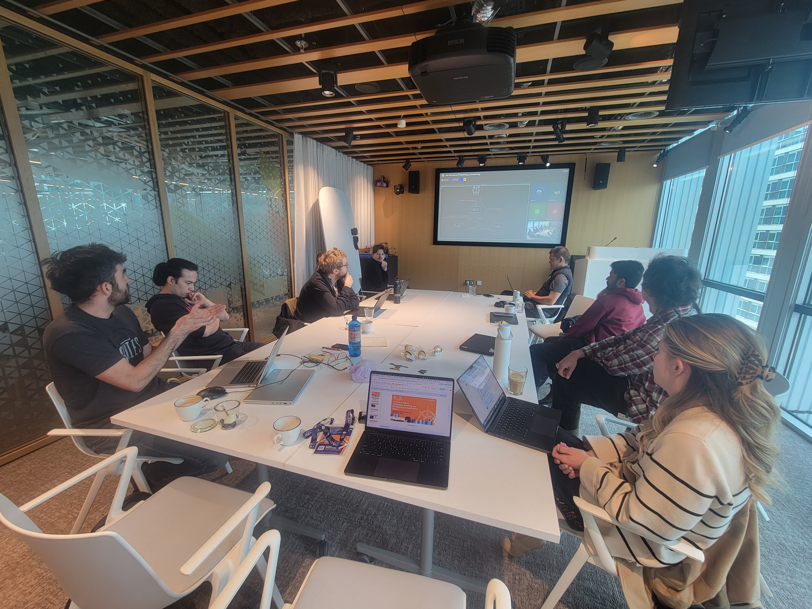

import authors from 'utils/author-data';

Cilium is heading back to Salt Lake City this November for KubeCon + CloudNativeCon and CiliumCon North America 2026. Since coming together at CiliumCon Europe in Amsterdam this spring, the community has been busy building improvements and new features into the project. Cilium 1.20 was shipped in July, stabilizing multi-pool IPAM and adding Gateway API ExternalAuth and TCPRoute/UDPRoute support, and sub-project Tetragon shipped 1.7 in May, bringing more precise filtering and runtime context.

The talks for the upcoming event reflect these advancements and shifts in the industry. While Amsterdam's sessions focused on general adoption and multi-cluster scale, the schedule in Salt Lake City has more of a focus on AI infrastructure, covering areas like sizing IPv6 address space for dense GPU clusters, enforcing NetworkPolicy-style isolation on RDMA traffic, debugging inference workloads with eBPF, and bringing netkit's zero-copy datapath to Pods running high-throughput workloads. There will also be end user talks from Walmart, OpenAI, GEICO, and more.

## CiliumCon

CiliumCon will take place Monday morning, November 9, featuring technical deep dives and end user production stories. The [full schedule](https://events.linuxfoundation.org/kubecon-cloudnativecon-north-america/co-located-events/cncf-hosted-co-located-schedule/?all-sessions=ciliumcon) includes:

**[Welcome + Opening Remarks](https://events.linuxfoundation.org/kubecon-cloudnativecon-north-america/co-located-events/cncf-hosted-co-located-schedule/?id=1312035)** Joe Stringer & Jordan Rife, CiliumCon Co-Chairs | 9:00 - 9:05 AM
 
**[Handing a Proxy the Keys to Your Pod: Inside Cilium's Sidecarless mTLS](https://events.linuxfoundation.org/kubecon-cloudnativecon-north-america/co-located-events/cncf-hosted-co-located-schedule/?id=1268376)** Quang Nguyen, Microsoft & Robin Gögge, Isovalent at Cisco | 9:10 - 9:35 AM
 
Sidecarless mTLS was shipped in Cilium 1.19. It allows users to label a namespace, and traffic between its pods gets encrypted and identity-authenticated without needing to make any app changes. This talk will explain how it works under the hood, and give a live demo of the work being done upstream on SPIRE to bind certificates to a requesting process.
 
**[Cluster Mesh, Native Routing, and Multi-Pool IPAM in IPv6-Only Networks: What the Docs Don't Tell You](https://events.linuxfoundation.org/kubecon-cloudnativecon-north-america/co-located-events/cncf-hosted-co-located-schedule/?id=1269739)** Kapil Agrawal & Luke Baker, ESnet | 9:45 - 10:10 AM
 
ESnet will return to CiliumCon to present the next chapter of running Kubernetes on an IPv6-only network. They will share what broke while they built ClusterMesh with native routing, BGP, and multi-pool IPAM entirely without IPv4, and how they resolved it.
 
**[Keynote](https://events.linuxfoundation.org/kubecon-cloudnativecon-north-america/co-located-events/cncf-hosted-co-located-schedule/?id=1311961)** TBC, Isovalent | 10:15 - 10:20 AM
 
**[Don't Make a Mesh of It: Multi-Cluster Networking at Cloud Scale](https://events.linuxfoundation.org/kubecon-cloudnativecon-north-america/co-located-events/cncf-hosted-co-located-schedule/?id=1268169)** Anubhab Majumdar & Vanessa Chammas, Microsoft; Vamsi Kalapala, Palantir | 10:40 - 11:05 AM
 
Using Cilium Cluster Mesh as a case study, this talk will cover what makes multi-cluster networking practical at cloud scale, from scoped service export to aligning the data path with network topology.
 
**[When Packets Disappear in the Cloud: Debugging Inference Workloads with eBPF](https://events.linuxfoundation.org/kubecon-cloudnativecon-north-america/co-located-events/cncf-hosted-co-located-schedule/?id=1248003)** Venkat Gattupalli & Haibing Zhou, OpenAI | 11:15 - 11:40 AM
 
OpenAI will trace through rare packet loss in latency-sensitive inference workloads using targeted eBPF probes, isolating a cloud-infrastructure issue outside their own stack.
 
**[Running Out of IPs Before You Run Out of GPUs: IPv6 for AI-Scale Kubernetes](https://events.linuxfoundation.org/kubecon-cloudnativecon-north-america/co-located-events/cncf-hosted-co-located-schedule/?id=1269247)** Marino Wijay, Isovalent at Cisco | 11:45 - 11:55 AM
 
Dense AI clusters can exhaust private IPv4 space faster than teams expect. This talk will make the case that IPv6 is the substrate that lets AI-scale Kubernetes keep growing, with production examples and a live demo.
 
**[Lightning Talk: One Kernel, Two eBPF Stacks: Running OBI Alongside Cilium](https://events.linuxfoundation.org/kubecon-cloudnativecon-north-america/co-located-events/cncf-hosted-co-located-schedule/?id=1255649)** Antonio Jimenez Martinez, Isovalent at Cisco | 12:00 - 12:10 PM
 
OpenTelemetry eBPF Instrumentation (OBI) and Cilium both run eBPF programs on the same node. This talk will look at what it takes to run them alongside each other.
 
**[Lightning Talk: A One-Way Valve to netkit: Migrating Cilium's Datapath Transparently at Scale](https://events.linuxfoundation.org/kubecon-cloudnativecon-north-america/co-located-events/cncf-hosted-co-located-schedule/?id=1264636)** Hadrien Patte, Datadog | 12:15 - 12:25 PM
 
Datadog will share how they migrated hundreds of thousands of nodes across hundreds of production clusters from veth to netkit as a one-way valve, with rollback available at every step.
 
**[Closing Remarks](https://events.linuxfoundation.org/kubecon-cloudnativecon-north-america/co-located-events/cncf-hosted-co-located-schedule/?id=1312055)** Joe Stringer & Jordan Rife, CiliumCon Co-Chairs | 12:25 PM

## Featured KubeCon + CloudNativeCon North America 2026 Talks

Cilium shows up across the main conference schedule too, from a Maintainer Track deep dive into the project's evolution to end user stories from Walmart Global Tech, GEICO, and AWS. Highlights below:

**[Zero Downtime CNI Migration at Scale: Canal to Cilium Across Hundreds of Production Clusters](https://events.linuxfoundation.org/kubecon-cloudnativecon-north-america/program/schedule/?id=1250187)** Prathamesh Bhope, Walmart Global Tech | Tuesday, November 10 | 4:40 - 5:10 PM
 
Walmart Global Tech will share the hybrid migration strategy that moved hundreds of production clusters from Canal to Cilium with zero downtime and a 2.27x throughput improvement.
 
**[From ListenerSets to eBPF Plugins: Cilium's Evolution Across the Stack](https://events.linuxfoundation.org/kubecon-cloudnativecon-north-america/program/schedule/?id=1289674)** Christine Kim & Katie Meinders, Isovalent at Cisco; Hadrien Patte, Datadog | Wednesday, November 11 | 11:50 AM - 12:20 PM
 
A Maintainer Track session covering Cilium's latest development, from Gateway API features like TCPRoute and ListenerSet to new eBPF datapath plugins, plus community updates and how to get involved.
 
**[Extending NetworkPolicy to RDMA: Hardware-Enforced Tenant Isolation for AI Clusters](https://events.linuxfoundation.org/kubecon-cloudnativecon-north-america/program/schedule/?id=1249358)** Pavani Panakanti & Jayanth Varavani, AWS | Wednesday, November 11 | 1:20 - 2:20 PM | Poster Session
 
RDMA bypasses the kernel entirely, leaving policy engines like Cilium blind to it. This poster session will present a hardware-enforced pattern to close that gap on multi-tenant AI clusters.
 
**[Managing Network Security in Multi-Tenant Environments with Istio and Cilium](https://events.linuxfoundation.org/kubecon-cloudnativecon-north-america/program/schedule/?id=1247970)** Michael Bolot & Zaira Shaikh, GEICO | Thursday, November 12 | 11:00 - 11:30 AM
 
GEICO will share how they layer Cilium Network Policies for broad network boundaries with Istio authorization policies for application-layer zero trust.
 
**[Follow the GPUs: How a Regulated Fortune 100 Serves Customers When No Single Cloud Has Enough](https://events.linuxfoundation.org/kubecon-cloudnativecon-north-america/program/schedule/?id=1250973)** Michael Kinsley & Yuva Peavler, GEICO | Thursday, November 12 | 11:50 AM - 12:20 PM
 
GEICO's platform team will detail their Hybrid Cloud Fabric, a multi-provider Kubernetes and zero trust overlay built on Istio, Cilium, and SPIFFE/SPIRE.
 
**[Here be DRAgons: Bringing Native Zero-Copy Networking to Pods with Cilium and netkit](https://events.linuxfoundation.org/kubecon-cloudnativecon-north-america/program/schedule/?id=1244000)** Daniel Borkmann & Bernardo Soares, Isovalent at Cisco | Thursday, November 12 | 3:30 - 4:00 PM

A look at two new Dynamic Resource Allocation drivers for Cilium, bringing native zero-copy networking to Pods for the first time via netkit.

## A look back at KubeCon + CloudNativeCon and CiliumCon Europe in Amsterdam

In March at [CiliumCon in Amsterdam](https://www.youtube.com/playlist?list=PLDg_GiBbAx-mSQHa1y9Z9sjBYUmG2FBCZ), attendees heard end user stories from Roche and Etraveli Group, S3NS and Ledger's ClusterMesh blueprint at hundreds-of-clusters scale, and SUSE's approach to scaling Tetragon without flooding the cluster. Cilium was also featured during KubeCon + CloudNativeCon, including [Asana's talk](https://www.youtube.com/watch?v=mxjiSCnrb3c) on using Cilium and Crossplane to build invisible security guardrails into their developer platform.

Contributors gathered during the [Cilium Developer Summit](https://github.com/cilium/dev-summits/blob/main/2026-EU/README.md) to discuss the project's future, with representatives from Google, Isovalent, Microsoft, Ledger, and more tackling topics like cluster mesh, datapath plugins, and scale testing.

## Connect with the Cilium Community in Salt Lake City

**Cilium Project Booth:** Find us in the Project Pavilion for live demos and a chance to talk shop with maintainers and contributors directly. Bring your hardest debugging question, your rollout war story, or just come say hi.

Outside the formal sessions, the hallway track is where a lot of the real conversation happens. Swing by if you're weighing a migration, hitting an edge case, or thinking about contributing for the first time!

<BlogAuthor {...authors.KatieMeinders} />
