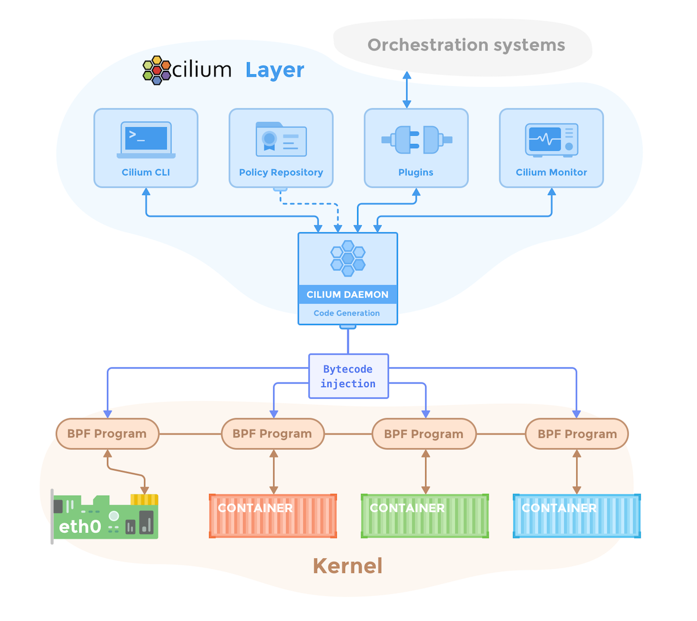

{{preview}}

The last couple of months have been tremendously exciting for everyone working
on Cilium and BPF. We have witnessed a fast growing community of
Cilium users as well as the rapid increase of BPF usage and development with
companies such as [Google] joining the existing already strong BPF community of
engineers from [Facebook], [Netflix], [Red Hat] and many more. Possibly the strongest
signal of the success of BPF has been the decision of the Linux kernel
community to [replace the in-kernel implementation of iptables with BPF](/blog/2018/04/17/why-is-the-kernel-community-replacing-iptables).

All of this has allowed us to advance BPF quickly and mature the Cilium project
very effectively. Our warmest
shoutouts go to everyone who has joined us on this incredible
journey since we initially announced Cilium at [DockerCon
2017](https://www.youtube.com/watch?v=ilKlmTDdFgk). Your support in the form of
contributing code, providing feedback and spreading the word has been
incredible.

{{/preview}}

The last couple of months have been tremendously exciting for everyone working
on Cilium and BPF. We have witnessed a fast growing community of
Cilium users as well as the rapid increase of BPF usage and development with
companies such as [Google] joining the existing already strong BPF community of
engineers from [Facebook], [Netflix], [Red Hat] and many more. Possibly the strongest
signal on the success of BPF has been the decisions of the Linux kernel
community to [replace the in-kernel implementation of iptables with BPF](/blog/2018/04/17/why-is-the-kernel-community-replacing-iptables).

All of this has allowed us to advance BPF quickly and mature the Cilium project
very effectively. Our warmest
shoutouts go to everyone who has joined us on this incredible
journey since we initially announced Cilium at [DockerCon
2017](https://www.youtube.com/watch?v=ilKlmTDdFgk). Your support in the form of
contributing code, providing feedback and spreading the word has been
incredible.

## Cilium 1.0: Stable API and LTS releases

Today, we mark the release of Cilium 1.0 and assign the first ever stable
release number. Starting with this release, we will also provide all of the
guarantees and processes required to run Cilium in production environments:

- [API stability](http://docs.cilium.io/en/doc-1.0/api/#compatibility-guarantees)
  with upgrade and downgrade compatibility guarantees.
- [Stable releases](http://docs.cilium.io/en/doc-1.0/contributing/#release-process)
  with LTS support for production use.
- Well defined process to handle security relevant bugs and incidents.
- Responsive support on [Slack] and [GitHub] as well
  as defined processes to report bugs and request features.

## Why Cilium?

This blog post focuses on the functionality provided by the Cilium 1.0 release.
We have published a separate post that provides additional background and use
cases as well as a preview of the service mesh/sidecar acceleration work.

> [Cilium - Rethinking Linux Networking and Security for the Age of Microservices](/blog/2018/04/24/cilium-security-for-age-of-microservices)

## What is Cilium?

The following list describes the functionality that Cilium provides as of 1.0.
You can find more detailed descriptions in the [functionality overview](http://docs.cilium.io/en/doc-1.0/intro/#functionality-overview)
section of the Cilium documentation.

- **Highly efficient BPF datapath:**
  BPF is the underlying Linux superpower doing the heavy lifting on the
  datapath by providing sandboxed programmability of the Linux kernel with
  incredible performance. Read more about the powers of BPF in [this
  blog](/blog/2018/04/17/why-is-the-kernel-community-replacing-iptables#bpf)
  or in the [BPF reference guide](http://docs.cilium.io/en/doc-1.0/bpf/).

  - **Fully Distributed:** All datapath elements are fully distributed
    across the cluster and run at the most efficient layer in the operating
    system on each cluster node.

  - **Service Mesh datapath:** BPF allows us to build the ideal dataplane for
    the fast growing service mesh space. Cilium 1.0 already provides
    transparent injection of proxies such as Envoy. Future versions of Cilium
    will provide acceleration of sidecar proxies. We have published a set of
    early [sidecar proxy performance benchmarks](/blog/2018/04/24/cilium-security-for-age-of-microservices)

- **[CNI](http://docs.cilium.io/en/doc-1.0/kubernetes/) and [CMM](http://docs.cilium.io/en/doc-1.0/docker/) plugins:**
  The CNI and CMM plugins enable integration with
  [Kubernetes](http://docs.cilium.io/en/doc-1.0/kubernetes/),
  [Mesos](http://docs.cilium.io/en/doc-1.0/mesos/), and
  [Docker](http://docs.cilium.io/en/doc-1.0/docker/) to provide networking,
  load balancing and security for containers.

- **Network Security on both the Packet and API level:**
  Cilium combines [packet
  based](http://docs.cilium.io/en/doc-1.0/policy/language/#) network security and
  segmentation with transparent [API aware
  authorization](http://docs.cilium.io/en/doc-1.0/policy/language/#layer-7-examples)
  to provide security for both traditional deployments and evolving
  microservices architectures.

  - **[Identity Based](http://docs.cilium.io/en/doc-1.0/concepts/#arch-id-security):**
    Instead of relying on source IP addresses to identify workloads, Cilium
    encodes the workload identity in every packet to provide highly scalable
    security. This portable design allows the identity to be encoded in any IP
    based protocol and is aligned with upcoming concepts such as
    [SPIFFEE](https://github.com/spiffe/spiffe) or Kubernetes' [Container
    Identity Working
    Group](https://github.com/kubernetes/community/tree/master/wg-container-identity).

  - **[IP/CIDR Based](http://docs.cilium.io/en/doc-1.0/policy/language/#ip-cidr-based):**
    If identity based enforcement is not applicable, IP/CIDR based security can
    be used to control access. Whenever possible, Cilium offers abstractions to
    avoid hardcoding IP addresses in security policies. An example of this is
    the ability to define policy based on [Kubernetes service
    names](http://docs.cilium.io/en/doc-1.0/policy/language/#services-based).
  - **[API Aware Security](http://docs.cilium.io/en/doc-1.0/policy/language/#layer-7-examples):**
    The increasing usage of protocols such as HTTP/REST, gRPC and Kafka renders
    IP and port based security insufficient. The built-in awareness of a
    growing list of API and data store relevant protocols allows enforcing
    least privilege security at the right granularity.

- **Distributed and Scalable Load Balancing:**
  High performance Layer 3-4 load balancer using BPF for service to service
  connectivity with support for flow hashing and weighted round-robin. The BPF
  hashtable based implementation provides O(1) performance which means that the
  performance will not drop as you increase the number of services. The load
  balancer can be configured in two ways:

  - **Kubernetes Service Implementation:** All Kubernetes ClusterIP services
    will be automatically implemented in BPF to provide a highly scalable
    alternative to kube-proxy for in-cluster load-balancing.
  - **[API driven](http://docs.cilium.io/en/doc-1.0/api/):** For more advanced
    use cases, an extensive API is available to directly configure the
    load-balancing component.

- **[Simplified Networking Model](http://docs.cilium.io/en/doc-1.0/intro/#simple-networking):**
  Decoupling security from addressing simplifies the networking model
  dramatically: A single layer 3 network space provides the connectivity
  for all endpoints which are then segmented and secured using the
  policy layer on top. This simplicity tremendously helps scaling and
  troubleshooting. Networking can be configured in two modes:

  - **[Overlay/VXLAN](http://docs.cilium.io/en/doc-1.0/concepts/#overlay-network-mode):**
    The simplest integration that allows carrying workload identities for any
    IP based protocol. Hardware assisted VXLAN offloads ensure close to native
    performance.
  - **[Direct Routing](http://docs.cilium.io/en/doc-1.0/concepts/#direct-native-routing-mode):**
    Direct routing allows delegating routing to an existing networking
    component such as the native Linux routing layer, IPVLAN or a cloud
    provider router.

- **Visibility/Telemetry:** Similar to policy, visibility is provided on both
  the network packet and API call level. All visibility information includes
  rich workload level metadata such as container/pod labels and service names,
  instead of just IP addresses and port numbers.
  - **[Microscope](https://github.com/cilium/microscope):** Microscope provides visibility of security and forwarding
    events at cluster level with the ability to filter events based on labels,
    security identities and event types.
  - **BPF-based High Performance Monitor:** The high performance BPF perf ring
    buffer, designed for tracing millions of applications events per second,
    provides a highly efficient reporting channel which, combined with the
    programmability of BPF, allows extracting metrics and visibility at will
    with minimal overhead.
  - **[API driven](http://docs.cilium.io/en/doc-1.0/api/):** All visibility is provided via APIs and can be fed into
    existing systems.
- **Troubleshooting:**
  - **[Cluster Connectivity Health](http://docs.cilium.io/en/doc-1.0/troubleshooting/#cluster-connectivity-check):**
    Cilium periodically monitors the cluster connectivity including latency
    between all cluster nodes to identify faulty nodes and
    underlying network issues.
  - **[Prometheus Metrics](http://docs.cilium.io/en/doc-1.0/configuration/metrics/):** Metrics allow integrating Cilium into your
    existing monitoring dashboards for efficient monitoring of Cilium.
  - **Health Checks and Status overview:** Reliable health checks and component
    status overviews help quickly assess the health of all components and
    pinpoint problems.
  - **[Diagnosis and Reporting tools](http://docs.cilium.io/en/doc-1.0/troubleshooting/#cluster-diagnosis-tool)**
    Various tools to assist in the automatic detection of common problems and
    in the collection of information for bug reports.

## Getting Started

Cilium is simple to install and use, in particular on Kubernetes:

  
xterm

  

    curl -sLO https://releases.cilium.io/v1.0.0/examples/kubernetes/cilium.yaml 
    vim cilium.yaml [provide etcd or consul address] 
    kubectl create -f cilium.yaml 
    kubectl create -f demo_app.yaml 
    kubectl create -f http_policy.yaml 
    kubectl exec -ti xwing-68c6cb4b4b-red5 -- curl -s -XPUT deathstar/v1/exhaust-port 
    
      Access denied 
    
    
  

The above example is a summary of the [hands-on minikube
tutorial](http://docs.cilium.io/en/doc-1.0/gettingstarted/minikube/) that walks
through applying a HTTP aware network policy step by step. More tutorials
can be found in the [getting started
section](http://docs.cilium.io/en/doc-1.0/gettingstarted/).

For further information on installing Cilium, see the [Kubernetes Quick
Installation Guide](http://docs.cilium.io/en/doc-1.0/kubernetes/quickinstall/)
or refer to the full list of [installation
guides](http://docs.cilium.io/en/doc-1.0/install/guides/#)

## The Roadmap Ahead

Cilium 1.0 is an exciting milestone for all of us but we are already deep into
the planning of Cilium 1.1. So what is on the roadmap for 1.1 and beyond?

- **Multi Cluster Service Routing:** The simplicity of Cilium’s networking model
  and the decoupling of addressing and policy allows for easy expansion across
  clusters. With this expansion, Cilium will start supporting Kubernetes
  service routing across multiple clusters without requiring complex proxy or
  Ingress solutions while providing the full set of identity based and API
  aware security.

- **Integration with OpenTracing, Jaeger and Zipkin:** The minimal overhead of
  BPF makes it the ideal technology to provide tracing and telemetry
  functionality without imposing additional system load.

- **Policy support for additional API protocols:** We already have several
  additional application protocols in mind that we will support in future
  releases to further improve security.

- **CRI support:** Repeatedly requested by various members of the community, we are
  looking forward to supporting CRI to properly abstract the container runtime.

- **Non container workloads:** The BPF datapath is not limited to container
  abstractions, it just happened to be the first use case we focused on. Future
  versions will provide APIs and documentation on how to integrate with native
  Linux tasks, VMs and how to bridge the identity based security space to
  existing worlds using IP addresses that cannot be migrated.

You can find the details of the 1.1 release planning in this [github
issue](https://github.com/cilium/cilium/issues/3585). Feel free to comment or
open GitHub issues if you would like to see particular functionality in future
Cilium releases.

[http]: http://docs.cilium.io/en/doc-1.0/gettingstarted/minikube/
[grpc]: http://docs.cilium.io/en/doc-1.0/gettingstarted/grpc/
[kafka]: http://docs.cilium.io/en/doc-1.0/gettingstarted/kafka/
[slack]: https://cilium.herokuapp.com/
[github]: https://github.com/cilium/cilium/issues/new
[google]: https://www.socallinuxexpo.org/sites/default/files/presentations/bcc-scale.pdf
[facebook]: https://www.netdevconf.org/2.1/slides/apr6/zhou-netdev-xdp-2017.pdf
[netflix]: http://www.brendangregg.com/Slides/BSidesSF2017_BPF_security_monitoring.pdf
[red hat]: https://developers.redhat.com/blog/2017/12/13/introducing-stapbpf-systemtaps-new-bpf-backend/
