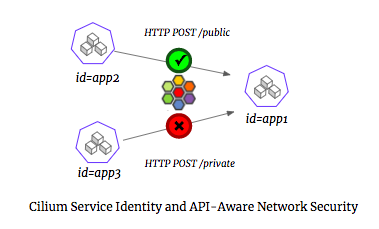
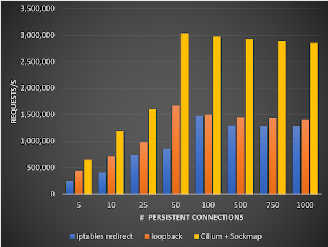

Linux’s traditional network forwarding and security capabilities, centered around iptables and focused on IP addresses and ports, were designed 20 years ago in an era of manually deployed physical hosts, monolithic application design, and hand-edited firewall rule-sets. Back then, concepts central to how we architect and deploy applications today, like containers and container orchestration (Docker, Kubernetes), API-driven microservices design, and continuous integration/continuous delivery were many years from widespread use.

In the highly dynamic and complex world of microservices, thinking about networking and security simply through the traditional lens of IP addresses and ports leads to an implementation that can be highly inefficient, has only course-grained visibility and filtering,
and is often highly complex to troubleshoot. Thanks to BPF, a powerful new kernel extensibility mechanism inside of Linux, we have the opportunity to rethink the Linux networking and security stack for the age of microservices and address these concerns.

Cilium is an open source CNI-compatible networking and security layer for Kubernetes, Mesos, and Docker that does just that. From
inception, Cilium was designed for large-scale, highly-dynamic containerized environments. It natively understands container
identity and parses API protocols like HTTP, gRPC, and Kafka, providing visibility and security that is both simpler and more
powerful than a traditional firewall. And the power of BPF enables highly efficient in-kernel data
forwarding, delivering huge performance wins for common microservices use cases like service-based load-balancing in Kubernetes or
the insertion of local proxies for a "service mesh" like Istio.

To celebrate the [Cilium project hitting 1.0](https://www.cilium.io/blog/2018/04/24/cilium-10),
we wanted to take a moment to share the broader story behind how BPF and Cilium are driving the biggest change in the past
two decades of Linux networking and security, and invite you to join in on the fun.

## Why Linux is the Right Place for Network Routing, Visibility, and Security

Despite almost everything about how we design and run our applications changing, in-kernel capabilities like
iptables are still by far the most common way to steer, filter, and log network data in modern microservices environments like Kubernetes, Mesos, and Docker.

Why? It comes down to the fact that in-kernel network and security has several key advantages:

- **Performance:** Workload data is already traversing the local kernel, so additional data processing can be efficient in terms of both throughput and latency.
- **Transparency:** Applications code and containers require no changes/reconfiguration, as they are already sending/receiving data using TCP/IP sockets.
- **Security:** A compromised or misconfigured application faces a very high barrier to bypass or disable kernel-level enforcement.

## The Limits of a General Purpose IP/port-based Firewall

As a component of a general purpose operating system, iptables focused on providing a “swiss army knife” for Linux administrators
to manually craft IP and port-based network forwarding, filtering, and logging rules targeting largely static environments. However, as iptables has been pressed into service in large-scale, highly dynamic microservices environments, the mismatch between the original design goals and the demands of modern infrastructure become obvious. For example, a [recent talk at KubeCon](https://schd.ws/hosted_files/cloudnativeeu2017/ce/Scale%20Kubernetes%20to%20Support%2050000%20Services.pdf) highlighted severe
bottlenecks related to iptables service-based load-balancing in Kubernetes.

And the issues go beyond just performance and scale. End-user workflows like troubleshooting and audit become almost impossible in environments where the ‘identity’ associated with an IP changes each time a container is created/destroyed. Filtering on TCP
port provides only coarse-grained security isolation in the common scenario where a microservice exposes all of its functionality
via an API running on a single port (e.g., HTTP).

So we found it worth asking: what would an in-kernel Linux networking and security approach look like if it was being designed from
scratch today for the era of microservices?

## Enter BPF: Flexibly and Safety Extending the Linux Kernel

BPF is a powerful new capability for extending the Linux kernel without compromising on safety or speed. BPF is a framework for running custom logic at various hook points in the kernel, including many points in the Linux networking stack. BPF logic is written as simple “BPF programs” that are run through a programmatic verifier to ensure that they under no circumstances could compromise, crash, or hang the kernel that evokes it. After verification, these programs are then JIT-compiled to native assembly code (e.g., x86), meaning they run at the same speed as code compiled into the kernel.

BPFs capabilities have grown incredibly the past few years, and Linux-centric tech companies that are operating at massive scales have already taken notice: [Netflix](http://www.brendangregg.com/Slides/BSidesSF2017_BPF_security_monitoring.pdf),
[Facebook](https://www.netdevconf.org/2.1/slides/apr6/zhou-netdev-xdp-2017.pdf), and [Google](https://www.socallinuxexpo.org/sites/default/files/presentations/bcc-scale.pdf) have all made significant bets on BPF as a mechanism for kernel extensibility. Readers curious for a deep-dive on BPF bytecode verification, JIT-compilation and more will enjoy our [BPF and XDP Reference Guide](http://cilium.readthedocs.io/en/stable/bpf/), but Cilium hides this complexity from end users, providing simple integrations with container orchestrators like Kubernetes, Mesos, and Docker.

## Cilium: Empowering Kubernetes Networking and Security with BPF

Using BPF as an underlying engine, Cilium creates a networking stack precisely optimized
for running API-driven microservices on platforms like Kubernetes. We’ll focus on two key benefits of using Cilium:

- Moving beyond a simple focus on packets, IP addresses, and ports, and instead treating service identity and API protocols (e.g., HTTP, gRPC, and Kafka) as first-class citizens in the platform.
- Optimizing Linux network forwarding, visibility, and filtering for the scale, dynamism and deployment patterns (e.g., service mesh proxies) that are increasingly common in microservices environments.

### Service-Centric Identity and API-Awareness

With traditional firewalling, workloads are identified by IP addresses and the "intent" of the communication is identified by
TCP/UDP port (e.g., TCP port 80 accesses Web, TCP port 22 accesses SSH).

But with microservices, an application is deconstructed into many distinct services, with each service implemented as a collection of
stateless container for scale-out performance, failure redundancy, and incremental upgrades. As a result, IP addresses are
relatively ephemeral, changing meaning each time a container is created or destroyed.

Furthermore, most communication happens using only a few ports (e.g., HTTP), and the actual “intent” of the communication between services can only be determined by understanding the API-layer “remote procedure calls” (RPCs) between API-driven services and datastores.

A typical microservices endpoint will expose 10s or even 100s of unique RPC calls:

- A RESTful HTTP-based service often exposes POST/PUT/GET/DELETE for many different resource types, each represented by a URL prefix.
- A Kafka broker will often have many different topics, and allow actions like produce and consume on each topic to different clients.
- A datastore like Cassandra, Elasticsearch, Mongodb, Redis, and even Mysql and Postgres provides both read and write access to many distinct tables/indices.

As a result, port-based visibility and security is blind to the individual RPC calls and will expose either all RPC between
two different services or none at all.

With Cilium, identity is extracted from the container orchestrator and embedded in each network request (e.g., id=app1).
Unlike an IP address, such an identity is consistent across multiple replicas implementing a service, and consistent across
time. Furthermore, Cilium provides API-aware visibility and security that understands
[HTTP Methods/URL](http://docs.cilium.io/en/stable/gettingstarted/minikube/),
[gRPC service methods](http://docs.cilium.io/en/stable/gettingstarted/grpc/),
[Kafka topics](http://docs.cilium.io/en/stable/gettingstarted/kafka/), etc. and enables fine-grained
visibility and security at the granularity of the RPCs between microservices.



This leads to a visibility and security that is both radically simpler (based on consistent identities, not ephmeral IP addresses)
and more powerful (visibility into individual RPC calls). To see this below is an example of using [Cilium Microscope](https://github.com/cilium/microscope) to view all HTTP requests to a microservice “app1” and log whether the request was allowed or denied by
security policy:

```
cilium-microscope --to-selector id=app1 --type l7
([k8s:id=app2]) => ([k8s:id=app1]) http GET http://app1-service/public Forwarded
([k8s:id=app3]) => ([k8s:id=app1]) http GET http://app1-service/private Denied
...
```

With Cilium, there is no need to worry about how many container replicas are implementing service ‘app1’, what hosts these containers are running on, or what IP addresses the containers were assigned at any point in time.

### BPF-optimized Dataplane Performance

Cilium leverages BPF to customize the in-kernel data flow, algorithms, and data structures used for forwarding data, optimizing for the exact use case and container identity. This can yield some amazing benefits at many points in data forwarding, but we will focus on just two below.

##### Kubernetes Service Load Balancing

The aforementioned [KubeCon Talk](https://schd.ws/hosted_files/cloudnativeeu2017/ce/Scale%20Kubernetes%20to%20Support%2050000%20Services.pdf) performed specific measurements on iptables as a bottleneck for Kubernetes service forwarding
and noted that throughput degraded by ~30% with 5,000 services deployed, and by 80% with 10,000 services (a 6X performance difference).Likewise, rule updates at 5,000 services took 11 minutes, ages in a world of continuous delivery.

Thanks to the flexibility of BPF, Cilium performs this same operation with O(1) average runtime behavior using a simple BPF map based hash table, meaning the lookup latency at 10,000 or even 20,000 services is constant. Likewise, updates to these BPF maps from userspace
are highly-efficient, meaning that even with 20,000+ services, the time to update a forwarding rule is microseconds, not hours.

For these reasons, Facebook has recently presented their use of [BPF and XDP for load-balancing](https://www.netdevconf.org/2.1/slides/apr6/zhou-netdev-xdp-2017.pdf) in a public talk to replace IPVS after measuring an almost 10x performance increase.

##### Local Proxy / Service Mesh Redirection (Istio/Envoy):

An emerging deployment pattern for microservices is to use a local proxy (running either as a per-pod “sidecar proxy” or
one proxy per Linux host) to implement a “service mesh” between a collection of microservices (for example,
[Istio](https://www.istio.io) uses [Envoy](https://www.envoyproxy.io/) in a sidecar model).

This approach requires all communication to/from a workload container to be redirected to this local proxy. This redirection
must be transparent (i.e., no application changes) and secure (i.e., cannot be bypassed by the application). Istio currently
performs this redirection at the packet level using iptables. But doing this redirect at the packet level means each
byte of data passes through the entire TCP/IP stack, with Linux performing TCP congestion control and ACKing,
breaking data into IP packets, and in some cases even passing it through a virtual ethernet device.  
The cost in terms of buffer memory, CPU cycles, context switches, and packet latency is quite high and all to effectively
copy data from one Linux socket to another on the same host.

Thanks to recent BPF improvements called “Sockmap” that we have upstreamed into the Linux kernel, Cilium is able to
perform this secure redirection at the socket layer itself. Initial measurements suggest that the savings are substantial,
resulting in approximately 2X the throughput compared to iptables redirect when persistent connections are used.



Long story short, if you see the use of local proxies either directly or via a service mesh as part of your future architecture,
using BPF + Cilium Sockmap should be a no-brainer way to reduce CPU/memory usage and drive down latency.

## Join The Cilium Community...

With BPF + Cilium, the Linux kernel can now be optimized for the age of Kubernetes, Docker and Mesos and the API-driven microservices that are deployed at scale on such platforms. We’re excited about what we’ve built so far with Cilium 1.0, but we’re just getting started! We are continuing to work with the upstream Linux community as well as open source projects like Envoy and Istio to push the boundaries of dataplane performance and add deeper and richer capabilities around service identity and API-aware visibility and security.

We look forward to hearing from you on how Cilium and BPF can continue to reinvent Linux networking for a world filled with
API-driven microservices, so [try it out](https://www.cilium.io/try), ask a question on [Cilium Slack](https://www.cilium.io/slack),
and if you like it, consider contributing on [Cilium GitHub](https://github.com/cilium/cilium).
