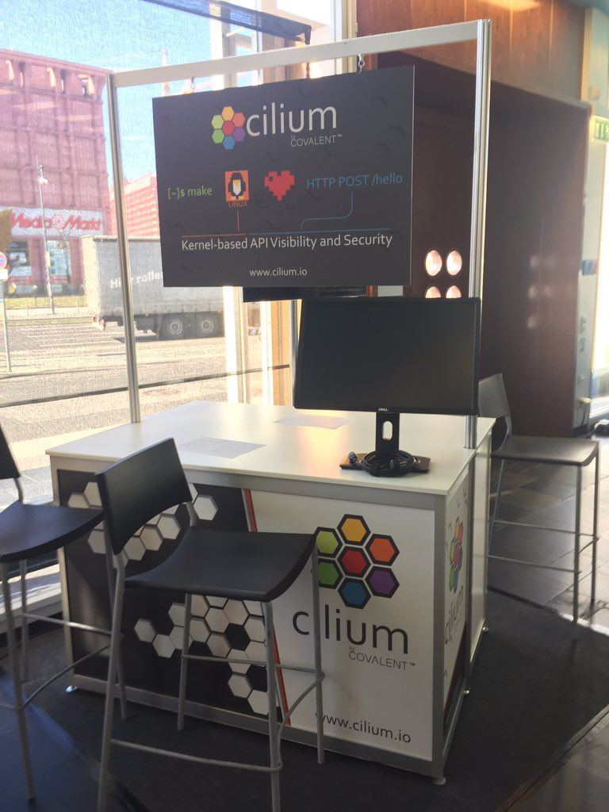
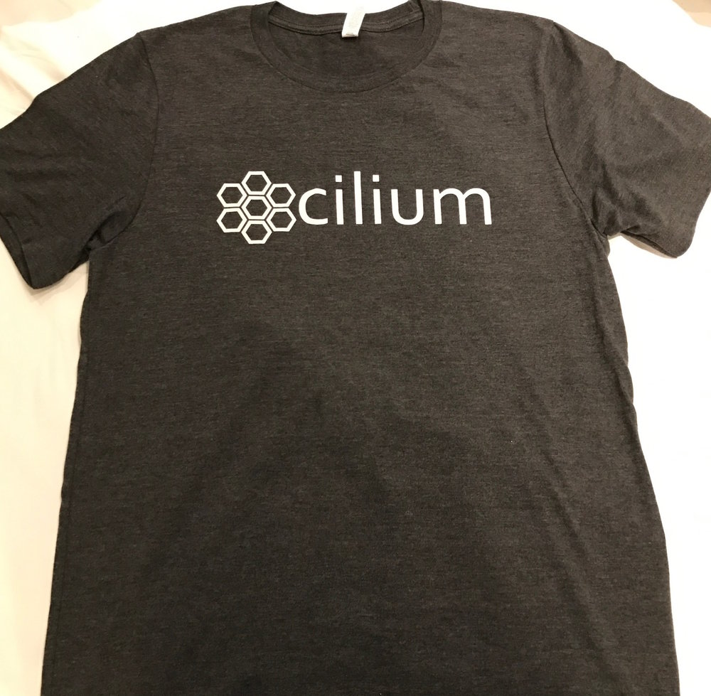
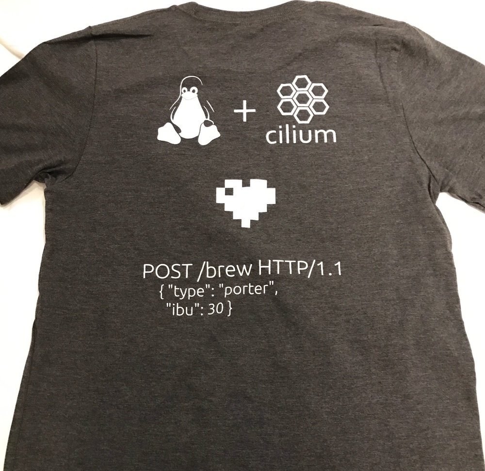

{{preview}}

This week the Cilium team is excited to be in the beautiful city of Berlin at KubeCon / CloudNativeCon EU!

{{/preview}}

This week the Cilium team is excited to be in the beautiful city of Berlin at KubeCon / CloudNativeCon EU!

Come by our booth to learn more about how Cilium provides HTTP-aware network security for microservices applications running on Kubernetes!  Our booth is located just to the left when you enter the exhibit area (booth S5).

At the booth, you'll see a super-cool "Star Wars" themed demo of Cilium or to pick up one of our fresh off the presses Cilium t-shirts.  Let's help Linux love Microservices!

